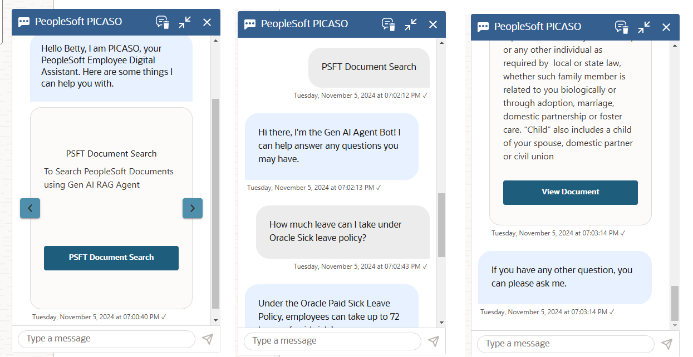
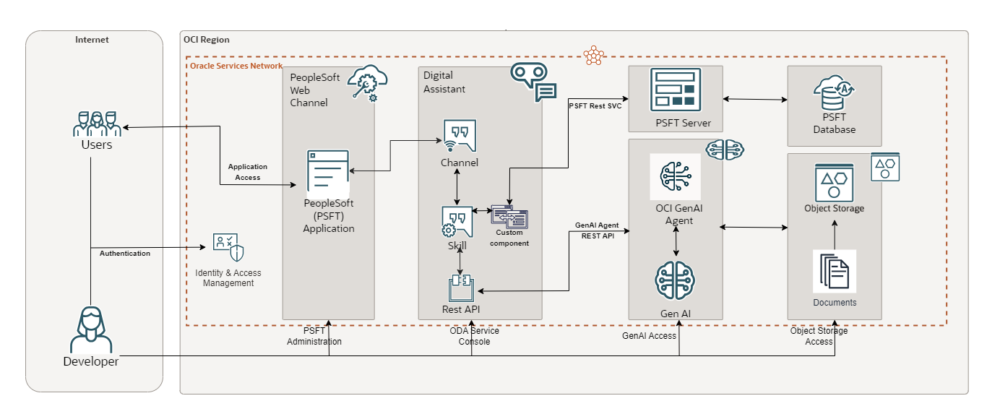

# Introduction

## About this Workshop

This workshop will help to configure Generative AI powered chatbot (PICASO) on your own OCI tenancy.
This workshop enables developers to perform GenAI RAG on custom PDF documents (stored in OCI Object Storage) using the OCI Generative AI Agent Service.
The users can then

- Connect to OCI Generative AI Agent Service from OCI Digital Assistant Chatbot PICASO (hosted in PeopleSoft Application)
- Get responses of their question (in natural language) from those custom PDF documents.

By following the workshop users can install PICASO with Gen AI Agent integration in their own tenancy

Estimated Workshop Time: 2 hours 15 minutes

### Objectives

Objective of this workshop is to set-up the required OCI services to create a full Generative AI Agent solution with RAG capabilities:

* OCI Object Storage Service – Users can configure OCI Object Storage and create Buckets.
Users can then upload their own unstructured PDF manuals / documents in those buckets.
* OCI Generative AI Agent Service – Users can configure OCI Generative AI Agent Service (create and configure Knowledge Bases and Agents).
Users can then ingest and perform RAG on the user’s documents in OCI Object Storage, using OCI Generative AI Agent Service.
* OCI Functions – Users can optionally enable some automation features using the provided OCI Function code
* OCI Digital Assistant (ODA) – Users can create ODA instance and import the provided ODA Skill.
Users can then connect from ODA chatbot to OCI Generative AI Agent Service, leveraging OCI Functions Rest Service.
* OCI PeopleSoft Application – User can create OCI PeopleSoft instance using OCI Marketplace image.
Users can then embed the ODA chatbot (PICASO) in PeopleSoft application. Then the users can get responses from their PDF manuals / documents, using PICASO Chatbot within PeopleSoft Application.

In this workshop, you will learn how to:

* Create Object Storage Buckets, and upload custom PDF documents in those buckets
* Setup & configure Generative AI Agent Service (Knowledge Bases and Agents)
* Setup & configure ODA (PICASO) as a LLM pwered chatbot in PeopleSoft Application
* Test out the features and capabilities of PICASO Chatbot in PeopleSoft

### Prerequisites

This lab assumes you have:

* An Oracle Cloud Account
* Access to a Region where the Agent service is available: Chicago, Frankfurt
* Must have an Administrator Account or Permissions to manage several OCI Services: Generative AI Agents, Digital Assistant, Visual Builder, Object Storage, Functions, OCIR, Logging, APM, Network, Dynamic Groups, Policies, IDCS/Identity Domain Confidential Applications, Resource Manager
* Familiarity with Oracle Cloud Infrastructure (OCI) is helpful

## Learn More

* [What Is Generative AI? How Does It Work?](https://www.oracle.com/artificial-intelligence/generative-ai/what-is-generative-ai/)
* [What Is Retrieval-Augmented Generation (RAG)?](https://www.oracle.com/artificial-intelligence/generative-ai/retrieval-augmented-generation-rag/)
* [Overview of Generative AI Service](https://docs.oracle.com/en-us/iaas/Content/generative-ai/overview.htm)
*	[Overview of Digital Assistants and Skills](https://docs.oracle.com/en-us/iaas/digital-assistant/doc/overview-digital-assistants-and-skills.html)
*	[Overview of PICASO](https://docs.oracle.com/cd/E52319_01/infoportal/chatbot.html)
*	[Oracle Digital Assistant's large language model integration](https://docs.oracle.com/en/cloud/paas/digital-assistant/use-chatbot/llm-blocks-skills.html)

## Acknowledgements

* **Author**
    * **Kaushik Kundu**, Master Principal Cloud Architect, NACIE
    * **Mahesh Sirikonda**, Senior Cloud Engineer, NACIE
* **Last Updated By/Date**
    * **Mahesh Sirikonda**, Senior Cloud Engineer, NACIE, October 2024
