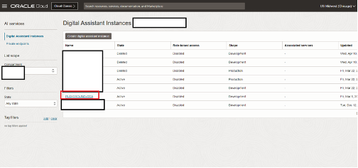

# Import GenAI RAG Skill and Re-configure PICASO (ODA) Assistant

## Introduction

This lab will take you through the steps needed to create ODA Gen AI Agent RAG Skill and configure it in PICASO (ODA)

Estimated Time: 30 minutes

### About OCI Digital Assistant

Oracle Digital Assistant (ODA) is a platform that allows you to create and deploy digital assistants for your users. Digital assistants are virtual devices that help users accomplish tasks through natural language conversations, without having to seek out and wade through various apps and web sites. Each digital assistant contains a collection of specialized skills. When a user engages with the digital assistant, the digital assistant evaluates the user input and routes the conversation to and from the appropriate skills.

### Objectives

In this lab, you will:

* Import and configure a skill to use GenAI Agent
* Add newly imported Skill to PICASO (ODA)

### Prerequisites

This lab assumes you have:

* All previous labs successfully completed
* Must have an Administrator Account or Permissions to manage several OCI Services: Digital Assistant, Generative AI agent, IAM.

## Task 1: Dynamic Group and Policy Definition

This task will help you to create the Dynamic Group and Policies in your tenancy. Please follow below mentioned steps:

These Dynamic Group and Policy Definitions are for single-tenancy deployment - where ODA and Generative AI Agent are in the same tenancy.

For Policy Definitions required for multi-tenancy deployment (where ODA and Generative AI Agent are in different tenancies), please refer to Task 9.

1. Locate Domains under Identity & Security

    

2. Click on your current domain name

    

3. Click on Dynamic Groups, and then your Dynamic Group name

    

    **Note** The name of your dynamic group can be different.

4. Ensure that your Dynamic Group is properly defined with Rules - as follows. Then click on Identity
    
    ```
    <copy>
    Example:
    resource.type='odainstance'
    resource.compartment.id='<ocid1.compartment.*************>'
    </copy>
   ```

    

    **Note** The resource.compartment.id should be set to the OCID of your Compartment - that is having your ODA Instance.

5. Click on Policies, ensure that you are in your "root" compartment, then click on your Policy name

    

    **Note** The name of your policy can be different.

6. Ensure that your Policy is properly defined - as follows.

   ```
    <copy>
    Example:
    allow dynamic-group GenAI-Agent-ODA-Dynamic-Group to manage agent-family in tenancy
    allow dynamic-group GenAI-Agent-ODA-Dynamic-Group to manage genai-agent-family in tenancy
    allow dynamic-group GenAI-Agent-ODA-Dynamic-Group to manage object-family in tenancy
    </copy>
   ```
    
    
    

   **NOTE:** If you are using a non-default identity domain - then instead of of just indicating the dynamic group name, you need to indicate domain-name/group-name in the policy statements.

## Task 2: Oracle Digital Assistant (PICASO) setup

This task will help you to check Oracle Digital Assistant (PICASO) under your chosen compartment.

**NOTE:** If you have already created Oracle Digital Assistant (PICASO) as part of Lab 1, Please skip to Task 3

1. Locate Digital Assistant under AI Services

    

    **Note** You can find Digital Assistant under the AI Services.

2. Click on Service Console of your PICASO ODA Instance to open ODA Console as shown below

    


3. Make sure you are able to see PICASO Digital Assistant as shown below

    

**NOTE:**  If you are not able to find PICASO DA Skill then please make sure you're selected correct Region, Compartment in OCI. Also, Make sure the previous Lab 1 Task 2 was completed successfully.


## Task 3: Create REST Services for the OCI Generative AI Agent

This task involves creating REST service which will be used by ODA to connect to OCI Generative AI Agent service. 

1. Download the two REST Service Configurations

[agent-RESTService-GenAIAgentCreateSession.yaml](https://objectstorage.us-ashburn-1.oraclecloud.com/p/OOL_2RmaYtzKH1cwpwYzo0eLGE1kIKSTywmoJdYa5YN6zVEnBAw7th9E2pa-LxSU/n/c4u02/b/hosted_workshops/o/generative_ai_agent_oda/agent-RESTService-GenAIAgentCreateSession-1.1.yaml)

[agent-RESTService-GenAIAgentChat.yaml](https://objectstorage.us-ashburn-1.oraclecloud.com/p/OOL_2RmaYtzKH1cwpwYzo0eLGE1kIKSTywmoJdYa5YN6zVEnBAw7th9E2pa-LxSU/n/c4u02/b/hosted_workshops/o/generative_ai_agent_oda/agent-RESTService-GenAIAgentChat-1.1.yaml)


2. Locate the ODA instance (created in [Lab 1 Task 2](../picaso/picaso.md#task-2-setup-picaso-digital-assistant-oda))

    

3. Select the ODA Instance and click on Service Console

    

4. In the ODA Console, click on hamburger menu. Under Settings, click API Services

    

5. Click on More -> Import REST Services

    

    
    Import both Rest Services - The GenAIAgentCreateSession Rest API service (using "agent-RESTService-GenAIAgentCreateSession.yaml") and the GenAIAgentChat Rest API service (using "agent-RESTService-GenAIAgentChat.yaml")

7. In the GenAIAgentCreateSession Rest API service, under Parameters, click on the pencil icon to change the value of the GenAIAgentEndpointId

    

8. In the Value field, remove the existing value 1, and put the value of the GenAI Agent Endpoint Id [Lab 2 Task 4 Step 4](../agent/agent.md#task-4-provision-agent)), and then click the Tick icon

    

9. Test the GenAIAgentCreateSession Rest API service, by clicking on the Test Request button. You should see Response Status 200, with a proper Response Body. Ensure that the "id" field is not blank / null. If the "welcomeMessage" field is blank in this Rest API response, a generic message would be shown in the ODA chatbot.

    


## Task 4: Import GenAI Agent Skill (Provided)

1. Click on the link to download the required skill

    [picaso-agent-livelabs.zip](https://objectstorage.us-ashburn-1.oraclecloud.com/p/OOL_2RmaYtzKH1cwpwYzo0eLGE1kIKSTywmoJdYa5YN6zVEnBAw7th9E2pa-LxSU/n/c4u02/b/hosted_workshops/o/generative_ai_agent_oda/PSFTGenAIRAGAgentBot(1.0).zip)

2. Import the skill (downloaded). Click on Import Skill & select the zip file to import

    

3. Open the PSFTGenAIRAGAgentBot, go to “Flows” and click on “user.StartFlow”

    

4. Open the second step “SetGenAIAgentEndpointIdVariable”, remove the old value and set the correct OCID value of the GenAI Agent Endpoint (the endpoint OCID that you copied in [Lab 2 Task 4 Step 4](../agent/agent.md#task-4-provision-agent)).

    

5. Ensure the Chatbot Training is completed

   Then click on the “Preview” button at top-right corner.

    

6. You should be able to successfully test the ODA Skill

    **NOTE** to start the conversation loop in ODA preview, send this initial message: "Hi"
    
    


## Task 5: Create Channel to Embed ODA in PeopleSoft Application or in any custom Web App

**NOTE:** If you have already created Channel for PICASO in Lab 1 Task 2, Please skip to Task 6

1. Click on hamburger menu and select Development > Channels, to check existing PeopleSoft Channel

    

2.  Make sure following options are present in your existing PeopleSoft Channel:
    * Channel Type = Oracle Web
    * Allowed Domain = *
    * Client Authentication Enabled = Toggle off
    * route it to PeopleSoft DA (created in Lab 1 Task 2) 

    

3. Ensure that the Client Authentication Enabled is disabled. Take note of Channel Id.

    

## Task 6: Add new Skill to PICASO (ODA) Assistant

1. From ODA service console homepage -> Click on **Digital Assistant** -> Select PICASO Skill

    

2. Click on Add Skill and Select newly imported SKill (PSFTGenAIRAGAgentBot)

    

    Click 'Done'

    

3. Make sure the Utterances of new Skill as shown below:
   (Note: Utterance must be - PSFT Document Search)

    

4. Click on Train to train the DA

    

5. Test new skill using Preview button of PSFT DA

    

## Task 7: (optional) Customize ODA Conversation

1. Customize predefined agent messages
    * The oda now passes through the agent's welcome message

2. Customize citation format
    * In the ODA Service Console, click on the appropriate skill
    * In the **Flows** tab, click on user.GenAIAgentAPIChatFlow
    * In the ShowCitation block, update the component tab -> messages

    


## Task 8: (optional) View Conversation Analytics

From ODA service console homepage -> skill **Dislpay name** -> **Insights** on side nav bar

* On this overview page, you can see stats such as **Total number of Conversations** and **Number of Unique users
* The View dropdown on the top right allows you to set a time window
* The Channels filter allows you to filter data from a specific frontend channel
* The Conversations tab allows you to see user messages and the agent's responses
<!-- TODO: add screenshot-->

## Task 9: (optional) Policy Definitions for multi-tenancy deployment

This task will help you ensure that the required Policy Definitions are correctly defined for multi-tenancy deployment (where ODA and Generative AI Agent are in different tenancies). 

If the Policy Definitions are not correctly defined, please define them as follows.

**Required Information:**

* _ODATenancyOCID_ - The OCID of the Tenancy, where the ODA Instance is created.

    In the OCI Console, you can click on your profile icon in the top right corner, click on your Tenancy name, and then copy the OCID of the tenancy.

    

* _ODAInstanceOCID_ - The OCID of the ODA Instance.

    In the OCI Console, you can go to your Digital Assistance instance (Menu -> Analytics & AI -> Digital Assistant), and then copy the OCID of the       ODA instance

    

1. In the tenancy where the ODA instance is hosted - Locate Policies under Identity & Security, ensure that you are in your "root" compartment, and      then define the following policies.

   ```
   <copy>
    endorse any-user to manage agent-family in any-tenancy where request.principal.type='odainstance'
    endorse any-user to manage genai-agent-family in any-tenancy where request.principal.type='odainstance'
    endorse any-user to manage object-family in any-tenancy where request.principal.type='odainstance'
    </copy>
   ```

   

2. In the tenancy where the Generative AI instance is hosted - Locate Policies under Identity & Security, ensure that you are in your "root" 
   compartment, and then define the following policies.

   _Please ensure to replace the ODATenancyOCID and ODAInstanceOCID with the proper OCID values._

   ```
   <copy>
    define tenancy oda-instance-tenancy as ODATenancyOCID
    admit any-user of tenancy oda-instance-tenancy to manage agent-family in tenancy where request.principal.id in ('ODAInstanceOCID')
    admit any-user of tenancy oda-instance-tenancy to manage genai-agent-family in tenancy where request.principal.id in ('ODAInstanceOCID')
    admit any-user of tenancy oda-instance-tenancy to manage object-family in tenancy where request.principal.id in ('ODAInstanceOCID')
    </copy>
   ```

   

## Acknowledgements

* **Author**
    * **Kaushik Kundu**, Master Principal Cloud Architect, NACIE
    * **Mahesh Sirikonda**, Senior Cloud Engineer, NACIE
* **Last Updated By/Date**
    * **Mahesh Sirikonda**, Senior Cloud Engineer, October 2024
