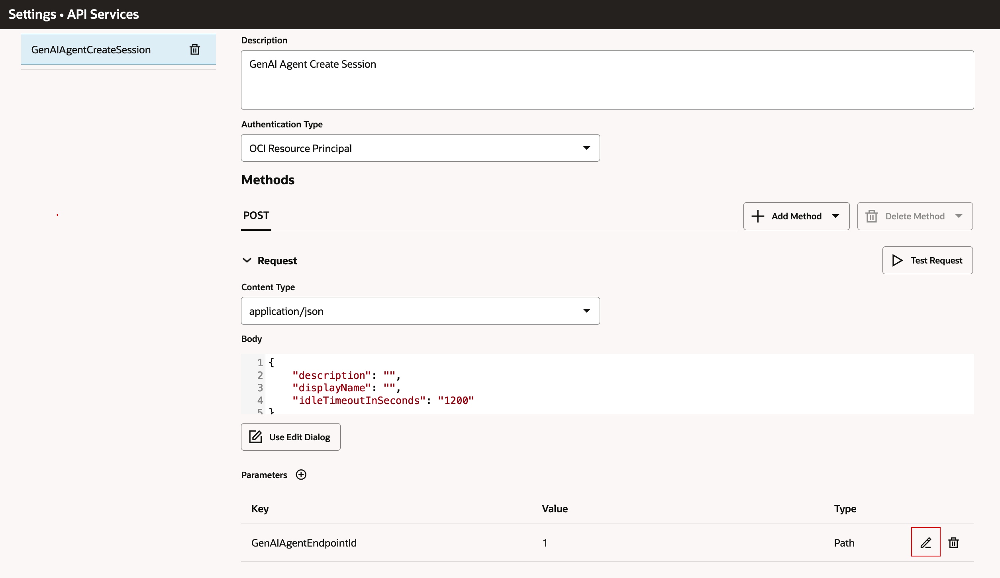

# Import GenAI RAG Skill and configure in PICASO (ODA)

## Introduction

This lab will take you through the steps needed to create ODA Gen AI Agent RAG Skill and configure it in PICASO (ODA)

Estimated Time: 30 minutes

### About OCI Digital Assistant

Oracle Digital Assistant (ODA) is a platform that allows you to create and deploy digital assistants for your users. Digital assistants are virtual devices that help users accomplish tasks through natural language conversations, without having to seek out and wade through various apps and web sites. Each digital assistant contains a collection of specialized skills. When a user engages with the digital assistant, the digital assistant evaluates the user input and routes the conversation to and from the appropriate skills.

### Objectives

In this lab, you will:

* Provision an ODA instance
* Import and configure a skill to use GenAI Agents
* Add new Skill to PICASO (ODA)

### Prerequisites

This lab assumes you have:

* All previous labs successfully completed
* Must have an Administrator Account or Permissions to manage several OCI Services: Digital Assistant

## Task 1: Dynamic Group and Policy Definition

This task will help you ensure that the Dynamic Group and Policy are correctly defined.

1. Locate Domains under Identity & Security

    

2. Click on your current domain name

    

3. Click on Dynamic Groups, and then your Dynamic Group name

    

    **Note** The name of your dynamic group can be different.

4. Ensure that your Dynamic Group is properly defined - as follows. Then click on Identity

    

    **Note** The resource.compartment.id should be set to the OCID of your Compartment - that is having your ODA Instance.

5. Click on Policies, ensure that you are in your "root" compartment, then click on your Policy name

    

    **Note** The name of your policy can be different.

6. Ensure that your Policy is properly defined - as follows.

    

   **NOTE:** If you are using a non-default identity domain - then instead of of just supplying the dynamic group name, you need to provide domain-name/group-name in the policy statements.

## Task 2: Provision Oracle Digital Assistant

This task will help you to create Oracle Digital Assistant under your chosen compartment.

**NOTE:** If you have already created Oracle Digital Assistant (PICASO) as part of Lab 2 Please skip to Task 3

1. Locate Digital Assistant under AI Services

    

    **Note** You can find Digital Assistant under the AI Services.

2. Provide the information for Compartment, Name , Description (optional) & Shape. Click Create

    

3. In few minutes the status of recently created Digital Assistant will change from Provisioning to Active

    

## Task 3: Create REST Services for the OCI Generative AI Agent

This task involves creating REST service which will be used by ODA to connect to OCI Generative AI Agent service. 

1. Download the two REST Service Configurations

[agent-RESTService-GenAIAgentCreateSession.yaml](https://objectstorage.us-ashburn-1.oraclecloud.com/p/OOL_2RmaYtzKH1cwpwYzo0eLGE1kIKSTywmoJdYa5YN6zVEnBAw7th9E2pa-LxSU/n/c4u02/b/hosted_workshops/o/generative_ai_agent_oda/agent-RESTService-GenAIAgentCreateSession-1.1.yaml)

[agent-RESTService-GenAIAgentChat.yaml](https://objectstorage.us-ashburn-1.oraclecloud.com/p/OOL_2RmaYtzKH1cwpwYzo0eLGE1kIKSTywmoJdYa5YN6zVEnBAw7th9E2pa-LxSU/n/c4u02/b/hosted_workshops/o/generative_ai_agent_oda/agent-RESTService-GenAIAgentChat-1.1.yaml)

2. Locate the ODA instance (created in [Lab 2 Task 2](../picaso/picaso.md#task-2-setup-picaso-digital-assistant-oda))

    

3. Select the ODA Instance and click on Service Console

    

4. In the ODA Console, click on hamburger menu. Under Settings, click API Services

    

5. Click on More -> Import REST Services

    

    Import both Rest Services - The GenAIAgentCreateSession Rest API service (using "agent-RESTService-GenAIAgentCreateSession.yaml") and the GenAIAgentChat Rest API service (using "agent-RESTService-GenAIAgentChat.yaml")

7. In the GenAIAgentCreateSession Rest API service, under Parameters, click on the pencil icon to change the value of the GenAIAgentEndpointId

    

8. In the Value field, remove the existing value 1, and put the value of the GenAI Agent Endpoint Id [Lab 3 Task 4 Step 4](../agent/agent.md#task-4-provision-agent)), and then click the Tick icon

    

9. Test the GenAIAgentCreateSession Rest API service, by clicking on the Test Request button. You should see Response Status 200, with a proper Resoponse Body. Ensure that the "welcomeMessage and "id" fields are not blank / null.

    

## Task 4: Import Skill (Provided)

1. Click on the link to download the required skill

    [agent-oda-livelabs.zip](https://objectstorage.us-ashburn-1.oraclecloud.com/p/OOL_2RmaYtzKH1cwpwYzo0eLGE1kIKSTywmoJdYa5YN6zVEnBAw7th9E2pa-LxSU/n/c4u02/b/hosted_workshops/o/generative_ai_agent_oda/agent-oda-livelabs-1.1.zip)

2. Import the skill (downloaded). Click on Import Skill & select the zip file to import

    

3. Open the GenAIRAGAgentChatbot, go to “Flows” and click on “user.StartFlow”

    

4. Open the second step “SetGenAIAgentEndpointIdVariable”, remove the old value and set the correct OCID value of the GenAI Agent Endpoint (the endpoint OCID that you copied in [Lab 3 Task 4 Step 4](../agent/agent.md#task-4-provision-agent)).

    

5. Ensure the Chatbot Training is completed

   Then click on the “Preview” button at top-right corner.

    

6. You should be able to successfully the ODA Skill

    **NOTE** to start the conversation loop in ODA preview, send this initial message: "Hi"
    

## Task 5: Create Channel to Embed ODA in PeopleSoft Application or in any custom Web App

**NOTE:** If you have already created Channel for PICASO in Lab 2 Task 2, Please skip to Task 7

1. Click on hamburger menu and select Development > Channels, to check existing PeopleSoft Channel

    

2.  Make sure following options are present in your existing PeopleSoft Channel:
    * Channel Type = Oracle Web
    * Allowed Domain = *
    * Client Authentication Enabled = Toggle off
    * route it to PeopleSoft DA (created in Lab 2 Task 2) 

    

3. Ensure that the Client Authentication Enabled is disabled. Take note of Channel Id.

    

## Task 7: Add new Skill to PICASO (ODA) DA

From ODA service console homepage -> Click on **Digital Assistant** -> Select PICASO Skill

Click on Add Skill and Select newly imported SKill (GenAIRAGAgentChatbot)

Modify Utterances for new Skill (Note: Utterance must be: PSFT Document Search)

Click on Train to train the DA

Test new skill using Preview button of PSFT DA

## Task 7: (optional) Customize ODA Conversation

1. Customize predefined agent messages
    * The oda now passes through the agent's welcome message

2. Customize citation format
    * In the ODA Service Console, click on the appropriate skill
    * In the **Flows** tab, click on user.GenAIAgentAPIChatFlow
    * In the ShowCitation block, update the component tab -> messages

    

## Task 8: (optional) View Conversation Analytics

From ODA service console homepage -> skill **Dislpay name** -> **Insights** on side nav bar

* On this overview page, you can see stats such as **Total number of Conversations** and **Number of Unique users
* The View dropdown on the top right allows you to set a time window
* The Channels filter allows you to filter data from a specific frontend channel
* The Conversations tab allows you to see user messages and the agent's responses
<!-- TODO: add screenshot-->

## Acknowledgements

* **Author**
    * **Kaushik Kundu**, Master Principal Cloud Architect, NACIE
    * **Mahesh Sirikonda**, Senior Cloud Engineer, NACIE
* **Last Updated By/Date**
    * **Mahesh Sirikonda**, Senior Cloud Engineer, October 2024
