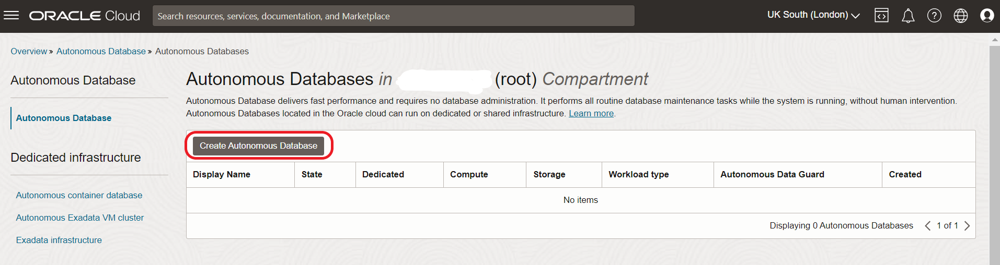
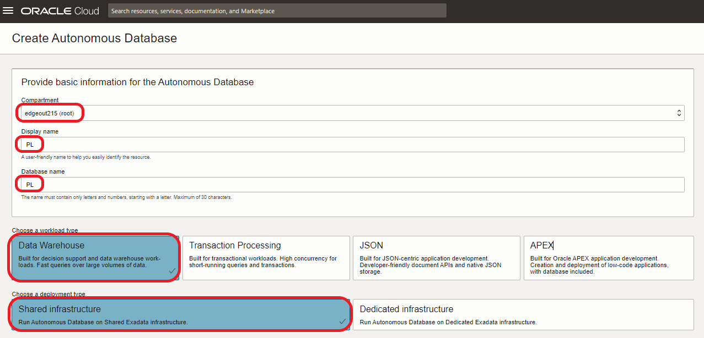
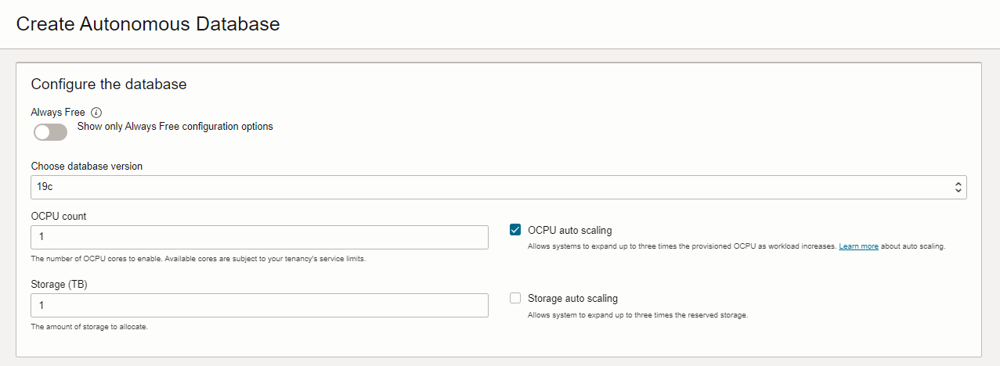
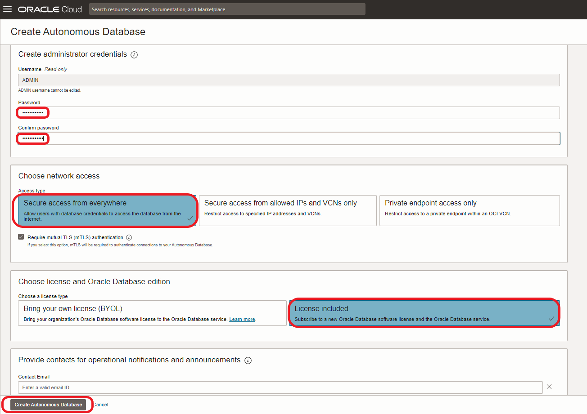

# Autonomous Data Warehouse 프로비저닝

<!---->

## Introduction

이 실습에서는 새로운 Autonomous Data Warehouse (ADW) 인스턴스를 프로비저닝합니다. 이 데이터베이스에는 분석할 데이터를 보관할 것입니다..

예상 시간: 5분

### Objectives

이 실습에서는 다음을 수행합니다:

-   새로운 Autonomous Database를 프로비저닝하는 방법을 배웁니다.

### 사전 요구사항

이 실습을 완료하려면 다음이 필요합니다::

- Oracle Cloud 계정에 로그인되어 있어야 합니다

## Task 1: ADW 프로비저닝

1. 다음으로 이동하세요  **Menu** > **Oracle Database** > **Autonomous Data Warehouse**.

   

2. **Create Autonomous Database** 를 클릭하세요 

   

3. 프로비저닝 폼의 첫 부분을 다음 값으로 입력하세요..

   

      - Compartment: `root` (이미 선택되어 있는 경우 root compartment를 선택하면 됩니다.)
      - Display name: `PL`
      - Database name: `PL`
      - Choose a workload type: `Data Warehouse`
      - Choose a deployment type: `Shared Infrastructure`

4. 프로비저닝 폼의 다음 부분을 다음 값으로 입력하세요.

   

      - Choose database version: `19c` (해당 지역에서 21c가 있는 경우 동일하게 작동합니다.)
      - OCPU count: `1` or default value.
      - Storage (TB): `1` or default value.
      - OCPU auto scaling: `on` or default value.
      - Storage auto scaling: Leave at default value.

5. 프로비저닝 폼의 마지막 부분을 다음 값으로 입력하세요.

   

      - Password: Create a secure password
      - Confirm password: Confirm the secure password
      - Access Type: `Secure access from everywhere`
      - Choose a license type: `License Included`

6. **Create Autonomous Database**를 클릭하세요.

   ADW 데이터베이스의 프로비저닝 상태를 확인할 수 있습니다.

   아이콘이 다음과 같이 변경될 때까지 기다립니다::

   

   To `ACTIVE` state:

   

7. Autonomous Data Warehouse를 사용할 준비가 되었습니다..

이제 다음 실습으로 진행하실 수 있습니다.

## **Acknowledgements**

- **Author** - Jeroen Kloosterman - Technology Product Strategy Director, Sudeshni Fisher - Technology Product Strategy Manager.
