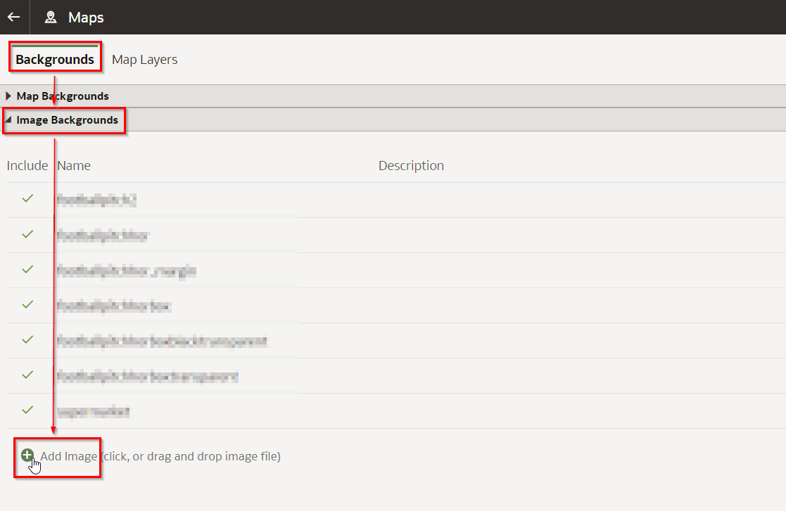
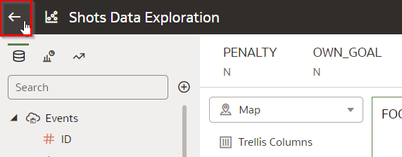

# Explore data - advanced

<!---->

## Introduction

We've already identified several data points of shots that we believe are important for training the xG model.

In addition, we use visual data exploration to look for *hidden* patterns in the data. Those patterns may not be obvious at first sight. Sometimes, after transforming the original data in some way, new information can be extracted from it that can add additional predictive value. We can look for clues to find those hidden gems again by visualizing the data in different ways. In other words, by visualizing the data, we hope that the data will *surprise* us. 

The success of our machine learning model will depend on the data that we present to it, and we have to make the most of the data that we have!

Estimated Time: 10 minutes

### Objectives
- Identify additional data points that could be extracted from the data.
- Learn how to use Oracle Analytics Cloud to visualize Geospatial data for sports.

### Prerequisites
- An Oracle Free Tier, Always Free, Paid or Live Labs Cloud Account
- Oracle Analytics Cloud
- Autonomous Data Warehouse
- You've completed the previous lab that loads the data sources into the Autonomous Data Warehouse

## Task 1: Configure a Football Pitch to Display our Shot Data

Distance is an important aspect of a shot, but it still doesn’t tell us all there is to know about WHERE on the pitch a shot is being taken from. 

Therefore, let’s plot the shots on a football pitch (helicopter view). We hope to find out where the opportunities to score lie on the pitch.

1. **Download** a picture of a football pitch as well as a file that divides the pitch up into a grid of cells.

   Download [Image of a football pitch](./files/football_pitch.png) Depending on your browser, you may have to use Right Click. Make sure that the file is saved with extension `.png`.
   
   Download [Grid](./files/grid_pitch.json). Depending on your browser, you may have to use Right Click. Make sure that the file is saved with extension `.json`.

2. From the ribbon on the **Home Page**, go to the Console.

   

3. Select Maps.

   

4. We're first going to add the football pitch as a background image.

   Click "Backgrounds", then "Image Backgrounds", then "Add Image" and select the `football_pitch.png` file that you just downloaded.

   

5. Set the dimensions of the football pitch by changing Coordinates to "Custom (lat, long)" and the coordinates as shown in the screenshot. Finally, press Save.

   
   
6. Next, click on "Map Layers" and "Add Custom Layer", then select the `grid_pitch.json` file that you downloaded earlier. This will divide the pitch into a grid of cells of 2 by 2 meters.

   

7. Check the "football\_pitch\_cell" layer key and press "Add". This will allow us to connect the coordinates of each shot with a cell on the grid.

   

8. Go back to the main menu by pressing the left-arrow on the top-left, then open the top left menu and choose "Home".

   
   

## Task 2: Create a Spatial Visualization of Shot Data

1. Reopen the visualizations we created earlier by clicking on "Workbooks and Reports" and then "Shots Data Exploration".

   

2. Select **Edit mode** at the top right hand corner

   

3. To create space for new visualizations, create a new canvas by clicking on the "+" icon at the bottom of the screen (next to "Canvas 1").

   

4. Create a new visualization of a football pitch. The `FOOTBALL_PITCH_CELL` attribute can be used to pick the right cell (location) on the pitch of each shot. 

   Create a Map visualization on the fields `FOOTBALL_PITCH_CELL` and the previously created calculation `Score Percentage`. 

   

5. Change the background to show our football pitch by going to the Map settings icon, then choose "football\_pitch" as the Background Map.

   

6. Finally, remove penalties and own goals by setting the filters (as you've done previously on the first canvas). 

   

7. The result looks like this. Hover over the cells to see the Score Percentage for that part of the pitch.

   

   What we saw before is confirmed in this visualization: the Score Percentage is highest near the goal and gets lower as we get further away.

   In addition, we can see a **new pattern** emerge: Notice how there are are relatively few shots and even fewer goals from the back line at both sides of the goal (see manual annotation below), even though we're fairly close to the goal.
   
   

8. The reason for this pattern is that the player has a very small "window" between the left and right pole from these areas.
   
   We can measure this by calculating the **ANGLE between the LEFT and the RIGHT goal pole**.

   

   Take a look at images A and B. In image A, the angle between the poles is small, because the shot is taken from a difficult position on the "side" of the goal. In image B, the angle is much wider (+/- 90 degrees), as it is taken centrally in front of the goal. 

   Now compare images B and C. Notice how, although both are right in front of the goal, the angle of C is much smaller than B; the angle gets smaller as the distance increases.

   What do we learn from all this? That we should include the angle when we train our model, because this is likely to influence the chance of scoring a goal. 
   
9. Go back to the homepage by clicking on the top left icon. Save the workbook in case you're being asked to.

   

## Task 3: Conclusions

In this lab we identified one additional attribute that's not yet part of the data: ANGLE (between goal posts). 

In the next lab, we'll extract the angle for each shot, and then build the machine learning model.

You may now proceed to the next lab.

## **Acknowledgements**

- **Author** - Jeroen Kloosterman - Technology Product Strategy Director, Sudeshni Fisher - Technology Product Strategy Manager.
