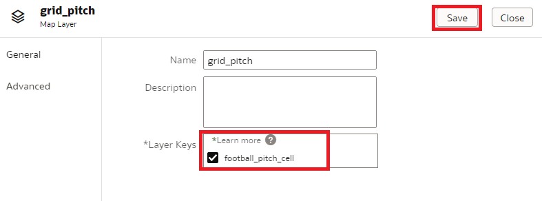
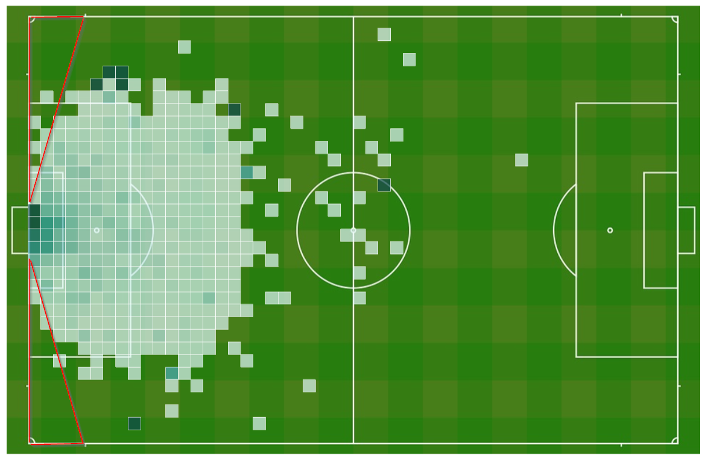
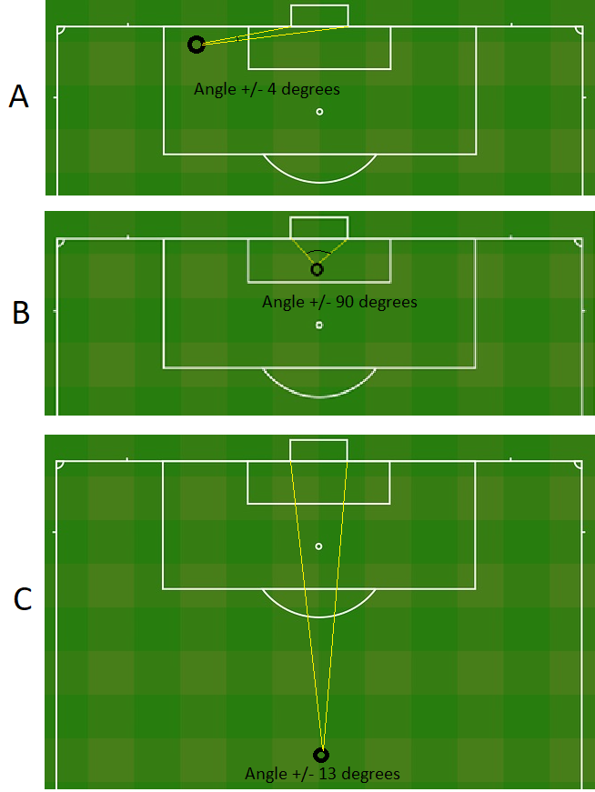

# Explore data - advanced

<!---->

## Introduction

우리는 이미 xG 모델 훈련에 중요하다고 생각되는 슛의 여러 데이터 포인트를 확인했습니다.

또한 시각적 데이터 탐색을 사용하여 데이터에서 *숨겨진* 패턴을 찾았습니다 . 이러한 패턴은 처음에는 명확하지 않을 수 있습니다. 경우에 따라 원래 데이터를 어떤 식으로든 변환한 후 추가 예측 값을 추가할 수 있는 새로운 정보를 추출할 수 있습니다. 데이터를 다양한 방식으로 시각화하여 숨겨진 보석을 다시 찾을 수 있는 단서를 찾을 수 있습니다. 따라서, 우리가 데이터 시각화를 통해 *놀라운* 인사이트를 얻기를 바랍니다 .

기계 학습 모델의 성공은 우리가 제공하는 데이터에 달려 있으며, 우리가 가지고 있는 데이터를 최대한 활용해야 합니다!

예상 시간: 10분

### Objectives
- 데이터에서 추출할 수 있는 추가 데이터 포인트를 식별합니다.
- Oracle Analytics Cloud를 사용하여 스포츠에 대한 지리공간(Geospatial) 데이터를 시각화하는 방법을 배웁니다. 

### Prerequisites
- Oracle 무료 계층, 상시 무료, 유료 또는 Live Labs 클라우드 계정
- Oracle Analytics Cloud
- Autonomous Data Warehouse
- Autonomous Data Warehouse에 데이터 소스를 로드하는 이전 실습을 완료

## Task 1: 슛 데이터를 표시하도록 축구 경기장 구성

거리는 슛의 중요한 측면이지만 경기장에서 슛을 던지는 위치에 대해 알아야 할 모든 것을 알려주지는 않습니다

따라서 축구 경기장(헬리콥터 보기)에서 샷을 구성해 보겠습니다. 우리는 경기장에서 득점 기회가 어디에 있는지 알아내길 바랍니다

1. 축구장 사진과 경기장을 셀 그리드로 나누는 파일을 **Download** 하세요 

   Download [Image of a football pitch](./files/football_pitch.png) 다운로드 브라우저에 따라 오른쪽 클릭을 사용해야 할 수도 있습니다. 파일이  `.png` 확장자로 저장되었는지 확인하십시오.
   
   Download [Grid](./files/grid_pitch.json) 다운로드 브라우저에 따라 오른쪽 클릭을 사용해야 할 수도 있습니다. 파일이 `.json` 확장자로 저장되었는지 확인하십시오 .

2. **Home Page** 의 리본에서 콘솔로 이동합니다.

   

3. 맵을 선택합니다. 

   

4. 먼저 축구장을 배경 이미지로 추가하겠습니다.

   클릭 "Backgrounds", 그리고 "Image Backgrounds", 크리고 "Add Image" 를 선택합니다. 그리고  `football_pitch.png` 방금 다운로드 받은 파일을 선택합니다.

   

5. 좌표를 "사용자 정의(위도, 경도)"( "Custom (lat, long)" ) 로 변경하고 스크린샷과 같이 좌표를 변경하여 축구 경기장의 치수를 설정합니다. 마지막으로 저장을 누릅니다

   
   
6. 다음으로 "Map Layers" 클릭한다움 "Add Custom Layer"를 선택하고 드다음 `grid_pitch.json` 을 선택하합니다. 이것은 피치(운동장 뷰)를 2 x 2 미터 셀 그리드로 나눕니다 

   

7. "football\_pitch\_cell" layer key를 체크 하고, "Add"를 누룹니다. 이렇게 하면 각 샷의 좌표를 그리드의 셀과 연결할 수 있습니다
   

8. "Home".왼쪽 상단의 왼쪽 화살표를 눌러 메인 메뉴로 돌아간 다음 왼쪽 상단 메뉴를 열고 "home"을 선택합니다.

   
   

## Task 2: 슛 데이터의 공간 시각화 만들기

1. "Workbooks and Reports"를 클릭한 다음 "Shots Data Exploration"을 클릭하여 이전에 생성한 시각화를 다시 엽니다.

   

2. 오른쪽 상단에, **Edit mode** 를 선택 합니다. 

   

3. 새 시각화를 위한 공간을 만들려면 화면 하단의 "+" 아이콘("canvas 1" 옆)을 클릭하여 새 캔버스를 만듭니다

   

4. 이 `FOOTBALL_PITCH_CELL` 속성은 각 샷의 피치에서 올바른 셀(위치)을 선택하는 데 사용할 수 있습니다.

   `FOOTBALL_PITCH_CELL` 필드 및 이전에 만든 계산 `Score Percentage` 에 맵 시각화를 만듭니다 

   

5. 지도 설정 아이콘으로 이동하여 축구 경기장을 표시하도록 배경을 변경하기 위해 배경 지도(Background Map)로 "football\_pitch"를 선택합니다.

   

6. 마지막으로 필터를 설정하여 페널티와 자책골을 제거하세요 (이전에 첫 번째 캔버스에서 수행한 것처럼).

   

7. 결과는 다음과 같습니다. 운동장의 해당 부분에 대한 점수 백분율을 보려면 셀 위로 마우스를 가져갑니다.

   

   이전에 본 것은 이 시각화에서 확인됩니다. 점수 백분율은 골 근처에서 가장 높고 멀어질수록 낮아집니다.

   **새로운 패턴**이 나타나는 것을 볼 수 있습니다. 우리가 골에 꽤 가까이 있음에도 불구하고 골 양쪽의 백 라인에서 상대적으로 적은 수의 슛과 더 적은 수의 골이 있다는 점에 주목하십시오(아래 붉은 주석 참조). .
   
   

8. 이 패턴의 이유는 플레이어가 이 영역의 왼쪽과 오른쪽 기둥 사이에 매우 작은 "창"(Window) 을 가지고 있기 때문입니다.
   
   **왼쪽 골대와 오른쪽 골대 사이의 각도**(ANGLE between the LEFT and the RIGHT goal pole). 를 계산하여 이를 측정할 수 있습니다 .

 

   

   이미지 A와 B를 살펴보십시오. 이미지 A에서는 골대 "측면"의 어려운 위치에서 슛을 하기 때문에 극 사이의 각도가 작습니다. 이미지 B에서는 각도가 훨씬 더 넓습니다(+/- 90도). 골 앞 중앙에서 측정되기 때문입니다.

   이제 이미지 B와 C를 비교합니다. 둘 다 목표 바로 앞에 있지만 C의 각도는 B보다 훨씬 작습니다. 거리가 증가함에 따라 각도가 작아집니다.

   이 부분에서 무엇을 알 수 있습니까? 이 부분은 골을 넣을 확률에 영향을 미칠 가능성이 높기 때문에 모델을 훈련할 때 각도를 포함해야 합니다.
   
9. 왼쪽 상단 아이콘을 클릭하여 홈페이지로 돌아갑니다. 다시 사용할 경우를 대비하여 통합 문서를 저장하십시오.

   

## Task 3: Conclusions

이 실습에서는 아직 데이터의 일부가 아닌 추가 속성인 ANGLE(골 포스트 사이)을 식별했습니다.

다음 실습에서는 각 샷의 각도를 추출한 다음 기계 학습 모델을 빌드합니다.

이제 다음 실습을 진행할 수 있습니다.

## **Acknowledgements**

- **Author** - Jeroen Kloosterman - Technology Product Strategy Director, Sudeshni Fisher - Technology Product Strategy Manager.
