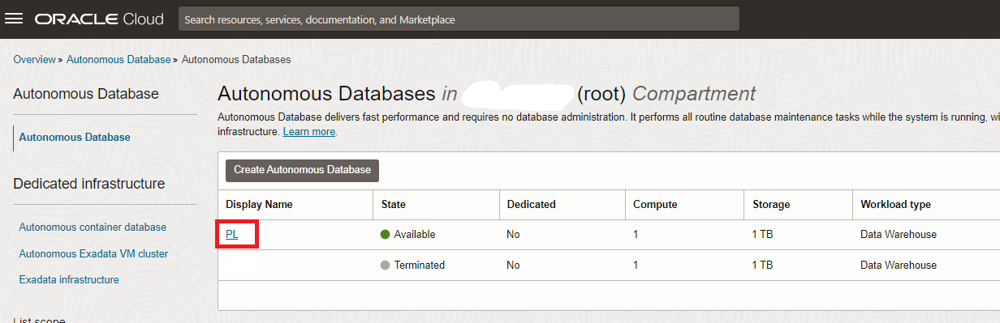
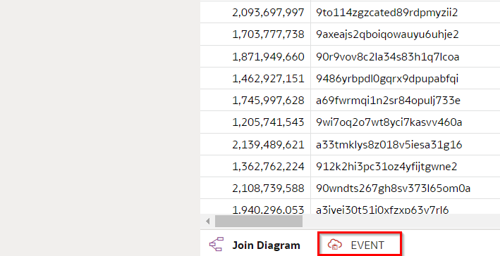
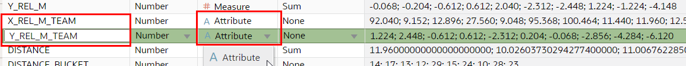
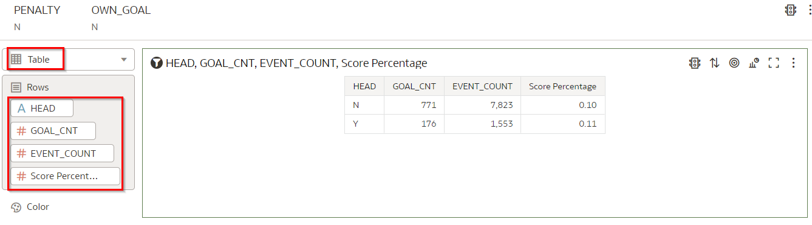

# Explore Data - basic

<!---->

## Introduction

인트로에서 소개한대로, 우리의 목표는 xG 모델을 만드는 것입니다. 이 모델은 슛이 골로 이어질 가능성이 얼마나 있는지를 추정할 수 있어야 합니다.

이제 슛 데이터의 시각적인 데이터 탐색을 수행하겠습니다. 이는 슛이 골로 이어지기 위해 실제로 관련성 있는 데이터 포인트가 어떤 것인지 알아내기 위한 것입니다. 다시 말해, 슛에 대해 예측할 수 있는 정보를 가지는 요소(속성)는 무엇인가요? 불필요한 데이터 포인트로 기계 학습 모델을 훈련시키면 모델의 정확도가 감소할 가능성이 높습니다. 다른 말로, 우리는 모델을 훈련시키기 위해 슛에 대한 올바른 속성을 선택하고 나머지는 무시하려고 합니다.

예상 소요 시간: 30분

### Objectives
- 슛의 데이터 포인트 중 골의 가능성을 예측하는 데 관련이 있는 것을 무엇인지 확인합니다.
- Oracle Analytics Cloud를 사용하여 데이터를 탐색하는 방법을 배웁니다.

### Prerequisites
- Oracle Analytics Cloud
- Autonomous Data Warehouse
- 이전 랩에서 자료를 Autonomous Data Warehouse에 로드 완료

## Task 1: Oracle Analytics Cloud에서 Autonomous Database로의 연결 생성

**Oracle Analytics Cloud** 는 데이터를 분석하는 데 사용하는 도구입니다. **Autonomous Data Warehouse** 는 데이터를 저장하고 구성하며 머신 러닝 엔진을 제공하는 데 사용됩니다.
따라서 먼저 Oracle Analytics Cloud에서 자율 데이터 웨어하우스로의 연결을 생성해야 합니다. 이 연결을 생성하기 위해 OAC는 이를 "wallet" 파일이라고 하는 특정 파일을 사용해야 합니다. "wallet" 파일(클라이언트 자격 증명)은 데이터베이스 사용자 ID와 비밀번호와 함께 가장 안전한 방법으로 자율 데이터베이스에 액세스할 수 있게 해줍니다. "wallet" 파일은 데이터베이스 메뉴에서 얻을 수 있습니다

1. Oracle Cloud에서 상단 왼쪽의 **Navigation Menu** 를 클릭하여,  **Oracle Database**로 이동한 다음, **Autonomous Data Warehouse** 를 선택합니다.

	

    만들어진 **ADW** 인스턴스를 모두 볼 수 있습니다. 이전에 만든 'PL' 인스턴스를 **선택**해주세요.

    

2. 다음은 월렛 파일을 다운로드하는 과정입니다. 월렛 파일은 데이터베이스 사용자 ID와 비밀번호와 함께 자율 데이터베이스에 가장 안전한 방식으로 액세스할 수 있도록 합니다.

   > **Note:** 월렛 파일을 안전한 위치에 저장하고, 월렛 파일을 권한이 있는 사용자만 공유해야 합니다.

3. ADW detail 페이지에서, **DB Connection** 클릭.

   

4. Database Connection 스크린에서, 클릭 **Download Wallet** . **Wallet Type**은 **Instance Wallet**으로 기본값인 채로 두고, **Download Wallet**를 클릭하세요.

   

5. 월렛에 안전한 암호를 선택하고, 암호를 다시 입력하여 확인한 후에 **Download**를 클릭하세요.

      - Password: Type the secure password
      - Confirm Password: Confirm the secure password

   

6. **Close** 클릭.  ZIP 파일 하나가 다운로드 됩니다.

7. Oracle Analytics Cloud 에서 Wallet 사용하기  

    **Oracle Cloud Infrastructure console** 화면으로 돌아가서, 왼쪽에 있는 메뉴 아이콘을 클릭 하세요.

    **Analytics & AI** 메뉴로 들어가서 **Analytics Cloud**를 선택하세요

    

8. 인스턴스 정보 우측에 있는 점 메뉴 버튼을 사용하여 이전에 생성한 인스턴스와 관련된 **Cloud Analytics URL**을 **열고** **Analytics 홈페이지**를 선택하세요

   **Analytics Home Page** 로 들어가기 전에, Oracle Analytics Cloud 인스턴스가 상태가 `Active` 확인해주세요. (`Creating`이 아닌)

   

  **Oracle Analytics** 페이지가 새로운 창에서 열립니다.

9. 화면 오른쪽 상단에 있는**Create**을 클릭한 후 **Connection**을 선택하세요.

    

10. **Oracle Autonomous Data Warehouse**를 선택해세요.

    

    다음 정보를 사용하여 **connection**을 구성합니다.

    > **Connection Name**: `PL`
    >
    > **Client Credentials**: 다운로드한 **Wallet ZIP 파일**을 업로드하려면 브라우즈 버튼을 사용하세요. 이 파일은 ZIP 에서 `cwallet.sso` 파일을 자동으로 추출합니다.
    >
    > **Username**: `PL`
    >
    > **Password**: "Autonomous Data Warehouse로 데이터 로드" 단계 6에서 선택한 PL 사용자의 안전한 비밀번호를 제공하세요.
    >
    > **Service Name**: `_high` 접미사가 붙은 기본값인 데이터베이스 이름을 선택하세요  
    >

    

11. **SAVE**을 선택하여 새로운 연결 **정보**를 저장합니다.

## Task 2: Oracle Analytics Cloud에 EVENT 데이터 세트 추가

EVENT 데이터 세트에는 2017/2018 전체 시즌과 2021/2022의 소수 경기에 대한 수천 개의 샷에 대한 정보가 포함되어 있습니다.

1. 오른쪽 상단에서 생성(Create)을 선택한 다음 데이터 세트를 선택합니다.

   

2. `PL` 연결을 선택합니다. 

   

3. PL스키마를 열고 Event 테이블 을 **두 번 클릭**합니다

   

   이 데이터 세트의 각 레코드는 각각의 단일 슛을 나타냅니다.

   Oracle Analytics가 데이터 세트의 열을 프로파일링하는 방법을 확인합니다. 열의 값 분포에 대한 높은 수준의 개요를 제공하는 히스토그램을 생성합니다. 이 히스토그램은 데이터의 품질(예: 누락된 값)을 측정할 뿐만 아니라 원하는 데이터가 무엇인지 빠르게 이해하는 데 도움이 됩니다.

4. `MATCH_DATE` 컬럼 확인

   

   데이터 세트에 2017/2018의 대부분의 일치 항목이 포함되어 있음을 확인하십시오. 소개에서 언급했듯이 2017/2018 전체 시즌을 모델 교육에 사용한 다음 이를 2021/2022 시즌의 몇 경기에 적용할 것입니다.

5. `X_REL_M` 및 `Y_REL_M` 열로 스크롤 합니다, 이 부분은 플레이어가 샷을 한 순간의 좌표를 표기합니다. 이 값은 골라인 중앙에서 측정됩니다(미터 단위). 이에 부분에 대해서는 나중에 자세히 더 설명하겠습니다.

	 

6. `HEAD`, `RIGHT_FOOTED`, `OTHER_BODY_PART`, 등 열로 스크롤합니다 . 이들 모두가 샷에 대한 추가 정보를 제공하는 방법에 주목하십시오. 이를 통해 이러한 변수의 분포를 빠르게 평가할 수 있습니다. 예를 들어, 대부분의 샷이 머리글(따라서 바닥글)이 아님을 즉시 알 수 있습니다.

	 

7.  `IS_GOAL` 속성 으로 스크롤합니다. 놀랍게도 대다수의 슛이 골로 이어지지 않는다는 것을 즉시 알 수 있습니다.

	 

8. 데이터 세트의 세부 정보 구성

   화면 하단에서 를 클릭하여 `EVENT` 데이터 세트의 세부 정보를 구성합니다.

   

9. 열 구성을 더 쉽게 수정할 수 있도록 프레젠테이션을 피봇팅합니다. 

  

10.  `DISTANCE_BUCKET` 열을 수정합니다. 이 속성에는 가장 가까운 2미터 지점으로 반올림된 거리가 포함됩니다. 보시다시피 짝수 값만 포함합니다. 이렇게 하면 나중에 시각화할 때 비슷한 거리의 샷을 그룹화할 수 있습니다.

    현재 이 컬럼은 `MEASURE`(# 기호로 표시)로 분류됩니다. 그러나 이 컬럼을 사용하여 계산하지 않으므로 이를 `ATTRIBUTE` 로 변환합니다. 

   `DISTANCE_BUCKET` 컬럼의 헤더를 클릭한 다음, **Treat As** 옆에 값을 클릭하고 이 것을 **Attribute** 로 변경합니다.

   

   컬럼의 머리글 옆의 기호가 `A` 로 변경됩니다 .

11. 유사하게,  `ID`, `X_REL_M_TEAM` 와 `Y_REL_M_TEAM` 컬럼도 **Attributes** 로 변경합니다.

   

   

<!--9. Modify the aggregation type of `SCORE` (score that fans have given to the race)

   Later on, we will want to find out the average SCORE per season. Because of this, we want to set the default aggregation of the `SCORE` field to **Average**.

   Find the `SCORE` column and click it, then change the aggregation to **Average**.

   
-->
12. 데이터 세트 저장

    **Save** 아이콘을 클릭하고, 이름을 `Events` 로 저장

    

12. 마지막으로 왼쪽 상단 아이콘을 클릭하여 홈페이지로 돌아갑니다.

   

<!--
Let's have a first look at the data that we have available for our data challenge.

1. On the homepage, click "Data", then click the "Races" dataset to create a new visualization project.

  

2. We want to create a chart that shows the number of races per season.

  Select both the `YEAR_C` and `RACE_COUNT` columns. You can do this by clicking on `YEAR_C`, then hold Control while you click `RACE_COUNT`. Next, drag the two to the canvas.

	

  You see that the chart was automatically configured.

	

	Notice the drop in number of races in season 2020 (Covid 19).

3. Now, let's add in the race score. Drag the `SCORE` field to the small space right underneath the `RACE_COUNT` field (inside of the Values Y-Axis section).

   

4. By default the `SCORE` also shows as bars. We want to improve the readability of the chart by changing `SCORE` to a Line presentation.

  Change the visualization type to "Combo".

	

  Set the visualization type of `RACE_COUNT` back to Bar.

	

5. Now the only problem is that `SCORE` has a very different number range than `RACE_COUNT`, and therefore is hard to read. To fix this, we'll give `SCORE` its own scale.

   Click `SCORE` (in the Values Y-axis section) and select "Y2 Axis".

	

	Now you see that `RACE_COUNT` and `SCORE` have their own scale (see left and right Y-axis).

6. Inspect the chart.

   The chart helps us to understand that, although we have Formula 1 data from the very start in 1950 until now, the fan scores are only available for the last decade. And we're missing the fan scores for the races in season 2021.

   At first glance, it appears that, since the measurement of fan scores started in 2008, fans are less excited about the sport as the years progressed. At least, this is the case if we look at the yearly average, not looking at individual races.

	 Since we're missing fan scores for 2021, we cannot say whether this trend continued. However, by the completion of this workshop, you will be able to generate (predict) the scores for the races of 2021 yourself!
-->

## Task 3: 슛 결과의 이해

  이 랩 소개에서 설명한 것처럼 시각적 데이터 탐색을 수행합니다. 우리의 목표는 샷 데이터를 더 잘 이해하는 것입니다. 특히 모델에 포함할 데이터 포인트와 무시할 데이터 포인트를 식별하려고 합니다. 또한 원본 데이터 세트를 어떻게든 향상시켜 추출할 수 있는 **새로운 데이터 포인트**를 식별하고자 합니다.

1. 홈페이지에서 "데이터"를 클릭한 다음 "이벤트" 데이터 세트를 클릭하여 새 시각화 통합 문서를 만듭니다.

	  

2. 우선, 우리는 우리가 사용할 수 있는 슛 수와 그 중 골로 이어지는 슛 수를 더 잘 이해하고 싶습니다.

    `EVENT_COUNT`(샷 수) 및 `RESULT` (샷 결과)를 선택하여 새 시각화를 만듭니다 . Control + 클릭을 사용하여 여러 필드를 선택한 다음 필드를 캔버스로 드래그합니다.

	 

    그 결과 다음과 같은 시각화가 생성됩니다.

	 

3. 우리 모델의 경우 게임 내 샷만 포함하고 따라서 페널티를 제외하려고 합니다. PENALTY 필드를 필터 영역으로 끌고 "N"을 선택합니다.

	 

4. 우리는 또한 자책골을 제외하고 싶습니다. 그것들은 데이터 세트의 일부이지만 우리가 원하는 것과는 관련이 없습니다. OWN_GOAL 필드를 필터 영역으로 드래그하고 "N"을 선택합니다.

	 

5. 결과를 살펴보고 페널티킥이나 자책골이 아닌 9000개 이상의 슛이 있는지 확인하십시오. 그 중 900개 이상이 골로 이어집니다. 워크숍 자료를 업데이트하는 중이므로 환경에 표시되는 숫자가 스크린샷과 약간 다를 수 있습니다

	 

6. 이 숫자 사이의 비율을 이해하기 위해 시각화를 변경해 보겠습니다. 시각화 유형 드롭다운을 클릭하고 파이차트를 선택합니다.

	 

    RESULT 필드를 색상 영역으로 끕니다.

	 

7. 시각화를 검사합니다. 파이 차트 위로 마우스를 가져가면 세부 정보를 볼 수 있습니다.

	 

   우리의 결론은 거의 40%의 슛이 골대를 놓치거나 목공에 맞았다는 것입니다. 
   슛의 60% 이상이 목표물에 맞았습니다. 그러나 대부분은 저장됩니다. 평균적으로 약 10%의 슛이 골로 이어집니다.

## Task 4: 거리가 득점 기회에 미치는 영향 조사

우리는 슛이 골로 이어질지 여부를 예측하기 위해 가치 있는 데이터 포인트를 찾고 있습니다. 우리의 직감은 *distance* 거리가 슛이 골로 이어지는지 여부에 영향을 미쳐야 한다는 것을 알고 있습니다. 이것에 대해 더 알아봅시다.

1. Control + 오른쪽 클릭을 사용하여 필드 `DISTANCE_BUCKET`(2미터의 버킷으로 그룹화된 샷 거리) 및 `EVENT_COUNT` (샷 수)를 선택합니다. 그런 다음 두 필드 중 하나를 마우스 오른쪽 버튼으로 클릭하고 "Create Best Visualization" 를 선택합니다.

   이렇게 하면 막 대형 차트가 생성됩니다. 그렇지 않은 경우 시각화 유형을 변경하십시오.

   

   이것은 거리별로 *정리된 샷 수*를 보여줍니다.

   골대에서 8~30미터 떨어진 곳에서 얼마나 많은 양의 슛을 날리는지 주목하세요. 흥미롭게도 22미터 부근에서 슛 횟수가 줄었습니다.
   
   또한 골대에서 +/- 5미터 이내에서는 슛이 거의 없다는 점에 유의하십시오. 선수들이 골대와 가까운 거리에서 실제로 슛 기회를 잡는 것은 매우 어렵습니다.

2. 이 슛 중 몇 개가 골로 이어지나요? 이것도 시각화해 봅시다. `GOAL_CNT` 필드를 차트 구성의  "Values (Y-Axis)" 섹션으로 드래그합니다 . 올바른 차트가 먼저 선택되었는지 확인하십시오.

   
   
   결과는 다음과 같습니다:
   
   

   우리는 대부분의 골이 골대로부터 +/- 18미터 미만의 슛에서 나온다는 결론을 내릴 수 있습니다.
   
   또한 플레이어가 +/- 6미터 미만에서 슛을 쏠 수 있는 위치에 도달하기는 어렵지만 해당 범위의 *골 비율*이 매우 높다는 점에 유의하십시오. 골 수는 4m 미만의 거리에서 슛 수와 거의 같습니다. 반면에 우리는 18미터가 넘는 거리에서 상당한 양의 슛을 볼 수 있지만 골 수는 상대적으로 적습니다. 즉, 더 먼 거리에서 득점으로 이어지는 슛의 비율은 낮습니다.
   
3. 우리의 직감은 이 모든 것이 그럴듯하게 맞다고 말하지만, 이 현상에 어떻게 정량적으로 숫자를 매길까요? 새로운 "점수 백분율"(Score Percentage) 변수를 도입하여 거리와 목표 백분율 사이의 관계를 정량화해 보겠습니다.

   "My Calculations"을 마우스 오른쪽 버튼으로 클릭하고 (속성 목록 아래)) "Add Calculation"을 선택합니다. 

   `GOAL_CNT`/`EVENT_COUNT` 공식을 만듭니다. 가장 쉬운 방법은 속성 목록(왼쪽)에서 수식 캔버스로 필드를 드래그하는 것입니다. 그런 다음 새 속성의 이름을 "Score Percentage"로 지정하고 "저장"을 누릅니다.

   
   
4. 새로 생성된 속성을  `EVENT_COUNT` 속성 바로 아래의 값(Y축) 섹션으로 드래그합니다.

   

5. 그러나 아직 Score Percentage를 거의 볼 수 없습니다. 값이 0과 1 사이의 범위에 있기 때문입니다. 이를 확대하기 위해 이 속성에 자체 Y축"Y2 Axis"을 지정하기로 결정했습니다.

   "Score Percentage" 필드를 마우스 오른쪽 버튼으로 클릭하고 "Y2 Axis"를 선택합니다.

   

   그런 다음 다시 "Score Percentage"를 마우스 오른쪽 버튼으로 클릭하고 시각화 유형을 "Line"으로 변경합니다.

   

6. 결과는 다음과 같아야 합니다.

   
   
   오른쪽 Y축을 따라 백분율(0.0 - 1.0)이 어떻게 표시되는지 확인합니다.
   
   이제 골까지의 거리와 점수 비율 사이에 존재하는 음의 지수 관계를 볼 수 있습니다. 골에서 0미터(실제로 골라인)에서 골로 이어지는 슛의 비율은 100%입니다. 점수 비율은 약 6m 떨어진 곳에서 촬영한 샷의 경우 약 25%로 빠르게 떨어지고, 거리가 28m를 초과하면 약 2%(50발 중 1발이 득점됨)까지 천천히 더 떨어집니다.

7. 흥미롭게도 우리는 36미터와 58미터 부근에서 점수 퍼센티지에서 두 개의 스파이크를 볼 수 있습니다. 어떤 현상이 있는지 분석해 봅시다. 

   Control + 클릭을 사용하여 `GOAL_CNT` (number of goals) 와 `EVENT_COUNT` (number of shots) 를 선택하여 차트의 도구 설명 섹션으로 드래그합니다.
   
   
8. 이제 58미터 정도에 위치한 "의심스러운" 슛 위로 마우스를 가져갑니다.

   

   도구 설명에 해당 거리에서 슛팅이 2개뿐임을 표시하는 것을 확인하세요. 그 슛 중 하나가 골로 이어졌습니다!

   어쨌든 우리는 **거리**가 슛이 골로 이어질 가능성을 예측하는 데 가치가 있을 가능성이 있는 지표라는 결론을 내릴 수 있습니다.

## Task 5: Investigate how Headers/Footers Influence the Chance of Scoring a Shot

우리는 거리보다 슛에 대해 더 많은 정보를 가지고 있습니다. 이러한 데이터 포인트가 목표 예측에 얼마나 중요한지 살펴 봅시다.

1. 우리는 슛이 헤더(헤딩 사용)에서 나오는지 풋터(발 사용)에서 나오는지 여부가 득점 가능성에 영향을 미친다고 생각합니다. 이것도 시각화해 봅시다.

   `HEAD`, `GOAL_CNT`, `EVENT_COUNT`, `Score Percentage`필드 (컬럼) 를 사용하여 테이블 시각화 유형을 만듭니다. Control+클릭을 사용하여 여러 필드를 선택할 수 있습니다. 

   

   풋터 및 헤더 모두 약 10%의 사례에서 골로 이어집니다. 그렇다면 발이나 머리로 슛을 쏜다는 사실이 우리의 예측에 중요하지 않다는 의미입니까? 모델에 대해 무시해야 합니까? 반드시 그렇지는 않습니다. 이것이 다른 변수와 결합될 때 의미가 있을 수 있기 때문입니다.

3. 슛 거리의 맥락에서 풋터/헤더의 영향을 살펴보겠습니다.

   이전에 거리 메트릭으로 만든 차트를 클릭합니다.
   
   차트에서 `GOAL_CNT` 를 제거합니다 .

   

   `HEAD` 필드를 드레그하여 차트 구성의 컬러 섹션으로 끌어다 놓습니다.

   
   
4. 결과를 확인 합니다. 

   

   당연하게도 헤딩은 대개 골대에 매우 근접하게 이루어집니다.

   목표 퍼센티지 라인에서 "N, Score Percentage" 라인은 푸터 스코어 퍼센티지를 의미하고 "Y, Score Percentage"는 헤더 스코어 퍼센티지를 의미합니다.

   대부분의 거리에서 머리글의 점수 백분율은 바닥글의 점수 백분율보다 낮습니다. 예를 들어 8m 거리에서 슛을 했다면 발로 공을 잡을 수 있을 때 득점 변화가 더 큽니다.

   따라서 HEAD 플래그가 골 찬스를 예측하는 지표일 가능성이 높다고 결론을 내릴 수 있습니다. 따라서 모델을 훈련할 때 포함하고 싶습니다.

5. 저장 아이콘을 클릭하여 시각화를 저장하고 이름을 "Shots Data Exploration"으로 지정합니다.

   

## Task 6 (Bonus): Investigate how Corners and Other Factors Influence the Chance of Scoring a Shot

1. 포터 /헤더와 마찬가지로 검증할 수 있는 데이터 포인트가 훨씬 더 많습니다. 예를 하나 더 들어보겠습니다. 슛이 코너킥의 간접적인 결과인지 여부입니다.

   여기에 표시되는 두 차트에서 `HEAD` 을 `FROM_CORNER` 특성으로 교환합니다 FROM_CORNER. 두 차트 구성 모두에서 `FROM_CORNER`  속성을 `HEAD` 속성 위로 드래그하면 됩니다 

2. 결과는 다음과 같아야 합니다.

   

   일반적으로 코너킥의 (간접적인) 결과인 샷의 점수 비율은 그렇지 않은 샷보다 약간 낮습니다(9% 대 10%). 코너킥이 있을 때 많은 선수들이 같은 지역에 모여서 득점하기가 더 어려워지기 때문일까요?

   우리는 모든 거리에서 이 패턴을 볼 수 있습니다. 슛이 코너킥의 결과일 때 점수 비율은 다른 원점이 있는 슛보다 낮습니다.

   여기에서 시사점은, 변수(이 경우 코너킥 "플래그")가 우리가 예측하려는 항목(이 경우 *점수 백분율*)에서 다른 패턴으로 이어지는 것을 발견할 때마다 변수가 영향 요인일 수 있음을 보여줍니다. 따라서 점수 비율을 예측하기 위해 모델에 포함할 가능성이 있는 후보입니다.

   그래서 우리는 `FROM_CORNER` 변수를 우리의 모델 훈련에 포함 시켜야 합니다.

3. 이제 다른 변수를 시험해보고 점수 백분율과 어떤 관련이 있는지 확인하는 것은 귀하의 몫입니다.

   다음 속성을 살펴보는 것이 좋습니다. `FREE_KICK` (슛이 프리킥으로 부터 시작 되었는지 여부), `SET_PIECE` (슛이 프리킥의 간접적 결과인지 여부),  `FAST_BREAK` (상대편에데 공을 뺏은 뒤 역습에 의한 것인지 여부).

4. 왼쪽 상단의 왼쪽 화살표를 눌러 메인 메뉴로 돌아갑니다. 필요한 경우 통합 문서를 저장합니다.

   

## Task 7: 결론

탐색적 데이터 분석에서 우리는 득점 여부를 예측하는 데 가치가 있는 샷의 요소를 식별하려고 했습니다. 다양한 시각화 기술을 사용하여 기계 학습 모델에 적합한 여러 변수를 식별했습니다.

이제 다음 실습을 진행할 수 있습니다.

## **Acknowledgements**

- **Author** - Jeroen Kloosterman - Technology Product Strategy Director, Sudeshni Fisher - Technology Product Strategy Manager.
