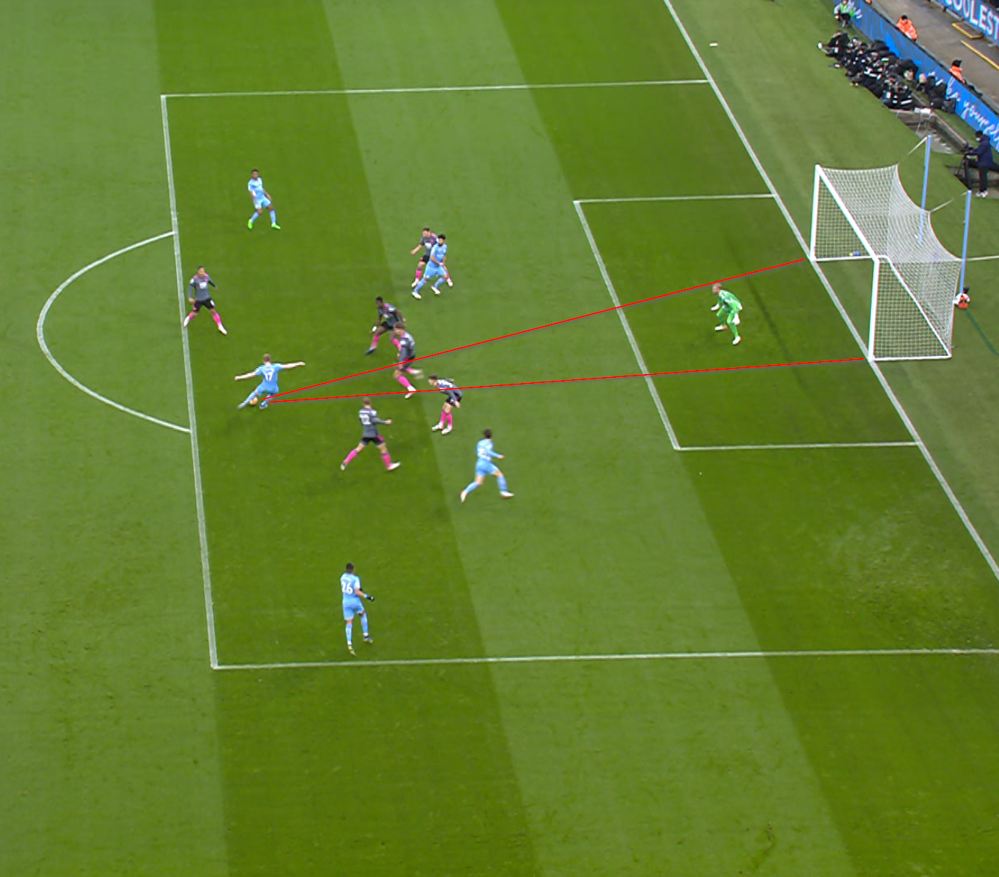
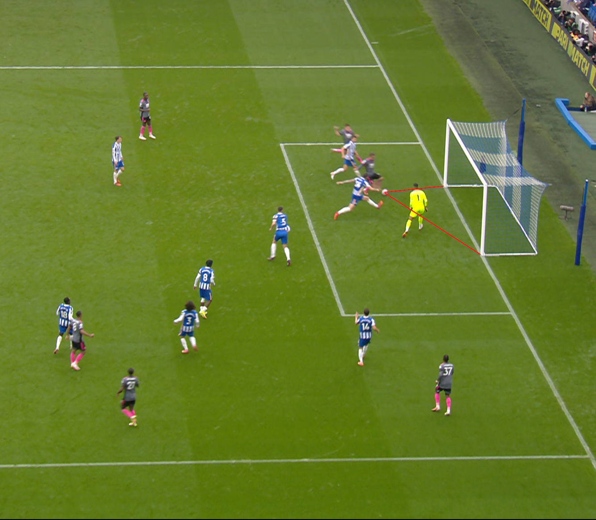
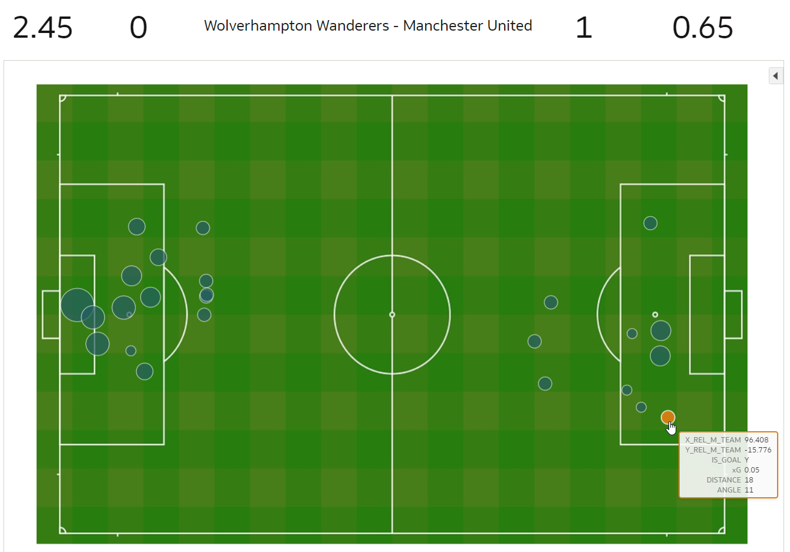

# Introduction

## About this Workshop

축구와 데이터에 열정을 가지고 있다면, 이 워크샵은 최고의 선택입니다!  프리미어 리그와 오라클의 파트너십 덕분에, 실제 데이터에 고급 분석과 기계 학습을 적용하는 축구 분석가의 경험을 직접 체험할 수 있는 독특한 기회를 갖게 가지게 되었습니다.!

이 워크샵에서는 **예상 골 (Expected Goals, xG)**에 대해 살펴보겠습니다. 이는 축구에서 가장 중요한 지표 중 하나입니다. 축구 중계에서 이미 이에 대해 들어본 적이 있을 수도 있습니다. 축구 전문가들은 xG를 사용하여 팀과 선수의 성과에 대해 논평합니다.

여러 가지 연습을 통해 xG에 대한 세부 정보를 배우게 될 것입니다. 직접 xG 모델을 구축하고, 이를 사용하여 팀과 선수의 성과를 분석할 수 있게 될 것입니다. 또한 자율 운영 데이터 웨어하우스(ADW)와 오라클 분석 클라우드(OAC)에 대해 배우게 될 것입니다.

사전 경험이 없어도 괜찮습니다. 여기에서 필요한 모든 것을 배우게 될 것입니다!

### Objectives
이 워크샵의 목표는 다음과 같습니다:

직접 xG 모델을 구축합니다. 먼저 모델에 필요한 데이터를 탐색한 후, 기계 학습을 사용하여 모델을 훈련시킵니다.
구축한 xG 모델을 적용합니다. xG 지표를 사용하여 경기와 선수를 평가하고, 팀, 선수, 스카우트, 팬에게 유용한 인사이트를 추출합니다!

예상 워크샵 시간: 120분

## What is Expected Goals?
예상 골 (Expected Goals, xG)은 특정 상황에서의 슛이 골이 될 가능성을 나타내는 측정치입니다. 이 측정치는 수천 건의 과거 슛 데이터를 학습한 모델에 의해 생성됩니다.

위의 이미지에서는 2021년 12월 26일 맨체스터 시티의 케빈 데 브라위너 선수가 레스터 시티와의 경기에서 찍은 슛을 볼 수 있습니다. 이 슛은 xG가 0.10으로 예측되었습니다. 즉, 해당 위치에서 찍힌 슛 중에서 비슷한 상황(예: 발로 차는 것이 아닌 헤딩인지 여부)에서는 약 10번 중 1번이 골이 될 것으로 예상됩니다. 이 경우, 이 슛은 실제로 골이 되었습니다.

위에서는 다른 예시를 볼 수 있습니다. 이번에는 레스터 시티의 제이미 바디 선수가 2021년 9월 19일 브라이튼과의 경기에서 찍은 슛입니다. 그는 유리 틸레만스로부터 어시스트를 받아 골에 매우 가까이 접근합니다. 이 경우, 이 슛의 xG는 0.92입니다. 즉, 비슷한 상황에서 찍힌 슛 중에서는 약 10번 중 9번이 골이 될 것으로 예상됩니다. 실제로, 이 슛은 골이 되었습니다.

## Why is Expected Goals useful?
경기에서 실제로 일어난 일을 설명하려고 할 때, 가장 논리적인 것은 최종 점수를 확인하는 것으로 보일 수 있습니다. 그러나 점수는 실제 경기 동안 일어난 일의 일부에 불과합니다. 일반적인 경기에서는 몇 개의 골만이 득점됩니다. 골은 그만큼 드물기 때문에 무작위한 사건과 운이 경기 결과에 상당한 영향을 미칠 수 있습니다. 때로는 더 좋은 팀이 이기지 못하는 경우도 있습니다!

이로 인해 우리가 경기를 분석할 때, 골뿐만 아니라 만들어진 기회(chances) 도 살펴보는 것이 유용합니다. 그리고 그것이 바로 xG가 우리에게 가능하게 해주는 것입니다

이를 설명하기 위해, 2021년 8월 29일 월버햄튼 원더러스와 맨체스터 유나이티드 경기를 예로 들어보겠습니다. 경기장에서는 양 팀이 슛을 찍은 모든 위치를 볼 수 있습니다. 월버햄튼 원더러스의 슛은 왼쪽에 있고 맨체스터 유나이티드의 슛은 오른쪽에 있습니다. 원의 크기는 각 슛의 xG를 나타내며, 색상은 그것이 골인지 여부를 나타냅니다.

보시다시피, 경기에서 승리한 단일 골의 xG는 단 0.05입니다(오른쪽 하단 참조). 경기를 관전한 경우, 0-1의 최종 점수는 실제 경기 상황을 반영하지 못하는 것을 알 수 있습니다: 월버햄튼 원더러스가 대부분의 시간 동안 경기를 지배했습니다. 이는 월버햄튼 원더러스와 맨체스터 유나이티드의 결합된 xG 점수(각 팀의 모든 슛의 xG를 요약)인 2.45 대 0.65로 나타납니다.

경기장 시각화에서는 월버햄튼 원더러스가 많은 슛을 날렸으며 그 슛들의 xG가 비교적 높다는 것을 알 수 있습니다. 이를 어떻게 보느냐에 따라, 그들은 운이 없었거나 맨체스터의 골키퍼가 훌륭한 성과를 냈다고 볼 수 있습니다. 어떤 경우에도, 이는 xG가 실제로 일어난 일에 대한 이야기를 보여주는 방법을 보여줍니다.

이러한 정보는 감독들이 자신의 팀을 더욱 발전시키는 데 도움이 될 수 있습니다. 또한 팬들에게도 큰 도움이 됩니다. 심지어 스카우트들도 팀에 잠재적인 선수를 평가할 때 유용한 정보로 활용할 수 있습니다. 

_이제, 학습을 시작할 준비가 되었습니다! 계속 진행해주세요._

## **Acknowledgements**

- **Author** - Jeroen Kloosterman - Technology Product Strategy Director, Sudeshni Fisher - Technology Product Strategy Manager.
- **Translator** - Korea ODP 
