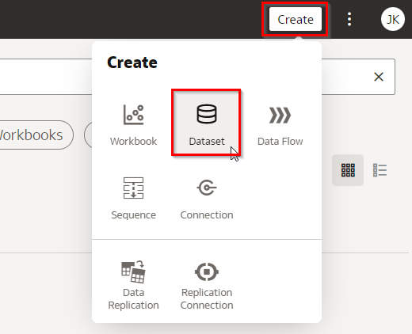

# Apply the Expected Goals model to matches and players

<!---->

## Introduction

이 실습에서는 새로 훈련된 예상 골 모델을 실제 경기 및 선수에 적용합니다.

예상 시간: 30분

### Objectives
- OAC 데이터 흐름(Data Flow) 을 사용하여 ML 모델을 실제 데이터에 적용하는 방법 알아보기

### Prerequisites
- Oracle Analytics Cloud
- Autonomous Data Warehouse
- 이전 실습을 완료

## Task 1: 새 열을 포함하도록 Oracle Analytics Cloud에서 EVENT 데이터 세트 새로 고침(Refresh)

1. Oracle Analytics Cloud가 열려 있는 창이 없는 경우 다음과 같이 열 수 있습니다:

    **Oracle Cloud Infrastructure console** 에서 왼쪽의 메뉴 아이콘을 클릭합니다.

    **Analytics & AI** 로 이동한 다음 **Analytics Cloud** 을 클릭합니다.

    

2. 인스턴스 정보 오른쪽에 있는 점 메뉴 버튼을 사용하여 **Analytics Home Page** 를 선택하고, 인스턴스와 연결된 Cloud Analytics **URL** 를 **Open** 합니다. 

    

    **Oracle Analytics** 페이지가 **새 브라우저** 창/탭 에서 열립니다 .

3. **Data**를 클릭하고, 데이터 세트의 오른쪽 하단에 있는 작은 아이콘(`EVENTS`)을 클릭 한 다음 "열기"를 클릭합니다. 

   

4. 화면 오른쪽 상단의 "정의 편집"을 클릭합니다.

   

5. `ANGLE` 필드와  `ANGLE_BUCKET`, `PREDICTED_GOAL` 그리고 `XG` 필드가 아직 데이터셋의 일부가 아닌 것을 확인 하세요. 

   "모두 추가"를 클릭하여 Oracle Analytics Cloud의 데이터 세트에 이러한 새 열을 추가하고 "확인"을 누릅니다.

   

6. "저장"을 눌러 변경 사항을 적용한 다음 왼쪽 상단의 버튼을 사용하여 홈페이지로 돌아갑니다.

   

<!--
## Task 2: Import the Trained Model into Oracle Analytics Cloud

Now we need to make the Machine Learning model that we built in the database available to Oracle Analytics Cloud.

1. From the home page, click the ribbon on the top right, then Register ML Model, Machine Learning Models. 

   

2. Select the "PL" database connection.

   

3. Now select the model we created earlier and press "Register".

   

   The model is now availabe in Oracle Analytics Cloud.

## Task 3: Apply the xG Model to All Shots

We're going to calculate/predict the xG value for all shots in our data set, including the 2017/2018 and 2021/2022 data, by applying the new ML model.

1. Create a new Data Flow by clicking on Create in the top right, then "Data Flow".

   

2. Click the EVENTS data set, then click "Add".

   

3. Drag the "Apply Model" operation to the "+" icon right next to the Events dataset.

   Click on the model that you registered earlier, then "OK".

   

4. Rename the column "Prediction" to `PREDICTED_GOAL`. This column will be given a value of Y or N. 

   There's also a "PredictionProbability" column, this is the value we're interested in for xG.

   

   Notice also how the columns automatically match up with the input parameters of the model (`ANGLE`, `HEAD`, `FROM_CORNER`, `SET_PIECE` and `FAST_BREAK`).

5. Drag an "Add Columns" operation to the "+" icon right next to the "Apply Model" operation and name the column "XG".

   

6. By default the model will give the probability that its prediction for `IS_GOAL` is correct, regardless of it being Y or N. For example, if the prediction for `IS_GOAL` is "N", then PredictionProbability will hold the probability of the goal *not* being scored. This is not what we want, we only want the probabilty for `IS_GOAL` is "Y". Therefore we'll add a step in the data flow to "invert" the value when `IS_GOAL` is N.

	Type the following in the column definition.

	```
	<copy>
	CASE WHEN PREDICTED_GOAL = 'Y' THEN PredictionProbability ELSE 1-PredictionProbability END
	</copy>
	```

	

7. Drag a "Save Data" operation to the "+" icon right next to the "Add Columns" operation. Name the data set "Event with xG" and set the Table name to "EVENT\_WITH\_XG".

   

8. Set "Treat As" for the following columns:

	> `ID`: Attribute
	>
	> `MATCH_ID`: Attribute
	>
	> `X_REL_M_TEAM`: Attribute
	>
	> `Y_REL_M_TEAM`: Attribute

9. Save the Data Flow by clicking on the Save icon, then type `Apply xG model` as the name and press "OK".

   

7. Keep in mind that at this point we have only _created_ the Data Flow. We have not _run_ it yet!

   To run the Data Flow, press the indicated icon at the top.

   

   After a few moment (usually less than 1 minute), you should see the message _Data Flow "Apply xG model" complete_.

8. Go back to the home page by clicking on the top-left icon.

   
-->

## Task 4: 경기를 분석하기 위한 시각화 만들기

1. 먼저 각 경기의 팀 이름과 결과를 포함하는 MATCH 데이터 세트를 추가합니다.

   홈페이지에서 "만들기"를 클릭한 다음 데이터 세트를 클릭합니다.


   

2. `PL` 연결을 선택합니다. 
   

3. `PL` 스키마를 열고 `MATCH`를 더블 클릭합니다. 

   

   이 데이터 세트에 각 경기(2017/2018 시즌 및 2021/2022 시즌의 일부 경기)에 대해 하나의 행이 포함되어 있는지 확인하십시오.

4. 데이터 세트를 저장하고 이름을 `MATCH` 로 지정 다음 기본 메뉴로 돌아갑니다.

   

5. 홈페이지에서 "데이터"를 클릭한 다음 "Match" 데이터 세트를 클릭하여 새 시각화 통합 문서를 만듭니다.

   

6. 먼저 특정 경기를 선택하겠습니다. `NAME_DATE`필드를 필터 섹션으로 드래그 하고 "Liverpool - Manchester City 03-10-2021" 경기를 검색하고 선택합니다.

   

7. `TEAM_HOME_NAME`, `TEAM_AWAY_NAME`, `SCORE_HOME` 및 `SCORE_AWAY` 및 필드를 선택합니다 (여러 필드 를 선택하려면 Control-클릭 사용). 그런 다음 필드 중 하나를 마우스 오른쪽 버튼으로 클릭하고 "시각화 선택"을 선택한 다음 테이블을 선택합니다.

   

8. 결과가 다음과 같이 표시되도록 열을 재정렬합니다.

   

9. 다음으로 경기에서 각 팀의 샷 목록**list of shots by each team**을 추가합니다.

   검색 상자 옆에 있는 "+" 아이콘을 클릭하고 "데이터 세트 추가"를 선택합니다.

   

10. "이벤트" 데이터 집합을 선택하고 "통합 문서에 추가"를 클릭합니다.

   

11. "Event with xG" 데이터 세트 에서,  `PLAYER_NAME`, `TIME_MIN` and `IS_GOAL` 를 선택합니다. 그런 다음 필드 중 하나를 마우스 오른쪽 버튼으로 클릭하고 "Pick Visualization"을 선택한 다음 테이블을 선택합니다.

   

12. 우리는 홈팀과 원정팀을 위한 별도의 테이블을 갖고 싶습니다. 따라서 이 테이블을 복제합니다.

   방금 만든 차트의 헤더를 마우스 오른쪽 버튼으로 클릭하고 편집 -> 시각화 복제를 선택합니다.

   

13. 결과는 다음과 유사해야 합니다.

   필요한 경우 헤더를 드래그하여 테이블을 재정렬하십시오.

   

14. 이제 필터를 적용하여 왼쪽 및 오른쪽 테이블에 홈 팀과 원정 팀의 샷이 각각 표시되도록 해 보겠습니다.

   `TEAM_SIDE` 필드를 왼쪽 샷 테이블의 필터 섹션으로 드래그 하고 "Home"을 선택합니다.

   마찬가지로 "away" 팀에 대한 다른 샷 테이블을 필터링합니다.

   

15. 마지막으로 샷이 있는 두 테이블에서 열의 위쪽 화살표를 사용하여 `TIME_MIN`샷을 시간별로 정렬합니다.

   

16. 이제 축구 경기장을 추가하여 xG 정보와 함께 **각 샷의 위치를 ​​시각화**해 보겠습니다.

   xG가 포함된 이벤트" 데이터 세트에서 `X_REL_M_TEAM`(선수의 위치), `Y_REL_M_TEAM`(선수의 위치), `GOAL_CNT`(슛에서 골이 득점되었는지 여부) 및 `XG`(우리 모델에 따른 xG 값)을 선택합니다 (Ctrl+클릭을 사용하여 여러 선택 필드). 그런 다음 필드 중 하나를 마우스 오른쪽 버튼으로 클릭하고 "Pick Visualization" 을 선택한 다음 맵을 선택합니다.

   

17. 다음 스크린샷과 일치하도록 차트 구성을 변경합니다.:

   

   필드를 드래그하여 구성을 변경할 수 있습니다..

18. 지도 아이콘을 클릭하고 배경으로 "football_pitch"를 선택하여 추가 지도 구성을 변경합니다.

   

19. `ANGLE` 및 `DISTANCE` 속성을 지도 구성의 도구 설명 섹션으로 드래그합니다 . 이렇게 하면 샷 위로 마우스를 가져갈 때 이러한 값을 쉽게 확인할 수 있습니다.

   

20. 마지막으로 총 xG 점수를 계산할 수 있습니다. 우리는 두 팀 모두에 값을 계산할 것입니다.

   `XG`속성 을 마우스 오른쪽 버튼으로 클릭 XG하고 "최고의 시각화 만들기"를 선택합니다. 이것은 경기에서 모든 샷의 xG 값에 대한 합계를 생성합니다.

   

21. 홈 팀 측면에 표시되도록 XG 시각화를 드래그합니다.

   

22. `TEAM_SIDE`필터 섹션으로 드래그하고 "홈"을 선택하여 홈 팀의 xG에 필터를 설정합니다
   
   

23. 어웨이 팀에 대해 20-22단계를 반복합니다

24. 결과 통합 문서를 확인합니다.

   필요한 경우 시각화를 재정렬합니다.

   

25. 통합 문서를 저장하고 이름을 "Match Analysis" 로 지정합니다.

   

## Task 5: 2021년 3월 10일 리버풀 - 맨체스터 시티 분석

1. 두 팀의 총 골 수와 총 xG의 차이를 살펴보십시오.

   숫자는 팀이 상대적으로 어려운 샷 상황을 잘 활용할 수 있음을 나타냅니다.
   

2. 선수들은 꽤 어려운 상황에서 골을 넣었습니다. 이제 우리는 xG를 가지고 있고, 우리는 실제로 이것에 숫자를 넣을 수 있습니다.

   슛 테이블에서 75분에 `Mohamed Salah` 의 골을 클릭하십시오.
   
   
   
   처음에는 그가 목표에 상당히 근접했고 좋은 기회라고 생각할 수 있지만 실제로 xG는 0.06에 불과합니다. 다시 말해, 우리의 xG 모델은 모든 경우의 약 6%(약 17번의 슛 중 1번)만이 이러한 상황에서 골이 될 것이라고 알려줍니다(경기장의 위치와 발을 사용한 슛이라는(Footer) 사실을 고려할 때, 프리킥이나 속공에서 나온 것이 아닙니다.)

   여기에서 `Salah`가 향하고 있는 거리와 각도를 보면 더 잘 이해할 수 있습니다.

   탑다운 뷰 에서 그는 골대에 가까운 것처럼 보일 수 있지만 실제로는 중앙에서 10미터 떨어져 있으며 두 골대 사이의 각도는 16도에 불과합니다. 이제 그와 골문 사이에 골키퍼가 있다는 것을 명심하고 우리는 여기에서 슛이 얼마나 어려운지 알 수 있습니다. 
   
   이것이 세계적 수준의 플레이 인 것을 알 수 잇습니다. 

3. 이제 슛 테이블에서 클릭하여 80분에 `Kevin de Bruyne`의 골을 살펴보십시오.

   모델에 따라 해당 위치에서 득점할 확률이 8%임을 알 수 있습니다. 케빈이 골문에서 꽤 멀리 떨어져 있었기 때문에 골대 사이의 각도가 22도로 비교적 작습니다

   

4. 또한 xG 모델에 따라 경기의 가장 높은 슛 기회를 확인하십시오.

   경기의 마지막 슛은 `Gabriel Jesus`의 슈팅으로 xG는 0.28로 주어졌으며 득점으로 이어지지는 않았습니다. 

   Bonus:  모델이 이 샷에 대해 상대적으로 높은 xG를 제공했을 수 있는 이유를 파악해 봅니다. 

   

## Task 6: 2022년 2월 26일 맨체스터 유나이티드 - 왓포드 분석

1. 필터를 변경하여 2022-02-26 맨체스터 유나이티드와 왓포드 간의 경기를 선택하세요.

   

2. 시각화를 검사하고 일치 항목을 분석합니다.

   

   이 게임은 0-0으로 끝났습니다.

   그렇다면 두 팀 모두 그만큼 강했다는 의미일까요? 경기를 본 적이 있다면 점수에는 반영되지 않지만 맨체스터 유나이티드가 우위를 점하고 있다는 것을 알 수 있습니다.

   양 팀의 xG 합계에서 이를 확인할 수 있습니다. xG가 20%가 넘는 슛이 많았고, 일반적으로 이슛들 중 일부는 골 네트에 도달하지만 때때로 팀은 운이 좋지 않을 때도 있습니다.
   
   이제 맨체스터 유나이티드의 트레이너로서 이것을 다른 방식으로 해석할 수 있습니다. 팀이 운이 없었을 수도 있고 혹은 팀이 마무리 기술을 개선해야 할 수도 있습니다. 그것을 보는 또 다른 방법은 Watford의 골키퍼가 훌륭한 일을 했다는 것입니다. 어쨌든 우리는 맨체스터 유나이티드가 기회를 만들지 못했다고 비난할 수 없습니다!

## Task 7 (Bonus): xG 모델에 따라 가능성이 가장 낮은 목표 찾기

1. Match 에서 기존 필터를 제거합니다.

   

2. 다음의 필터를 만듭니다 a) 골만 표시, b) 페너티 제거 c) 자살골 제거 

   

3. "Event with xG" 데이터 셋트의 `ID`, `PLAYER_NAME` 그리고`XG` 를 선택하고, 그런 다음 필드 중 하나를 마우스 오른쪽 버튼으로 클릭하고 "pick visualization"을 선택한 다음 테이블을 선택합니다.

   

4. 시각화를 마우스 오른쪽 버튼으로 클릭하고 "Use as Filter"을 선택합니다. 즉, 통합 문서의 다른 시각화가 클릭하는 샷과 자동으로 동기화됩니다.

   

5. xG 열 머리글의 위쪽 화살표를 클릭하여 결과를 xG 오름차순으로 정렬합니다.

   

   우리는 가장 낮은 xG로 슛에서 골을 넣은 것이 `Kai Havertz`임을 알 수 있습니다. xG는 0.02에 불과하며, 이는 동일한 상황에서 약 50개의 슛 중 1개만이 골로 이어질 것으로 예상된다는 의미입니다.

   Click on the row.

6. 이 슛을 그렇게 어려운 이유를 조사하십시오.

   `HEAD` 과 `FROM_CORNER` 속성을 슛 테이블에 추가 합니다.

   

   이 슛은 코너킥에서 나온 헤딩이었였을 뿐만 아니라 골문까지의 거리가 상당했고(11미터) 각도도 이상적이지 않았습니다(22도).

   굉장한 헤딩골 ~!

   이제 다음 실습을 진행할 수 있습니다.

## **Acknowledgements**
- **Author** - Jeroen Kloosterman - Technology Product Strategy Director, Sudeshni Fisher - Technology Product Strategy Manager.
