# Generate features and train ML model

<!---->

## Introduction

이 실습에서는 드디어 실제 머신러닝 부분을 다루게 됩니다!!

다음을 학습 할 예정입니다:
- Feature Generation: 기존 슛 데이터에서 새 데이터 포인트 ANGLE 을 추출합니다.
- 머신러닝 모델 훈련 

예상 시간: 10분

### Objectives
- 하나 이상의 데이터 세트에서 새 피쳐 (new features) 을 생성하는 방법 알아보기
- 인 데이터베이스 머신러닝을 사용하여 모델을 훈련하는 방법 알아보기

### Prerequisites
- Oracle Analytics Cloud
- Autonomous Data Warehouse
- 이전 실습을 완료

## Task 1: 머신러닝 유저 설정

1. Autonomous Data Warehouse 를 엽니다.

   오라클 클라우드 콘솔에서 **Oracle Database** > **Autonomous Data Warehouse** 를 클릭합니다. 

   

2. 앞에서 만든 `PL` database 를 선택합니다.

   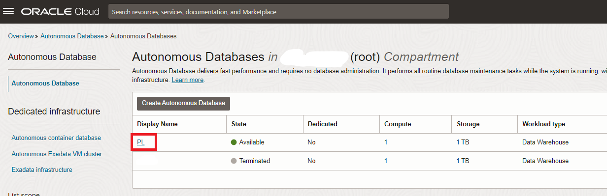

3. **DB Actions**을 엽니다.

   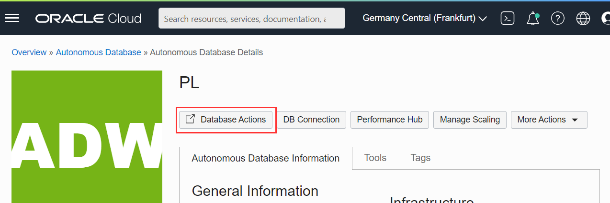

   만일 sign-in 창이 열리면, `ADMIN` 과 설정한 패스워드를 사용하여 로그인 합니다.

4. 다음을 선택합니다. **Administration** > **Database Users**.

   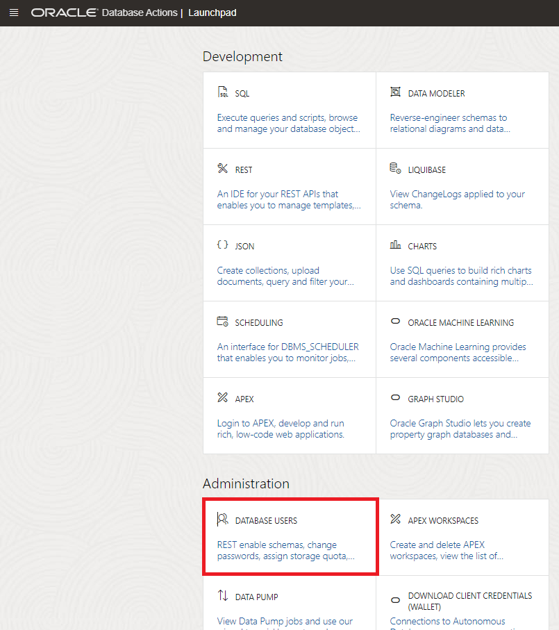

5. **PL** 사용자를 찾은 다음 수정을 선택합니다.

   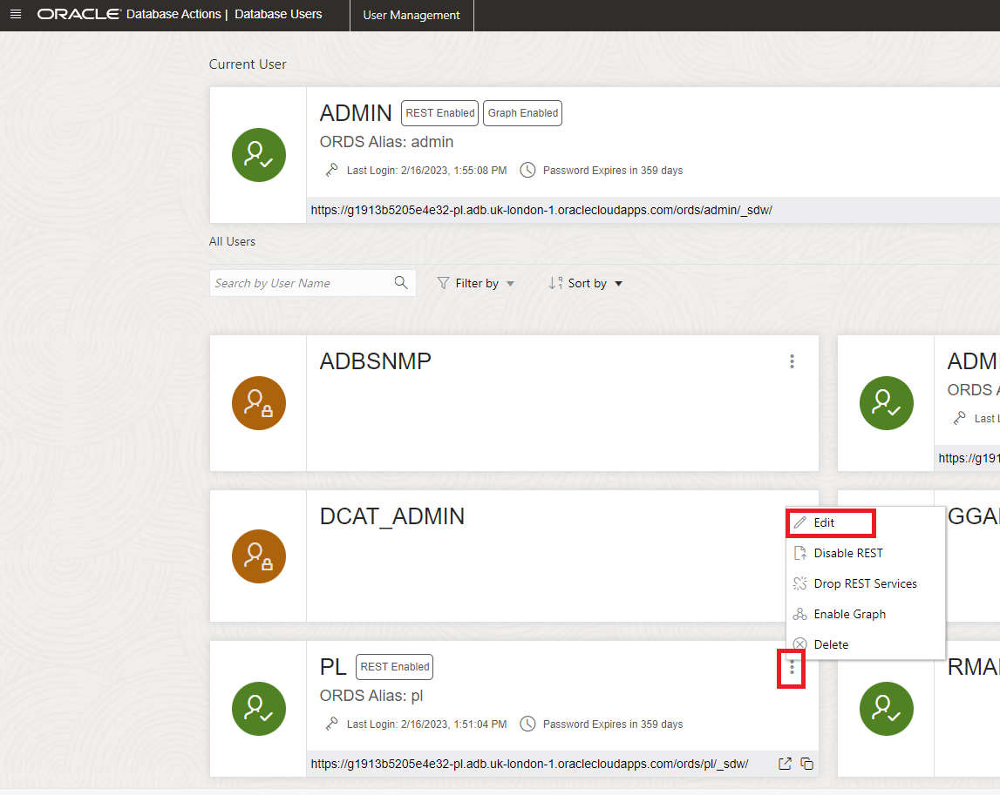

6. "OML"(Oracle Machine Learning) 버튼을 켜고 변경 사항 적용을 클릭합니다. 이제 **PL** 사용자가 Autonomous Data Warehouse의 기계 학습 기능을 사용하도록 설정했습니다. 관리자 로그아웃하십시오.

   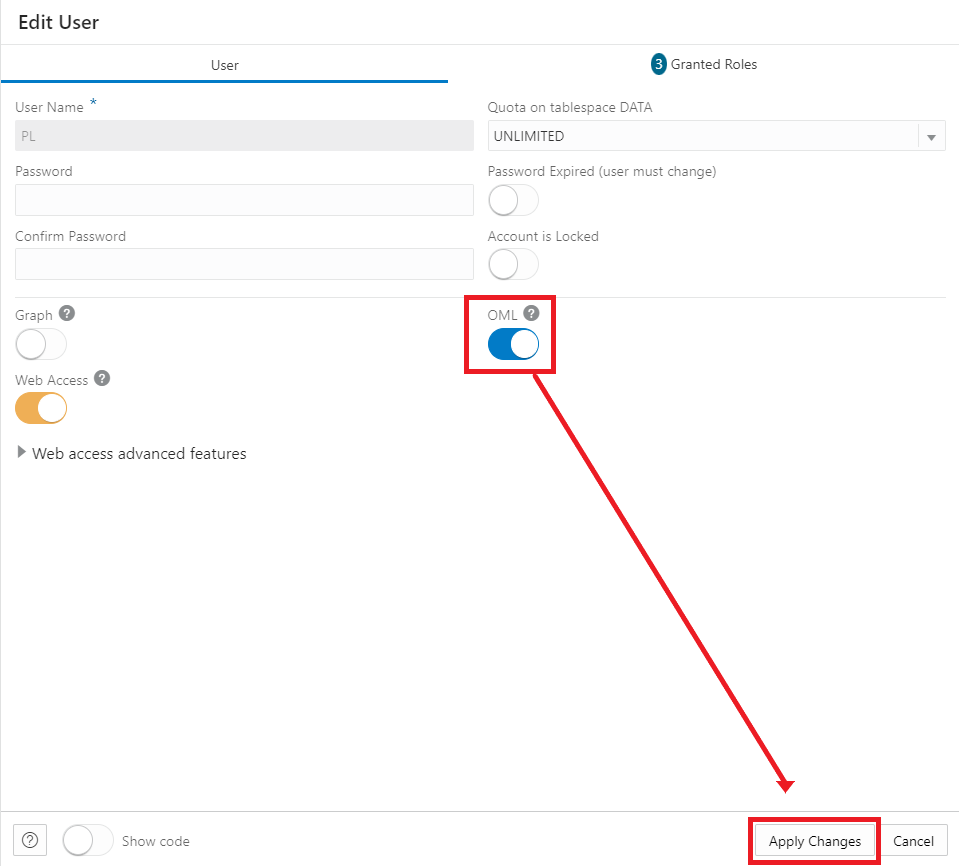

## Task 2: ML Notebook을 실행하여 ANGLE 계산, xG 모델 구축 및 xG 모델 적용

SQL은 머신러닝  프로세스에서도 유용한 언어입니다. 이를 통해 효율적인 방식으로 데이터베이스의 데이터로 작업할 수 있습니다.

사용 가능한 원시 데이터에서 새 데이터를 추출하는 데 사용할 것입니다. 또한 이를 사용하여 데이터베이스 내부에 머신러닝 모델을 구축할 것입니다. 모든 데이터가 데이터베이스에도 저장되므로 매우 편리합니다. 아무데도 옮길 필요가 없습니다.

SQL 학습은 이 워크숍의 목표가 아닙니다. 따라서 이미 이 작업을 수행할 SQL 문을 제공 해 드립니다. 

노트북에서 이 SQL 문을 실행합니다. ML 노트북은 SQL을 실행하는 편리한 방법일 뿐만 아니라 코드를 쉽게 문서화하고 공유할 수 있게 해줍니다.

1. SQL 지침이 포함된 사전 준비된 노트북 파일을 **Download** 합니다:

   [Notebook to calculate ANGLE and build the xG model](./files/calculate-angle-and-build-xgmodel.json)

   로컬 컴퓨터에 파일을 저장합니다. 파일이 `.json` 확장자로 저장되었는지 확인하십시오.

2. Autonomous Data Warehouse의 콘솔에서 **Database Actions** 를 열고 PL 사용자로 로그인합니다.

   

3. **Oracle Machine Learning**을 선택합니다.

   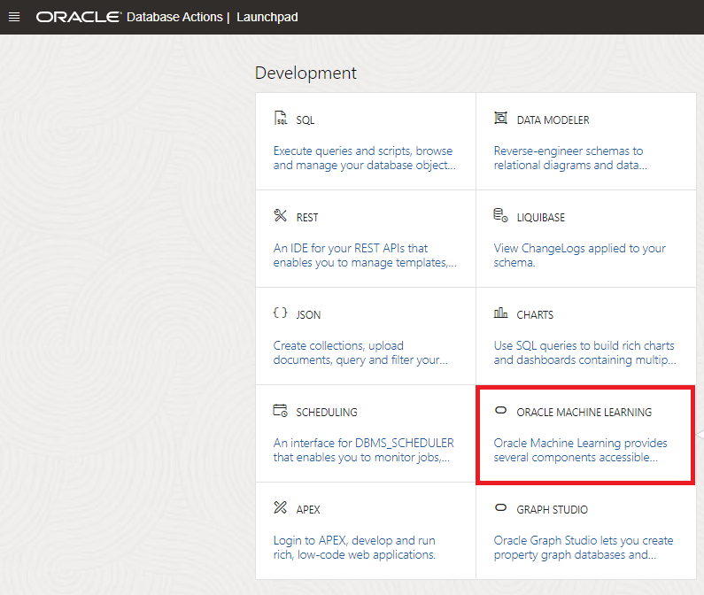

4. 사용자 `PL` 및 PL 사용자의 보안 암호로 로그인합니다.

   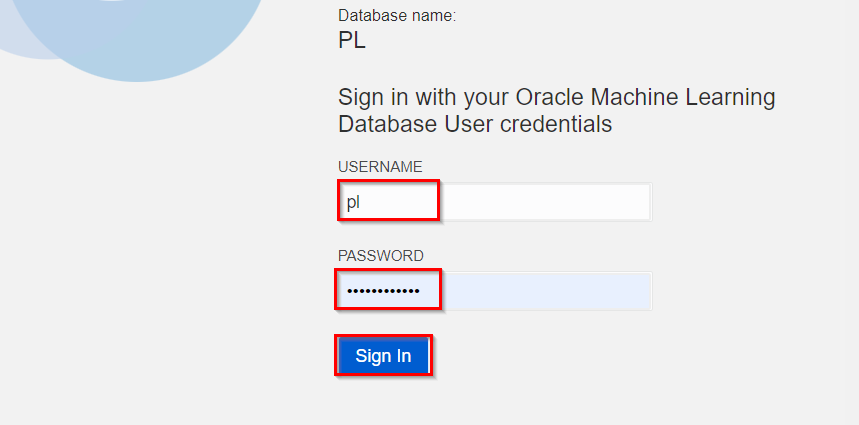

   **`PL` 사용자로서 실행하는 것이 중요합니다**

5. 햄버거 아이콘을 눌러 메뉴를 연 다음 노트북 옵션을 엽니다.

   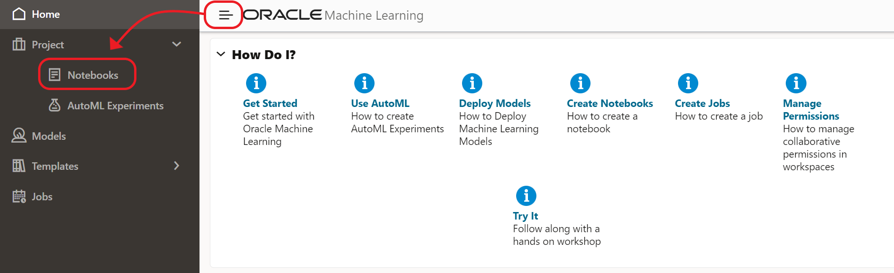

6. "Import Notebook" 옵션을 수행합니다. 

   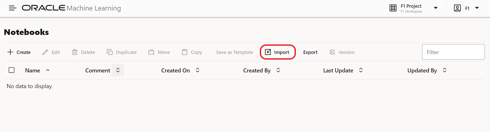

7. 그런 다음 다운받은 `calculate-ANGLE-and-build-xG-model.json`  파일을 선택합니다.

   "노트북 1개 중 1개를 성공적으로 가져왔습니다"라는 메시지가 표시되고 노트북 "Calculate ANGLE and build xG model" 가 나타납니다.

   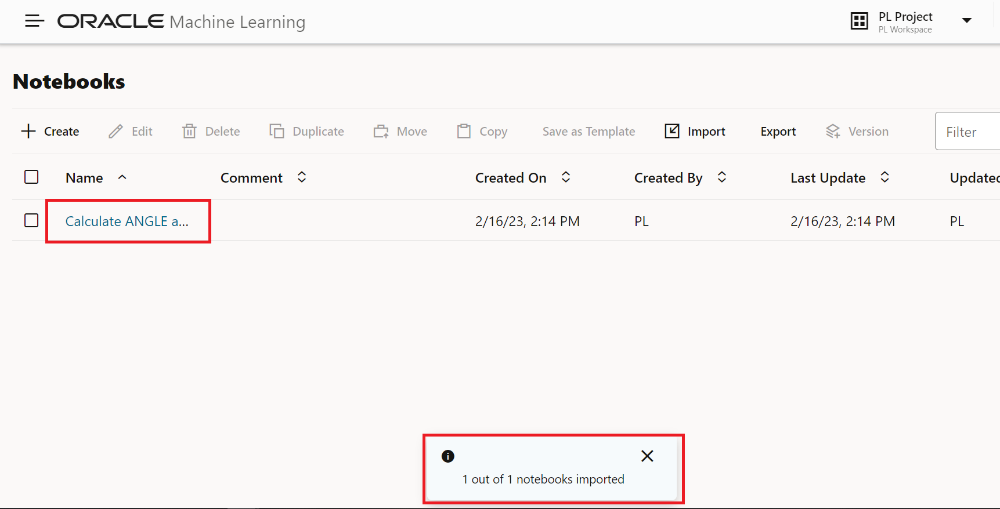

   노트북을 클릭하여 엽니다. 이 작업은 1분 정도 소요될 수 있습니다.

9. 노트북 검사

   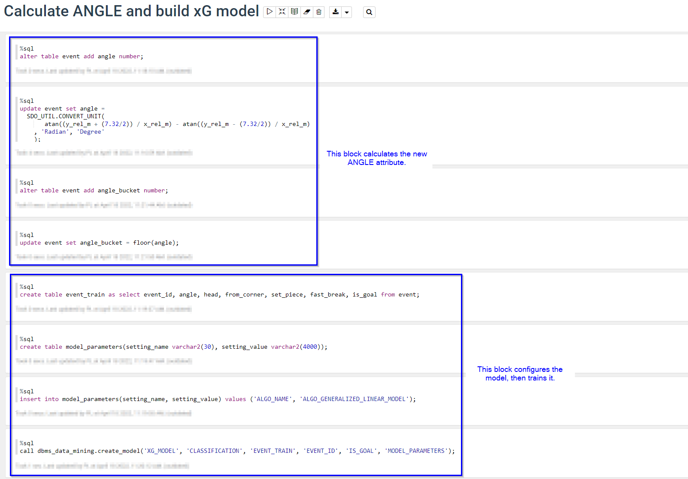
   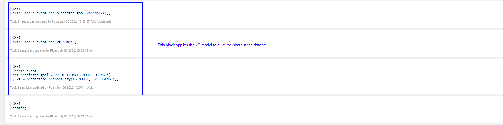

   노트북에서 다음 섹션을 찾을 수 있습니다.

    **1. Calculate ANGLE**

   이 계산은 삼각 함수를 사용합니다. 왼쪽 및 오른쪽 골대까지의 각도를 계산한 다음 이를 빼서 둘 사이의 각도를 구합니다. 기본적으로 이러한 함수는 값을 라디안으로 반환하며 각도로 변환합니다.

    **2. Prepare the data**

   모델 학습에 관련이 있는 데이터만 포함하는 학습 테이블이 생성됩니다. 2017/2018 시즌의 샷 데이터만 사용합니다.

   데이터 탐색 후, 다음 속성이 모델을 구축하기에 좋은 후보라는 결론을 내렸습니다: 
   * `ANGLE`: 슛 위치에서 본 골 포스트 사이의 각도(0도에서 180도 사이).
   * `HEAD`: 슛이 헤딩인지 아닌지 여부 
   * `FROM_CORNER`: 슛이 코너킥에 간접적인 영향을 받았는지 여부 
   * `SET_PIECE`: 슛이 프리킥에서 나온것인지 여부 
   * `FAST_BREAK`: 슛이 역습 상황에서 나왔는지 여부 

   `DISTANCE`를 포함하지 않은 것을 유념하세요. 왜냐하면, `ANGLE` 이 이미 `DISTANCE`의 의미를 내포하기 있기 때문입니다.`DISTANCE` 가 증가하면, `ANGLE`이 감소합니다. 하지만 여러분들은 자유롭게 실험하고 다른 속성(Features) 을 선택하셔도 됩니다~!

   **c) Configure the model training**

   훈련을 위해 모델 매개변수 테이블이 먼저 생성됩니다. 설정되는 유일한 매개변수는 사용할 알고리즘의 이름인 Generalized Linear Model 입니다. 이것은 분류를 위해 로지스틱 회귀를 사용합니다.

   **d) Train the model**

   훈련이 완료되면, 모델은 `XG_MODEL`로 저장될 것입니다. 

   **e) Apply the model**

   이 코드는 새로 생성된 xG 모델을 모든 슛에 적용합니다. 모든 슛은 이제 골이 될 것인지 여부와 골 확률(xG 값)에 대한 이진(바이너리) 예측을 갖게 됩니다.

10. Run the notebook

    노트북 상단으로 이동하여 실행 아이콘을 누릅니다. 그런 다음 전체 노트북을 실행할 것인지 확인합니다.

    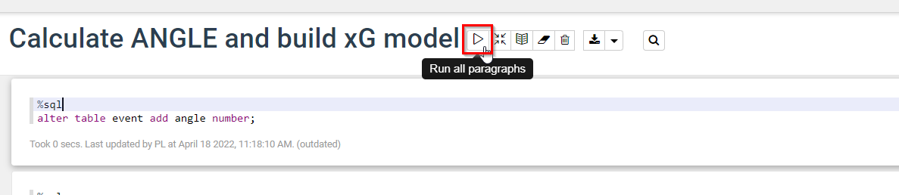

11. 노트북을 실행하는 데 몇 분 정도 걸릴 수 있습니다.

    단락이 하나씩 실행되면서 진행 상황을 따라갈 수 있습니다.

    모든 것이 성공적으로 실행되었는지 확인하려면 마지막 단락으로 이동하여 상태가 "FINISHED"이고 "Took X secs. Last updated..."와 같은 메시지가 표시되는지 확인합니다. 모두 정상이면 **현재 날짜가 표시되어야 합니다** .

    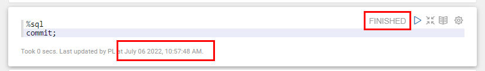

## Task 3 (Bonus): 모델 검증

모델의 품질을 확인하고 싶습니다. 이를 수행하는 한 가지 방법은 xG 지표가 실제 점수 백분율과 얼마나 잘 비교되는지 시각적으로 비교하는 것입니다.

1. 새 노트북을 만들고 이름을 "Verify xG model fit"로 지정합니다.

    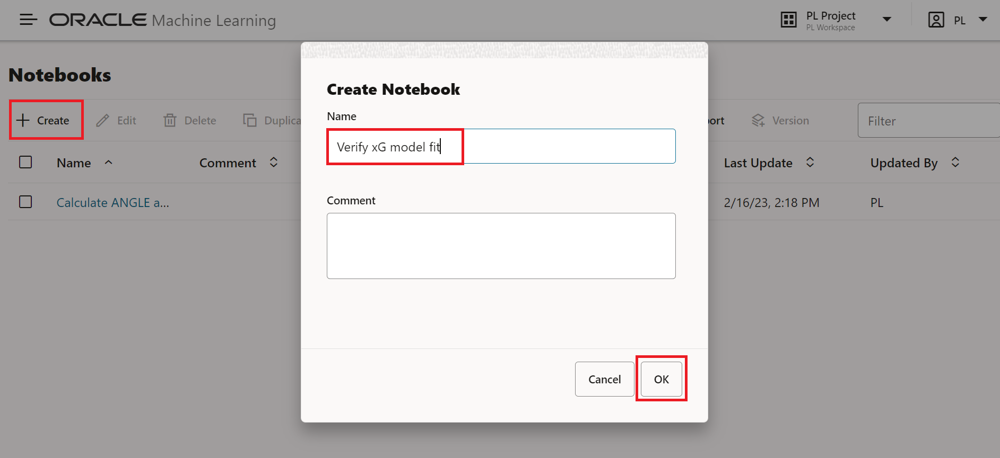

2. 먼저 슛의 *실제 점수* 비율을 시각화해 보겠습니다.

   다음 SQL로 새 셀을 생성하여 ANGLE별로 정렬된 실제 점수 백분율을 확인합니다.

	```
	<copy>
	select angle_bucket, (sum(goal_cnt)/sum(event_count)) as score_percentage
	from event
	group by angle_bucket;
	</copy>
	```

   아이콘을 클릭하여 셀을 실행합니다.

   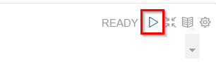

3. 시각화를 분산형으로 변경하고 설정을 클릭하여 차트를 구성합니다. x축 을 `ANGLE_BUCKET` 로 변경합니다. 그리고  y 축을 `SCORE_PERCENTAGE`로 선택합니다.

    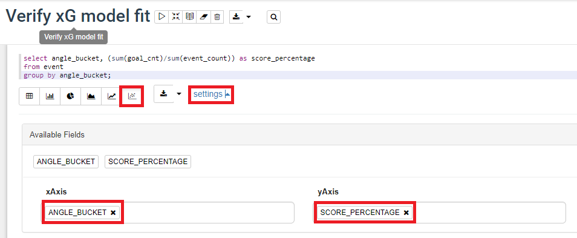

   각도가 증가함에 따라 Score Percentage가 점차 증가하는 것을 볼 수 있습니다.

4. s다음으로 각도 범위에 대해 *xG 모델에서 예측한 값*을 얻습니다 .`PREDICT_BY_ANGLE` 테이블은 0도에서 180도 사이의 자리 표시자가 포함되어 있습니다. 우리는 모든 각도에서 xG 예측 할 것입니다. 

   오른쪽에 있는 아이콘을 클릭하고 "새로 삽입"("Insert New")을 선택하여 새 셀을 만듭니다.

   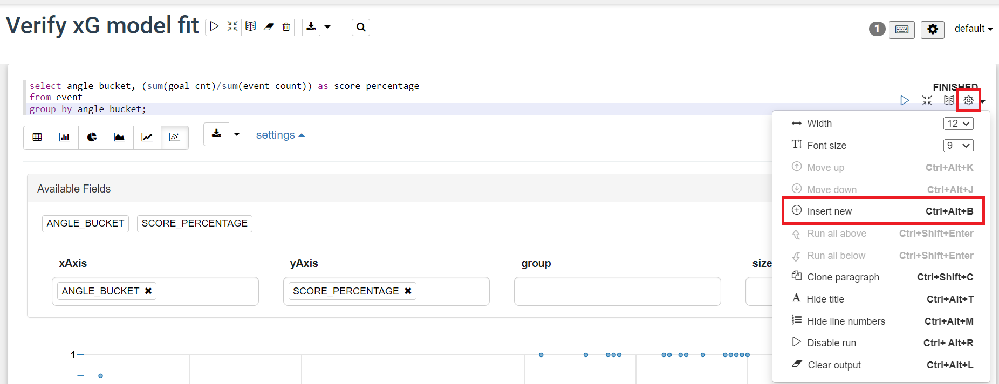

   그런 다음 다음 텍스트를 셀에 복사합니다.

	```
	<copy>
	update predict_by_angle
	set predicted_goal = prediction(XG_MODEL using angle)
	,   xg = prediction_probability(XG_MODEL, 'Y' using angle);
	</copy>
	```

	셀을 실행합니다.

5. xG 모델의 결과를 시각화합니다. 다음 내용으로 새 셀을 생성하고 실행합니다.

	```
	<copy>
	select * from predict_by_angle;
	</copy>
	```

6. 이전과 마찬가지로 시각화를 Scatter로 변경하고 Settings를 클릭하여 차트를 구성합니다. 키를 `ANGLE_BUCKET`로 , 값을 `XG`로 변경합니다.

    
   
6. 두 차트를 비교하여 결과를 검사합니다.

    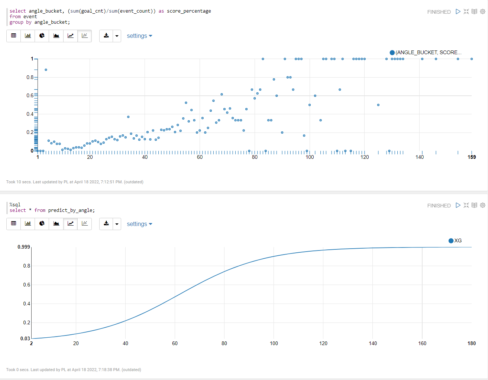

   xG 모델 결과가 실제 점수 백분율의 패턴을 매우 잘 따르는지 확인하십시오. xG 결과와 Score Percentage는 각도가 증가함에 따라 점진적으로 증가하며 절대 0 아래로 떨어지지 않거나 1을 넘지 않습니다.

   이제 다음 실습을 진행할 수 있습니다.

## Acknowledgements

- **Author** - Jeroen Kloosterman - Technology Product Strategy Director, Sudeshni Fisher - Technology Product Strategy Manager.
- **Last Updated By/Date** - Jason Jang, July 2023
- **Korean Translator & Contributors** - Jason Jang, July 2023
