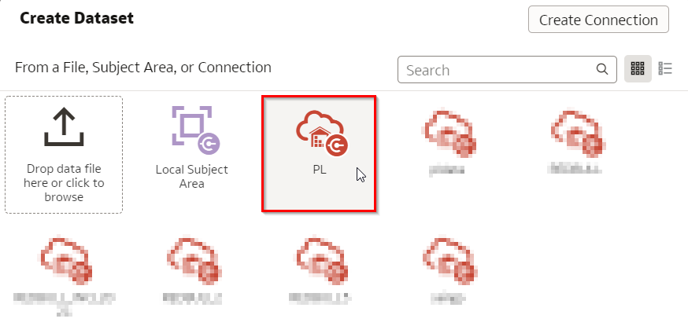

# Use the Expected Goals model to coach players

<!---->

## Introduction

이 실습에서는 플레이어/팀을 안내하는 데 사용할 수 있는 방식으로 모델을 시각화하는 방법을 살펴봅니다.

예상 시간: 15분

### Objectives
- 플레이어/팀을 가이드 하기 위한 모델을 시각화하는 방법 알아보기

### Prerequisites
- Oracle Analytics Cloud
- Autonomous Data Warehouse
- 이전 실습을 완료

## Task 1: xG Matrix 데티어 셋 추가 

1. `XG_MATRIX` 데이터 세트는 2 x 2 미터의 셀로 나누어진 피치(Pitch) 의 모든 위치에 대한 매트릭스를 보유합니다.

    데이터 세트는 xG 값을 포함하여 이러한 각 셀에 대해 미리 계산된 값으로 준비되었습니다. 다시 말해, 우리가 각 셀에서 슛 쏘고 모델에게 골을 넣을 가능성이 얼마나 되는지 묻는다고 상상할 수 있습니다.

   홈페이지에서 "만들기"를 클릭한 다음 데이터 세트를 클릭합니다.

   

2. `PL` 연결을 클릭합니다. 

   

3. `PL` schema 를 열고 `XG_MATRIX` 를 더블 클릭 합니다. .

   

4. 데이터 셋을 저장합니다.  `XG_MATRIX` 이름으로 설정하고, 메인 메뉴로 돌아갑니다.

   

## Task 2:  xG Model 시각화 생성 

1. 홈페이지에서 "Data"를 클릭한 다음 "xG Matrix" 데이터 세트를 클릭하여 새 시각화 통합 문서를 만듭니다.

   

2. `XG`및 `FOOTBALL_PITCH_CELL`(피치의 위치) 필드를 선택합니다 (여러 필드를 선택하려면 Control-클릭 사용). 그런 다음 필드 중 하나를 마우스 오른쪽 버튼으로 클릭하고 "Pick Visualization"을 선택한 다음 맵을 선택합니다.

   

3. 화면 좌측 상단의 추가 설정에서 지도 아이콘을 클릭하여 배경 지도를 "football_pitch"로 설정합니다.

   

4. 일반 플레이 중에는 발을 사용한 슛에 집중하세요(카운터 아님).

   `HEAD` (headers) 를 끌어서 필터로 만들고 "N" 을 선택합니다.

   `FAST_BREAK` (counters) 를 끌어서 필터로 만들고 "N" 을 선택합니다.

   

5. 우리는 최소 xG가 7%인 경기장 섹션(위치)에만 관심이 있습니다.

   드래그하여 `XG`필터링하고 범위 시작을 0.07로 설정합니다.

   

6. 스코어링 찬스가 다음과 같은 영역을 만들고 싶습니다.
	* 30% 이상
	* 15% 이상
	* 7% 이상

	

	"My Calculations" 을 마우스 오른쪽 버튼으로 클릭하고 "New Calculation"을 선택합니다.

	계산 이름을 "xG Zone"으로 지정합니다.

	다음 수식을 입력합니다.
	```
	<copy>
	CASE WHEN XG > 0.3 THEN '>30%' WHEN XG > 0.15 THEN '>15%' WHEN XG > 0.07 THEN '>7%' ELSE '<=7%' END
	</copy>
	```

	**수식에 표시된 모든 위치에 XG라는 단어를 다시 입력합니다. 이렇게 하면 열 이름이 강제로 인식됩니다. 드롭다운에서 "XG"를 클릭합니다.**

	마지막으로 "저장"을 누릅니다.

7. 새로 계산된 필드 "xG Zone"을 Color 섹션의 "XG" 필드 위로 드래그하여 교체합니다

   

8. 결과를 검사합니다.

   

   우리는 이제 발을 사용한 슛을 위한 득점 기회가 어디에 있는지에 대한 매우 명확한 그림을 가지고 있습니다. 이것은 특히 실제 슛과 비교할 때 선수 또는 팀과의 코칭 대화에서 사용할 수 있습니다.

9. xG 영역이 헤딩에 대해 어떻게 다른지 비교하십시오.

   `HEAD`필터를 "Y"로 변경합니다.

   

10. 결과를 검사합니다.

   

   헤더의 xG 영역이 목표에 훨씬 더 가까워지는 것을 명확하게 볼 수 있습니다.

11. 패스트 브레이크(역공)에 대해 xG 영역이 어떻게 다른지 비교합니다.

   `FAST_BREAK` to "Y".다시 `HEAD`필터를 "N"으로 변경합니다. `FAST_BREAK` 필터를 "Y"로 변경합니다.

   

12. 결과를 검사합니다.

   

   슛이 카운터(역공)에서 나올 때 득점 기회가 어떻게 크게 증가하는지 확인하십시오. 꽤 자주 카운터가 발생했을 때 수비가 아직 제 위치에 있지 않은 경우가 많습니다. 이는 더 높은 xG를 설명할 수 있습니다.
   
   실제로 이 모델은 경기장 어디에 서든 득점할 확률을 최소 7%로 예측합니다. 우리의 상식은 이것이 정확하지 않을 수 있다고 말합니다. 그 이유는 특정 거리를 넘어서는 샷이 부족하여 해당 범위에서 모델의 성능이 저하될 수 있기 때문일 수 있습니다.

13. Conclusion: 이제 우리는 다양한 유형의 슛(헤딩/발사용슛/카운터(역공) 등)에 대해 득점 기회가 어디에 있는지에 대한 명확한 그림을 갖게 되었습니다. 이는 선수나 팀과의 코칭 대화에서 사용할 수 있으며 특히 실제 슛과 비교할 때 유용할 수 있습니다.

## **Acknowledgements**
- **Author** - Jeroen Kloosterman - Technology Product Strategy Director, Sudeshni Fisher - Technology Product Strategy Manager.
