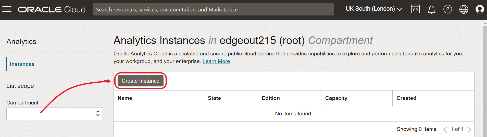

# Oracle Analytics Cloud 프로비저닝

<!---->

## Introduction

이 실습에서는 Oracle Cloud Infrastructure에 Oracle Analytics Cloud 인스턴스를 배포합니다.

예상 시간: 15분 (배포 시간은 다를 수 있음)

### Objectives
이 실습에서는 다음을 수행합니다::
- 사용자 로그인합니다.
- Oracle Analytics Cloud 인스턴스를 생성합니다.

## Task 1: Federated User Login

1. Oracle Cloud에는 두 가지 유형의 사용자가 있습니다:

   - **OCI Native users**: 여러분과 같은 사용자 또는 OCI 기본 서비스에서 작업을 수행할 수 있는 애플리케이션을 나타냅니다.
   - **OCI Federated Users** IDCS는 Oracle Cloud에 포함된 Identity 공급자로서 기본 사용자, 그룹 및 역할 기능 이상의 Identity 서비스를 관리합니다. 예를 들어 OAuth2.0, 다중 인증 요소 등을 포함합니다.

   > NOTE: 참고: Oracle Analytics Cloud (OAC)는 Federated user 를 필요로 합니다. 

2. 오른쪽 상단의 프로필로 이동하여 사용자 이름 앞에 **oracleidentitycloudservice/**가 표시되는지 확인하세요(아래 그림 참조).:

   

3. 사용자 이메일 앞에 **oracleidentitycloudservice/**가 표시되지 않는다면 다음 단계를 따라서 로그아웃한 후 Federated user 로 로그인해야 합니다..

4. cloud.oracle.com로 이동하고 Cloud 계정 이름을 입력한 후 다음을 클릭하세요.

   

5. 사용자 이름과 비밀번호로 로그인하세요..

   

6. 이제 프로필 팝업에서 오른쪽 상단에 이메일 앞에 **oracleidentitycloudservice/**가 표시되어야 합니다.
   Federated user 에 대한 자세한 정보는 User Provisioning for Federated Users를 참조하세요.

## Task 2: Oracle Analytics Cloud (OAC) 인스턴스 생성

1. 홈 페이지로 돌아가 메뉴 > Analytics & AI > Analytics Cloud로 이동하세요.

   

2. 'root' compartment(권한과 다른 compartment를 선택할 수 있는 권한과 경험이 있는 경우)를 선택하고 인스턴스 생성을 클릭하세요..

   

3. 다음 정보를 웹 폼에 입력하고 **Create**:

   - **Name**: `PLAnalytics`
   - **Description**: `Analytics Instance for PL Workshop`
   - **Compartment**: `root` compartment, unless you have permissions and experience selecting a different one.
   - **Capacity**: `OCPU`
   - **OCPU Count**: `1 (Non-Procuction)`
   - **License**: `License Included`
   - **Edition**: `Enterprise Edition`

   

   Your Analytics Instance will start provisioning.

   

   > **Note:** Oracle Analytics Cloud 인스턴스를 프로비저닝하는 데는 10분(아마도)에서 40분이 소요될 수 있습니다.

   이후 워크샵에서 Oracle Analytics Cloud 인스턴스 메뉴로 다시 돌아올 것입니다.

   이제 다음 실습으로 진행하실 수 있습니다..

## **Acknowledgements**

- **Author** - Jeroen Kloosterman - Technology Product Strategy Director, Sudeshni Fisher - Technology Product Strategy Manager.
