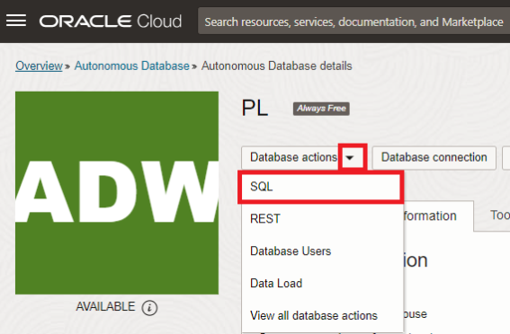
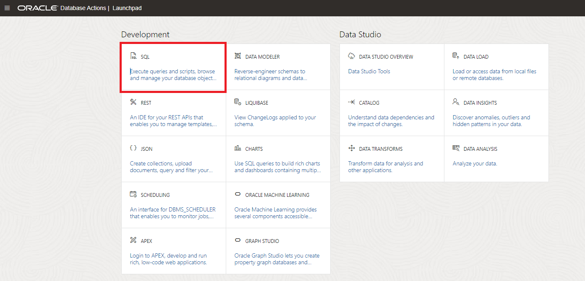

# Lab: Connect OCI Data Science with Autonomous Data Warehouse

## Introduction

Once we have the tracking information, we will want to extract all kinds of statistics from it. For example, a scout may want to calculate statistics on Player Performance. A coach may want to look at Expected Goals, et cetera. In order to give analysts like the scout and the coach easy access to the data for their analysis, we will store all the information that we extract (from the videos) in the Autonomous Data Warehouse. 

In this lab we will set up the connection between our OCI Data Science notebook and Autonomous Data Warehouse

Estimated Time: 15 minutes

### Objectives

In this lab you will:
* Download the wallet from Autonomous Data Warehouse.
* Configure OCI Data Science to connect with ADW.

### Prerequisites
* You've completed the previous labs.
* In particular, you should have finished the provisioning of your Autonomous Data Warehouse.

## Task 1: Download the wallet from Autonomous Data Warehouse

1. In Oracle Cloud, click the **Navigation Menu** in the upper left, navigate to **Oracle Database**, and select **Autonomous Data Warehouse**.

	

    You can see all the **ADW** instances that you have **created**.
    **Select** the instance `PL` that we created before.

    

2. We will download the wallet file. The wallet file (client credentials), along with the database user ID and password, provides access to your Autonomous Database in the most secure way possible.

    

    Choose a password for the wallet and press Download.

> **Note:** Store the wallet in a secure location. 

## Task 2: Configure OCI Data Science

We assume you are connected to your OCI Data Science notebook. If not, please open it first.

1. First, we are going to install the wallet. 

   Upload the wallet to the notebook, by dragging it over to the file explorer on the left.

   

2. Open a terminal, create a new directory and unzip the wallet there.

   

    ```
    <copy>mkdir wallet
    mv Wallet_PL.zip wallet
    cd wallet
    unzip Wallet_PL.zip
    </copy>
    ```

<!--
3. Also, install the Python library "oracledb" to connect with an Oracle database.

    ```
    <copy>pip install oracledb --upgrade
    </copy>
    ```

   
-->

3. We're going to work on an updated version of the notebook, which has all the work of the previous labs, and some additional code to connect to a database. Download the new version here.

   [Notebook with connection to ADW](./files/connect_to_adw_starting_point.ipynb)

  Upload the notebook by dragging it to the explorer section.

   

4. Go to the last cell and adapt the values to match your Autonomous Data Warehouse.

   If you used the default values as instructed in the previous labs, the only values you should have to adapt are the two passwords. The first password is the one you used when you provisioned Autonomous Data Warehouse. The second password is the one you used when you created and downloaded the wallet.

   

5. Run the notebook in its entirety.

   

   If all is well, after a short while, the run completes, and no error messages are shown. This means that a connection was made to Autonomous Data Warehouse, and the TRACKING table was created in the database.

6. Now we are going to store the tracking information for this single frame in the TRACKING table.

   Copy the following code, paste it into a new cell and run it.

    ```
    <copy>def store_tracking_information(image_objects):
        for index, image_object in enumerate(image_objects):
            world_coordinate = image_object["world_coordinates"]
            if "display" in image_object:
                sql = ""
                if image_object["name"] == "Person":
                    shirt_number = "null"
                    if "shirt_number" in image_object:
                        shirt_number = image_object["shirt_number"]
                    sql = "insert into tracking(framenumber, object, shirt_number, position_x, position_y) values (23, 'Player', " + shirt_number + ", " + str(image_object["world_coordinates"][0]) + ", " + str(image_object["world_coordinates"][1]) + ")"
                if image_object["name"] == "Football":
                    sql = "insert into tracking(framenumber, object, position_x, position_y) values (23, \'Ball\', " + str(image_object["world_coordinates"][0]) + ", " + str(image_object["world_coordinates"][1]) + ")"
                print(sql)
                cur.execute(sql)
store_tracking_information(res_json["image_objects"])
connection.commit()
    </copy>
    ```

    Notice how the **store\_tracking\_information** function creates INSERT statements to store the tracking information of the players and the ball in the TRACKING table.

## Task 3: (BONUS) Inspect the results in Autonomous Data Warehouse.

1. In Oracle Cloud, click the **Navigation Menu** in the upper left, navigate to **Oracle Database**, and select **Autonomous Data Warehouse**.

	

    You can see all the **ADW** instances that you have **created**.
    **Select** the instance `PL` that we created before.

    

2. Open Database Actions.

    

3. Open SQL.

    

4. Query the contents of the TRACKING table.

   Type the following in the worksheet and run it.
   
    ```
    <copy>SELECT * FROM TRACKING 
    </copy>
    ```

    

5. You should see the following:

    

At this point we have the basic ingredients to be able to extract tracking information from videos. In the next lab we will take this to the next level by processing a video.

Congratulations on completing this lab!

You may now proceed to the next lab.

## Acknowledgements
* **Authors** - Olivier Perard - Iberia Technology Software Engineers Director, Jeroen Kloosterman - Product Strategy Director
