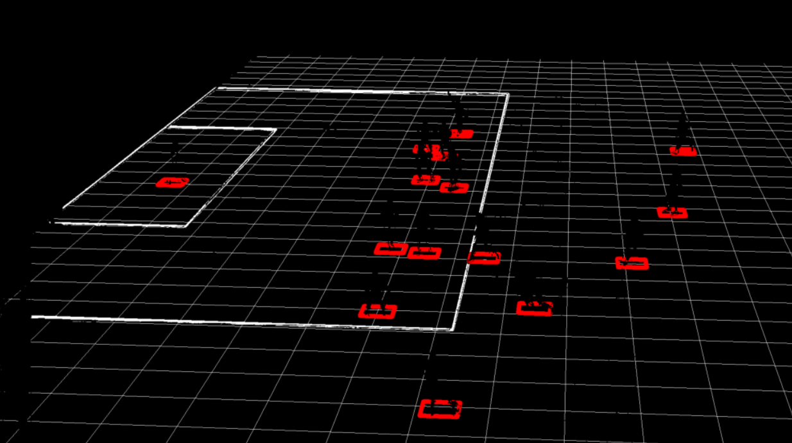

# Translate Camera Coordinates to Football Pitch Coordinates

<!---->

## Introduction

We now have the ingredients to process a video. In this lab, you are going to add a video to the notebook and process it frame by frame. The results of this process will be a) An augmented video (with boxes, and shirt numbers) and b) Tracking information in the database.

Estimated Time: 20 minutes

### Objectives
- Load an existing notebook with the full pipeline.
- Configure the details of your database connection (as you did in a previous lab).
- Inspect some interesting parts of the code with mechanisms that we hadn't covered yet.
- Run the pipeline and inspect the resulting video.

### Prerequisites
- You've completed the previous labs.

## Task 1: Obtain the assets that we require and open the notebook

1. We are going to work with an updated version of our main notebook. Download the new version here.

   [Notebook with full pipeline to process a video](./files/pipeline.ipynb)

2. Upload the notebook by dragging the file to the explorer area.

   

3. Download the video that we will be using as follows:

   Open a terminal.

   

   And execute the following:

   ```
   <copy>wget https://objectstorage.us-ashburn-1.oraclecloud.com/p/EwriB0Oq1hUYAPvkceXZMLTsxcywHAimwkYVc-l03mxWzVWGX79a8QO1lap5wMXz/n/c4u04/b/livelabsfiles/o/ai-ml-library/pl-analysis-video4.mp4 -O video.mp4</copy>
   ```

4. Open the notebook "pipeline.ipynb" and inspect it.

   

   The new notebook with the full pipeline contains all the code from the labs so far, and adds some additional logic. We will now review that logic.

   The notebook contains all the logic that we implemented before, including:
    - Object recognition and text recognition by calling the OCI Vision service for each frame
    - Calculation of the homography translation matrix for each frame
    - Translation player and ball coordinates from camera coordinates to field coordinates for each frame
    - Removal of any objects outside of the field limits for each frame
    - Connecting shirt numbers to players for each frame

   The notebook is basically a loop that processes all the frames, and goes through all of the steps mentioned above. Have a look at the last cell of the notebook, and see if you can recognize all of these elements. 

## Task 2: (Optional) Enable database tracking

By default, the database tracking is turned off in the notebook. Optionally, you can enable the database tracking as follows

1. Search for the function **initialize\_database\_connection\_and\_table** in the notebook. 

   Just like what you did in the lab on Autonomous Data Warehouse, change the values of the passwords. The first password is the one you used when you provisioned Autonomous Data Warehouse. The second password is the one you used when you created and downloaded the wallet.

   

2. Look for the following line in the code, and uncomment it.

   <code>#connection, cur = initialize_database_connection_and_table()</code>

3. Look for the following line in the code, and uncomment it.

   <code>#store_tracking_information(res_json["image_objects"], frame_number, connection, cur)</code>

## Task 3: Run the notebook

1. Run the notebook from the start.

   

   The notebook will output every individual frame as an image. It will also produce an output video called "soccer_out.avi".

2. The processing will take a while, in the meantime, let's inspect some of the code. First, let's have a look at the logic to do **player tracking**.

   NOTE: The code in this step is just for you to review, you don't have to add it to the notebook.

   With player tracking we refer to the idea that we remember where individual players are between frames. This is used to be able to show a shirt number, even when that shirt number is not visible in a certain frame. By using tracking we can "fill in the blanks" because we remember what the shirt number of the player was.

   For example, in the frame on the left, the number 25 is clearly visible on the back of this player, and therefore it will be recognized by OCI Vision. A moment later, in the frame on the left, the number is not visible anymore. Notice, how we are still able to show "25" below the player, this is thanks to the player tracking mechanism.

   
   
   Have a look at the function **enrich\_shirt\_numbers\_from\_tracked\_players**. 

   This function remembers where the players were with a shirt number in the previous frame.

   Check out this line:
   <code>distance = math.sqrt(((world_location_frame[0] - world_location_tracked[0]) * (world_location_frame[0] - world_location_tracked[0])) + ((world_location_frame[1] - world_location_tracked[1]) * (world_location_frame[1] - world_location_tracked[1])))</code>

   This calculates the distance between the players as recognized on the current frame, and the positions of which the players were in the previous frame (with shirt numbers). The function locates the player in the current frame that is closest to the position of where that shirt number was spotted in the previous frame, and adds that shirt number.

3. Let's have a look at the logic for **masking**.

   NOTE: The code in this step is just for you to review, you don't have to add it to the notebook.

   We are using masking to only draw on the field, and not "on top of" the players. For example, notice how in the output below, the augmented drawing appears to be "below" the players. The lines don't obscure the players in any way. This gives a nice 3D effect.

   This is achieved by drawing only on top of pixels that have the colors of the field, in other words, pixels that are green (grass) or white (lines on the field).

   Look for the following code, this creates a mask with only the field (green and white pixels).

   <code># Create a mask for the underlying field (all the green pixels + some white pixels for the lines)
    img_hsv = cv2.cvtColor(image_np, cv2.COLOR_BGR2HSV)
    white_mask = cv2.inRange(image_np, (213, 225, 204), (255, 255, 255))
    lower_green = np.array([40,40, 40])
    upper_green = np.array([70, 255, 255])
    green_mask = cv2.inRange(img_hsv, lower_green, upper_green)
    white_or_green_mask = cv2.bitwise_or(green_mask, white_mask)
    </code>

    Although the notebook is not showing this, the output of this mask would look like this.
   

    We draw the augmentation on a separate black canvas first. This is initialized with the following line, and all the graphical elements are drawn on top of it:
    <code>drawing_canvas = np.zeros(image_np.shape[:3], dtype="uint8")</code>

    The result of this looks like this:
    
    
    Next, we combine the mask with the augmentation, so that the augmentations are only drawn on pixels that are identified as field (or field lines). Notice how the augmentations have been removed in the places where the players are.

    <code>drawing_canvas_masked = cv2.bitwise_and(drawing_canvas, drawing_canvas, mask=white_or_green_mask)</code>
    

    Lastly, we overlay the masked augmentation on top of the original.

    <code>img_augmented = cv2.bitwise_or(drawing_canvas_masked, image_np)</code>

    

4. Once the notebook has finished processing, inspect the resulting video.

   Right-click on the "soccer_out.avi" file and choose "Download".

    

    Watch the video with your favorite video player.

    If you had any problems creating the video, you can also download it here:
    [Augmented video](https://objectstorage.us-ashburn-1.oraclecloud.com/p/EwriB0Oq1hUYAPvkceXZMLTsxcywHAimwkYVc-l03mxWzVWGX79a8QO1lap5wMXz/n/c4u04/b/livelabsfiles/o/ai-ml-library/pl-analysis-soccer_out.avi)

## Task 4: (Optional) Run the notebook for another video

This video contains a fragment of a match between Liverpool and Tottenham Hotspur.

1. Download the new video as follows:

   Open a terminal.

   

   And execute the following:

   ```
   <copy>wget https://objectstorage.us-ashburn-1.oraclecloud.com/p/U4c38N1vkSezFW9TYqt6yfs70atBdeReiQA009FuMYxkN6ycSHK7J4K4iSYCvh1L/n/c4u04/b/livelabsfiles/o/ai-ml-library/video2.mp4 -O video2.mp4</copy>
   ```
   
2. You can download the new coordinate pairs file from [here.](./files/coordinate_pairs2.json)

   Make sure to save the file with extension .json.

3. Adapt the notebook to reference the new input video (video2.mp4) and the new coordinate pairs file (coordinate\_pairs2.json), and run it.

Congratulations on completing this workshop! We hope you have learned many new things and that you are excited to continue working on more data science challenges.

## Acknowledgements
* **Authors** - Olivier Perard - Iberia Technology Software Engineers Director, Jeroen Kloosterman - Product Strategy Director
