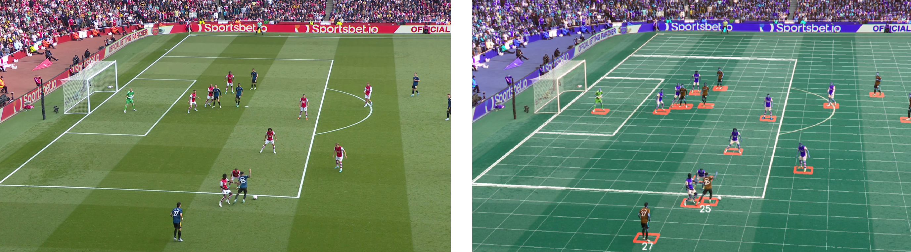

# Introduction

## About this Workshop

In this challenge, you'll learn how computer vision and AI algorithms can be used to extract information from videos of football matches. The end goal of this is to help coaches, football analysts, and fans by supplying them with insights about player and team performance.

Let’s first imagine a situation where we don’t have automatic extraction of information from videos: In this situation, if a football analyst wants to understand the performance of a player, he/she would be forced to manually watch many matches of that player. He/she would have to manually tag every moment in those matches where a player performs some action (e.g. pass, shot, free kick) and then analyze that information later. You can imagine that is a very cumbersome process.

In this workshop we will automate that process. You will create a system that examines a video feed and automatically creates tracking information; we will have a record of where each player and the ball are on the pitch at any moment in the match. 

For our challenge we will use the video from one single camera. The benefits of using one single camera, is that you don’t need any special expensive hardware. We also hope that this will make the system usable for any match that you see on TV.

At first hand you may think that this is easy. Human beings are actually really good at looking at the 3D world / a football match, and judge where the player and the ball are. However, for a machine/computer this is much more difficult. Traditional computer programs are notoriously bad at analyzing images automatically. Some factors that make this a tough problem are: Different stadiums/backgrounds, changing weather conditions and the fact that the camera is not in a fixed position (it can pan/tilt and zoom). To deal with all that, we will use a form of deep learning, which processes images in a way comparable to a brain.

However, we cannot rely on one single algorithm that will do everything we need in a single step, but rather this is a problem that needs to be decomposed into several subproblems:
- Object detection: Where on the 2D image from the camera are the players?
- Projection of coordinates onto pitch: How do we take the position from the 2D image from the camera and project it onto the 3D world space (the football pitch)?
- Team recognition: What side does a player play for?
- Player identification: How do we take “any” player from the object detection step and recognize the individual player from it? For this we'll have to be able to recognize the shirt numbers.
- Player tracking: How can we keep track of a player's identification even when his shirt number is not facing the camera?

We will be creating a pipeline (a process) for which the input will be the raw video of the camera. A sequence of actions (see above) will be performed on each frame (image). The output of the process will be a) an augmented video, showing the position of players, shirt numbers and the ball, and b) the tracking data stored in a database.

This image shows the augmentation that we will be performing in this workshop.

### Objectives
In this workshop, you will:
- Use a deep learning model to recognize players on a field.
- Translate camera coordinates to field coordinates.
- Find out what team a player plays for.
- Use a deep learning model to identify individual players with their shirt number.
- Augment the input video by adding graphical tracking information.

We will write the tracking data to a database (Autonomous Data Warehouse). You will use a number of services, such as Autonomous Data Warehouse, OCI Data Science and OCI Vision.

Estimated Workshop Time: 120 minutes

_At this point, you are ready to start learning! Please proceed._

## Acknowledgements
* **Authors** - Olivier Perard - Iberia Technology Software Engineers Director, Jeroen Kloosterman - Product Strategy Director
