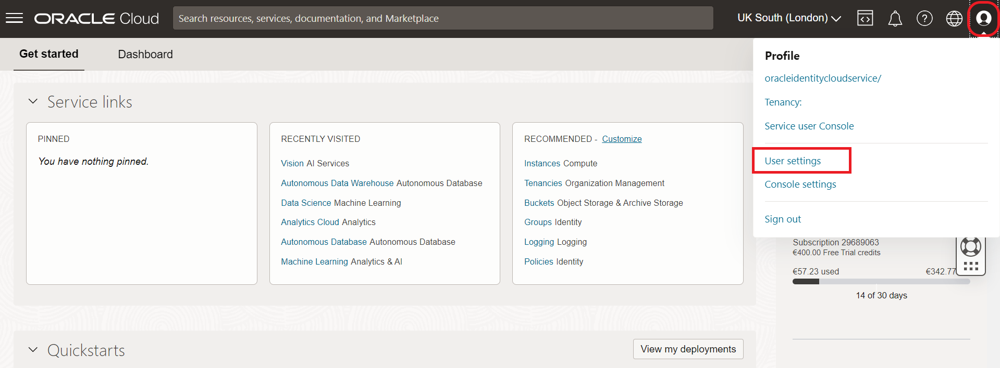
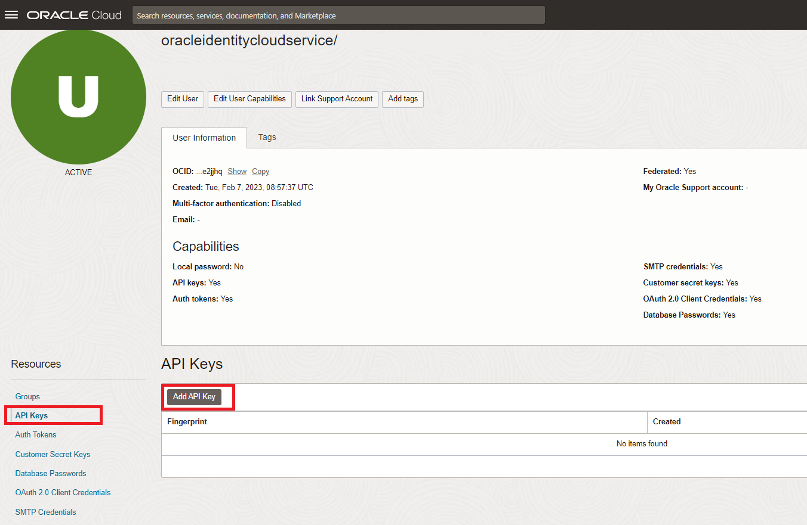
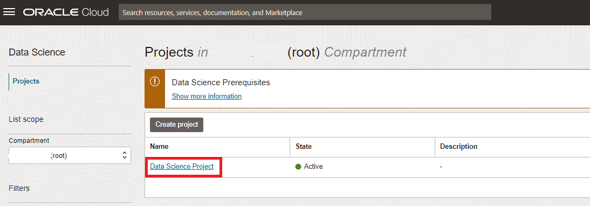
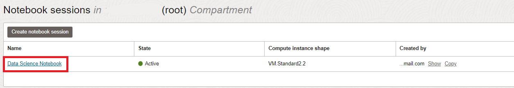
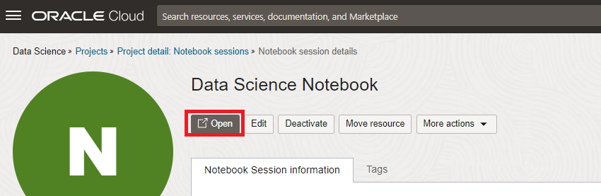
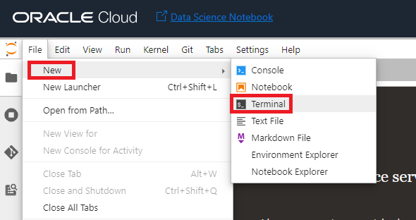
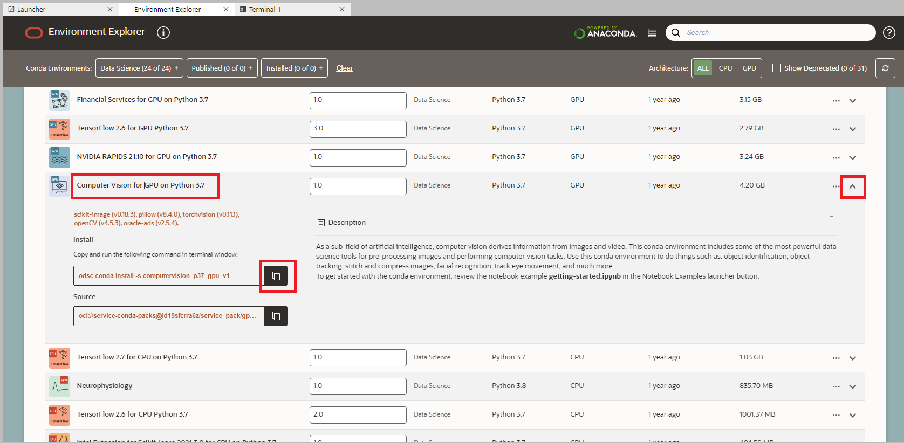

# Lab: Recognizing Players and Shirt Numbers - Programmatically

## Introduction

So far, we have used OCI Vision through the OCI Console (web user interface). In this lab we will call the OCI Vision Object Detection models programmatically using OCI Data Science. Our goal is to build up a solid pipeline that can process an entire video and produce tracking data.

Estimated lab time: 25 minutes

### Objectives

In this lab you will:
* Finalize the configuration of OCI Data Science, so that it is allowed to call the OCI Vision service.
* Create a Python notebook with code to run the two OCI Vision Object Detection models on a single image.

### Prerequisites
* You've completed the previous labs.
* In particular, you should have finished 

## Task 1: Setup API Signing Key and Config File

In order for OCI Data Science to be able to call the OCI Vision service, we need to set up an API Signing key.

1. From the cloud console, open the user menu (top right) and click My Profile.

   

2. Navigate to API Key and then click "Add API Key".

   

3. In the dialog, select Generate API Key Pair. Click Download Private Key and save the key to your local machine and then click Add.

   

4. Now look for the file that you saved on your harddrive. By default the key file has a long name, similar to the following: **oracleidentitycloudservice_mytenancyname-12-17-12-50.pem**. Rename your local file to **key.pem**.

5. Select the text in the contents field and copy it to the clipboard.

   

6. Create a file on your local machine called "config" (no extension)

   - Paste the contents of the clipboard into the new file.
   - Modify the line that has **key_file** to be exactly as shown in the screenshot
     <code>key_file=/home/datascience/.oci/key.pem</code>

   Save your changes.

   

## Task 2: Open the OCI Data Science notebook

1. From the OCI console, go to "Analytics & AI", then choose "Data Science".

    

2. Select the OCI Data Science project that you created earlier.

    

3. Select the notebook that you created earlier.

    

4. Open the notebook.

    

## Task 3: Setup API Signing Key and Config File in OCI Data Science

1. Drag and drop the "config" and "key.pem" files from your local machine to the notebook session.

    

2. Open the Terminal by clicking the Terminal icon in the Launcher Tab.

    

3. Create a new directory **.oci** and move the "config" and "key.pem" files to here by executing the following commands in the terminal.

    ```
    <copy>mkdir ~/.oci
    </copy>
    ```

    ```
    <copy>mv config ~/.oci
    </copy>
    ```

    ```
    <copy>mv key.pem ~/.oci
    </copy>
    ```

## Task 4: Install a Conda package that contains the libraries we need

1. Click on "Environment Explorer"

    

2. Search for a Conda environment that suits the type of development that we're going to do.

   Search for the environments with the "computer vision" libraries with the search field at top right. 
   Open the details of the "Computer Vision for CPU on Python 3.7" by clicking on the down arrow at the right.
   Copy the installation command to the clipboard by clicking on the Copy button.

    

3. Open a terminal window by clicking on **File, New** and then **Terminal**.

    

4. Paste the command from the clipboard.

   `odsc conda install -s computervision_p37_cpu_v1`

5. You will receive a prompt related to what version number you want. Press `Enter` to select the default version.

6. Wait for the conda package to be installed.

   There may be an apparant pause when extracting the libraries. Please be patient.

   This will take about 10 minutes.

7. Last of all, we're going to update the versions of some libraries. By default the computer vision environment doesn't have the right versions of the OCI library.

    Execute the following in the terminal.

    ```
    <copy>source activate /home/datascience/conda/computervision_p37_cpu_v1
    pip install oci==2.75.1 pandas==1.1.5 oci-cli==3.11.1
    </copy>
    ```

## Task 5: Create the first version of the notebook to run Object Detection and Text Detection

1. Create a new notebook by selecting File -> New -> Notebook.

    

2. Select the Conda environment that you installed earlier (Computer Vision), and choose "Create Notebook".

    

3. Download the [Test image](./images/example-football-pitch-image.jpg). This is the same image that you used in the earlier lab.

4. Upload the Test Image to the notebook by dragging it over.

    

5. Now you are in the notebook.

   First of all, we are going to prepare by importing some Python libraries, and by loading and displaying the example image.
   
   Copy the code for loading the required Python libraries by using the Copy button.

     ```python
     <copy>import base64
import json
import io
import os
import requests
from PIL import Image
import matplotlib.pyplot as plt
with open('example-football-pitch-image.jpg', "rb") as image_file:
        encoded_string = base64.b64encode(image_file.read())
image_data = base64.b64decode(encoded_string)
image = Image.open(io.BytesIO(image_data))
plt.gcf().set_dpi(200)
plt.axis('off')
plt.imshow(image)
plt.show()
     </copy>
     ```

   Paste the code into the Notebook and run it

   

   Follow the copy-paste approach every time you see a piece of code like this.

   Have a look at the bottom left of the window. When a command is still running it will show "Busy". When it has finished, you will see "Idle".

   **IMPORTANT: Always make sure that the last command has finished running (status=Idle) before running another cell.**

   If all is well, in this case you should not see any error message. The cursor simply moves to the next cell.

   

6. Now, we're going to make our first call to the AI Vision service. We will send a request to run Object Detection and Text Detection.

   Copy the following into the next cell.

    ```python
    <copy>import oci
config = oci.config.from_file('~/.oci/config')
ai_service_vision_client = oci.ai_vision.AIServiceVisionClient(config=config)
analyze_image_details = oci.ai_vision.models.AnalyzeImageDetails()
inline_image_details = oci.ai_vision.models.InlineImageDetails()
image_object_detection_feature = oci.ai_vision.models.ImageObjectDetectionFeature()
image_object_detection_feature.max_results = 255
image_text_detection_feature = oci.ai_vision.models.ImageTextDetectionFeature()
features = [image_object_detection_feature, image_text_detection_feature]
inline_image_details.data = encoded_string.decode('utf-8')
analyze_image_details.image = inline_image_details
analyze_image_details.features = features
res = ai_service_vision_client.analyze_image(analyze_image_details=analyze_image_details)
res_json = json.loads(repr(res.data))
f = open('vision_response.json', 'w')
json.dump(res_json, f)
    </copy>
    ```
    
    Have a look at the request. 
    
    Notice how we're building a parameter called **analyze\_image\_details**. We ask AI Vision with so-called "features" to do Object Recognition as well as Text Recognition. And, of course, we supply the image to be analyzed.

    Run the cell.
    
6. Inspect the results

   

   First open the "image\_objects" key. Notice how it contains all the objects that were detected in the frame. For each detection, it contains a "bounding\_polygon", which contains the coordinates of the 4 corners of the bounding box, as well as "name", which contains the class of the object, such as "Person" and "Football". 

   

7. Visualize the detections

   Now we are going to visualize the boxes. 
   
   Create a new cell with this contents.

   Notice how this loops through a) The recognized objects and b) The recognized texts. It will draw a bounding box for each of the detection by drawing lines between all of the corners ("vertices"). 

    ```python
    <copy>import cv2
def draw_bounding_boxes(objects, img):
        width = img.shape[1]
        height = img.shape[0]
        # Loop through all of the players found
        for obj in objects:
            point1 = (int(obj["bounding_polygon"]["normalized_vertices"][0]["x"] * width), int(obj["bounding_polygon"]["normalized_vertices"][0]["y"] * height))
            point2 = (int(obj["bounding_polygon"]["normalized_vertices"][1]["x"] * width), int(obj["bounding_polygon"]["normalized_vertices"][1]["y"] * height))
            point3 = (int(obj["bounding_polygon"]["normalized_vertices"][2]["x"] * width), int(obj["bounding_polygon"]["normalized_vertices"][2]["y"] * height))
            point4 = (int(obj["bounding_polygon"]["normalized_vertices"][3]["x"] * width), int(obj["bounding_polygon"]["normalized_vertices"][3]["y"] * height))
            color = (255, 255, 255)
            cv2.line(img, point1, point2, color, 2)
            cv2.line(img, point2, point3, color, 2)
            cv2.line(img, point3, point4, color, 2)
            cv2.line(img, point4, point1, color, 2)
img = cv2.imread('example-football-pitch-image.jpg')
draw_bounding_boxes(res_json["image_objects"], img)
draw_bounding_boxes(res_json["image_text"]["lines"], img)
plt.imshow(img)
plt.show()
    </copy>
    ```

8. Run the cell and inspect the results.

   

   Notice how all the players, the football, and the single visible shirt number (25) are all inside of a bounding box. There are still some problems though:
   a) There are a number of Persons recognized that are not players (outside of the field).
   b) There are a number of texts marked that are not shirt numbers.

   

## Task 6: Connect the shirt numbers to the players

Although we have detected the objects (players) and text (shirt numbers), we still don't know which shirt number belongs to which player.

We will solve this challenge by checking which texts are within the bounding boxes of which object. For example, in this case, the number 25 is within the boundaries of the player.


1. It is our goal to add any shirt number to the "image\_object" data structure for each player.

   We will add a key "shirt\_number" in case the player has an identified shirt number. We want to add this key in each occurrence of the elements of "image_objects" (if a shirt number has been found for that player).

   

2. Copy the following code to a new cell.

    ```python
    <copy>def is_point_within_rectangle(object_rectangle, text_rectangle):
        minX = 1
        maxX = 0
        minY = 1
        maxY = 0
        for coordinate in object_rectangle:
            if coordinate["x"] < minX:
                minX = coordinate["x"]
            if coordinate["y"] < minY:
                minY = coordinate["y"]
            if coordinate["x"] > maxX:
                maxX = coordinate["x"]
            if coordinate["y"] > maxY:
                maxY = coordinate["y"]
        result = text_rectangle[0]["x"] > minX and text_rectangle[0]["y"] > minY and text_rectangle[0]["x"] < maxX and text_rectangle[0]["y"] < maxY and text_rectangle[1]["x"] > minX and text_rectangle[1]["y"] > minY and text_rectangle[1]["x"] < maxX and text_rectangle[1]["y"] < maxY and text_rectangle[2]["x"] > minX and text_rectangle[2]["y"] > minY and text_rectangle[1]["x"] < maxX and text_rectangle[2]["y"] < maxY and text_rectangle[3]["x"] > minX and text_rectangle[3]["y"] > minY and text_rectangle[1]["x"] < maxX and text_rectangle[3]["y"] < maxY
        return result
def add_shirt_number_to_players(vision_response):
        # Loop through all of the players found
        for image_object in vision_response["image_objects"]:
            # Loop through all of the texts found
            # Check if it is within the bounds of this player
            # If it is, then set it as the shirt number
            for line in vision_response["image_text"]["lines"]:
                result = is_point_within_rectangle(image_object["bounding_polygon"]["normalized_vertices"], line["bounding_polygon"]["normalized_vertices"])
                if (result is True):
                    image_object["shirt_number"] = line["text"]
                    print(image_object)
add_shirt_number_to_players(res_json)
f = open('vision_response_enriched_with_shirt_numbers.json', 'w')
json.dump(res_json, f)

    </copy>
    ```

   

   The highlighted piece of code loops through all of the recognized players, and, for each player, loops through all of the texts that were recognized. If the text is within the bounding box of the player (using "is\_point\_within\_rectangle"), the shirt number is added to the player.

3. Inspect the results.

   Open the "vision\_response\_enriched\_with\_shirt\_numbers.json" file.

   Search through the elements of "image_objects". Notice how shirt number "25" has been added to one of the players.

   Later on we will us this in the pipeline to show the shirt number next to each player.

   

Congratulations on completing this lab!

[Proceed to the next section](#next).

## Acknowledgements
* **Authors** - Olivier Perard - Iberia Technology Software Engineers Director, Jeroen Kloosterman - Product Strategy Director
