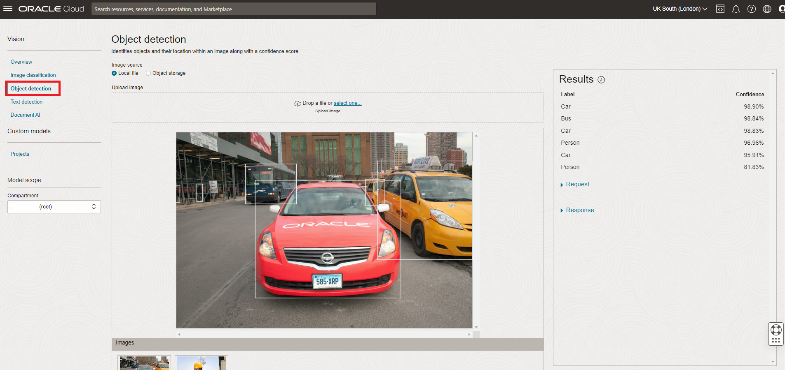

# Recognizing Players and Shirt Numbers (OCI console)

<!---->

## Introduction

In this lab we will look at how to identify players, ball and shirt numbers in a single image from a football game.

We will find out where on the image the players and the ball are using Object Detection, a form of image analysis that uses neural networks to predict (recognize) objects in an image. In this case the "objects" we try to recognize are "Person" and "Football".

We will find out what the shirt numbers of the players are by using Optical Character Recognition. This is a technique that's similar to Object Detection, in the sense that it looks for patterns in the image, but in this it searches the image for characters and numbers only.

Both Object Recognition and Optical Character Recognition can mark the objects/numbers that were found with bounding boxes, so we will know where in the image the occurrences are located.
 
The OCI Vision service is a serverless service, meaning that it requires no installation/provisioning, but is "simply there" for you to use. When you need a Machine Learning model for a particular task, you basically have two options: 1) Build it yourself or 2) Reuse a packaged model. OCI Vision offers both of these options. First of all, it makes it very easy for you to train new models by facilitating the process of labelling, training and testing. Secondly, it comes with prebuilt models for Object Detection and Optical Character Recognition (known as Document AI), that you can easily leverage. We will use these prebuilt models for this exercise.

In this lab, you will use the OCI console (web interface) to access the OCI Vision service and apply the Object Detection and Document AI models on an image from a football match. 

Estimated Time: 10 minutes

### Objectives
- Use the prebuilt Object Detection model of OCI Vision to recognize the players and the ball. 
- We will do this on one single frame (image) of the video using the UI (no programming at this point).

### Prerequisites
- You have a fully provisioned Oracle tenancy/trial.

## Task 1: Test the standard Object Detection model of OCI Vision to detect players and ball

1. In Oracle Cloud, click the "hamburger" menu in the upper left, navigate to Analytics and Data Science, and select OCI Vision.

	

2. Choose "Object Detection".

	

   Notice how you see an example test image. The pretrained object detection model recognizes different entities in this image, which you can see on the right hand side of the screen (Car, Bus, Person).

2. Download the image below to your local machine. 

   Typically you can do this by Right Clicking on the image and choosing "Save Image As".

	

3. In OCI Vision, choose "select one" and select the image that you just downloaded.

	

   At this point, the Object Detection model processes the image.
   Notice how the model recognizes the players and labels them as "Person".

   Click on "Show More" in the Results tab on the right.

   Notice how also the ball is recognized and labeled as "Football".

   

4. Now, click on the "Raw Text" tab.

   Notice how the shirt number of the player in possession of the ball is recognized. 
   Just like with the object detection, the exact position of the text is marked on the image by OCI Vision.

   

The first impression is that the standard models for object detection and text work very well for what we're trying to achieve. Therefore we decide to use this this standard model.

In the upcoming labs we will see how to call the OCI Vision service programmatically, to process all the frames of a video.

You may now proceed to the next lab.

## Acknowledgements
* **Authors** - Olivier Perard - Iberia Technology Software Engineers Director, Jeroen Kloosterman - Product Strategy Director
