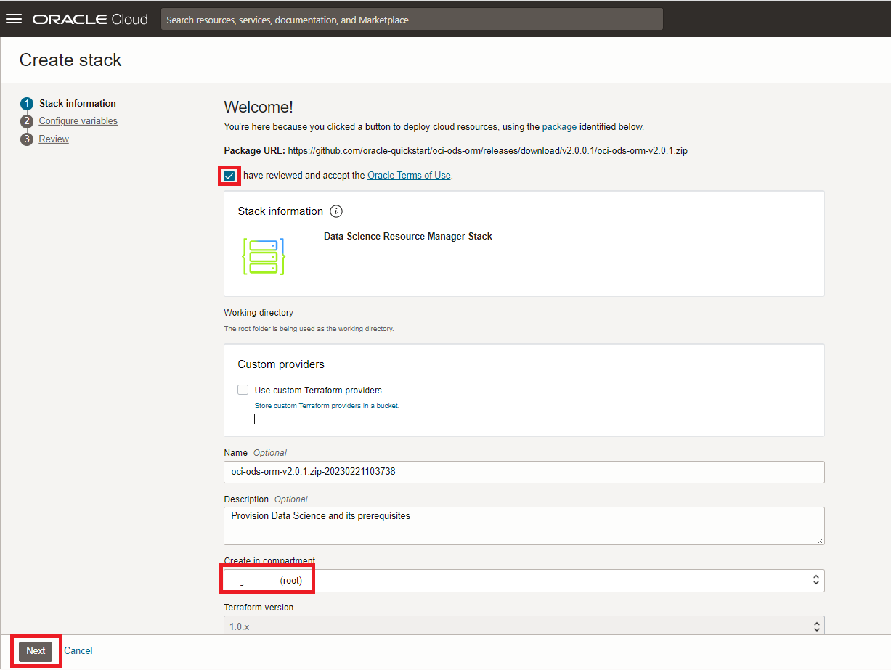

# Lab: Provision OCI Data Science

## Introduction

This lab will show you how to provision the OCI Data Science service.

Estimated lab time: 20 minutes

### Objectives

In this lab you will:
* Become familiar with the process of provisioning OCI Data Science

### Prerequisites

* An Oracle Free Tier or Paid Cloud Account (see prerequisites in workshop menu)
* You need a user with an **Administrator** privileges to execute the ORM stack or Terraform scripts. If you have just created an OCI Trial for this workshop, your main user has Administrator privileges.
* If you have just started with a new Oracle cloud account, make sure that it has completed provisioning. In particular, it's important that you **don't** see the message "Your account is currently being set up, and some features will be unavailable. You will receive an email after setup completes."

## Task 1: Configure prerequisites for the service

This guide shows how to use the Resource Manager to provision the prerequisites for the OCI Data Science service. This includes the configuration network (VCN) and security configuration (groups, dynamic groups and policies).

This process is automated.  However, **if you prefer a manual** approach, to control all the aspects of the provisioning, you can find those instructions here OCI Data Science: [manual provisioning steps](https://docs.cloud.oracle.com/en-us/iaas/data-science/data-science-tutorial/tutorial/get-started.htm#concept_tpd_33q_zkb). In all other cases, please continue with the steps below for automated provisioning.

1. Press this button below to open the Resource Manager.

    

    You may have to log in first in case you were not logged into to Oracle Cloud Infrastructure already.

2. Configure the Stack.
    * Check "I have reviewed and accepted the Oracle Terms of Use".
    * Select the right compartment. If you have just created your Oracle cloud account you may choose the root compartment.
    * Click Next.

    

3. On the "Configure variables" screen, press Next.

    

4. On the "Review" screen, press Create.

    

5. After about a minute, the state of the Job should change to "Succeeded" 

    

## Task 2: Create a Project and Notebook

1. Click on the top left "hamburger" menu, go to "Analytics and AI", then choose "Data Science".

    

2. Click "Create Project"

    

    - Select the right compartment. If you have just created your Oracle cloud account you may choose the root compartment.
    - Choose a name, e.g. "Data Science Project" and press "Create".

    

2. The newly created project will now be opened. Within this project, provision an Oracle Data Science notebook by clicking "Create notebook session".

    

    - Select the right compartment. If you have just created your Oracle cloud account you may choose the root compartment.
    - Select a name, e.g. "Data Science Notebook"
    - We recommend you choose **VM.Standard2.2** as the shape. In practice this makes the processing of the video of this workshop fast enough.
    - Set block storage to 50 GByte.
    - Keep the defaults for the Networking Resources.

    

    Finally click "Create". The process should finish after 5-10 minutes and the status of the notebook will change to "Active".

3. Open the notebook that was provisioned

    

    You may be asked to log in again. After this you will see the Data Science Jupyter environment

    

[Proceed to the next section](#next).

## Acknowledgements
* **Authors** - Olivier Perard - Iberia Technology Software Engineers Director, Jeroen Kloosterman - Product Strategy Director
