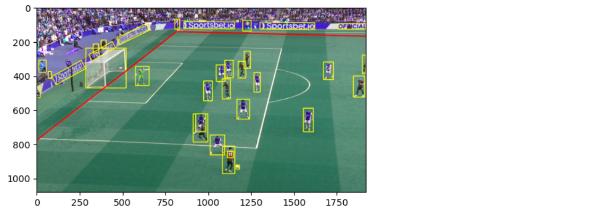

# Translate Camera Coordinates to Football Pitch Coordinates

<!---->

## Introduction

We now have the position of the bounding boxes, but those coordinates are expressed in terms of a flat 2D image (the camera coordinate system). What we are really interested in, is the coordinates of the players/ball on the football pitch. The question is: How can we take the position from the 2D image from the camera and project it onto the coordinate system of the football pitch?
The following image shows what we are trying to achieve:


What we are looking for is a so-called “Homography” translation. This can take any square and transform it into any other quadrilateral and vice versa, like this:


Mathematically, this transformation is represented as a 3x3 matrix. The question is, how can we obtain the right values for this matrix? We have chosen the approach to calculate the homography matrix from known pairs of camera and matching football pitch coordinates. For this calculation, at least 4 pairs are necessary. 
In other words, if we know the camera coordinates (pixels X and Y), and we know the real world location on the pitch, and we have at least 4 of those pairs, then we can calculate the translation matrix. 
In this case, we have already done this for you. We have manually annotated each frame in the football video with at least 4 recognizable markers (e.g. the corners of the penalty area, or the middle corners of the goal area).
What this means for you, is that you can load the 4 coordinate_pairs for each frame, and use Python to calculate the translation. 

Estimated Time: 30 minutes

### Objectives
- You will modify the notebook to load the 4 pairs of camera and matching football pitch coordinates for the frame.
- You will calculate the homography matrix from it.
- You will display the outlines of the field to show that the homography is correct.
- You will translate the positions of the players from camera space to coordinates on the pitch.
- You will remove any recognized objects that are outside of the field limits.

### Prerequisites
- You've completed the previous labs.

## Task 1: Calculate the homography matrix for a single frame and draw field lines on the image

1. Download the coordinate\_pairs.json file to your machine.

   [File with matching coordinate pairs for every frame](./files/coordinate_pairs.json)

   Save the file on your local machine. Make sure that the file is saved with extension `.json`.

2. Upload the file to the notebook by dragging it to the explorer section on the left.

	

3. Open the JSON file, by double-clicking on it in the explorer section. Inspect it.

	
   
   Notice how there are 4 coordinate pairs (pitch + matching camera coordinate) for each frame of the video.
   The file starts at frame 6 because the 5 first frames display the Premier League logo (there is no field visible on the first 5 frames).

4. We are going to work with an updated version of our main notebook. Download the new version here.

   [Notebook with coordinate translation](./files/coordinate_translation.ipynb)

5. Upload the notebook by dragging the file to the explorer area.

   
   
6. Open the notebook.

   This notebook contains all the code from the labs so far, and adds some logic for coordinate translation.

   Go to the last cell to inspect the coordinate translation logic. Notice how it loads the coordinate pairs file, and calculates two homography matrices for the frame. The first matrix is the translation from camera coordinates to world coordinates, and the second matrix is the translation from world coordinates to camera coordinates.

   

   Notice also how there is code that will draw lines on the field, taking real world coordinates (on the pitch, in meters) as an input. The draw\_line\_with\_field\_coordinates function will first translate these coordinates from to the corresponding coordinates on the frame (in pixels), and then draw the line.

7. Run the notebook (from beginning to end).

   You should see the following image.

   

8. Now your challenge is to **draw the penalty area on the field**.

   You can use the following picture with real world coordinates. 

   

   Hint: Keep in mind that the origin of the coordinate system is in the center of the goal line of the left goal (0,0). Pay special attention to the dimensions of the penalty area (16.5m x 40.3m). Deduct the correct coordinates from those values.

   Add the code right below the other calls to draw\_line\_with\_field\_coordinates.

   Your goal will be to produce the following end result:

   

   Ask your workshop instructor if you would like some help.

## Task 2: Translate player coordinates to real world coordinates

Now we are going to translate the player coordinates to real world coordinates.
We will need this for tracking purposes. Any statistics that we want to calculate will need the real world coordinates of the players (and not the coordinates in the camera space).

1. Add the following code to a cell and inspect it.

    ```python
    <copy>def add_object_world_coordinates(image_objects, img, camera_to_field):
        for image_object in image_objects:
            width = img.shape[1]
            height = img.shape[0]
            vertices = image_object["bounding_polygon"]["normalized_vertices"]
            vertex_x = vertices[0]['x'] * width
            vertex_y = vertices[0]['y'] * height
            box_width = (vertices[2]['x'] - vertices[0]['x']) * width
            box_height = (vertices[2]['y'] - vertices[0]['y']) * height
            camera_location = np.array([[int(vertex_x + (box_width / 2)), int(vertex_y + box_height)]], dtype='float32')
            camera_location = np.array([camera_location])
            world_location = cv2.perspectiveTransform(camera_location, camera_to_field)
            world_location = [float(world_location[0][0][0]), float(world_location[0][0][1])]
            image_object["world_coordinates"] = world_location
add_object_world_coordinates(res_json["image_objects"], img, camera_to_field)
f = open('vision_response_enriched_with_world_coordinates.json', 'w')
json.dump(res_json, f)
    </copy>
    ```

   Notice how this takes the pixels coordinates of the bottom middle of the bounding box, between the feet of the players. It translates these coordinates to real world coordinates on the pitch using the **camera\_to\_field** translation matrix that we calculated earlier.

   
   
   Run the code and inspect the resulting JSON document "vision\_response\_enriched\_with\_world\_coordinates.json".

   

   Notice how the key "world\_coordinates" has been added for this player (this has been done for all objects).

2. Your next challenge is to remove any objects (players) that are outside of the pitch.
 
   Copy the following code into a new cell. Don't run it yet, because it's not finished!

    ```python
    <copy>def draw_player_field_markers(image_objects, img, field_to_camera):
        for image_object in image_objects:
            world_coordinates = image_object["world_coordinates"]
            if "display" in image_object and image_object["name"] == "Person":
                draw_line_with_field_coordinates([world_coordinates[0]-0.5, world_coordinates[1]], [world_coordinates[0]+0.5, world_coordinates[1]], img, field_to_camera)
                draw_line_with_field_coordinates([world_coordinates[0]-0.5, world_coordinates[1]], [world_coordinates[0]-0.5, world_coordinates[1]+1], img, field_to_camera)
                draw_line_with_field_coordinates([world_coordinates[0]+0.5, world_coordinates[1]], [world_coordinates[0]+0.5, world_coordinates[1]+1], img, field_to_camera)
                draw_line_with_field_coordinates([world_coordinates[0]-0.5, world_coordinates[1]+1], [world_coordinates[0]+0.5, world_coordinates[1]+1], img, field_to_camera)
    def remove_unwanted_objects(image_objects):
        for index, image_object in enumerate(image_objects):
            world_coordinate = image_object["world_coordinates"]
            if image_object["name"] == "Person":
                if <YOUR CODE GOES HERE>:
                    image_object["display"] = "Y"
remove_unwanted_objects(res_json["image_objects"])
draw_player_field_markers(res_json["image_objects"], img, field_to_camera)
plt.imshow(img)
plt.show()
    </copy>
    ```

   Adapt the placeholder **YOUR CODE GOES HERE** by including a condition to only display players that are **inside** of the football pitch limits. We will do this to filter out all of the objects outside of the field.

   Hint: **world\_coordinate[0]** contains the X coordinate (in meters, as measured from the left of the pitch). **world\_coordinate[1]** contains the Y coordinate (in meters, as measured from the center axis). You will also need the constants **FIELD\_HEIGHT** and **FIELD\_WIDTH**.

   The result should look like this. Notice how there are now squares of 1 by 1 meter drawn at the feet of the players. Also notice how there are no such squares outside of the field limits.

   

   Ask your workshop instructor if you would like some help.

Congratulations on completing this lab!

You may now proceed to the next lab.

## Acknowledgements
* **Authors** - Olivier Perard - Iberia Technology Software Engineers Director, Jeroen Kloosterman - Product Strategy Director
