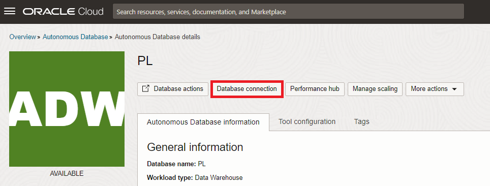
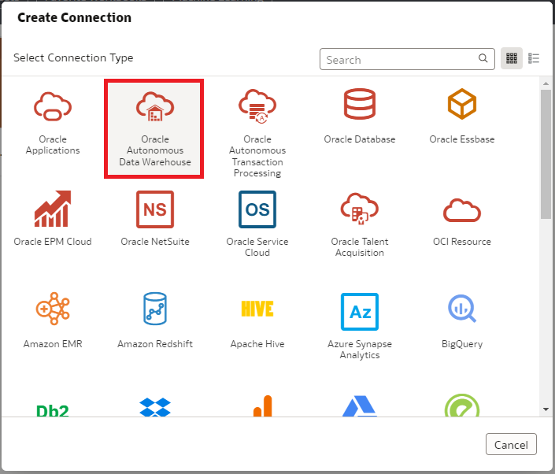
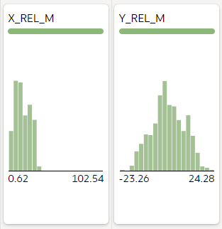
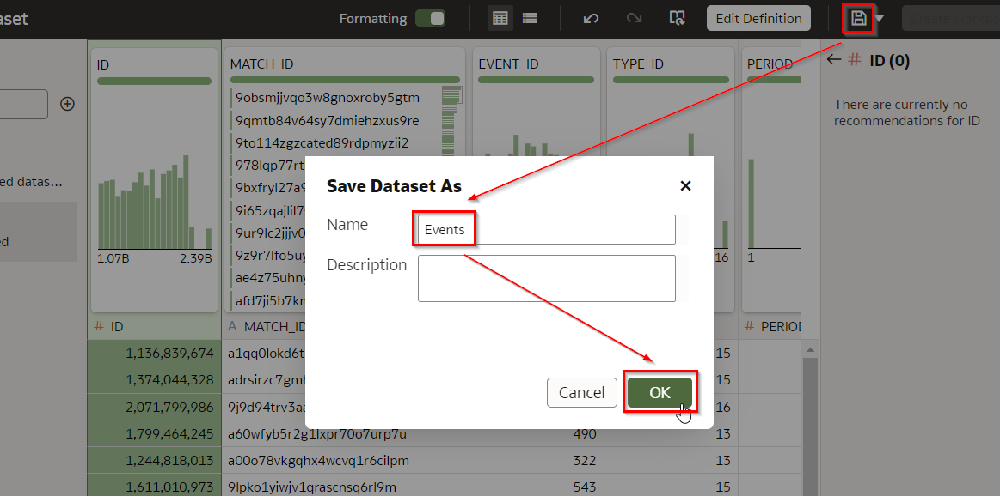
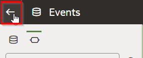
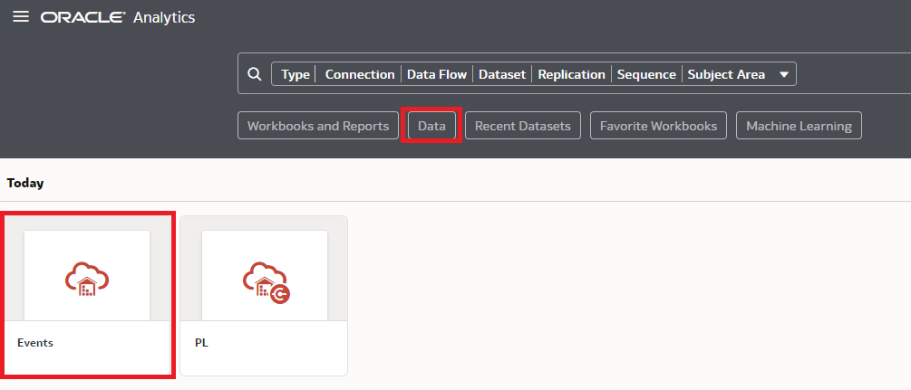
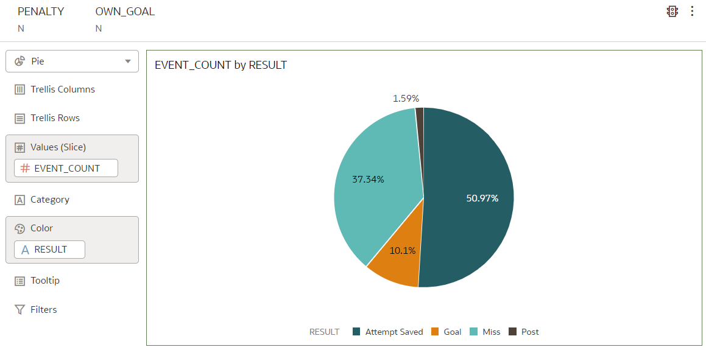
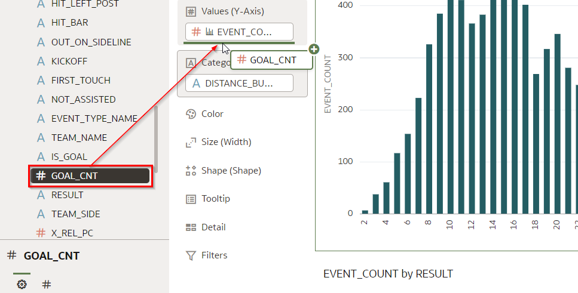
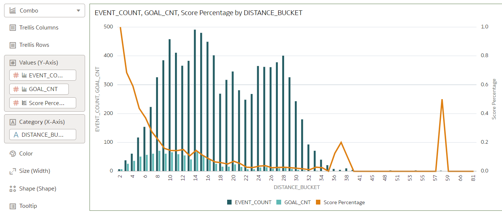

# Explore Data - basic

<!---->

## Introduction

As described in the introduction, our goal is to create an xG model. This model should be able to estimate how likely it is that a shot will result in a goal. 

We will now do a visual data exploration of the shot data. We do this to find out which of its data points are actually *relevant* for a shot becoming a goal. In other words, what information do we have on shots that is of predictive value? Keep in mind that, if we were to train a machine learning model with irrelevant data points, this is likely to result in a reduced accuracy of the model. In other words, we want to make a selection of the right attributes we have on shots to train our model with and ignore the rest.

Estimated Time: 30 minutes

### Objectives
- Identify what data points we have on shots are relevant to predicting the chance of a goal.
- Learn how to use Oracle Analytics Cloud to Explore Data.

### Prerequisites
- Oracle Analytics Cloud
- Autonomous Data Warehouse
- You've completed the previous lab that loads the data sources into the Autonomous Data Warehouse

## Task 1: Create the Connection from Oracle Analytics Cloud to Autonomous Database

**Oracle Analytics Cloud** will be the tool which you use to analyze your data. **Autonomous Data Warehouse** is used to store and organize the data, and to provide the Machine Learning engine.
Therefore we need to create a connection from Oracle Analytics Cloud to Autonomous Data Warehouse first. To be able to create this connection, OAC will need to use a so-called "wallet" file. The wallet file (client credentials), along with the database user ID and password, provides access to your Autonomous Database in the most secure way possible. The "wallet" file can be obtained from the database menus.

1. In Oracle Cloud, click the **Navigation Menu** in the upper left, navigate to **Oracle Database**, and select **Autonomous Data Warehouse**.

	

    You can see all the **ADW** instances that you have **created**.
    **Select** the instance `PL` that we created before.

    

2. We will download the wallet file. The wallet file (client credentials), along with the database user ID and password, provides access to your Autonomous Database in the most secure way possible.

   > **Note:** Store wallet files in a secure location. Share wallet files only with authorized users.

3. On the ADW detail page,click **DB Connection**.

   

4. Click **Download Wallet** on Database Connection side-screen. Leave  the default value `Instance Wallet` as the **Wallet Type**. Finally, click **Download Wallet**.

   

5. Choose a secure password for the wallet, confirm the password by typing it again and click **Download**.

      - Password: Type the secure password
      - Confirm Password: Confirm the secure password

   

6. Click **Close**. A ZIP file will start downloading.

7. Use the Wallet in Oracle Analytics Cloud

    **Return** to the **Oracle Cloud Infrastructure console** and click on the menu icon on the left.

    Navigate to **Analytics & AI** and then **Analytics Cloud**.

    

8. **Open** the Cloud Analytics **URL** associated with your instance (we created this earlier) by using the dots menu button on the right-hand side of your instance information and selecting **Analytics Home Page**.

   Make sure your Oracle Analytics Cloud instance is in status `Active` (not `Creating`) before you go to the **Analytics Home Page**. 

   

   The **Oracle Analytics** page will open in a new browser **window/tab**.

9. On the top right-hand side of the screen, click **Create**, and then **Connection**.

    

10. Choose **Oracle Autonomous Data Warehouse**.

    

    Use the following information to configure your **connection**.

    > **Connection Name**: `PL`
    >
    > **Client Credentials**: Use the Browse button to upload the **wallet zip > file** that you downloaded. It will automatically extract the `cwallet.sso` file from this zip bundle.
    >
    > **Username**: `PL`
    >
    > **Password**: Provide the secure password for the PL user (You chose this in "Load Data into Autonomous Data Warehouse" step 6).
    >
    > **Service Name**: Keep the default, the name of your database followed by the `_high` suffix.
    >

    

11. Select **Save** to save your new connection **information**.

## Task 2: Add the EVENT Dataset to Oracle Analytics Cloud

The EVENT dataset contains information on thousands of shots, of the full season 2017/2018 and a handful of matches of 2021/2022.

1. On the top right, choose Create and then Dataset.

   

2. Select the `PL` connection.

   

3. Open the `PL` schema and **double click** on the `EVENT` table.

   

   Each record in this data set represents one single shot.

   You see how Oracle Analytics is profiling the columns in the data set. It creates histograms that give a high level overview of the distribution of the values in the column. These histograms help you to quickly understand what data you have at your disposal as well as gauge the quality of the data (e.g. missing values).

4. Inspect the `MATCH_DATE` column

   

   Notice how the dataset contains mostly matches from 2017/2018. As mentioned in the introduction, we'll use the full season of 2017/2018 for training our model, and then we will apply this to a handful of matches of the 2021/2022 season.

5. Scroll over to the `X_REL_M` and `Y_REL_M` columns. These hold the coordinates from where the player was at the moment he took the shot. These values are measured from the center of the goal line (in meters). More about this later.

	 

6. Scroll over to the `HEAD`, `RIGHT_FOOTED`, `OTHER_BODY_PART`, et cetera columns. Notice how all of these provide additional information about the shot. This allows us to quickly evaluate the distribution of these variables. For example, we see immediately that the majority of shots are not headers (therefore footers). 

	 

7. Scroll over to the `IS_GOAL` attribute. We see immediately that, non surprisingly, the vast majority of shots do not result in a goal. 

	 

8. Configure the details of the dataset

   At the bottom of the screen, click on `EVENT` to configure the details of the dataset.

   

9. Pivot the presentation so it becomes easier to modify the column configuration.

  

10. Modify the `DISTANCE_BUCKET` column. This attribute contains the distance rounded to the nearest 2 meters point. As you can see, it only contains even values. This will allow us to group shots with similar distances when we visualize them later on.

   Right now this attribute is classified as a `MEASURE` (visible by the # symbol). However, we will not use this attribute to calculate, therefore we will convert this into an `ATTRIBUTE`.

   Click the header of the `DISTANCE_BUCKET` column, then click the value next to **Treat As** and change it to **Attribute**.

   

   The symbol next to the column header changes to `A`.

<!--9. Modify the aggregation type of `SCORE` (score that fans have given to the race)

   Later on, we will want to find out the average SCORE per season. Because of this, we want to set the default aggregation of the `SCORE` field to **Average**.

   Find the `SCORE` column and click it, then change the aggregation to **Average**.

   
-->
11. Save the data set

    Click the **Save** icon and name the data set `Events`.

    

12. Finally, go back to the homepage by clicking on the top left icon.

   

<!--
Let's have a first look at the data that we have available for our data challenge.

1. On the homepage, click "Data", then click the "Races" dataset to create a new visualization project.

  

2. We want to create a chart that shows the number of races per season.

  Select both the `YEAR_C` and `RACE_COUNT` columns. You can do this by clicking on `YEAR_C`, then hold Control while you click `RACE_COUNT`. Next, drag the two to the canvas.

	

  You see that the chart was automatically configured.

	

	Notice the drop in number of races in season 2020 (Covid 19).

3. Now, let's add in the race score. Drag the `SCORE` field to the small space right underneath the `RACE_COUNT` field (inside of the Values Y-Axis section).

   

4. By default the `SCORE` also shows as bars. We want to improve the readability of the chart by changing `SCORE` to a Line presentation.

  Change the visualization type to "Combo".

	

  Set the visualization type of `RACE_COUNT` back to Bar.

	

5. Now the only problem is that `SCORE` has a very different number range than `RACE_COUNT`, and therefore is hard to read. To fix this, we'll give `SCORE` its own scale.

   Click `SCORE` (in the Values Y-axis section) and select "Y2 Axis".

	

	Now you see that `RACE_COUNT` and `SCORE` have their own scale (see left and right Y-axis).

6. Inspect the chart.

   The chart helps us to understand that, although we have Formula 1 data from the very start in 1950 until now, the fan scores are only available for the last decade. And we're missing the fan scores for the races in season 2021.

   At first glance, it appears that, since the measurement of fan scores started in 2008, fans are less excited about the sport as the years progressed. At least, this is the case if we look at the yearly average, not looking at individual races.

	 Since we're missing fan scores for 2021, we cannot say whether this trend continued. However, by the completion of this workshop, you will be able to generate (predict) the scores for the races of 2021 yourself!
-->

## Task 3: Understanding the Result of Shots

  As explained in the introduction of this lab, we will perform a visual data exploration. Our objective of this is to understand the shot data better. In particular, we want to identify which data points to include in our model, and which ones to ignore. In addition, we would like to identify possibly *new* data points that can be extracted from the original dataset by enhancing it somehow. 

1. On the homepage, click "Data", then click the "Events" dataset to create a new visualization workbook.

	  

2. First of all, we want to understand better how many shots we have available and how many of those result in a goal. 

   Create a new visualization by selecting `EVENT_COUNT` (the number of shots) and `RESULT` (the outcome of the shot). Use Control + click to select multiple fields, then drag the fields over to the canvas.

	 

    This results in the following visualization.

	 

3. For our model we'll want to include only in-game shots, and therefore exclude penalties. Drag the PENALTY field to the filter region, and select "N". 

	 

4. We also want to exclude own goals. They are part of the dataset, but not relevant for what we want to do. Drag the OWN_GOAL field to the filter region, and select "N".

	 

5. Inspect the result, notice how there are over 9000 shots that aren't penalties or own goals. Over 900 of those result in a goal. Note that the numbers you see in your environment may vary slightly from the screenshot as we are updating the workshop material.

	 

6. Let's change the visualization to understand the ratios between these numbers. Click on the visualization type dropdown and select Pie.

	 

    Drag the RESULT field to the Color region.

	 

7. Inspect the visualization. You can hover over the pieces of the pie to see the details.

	 

   Our conclusion is that almost 40% of the shots either miss the goal or hit the woodwork. 
   Just over 60% of the shots are on target. The majority of those however, are saved. On average about 10% of shots result in a goal.

## Task 4: Investigate how The Distance Influences the Chance of Scoring a Shot

We are on the lookout for data points that are of value to make a prediction on whether a shot will result in a goal. Our intuition tells us that *distance* should have an influence on whether a shot results in a goal. Let's find more about this. 

1. Select the fields `DISTANCE_BUCKET` (the distance of the shot grouped in buckets of 2 meters) and `EVENT_COUNT` (the number of shots) by using Control + Right Click. Then, Right-Click any of the two fields and select "Create Best Visualization".

   This should create a Bar chart. If not, change the visualization type.

   

   This shows the *number of shots* organized by distance.

   Notice how a large amount of shots are taken from between 8 and 30 meters away from the goal. Interestingly, there’s a dip in the number of shots around 22 meters. 
   
   Notice also that there are hardly any shots from within +/- 5 meters from the goal. That makes sense, it’s very difficult for players to actually get a chance at a shot at such close distance to the goal.

2. How many of these shots result in a goal? Let's visualize this as well. Drag the `GOAL_CNT` field to the "Values (Y-Axis)" section of the chart configuration. Make sure that the correct chart is selected first.

   
   
   The result looks as follows:
   
   

   We can conclude that the majority of the goals come from shots from less than +/- 18 meters from the goal. 
   
   Also notice that although it’s hard for a player to get into a position to fire a shot from lower than +/- 6 meters, the *percentage* of goals in those ranges is very high. The number of goals is almost equal to the number of shots at a distance of less than 4 meters.
   On the other hand, we see a fair amount of shots from over 18 meters away, but the number of goals is relatively low, in other words, the percentage of shots that result in a score at larger distances is low. 
   
3. Our intuition tells us that all of this makes sense, but how do we put a number on this phenomenon? Let’s quantify this relationship between distance and goal percentage by introducing a new "Score Percentage" variable.

   Right-click on the "My Calculations" section (below the list of attributes) and choose "Add Calculation". 

   Then construct the formula `GOAL_CNT`/`EVENT_COUNT`. The easiest way to do this is by dragging the fields from the attribute list (on the left) to the formula canvas. Then name the new attribute "Score Percentage" and press "Save".

   
   
4. Drag the newly created attribute to the section of Values (Y-Axis) just below the `EVENT_COUNT` attribute.

   

5. However, we can hardly see the Score Percentage yet. This is because it's value is in a range between 0 and 1. To zoom in on this, we decide to give this attribute it's own Y-axis. 
   
   Right-click on the "Score Percentage" field and choose "Y2 Axis". 

   

   Next, again right-click on the "Score Percentage" and change the visualization type to "Line".

   

6. The result should look like this.

   
   
   Notice how the percentage (0.0 - 1.0) is shown along the right Y axis. 
   
   We now see the negative exponential relationship that exists between the distance to the goal and the score percentage: At 0 meters from the goal (practically on the goal line), the percentage of shots resulting in a goal is 100%. The score percentage quickly drops to around 25% for shots taken from about 6 meters away and than slowly drops off more, until about 2% (1 shot in 50 is scored) when the distance is over 28 meters.

7. Interestingly, we see two spikes in the score percentage around 36 and 58 meters. What's going on there? Let's investigate.

   Select `GOAL_CNT` (number of goals) and `EVENT_COUNT` (number of shots) by using Control+click and dragging them to the Tooltip section of the chart.

   
   
8. Now hover over the "suspicious" shots around 58 meters. 

   

   Notice how the tooltip shows that there were only 2 shots taken from that distance. It just happened so that one of those shots resulted in a goal!

   In any case, we can conclude that distance is an indicator that is likely to have value as it comes to predicting the chance that a shot will result in a goal.

## Task 5: Investigate how Headers/Footers Influence the Chance of Scoring a Shot

We have a lot more information on shots than just the distance, let's see how valuable those data points are as it comes to predicting goals.

1. We suspect that whether a shot comes from a header or footer has an influence on the chance of scoring. Let’s visualize this as well.

   Create a chart using the fields `HEAD`, `GOAL_CNT`, `EVENT_COUNT` and the calculated field `Score Percentage`. Use the Table visualization type. Remember that you can select multiple fields by using Control+click.

   

   Footers and headers both result in a goal in about 10% of cases. So does that mean that the fact that a shot is taken with the foot or the head is not important for our prediction? Should we ignore it for our model? Not necessarily, because it may be that there is value in it when header/footer is combined with other variables. 

3. Let's put the influence of header/footer in the context of the distance of the shot. 

   Click the chart we previously created with the distance metric. 
   
   Remove the `GOAL_CNT` metric from the chart.

   

   Drag the `HEAD` field to the Color section of the chart configuration.

   
   
4. Inspect the results.

   

   Not surprisingly, headers are usually taken very close to the goal.

   Regarding the goal percentage lines, the line named "N, Score Percentage" means footer score percentage and "Y, Score Percentage" means header score percentage. 
   
   At most distances, the scoring percentage for headers is lower than that for footers. For example, given a shot is taken from for 8 meters, the changes of scoring a goal are higher when the player can take the ball with the foot.

   We can conclude that the HEAD flag is likely an indicator to predict goal chance. Therefore we want to include it when training our model.

5. Save our visualization by clicking on the Save icon and name it "Shots Data Exploration".

   

## Task 6 (Bonus): Investigate how Corners and Other Factors Influence the Chance of Scoring a Shot

1. Similarly to headers/footers, we have a lot more data points that we can validate. Let's take one more example: Whether a shot is an indirect result of a corner.

   In the two charts that you see here, interchange the `HEAD` attribute with the `FROM_CORNER` attribute. You can do this by simply dragging the `FROM_CORNER` attribute on top of the `HEAD` attribute in both of the chart configurations.

2. The result should look like this.

   

   Generally speaking, the score percentage of shots that are the (indirect) result of corners is a bit lower than shots that aren’t (9% versus 10%). Maybe this is because a lot of players gather in the same area when there’s a corner, making it more difficult to score?

   We see this pattern across all distances: the score percentage when the shot is the result of a Corner is lower than for shots that have another origin. 

   What is the take away here? Whenever we find that a variable (in this case the corner "flag") leads to a different pattern in the thing we're trying to predict (in this case the scoring percentage), it shows that it may be an influencer. Therefore it’s a likely candidate to include in our model to predict scoring percentage.

   So yes, we should also include the `FROM_CORNER` variable when training our model.

3. Now it's up to you to try out the other variables, and see how they are related to the scoring percentage. 

   We suggest you take a look at the following attributes: `FREE_KICK` (whether the shot was a freekick), `SET_PIECE` (whether the shot was the indirect result of a sequence that was started by a free kick), and `FAST_BREAK` (whether the shot was the result of a counter).

4. Press the left-arrow on the top left to go back to the main menu. Save the workbook if necessary.

   

## Task 7: Conclusion

In our Exploratory Data Analysis we tried to identify the factors of a shot that are of value to predict whether a goal will be scored from it. Using various visualization techniques, we identified a number of variables that are good candidates for the machine learning model.

You may now proceed to the next lab.

## **Acknowledgements**

- **Author** - Jeroen Kloosterman - Technology Product Strategy Director, Sudeshni Fisher - Technology Product Strategy Manager.
