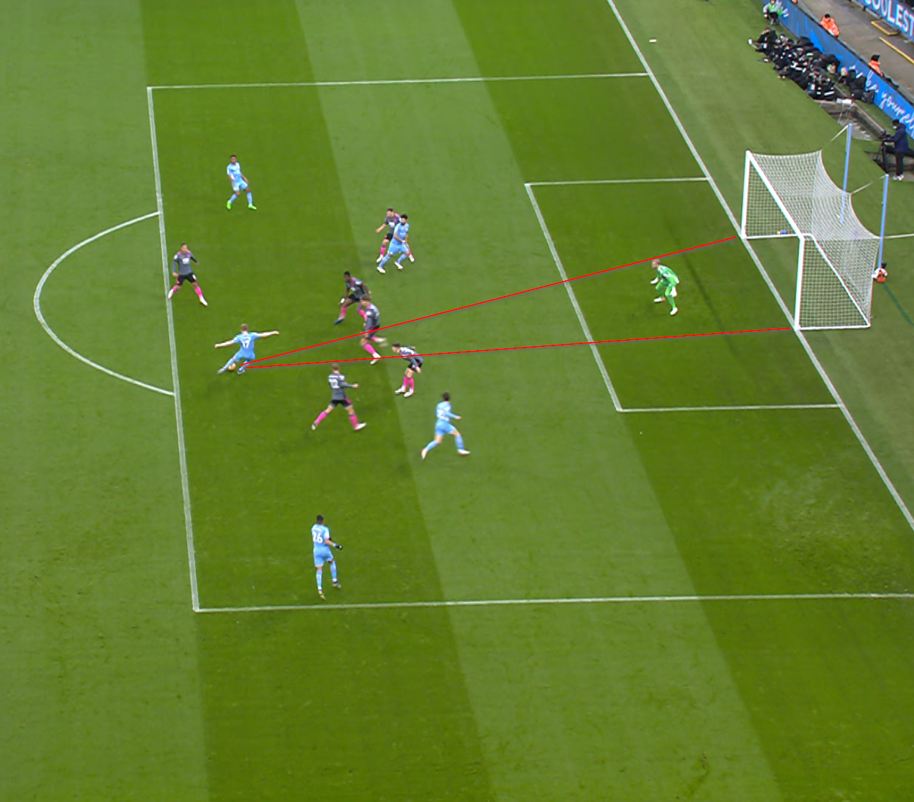
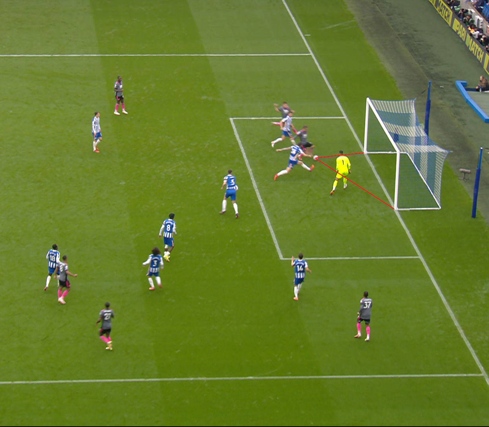
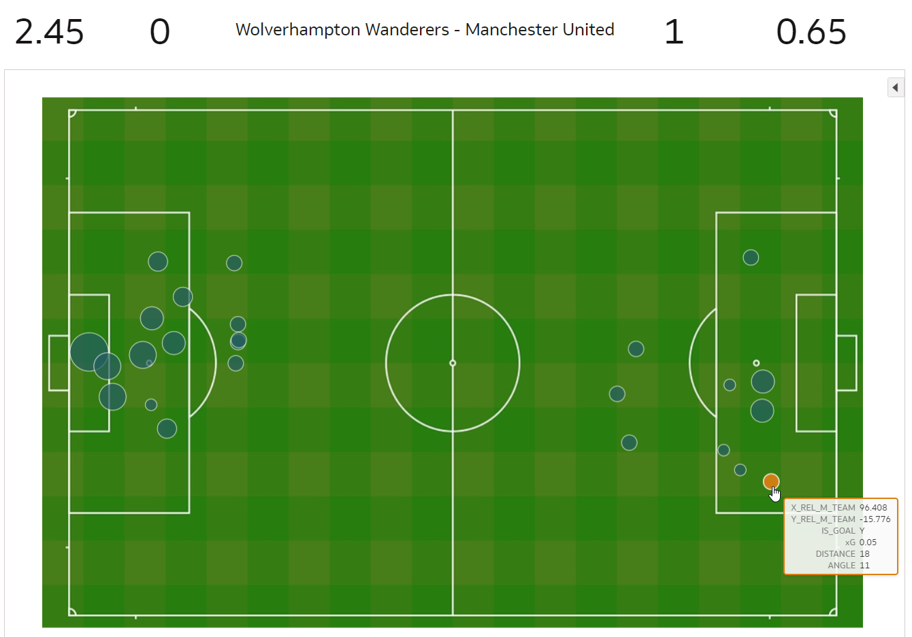

# Introduction

## About this Workshop

If you are passionate about football and data, this workshop is for you! Thanks to the partnership between the Premier League and Oracle, you have the unique opportunity to experience first-hand what it is to be a football analyst. You have the chance to apply advanced analytics and machine learning on real match data! 

In this workshop, we'll look at **Expected Goals (xG)**. This is one of the most important metrics in football. You may already have heard about this in football coverage on TV. The football experts use xG to comment on team and player performance.

In a number of exercises, you'll learn the details about xG. You'll build an xG model yourself and apply it to analyze the performance of teams and players. You'll learn about Autonomous Data Warehouse and Analytics Cloud. 

No experience is required. You will learn everything you need to know along the way!

### Objectives
In this workshop, you will:
- Build an xG model yourself. You'll first explore what data is needed for the model. After this, you will train the model using machine learning.
- Apply your xG model. You'll evaluate matches and players using the xG metric and extract valuable insights that are useful for teams, players, scouts, and fans!

Estimated Workshop Time: 120 minutes

## What is Expected Goals?
Expected Goals (xG) is a measure that tells us how likely it is that a shot from a certain situation will result in a goal. The measure is produced by a model that's been created by learning from thousands of historical shots.

In the image above you see Kevin de Bruyne of Manchester City in the game against Leicester City on 26-12-2021. This shot is assigned an xG of 0.10. That is to say, of shots taken from that position on the pitch, in similar circumstances (e.g. the fact that it's a footer and not a header), only about 1 in 10 would be expected to result in a goal. In this case, this shot actually resulted in a goal.

Above you see another example, this shot is from Jamie Vardy of Leicester City in the game against Brighton on 19-9-2021. He's assisted by Youri Tielemans and manages to get very close to the goal. In this case the xG of the shot is 0.92. This means that of the shots that are taken in a similar situation, about 9 out of 10 are expected to result in a goal. And indeed, this shot also became a goal.

## Why is Expected Goals useful?
When we try to explain what really happened during a match, the most logical thing may seem to be to look at the final score. However, the score tells us only a fraction of what actually happened during the game. 
In a typical match only a few goals are scored. Since goals are so rare, random events and plain luck can play a significant factor in the outcome. Sometimes the better team doesn't win! 

Because of this, when we analyze a match, it's useful to look not just at goals, but also at the **chances** that were created. And that's exactly what xG allows us to do.

To illustrate this, take this analysis of the game between the Wolverhampton Wanderers and Manchester United on 29-8-2021. On the pitch you see all the positions from which shots were taken by both teams. The shots taken by the Wolverhampton Wanderers are on the left and Manchester United's shots are on the right. The size of the circle shows the xG of each shot, and the color indicates whether it was a goal.

You see that the match winning single goal had an xG of only 0.05 (see bottom right). If you'd watched the game, you'd know that the end score of 0-1 didn't reflect what happened during the game: Wolves were dominating the game most of the time. This is reflected by the combined xG scores (summarizing the xG of all shots of a team) of 2.45 versus 0.65 of the Wolves versus Man United respectively.

On the pitch visualization you can appreciate the large amount of shots and relatively high xG of shots made by Wolves. Depending on how you look at it: they were unlucky or Manchester's keeper did a fantastic job. In any case, what this shows you is how xG tells the story of what really happened.

This type of information can be useful for coaches, in order to help their teams do better. It's also great for fans. And even scouts can use this as useful information when evaluating potential players for teams. 

_At this point, you are ready to start learning! Please proceed._

## **Acknowledgements**

- **Author** - Jeroen Kloosterman - Technology Product Strategy Director, Sudeshni Fisher - Technology Product Strategy Manager.
