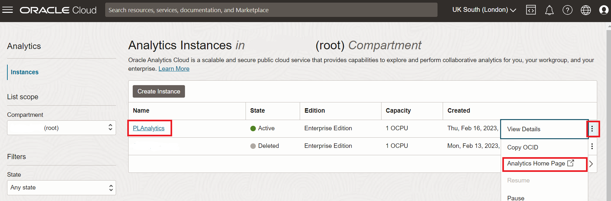
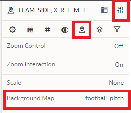

# Apply the Expected Goals model to matches and players

<!---->

## Introduction

In this lab, we will apply our newly trained Expected Goals model to matches and players.

Estimated Time: 30 minutes

### Objectives
- Learn how to use data flow to apply ML models to data

### Prerequisites
- Oracle Analytics Cloud
- Autonomous Data Warehouse
- You've completed the previous labs

## Task 1: Refresh the EVENT Data Set in Oracle Analytics Cloud to Include the New Columns

1. In case you don't have a window with Oracle Analytics Cloud open, you can open it as follows:

    From the **Oracle Cloud Infrastructure console** and click on the menu icon on the left.

    Navigate to **Analytics & AI** and then **Analytics Cloud**.

    

2. **Open** the Cloud Analytics **URL** associated with your instance (we created this earlier) by using the dots menu button on the right-hand side of your instance information and selecting **Analytics Home Page**.

    

    The **Oracle Analytics** page will open in a new browser **window/tab**.

3. Click **Data**, then the small icon on the bottom-right of the `EVENTS` data set, and then "Open".

   

4. Click on "Edit Definition" on the top near to the right of the screen.

   

5. Notice how the `ANGLE` and `ANGLE_BUCKET`, `PREDICTED_GOAL` and `XG` fields are not yet part of the data set. 

   Click "Add All" to also add these new columns in the data set in Oracle Analytics Cloud and press "OK".

   

6. Press "Save" to apply the changes and then go back to the home page with the button on the top-left.

   

<!--
## Task 2: Import the Trained Model into Oracle Analytics Cloud

Now we need to make the Machine Learning model that we built in the database available to Oracle Analytics Cloud.

1. From the home page, click the ribbon on the top right, then Register ML Model, Machine Learning Models. 

   

2. Select the "PL" database connection.

   

3. Now select the model we created earlier and press "Register".

   

   The model is now availabe in Oracle Analytics Cloud.

## Task 3: Apply the xG Model to All Shots

We're going to calculate/predict the xG value for all shots in our data set, including the 2017/2018 and 2021/2022 data, by applying the new ML model.

1. Create a new Data Flow by clicking on Create in the top right, then "Data Flow".

   

2. Click the EVENTS data set, then click "Add".

   

3. Drag the "Apply Model" operation to the "+" icon right next to the Events dataset.

   Click on the model that you registered earlier, then "OK".

   

4. Rename the column "Prediction" to `PREDICTED_GOAL`. This column will be given a value of Y or N. 

   There's also a "PredictionProbability" column, this is the value we're interested in for xG.

   

   Notice also how the columns automatically match up with the input parameters of the model (`ANGLE`, `HEAD`, `FROM_CORNER`, `SET_PIECE` and `FAST_BREAK`).

5. Drag an "Add Columns" operation to the "+" icon right next to the "Apply Model" operation and name the column "XG".

   

6. By default the model will give the probability that its prediction for `IS_GOAL` is correct, regardless of it being Y or N. For example, if the prediction for `IS_GOAL` is "N", then PredictionProbability will hold the probability of the goal *not* being scored. This is not what we want, we only want the probabilty for `IS_GOAL` is "Y". Therefore we'll add a step in the data flow to "invert" the value when `IS_GOAL` is N.

	Type the following in the column definition.

	```
	<copy>
	CASE WHEN PREDICTED_GOAL = 'Y' THEN PredictionProbability ELSE 1-PredictionProbability END
	</copy>
	```

	

7. Drag a "Save Data" operation to the "+" icon right next to the "Add Columns" operation. Name the data set "Event with xG" and set the Table name to "EVENT\_WITH\_XG".

   

8. Set "Treat As" for the following columns:

	> `ID`: Attribute
	>
	> `MATCH_ID`: Attribute
	>
	> `X_REL_M_TEAM`: Attribute
	>
	> `Y_REL_M_TEAM`: Attribute

9. Save the Data Flow by clicking on the Save icon, then type `Apply xG model` as the name and press "OK".

   

7. Keep in mind that at this point we have only _created_ the Data Flow. We have not _run_ it yet!

   To run the Data Flow, press the indicated icon at the top.

   

   After a few moment (usually less than 1 minute), you should see the message _Data Flow "Apply xG model" complete_.

8. Go back to the home page by clicking on the top-left icon.

   
-->

## Task 2: Build the Visualizations to Analyze a Match

1. First of all we will add a MATCH data set, which holds the team names and results of each match.

   On the homepage, click "Create", then click Dataset.

   

2. Choose the `PL` connection.

   

3. Open the `PL` schema and double-click on `MATCH`.

   

   Notice how this data set contains one row for each match (season 2017/2018 and a handful of matches of the 2021/2022 season).

4. Save the data set, name it `MATCH`, then go back to the main menu.

   

5. On the homepage, click "Data", then click the "Match" dataset to create a new visualization workbook.

   

6. First, let's select a particular match. Drag the `NAME_DATE` field to the Filter section and search and select the match "Liverpool - Manchester City 03-10-2021".

   

7. Select the `TEAM_HOME_NAME`, `TEAM_AWAY_NAME`, `SCORE_HOME` and `SCORE_AWAY` fields (use Control-Click to select multiple fields). Then right-click on any of the fields, choose "Pick Visualization" and choose Table.

   

8. Reorder the columns so that the result looks as follows.

   

9. Next, we will add the **list of shots by each team** in the match.

   Next to the search box, click the "+" icon and choose "Add Dataset".

   

10. Pick the "Event" data set and click "Add to Workbook".

   

11. Select `PLAYER_NAME`, `TIME_MIN` and `IS_GOAL` from the "Event with xG" data set (use Control+click to select multiple fields). Then right-click on any of the fields and select "Pick Visualization" and choose Table.

   

12. We would like to have separate tables for the home and away teams. Therefore we will duplicate this table. 

   Right-click on the header of the chart you just created and select Edit -> Duplicate Visualization.

   

13. The result should look similar to the following.

   Rearrange the tables by dragging their headers if necessary.

   

14. Now let's apply filters so that the left and right tables show shots for the home and away teams respectively.

   Drag the `TEAM_SIDE` field to the Filters section of the shots table on the left, and choose "home".

   Similarly, filter the other shots table for the "away" team.

   

15. Last of all, on both tables with shots use the up arrow on the `TIME_MIN` column to sort the shots by time.

   

16. Now, let's add the football pitch to **visualize the location of each shot**, along with the xG information.

   Select `X_REL_M_TEAM` (position of player), `Y_REL_M_TEAM` (position of player), `GOAL_CNT` (whether a goal was scored from the shot) and `XG` (the xG value according to our model) from the "Event with xG" data set (use Control+click to select multiple fields). Then right-click on any of the fields and select "Pick Visualization" and choose Map.

   

17. Change the chart configuration so it matches the following screenshot:

   

   You can drag fields around to change the configuration.

18. Change the additional map configuration at the bottom left of the screen by clicking the Map icon and choosing "football\_pitch" as the background.

   

19. Drag the `ANGLE` and `DISTANCE` attributes over to the Tooltip section of the map configuration. This will allow us to easily check these values when we hover over a shot.

   

20. Finally, we can compute the total xG scores. We will do this for both teams.

   Right-click the `XG` attribute and choose "Create Best Visualization". This will create a total for the xG values of all shots in the match.

   

21. Drag the XG visualization so that it shows on the side of the home team.

   

22. Set a filter on the home team's xG by dragging `TEAM_SIDE` to the Filters section and choosing "home".
   
   

23. Repeat steps 20-22 for the away team.

24. Check the resulting workbook. 

   Rearrange the visualizations if necessary.

   

25. Save the workbook and name it "Match Analysis".

   

## Task 3: Analyze Liverpool - Manchester City on 03-10-2021

1. Have a look at the difference between the total of goals versus the total xG for both teams. 

   The numbers indicate that the teams were able to take good advantage of relatively difficult shot circumstances.

   

2. The players managed to score goals from some pretty difficult situations. Now we have xG, we can actually put a number on this.

   Click on Mohamed Salah’s goal in minute 75 in the shots table. 
   
   
   
   Initially you may think that he’s quite close to the goal and it’s a good opportunity, but the xG is actually only 0.06. In other words, our xG model tells us that only in about 6% of all cases (1 in about 17 shots) a goal would be made in this situation (given the location on the pitch and the facts that it’s a footer, it’s not from a corner, it’s not from a free kick and it’s not from a fast break).

   We can appreciate that better if we have a look at the distance and the angle Salah is facing here:

   On the topdown view he may appear to be close to the goal, but he’s actually still 10 meters away from the center, with an angle of only 16 degrees between the two goal posts. Now keep in mind that there’s a keeper between him and the goal, and we realize just how difficult the shot is.
   
   That’s where we see the world class of these players!

3. Now have a look at the goal from Kevin de Bruyne in minute 80 by clicking on it in the shot table.

   You see that the chance of scoring from that position according to our model is 8%. Because Kevin was quite far away from the goal, the angle between the goal posts is relatively small at 22 degrees.

   

4. Also notice the highest shot chance of the match according to our xG model. 

   The last shot of the match was by Gabriel Jesus and it's given an xG of 0.28, and it did not result in a goal.

   Bonus: Investigate why the model may have given a relatively high xG for this shot. 

   

## Task 4: Analyze Manchester United - Watford on 26-02-2022

1. Change the filter to select the match between Manchester United - Watford on 26-02-2022.

   

2. Inspect the visualizations and analyze the match.

   

   This game ended in 0-0.

   So does that mean both teams were just as strong? If you’d watched the game, you’d know that Manchester United was having the upper hand, even though the score doesn’t reflect that.

   You can see that in the sum of xG for both teams. They had a large amount of shots with an xG of over 20%. Normally some of these would land in the net, but sometimes a team is unlucky.  
   
   Now, as a trainer for Manchester United, you could interpret this in different ways: Maybe the team was just unlucky, or maybe the team should improve their finishing skills. Another way of looking at it is that the goalkeeper of Watford did a great job. In any case, we cannot blame ManUnited for not creating opportunities!

## Task 5 (Bonus): Find the Goal That Had the Lowest Chances According to Our xG model

1. Remove the existing filter on match.

   

2. Create filter to a) show only the goals, b) remove penalties and c) remove own goals.

   

3. Select the `ID`, `PLAYER_NAME` and `XG` fields of the "Event with xG" data set (use Control-Click to select multiple fields). Then right-click on any of the fields, choose "Pick Visualization" and choose Table.

   

4. Right-click on the visualization and check "Use as Filter". This means that the other visualizations on the workbook will automatically sync to the shot that we click.

   

5. Sort the results by xG ascending by clicking on the up arrow on the xG column header.

   

   We see that it was Kai Havertz who scored a goal from the shot with the lowest xG. The xG is only 0.02, meaning that only one in about 50 shots in the same situation are expected to result in a goal.

   Click on the row.

6. Investigate what makes this such a difficult shot. 

   Add the `HEAD` and `FROM_CORNER` attributes to the shots table. 

   

   Now we understand why this shot was so difficult: Not only was this a header resulting from a corner, but also the distance to the goal was substantial (11 meters) and the angle was also not ideal (22 degrees).

   An incredible header!

   You may now proceed to the next lab.

## **Acknowledgements**
- **Author** - Jeroen Kloosterman - Technology Product Strategy Director, Sudeshni Fisher - Technology Product Strategy Manager.
