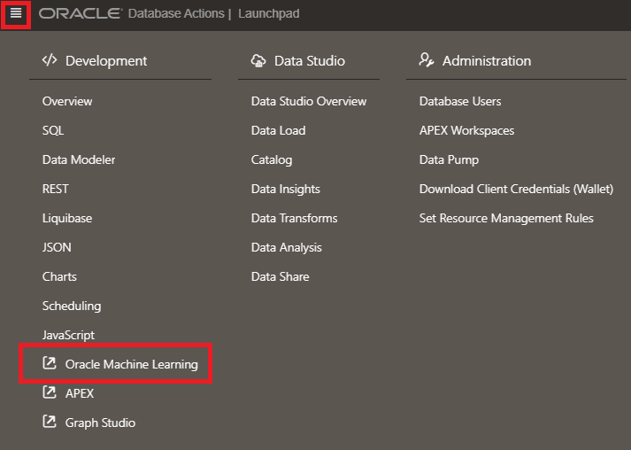
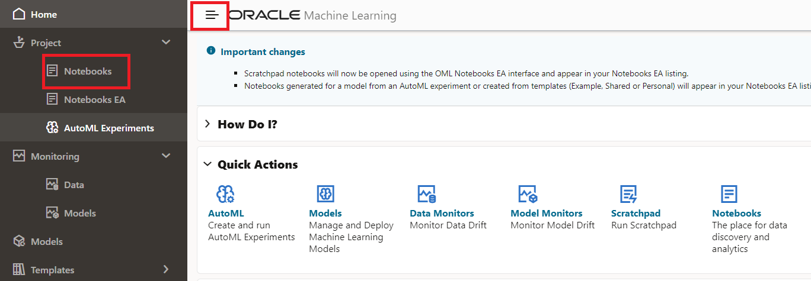
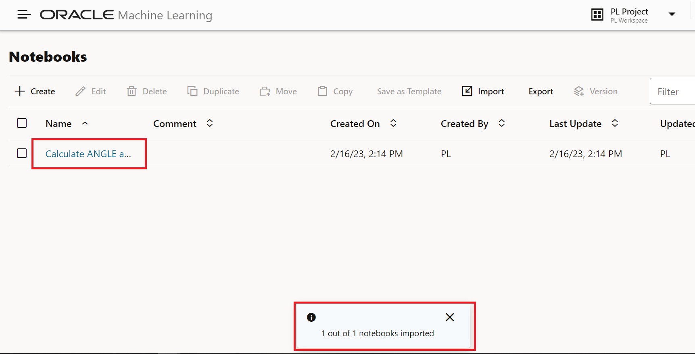
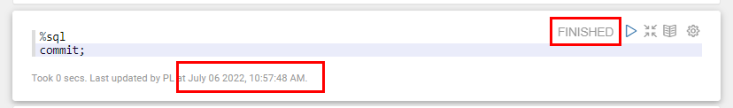
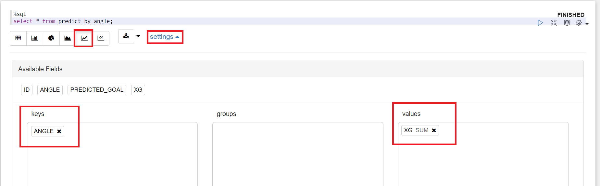

# Generate features and train ML model

<!---->

## Introduction

In this lab we will finally get to the actual Machine Learning part!

We will do the following:
- Feature Generation: we will extract the new data point ANGLE from the existing shot data
- Train the machine learning model

Estimated Time: 10 minutes

### Objectives
- Learn how to generate new features from one or more data sets
- Learn how to train a model using In-database Machine Learning

### Prerequisites
- Oracle Analytics Cloud
- Autonomous Data Warehouse
- You've completed the previous labs

## Task 1: Set Up The Machine Learning User

1. Open the Autonomous Data Warehouse.

   From the Oracle Console, click **Oracle Database** > **Autonomous Data Warehouse**.

   

2. Click on the `PL` database that you created earlier.

   

3. Open **DB Actions** and select Database Users from the drop down list.

   

   If sign-in is requested, sign in with `ADMIN` and the secure password for the admin user.

4. Find the **PL** user, then select edit

   

5. Turn on the "OML" (Oracle Machine Learning) button and click Apply Changes. You've now enabled the **PL** user to use the Machine Learning functionality of Autonomous Data Warehouse. Sign out now as admin user.

   

## Task 2: Run the Notebook to Calculate ANGLE, Build the xG model and Apply the xG model

SQL is a useful language in the Machine Learning process. It allows you to work with data in databases in an efficient manner. 

In our case, we will use it to extract new data from the raw data that is available to us. We will also use it to build a machine learning model inside of the database. This is very convenient, as the data is also stored in the database; we don't have to move it anywhere.

Learning SQL is not the objective of this workshop. Therefore we have already prepared the SQL statements that will do this work for us.

We will run these SQL statements in a Notebook. A notebook is not just a convenient way to execute SQL, it also allows us to document and share the code easily.

1. **Download** the prepared notebook that contain the SQL instructions:

   [Notebook to calculate ANGLE and build the xG model](./files/calculate-angle-and-build-xgmodel.json)

   Save the file on your local machine. Make sure that the file is saved with extension `.json`.

2. In the console of the Autonomous Data Warehouse, open the **Database Actions** and sign in as the PL user

   

3. Choose **Oracle Machine Learning**.

   

4. Sign in with the user `PL` and the secure password for the PL user. 

   

   **It's important that you execute the following instructions as the `PL` user.**

5. Open the menu by pressing the hamburger icon, then open the Notebooks option.

   

6. Start the "Import Notebook" option.

   

7. Then select the `calculate-ANGLE-and-build-xG-model.json` file from your file system.

   You should see the message "1 out of 1 notebooks imported successfully" and the notebook "Calculate ANGLE and build xG model" appears.

   

   Click on the notebook to open it. This may take a minute or so.

9. Inspect the notebook

   
   

   You will find the following sections in the notebook.

   **a) Calculate ANGLE**

   This calculation uses trigonometric functions. It calculates the angle to the left and right goal posts, and then subtracts them to get the angle between them. By default these functions return their values in radians, and we convert them to degrees.

   **b) Prepare the data**

   A training table is created that contains only the data that we're interested in to train the model. We will only use shots data for the 2017/2018 season.

   After our Data Exploration, we've concluded that the following attributes are likely good candidates to build a model: 
   * `ANGLE`: The angle between the goal posts seen from the location of the shot (between 0 and 180 degrees).
   * `HEAD`: Whether the shot is a header or a footer.
   * `FROM_CORNER`: Whether the shot is the indirect result of a corner.
   * `SET_PIECE`: Whether the shot comes from a free kick.
   * `FAST_BREAK`: Whether the shot was taken from a counter situation.

   Note how we've *not* included `DISTANCE`. We've chosen to do this because `ANGLE` already *encapsulates* the effect of `DISTANCE`, as the `ANGLE` will decrease when the `DISTANCE` increases. However, feel free to experiment and choose different attributes!

   **c) Configure the model training**

   A model parameters table is created first. The only parameter that is set is the name of the algorithm to use: Generalized Linear Model. This will use Logistic Regression for classification.

   **d) Train the model**

   Once trained, the model will be stored as `XG_MODEL`. 

   **e) Apply the model**

   This code applies the newly created xG model to all of the shots. Effectively, every shot will now have a binary prediction of whether it will be a goal and a goal probability (the xG value).

10. Run the notebook

    Go to the top of the notebook and press the Run icon. Then confirm that you want to run the entire notebook.

    

11. Running the notebook may take several minutes.

    You can follow the progress as the paragraphs are run one by one.

    To check that everything has run successfully, go to the last paragraph, and check that you see it has status "FINISHED" and a message such as the following "Took X secs. Last updated...". If all is well, **it should show the current date**.

    

## Task 3 (Bonus): Verify the Model

We want to check the quality of our model. One way of doing this, is to visually compare how well the xG metric compares to the actual Score Percentage.

1. Create a new notebook and name it "Verify xG model fit".

    

2. First of all, let's visualize the *actual* Score Percentage of the shots. 

   Create a new cell with the following SQL to see the actual Score Percentage ordered by ANGLE. 

	```
	<copy>
	select angle_bucket, (sum(goal_cnt)/sum(event_count)) as score_percentage
	from event
	group by angle_bucket;
	</copy>
	```

   Execute the cell by clicking on the icon. 

   

3. Change the visualization to Scatter and click Settings to configure the chart. Change xAxis to `ANGLE_BUCKET` and yAxis to `SCORE_PERCENTAGE`.

    

   We can see how the Score Percentage gradually increases as the angle increases. 

4. Next, obtain the values *predicted by the xG model* for a range of angles. The table `PREDICT_BY_ANGLE` contains placeholders of between 0 and 180 degrees. We will enrich it with the xG prediction for all those angles.

   Create a new cell by clicking on the icon on the right and selecting "Insert New".

   

   Then, copy the following text into the cell.

	```
	<copy>
	update predict_by_angle
	set predicted_goal = prediction(XG_MODEL using angle)
	,   xg = prediction_probability(XG_MODEL, 'Y' using angle);
	</copy>
	```

	Execute the cell.

5. Visualize the results of the xG model. Create a new cell with the following contents and execute it.

	```
	<copy>
	select * from predict_by_angle;
	</copy>
	```

6. Just like before, change the visualization to Scatter and click Settings to configure the chart. Change Keys to `ANGLE_BUCKET` and Values to `XG`.

    
   
6. Inspect the results by comparing the two charts.

    

   Notice how the xG models result follows the pattern of the actual Score Percentages very well. Both the xG result and the Score Percentage gradually increases as the angle increases, never falling below 0 or going beyond 1.

   You may now proceed to the next lab.

## **Acknowledgements**
- **Author** - Jeroen Kloosterman - Technology Product Strategy Director, Sudeshni Fisher - Technology Product Strategy Manager.
