# Use the Expected Goals model to coach players

<!---->

## Introduction

In this lab we will see how we can visualize the model in such a way that it can be used to guide players/teams.

Estimated Time: 15 minutes

### Objectives
- Learn how to visualize the model to guide players/teams

### Prerequisites
- Oracle Analytics Cloud
- Autonomous Data Warehouse
- You've completed the previous labs

## Task 1: Add the xG Matrix Data Set

1. The `XG_MATRIX` data set holds a matrix of all positions on the pitch, divided into cells of 2 by 2 meters. 

   The data set has been prepared with precalculated values for each of these cells, including its xG value. In other words, you can imagine that we're taking a shot from each of these cells, and we're asking the model what chance we have of scoring a goal.

   On the homepage, click "Create", then click Dataset.

   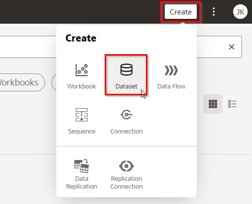

2. Choose the `PL` connection.

   

3. Open the `PL` schema and double-click on `XG_MATRIX`.

   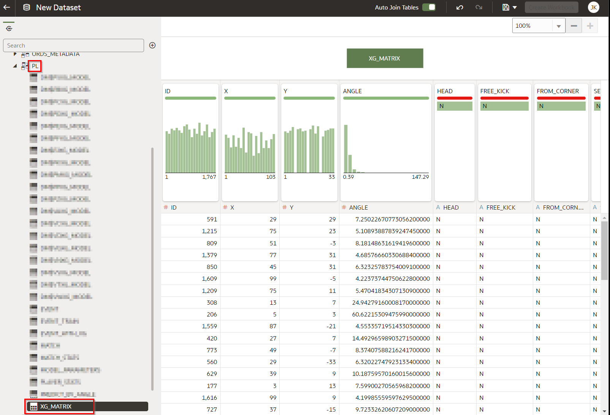

4. Save the data set, name it `XG_MATRIX`, then go back to the main menu.

   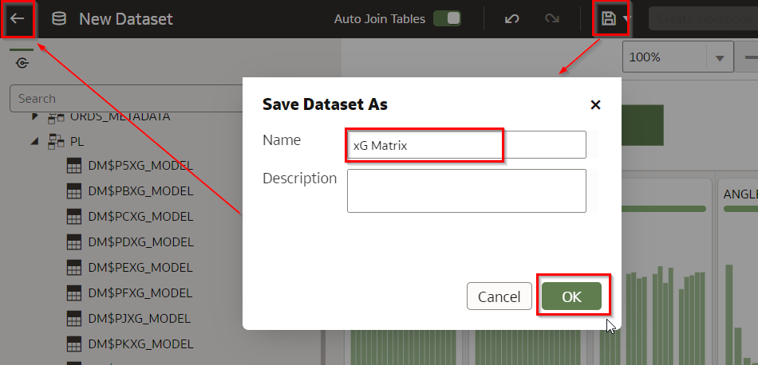

## Task 2: Create the xG Model Visualization

1. On the homepage, click "Data", then click the "xG Matrix" dataset to create a new visualization workbook.

   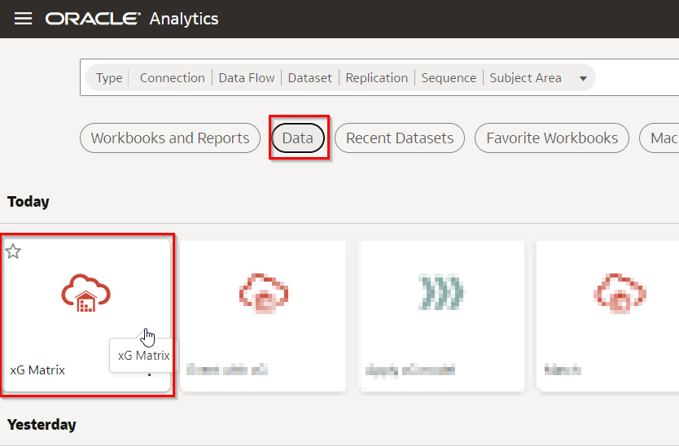

2. Select the `XG` and `FOOTBALL_PITCH_CELL` (location on the pitch) fields (use Control-Click to select multiple fields). Then right-click on any of the fields, choose "Pick Visualization" and choose Map.

   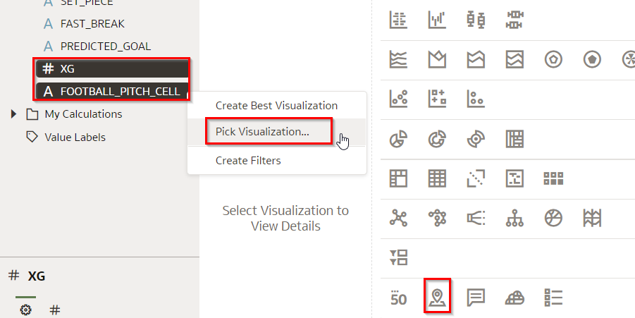

3. On the additional configuration on the top-left of the screen, click the Map icon and set the Background Map to "football\_pitch".

   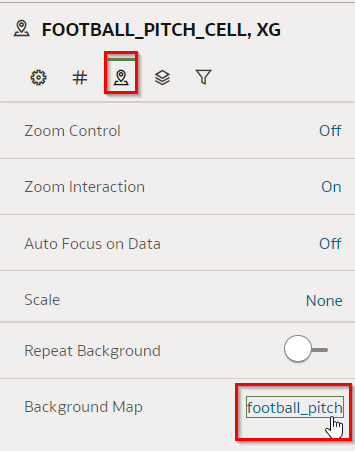

4. Focus on footers during regular play (not counters).

   Drag `HEAD` (headers) to filter and set it to "N".

   Drag `FAST_BREAK` (counters) to filter and set it to "N".

   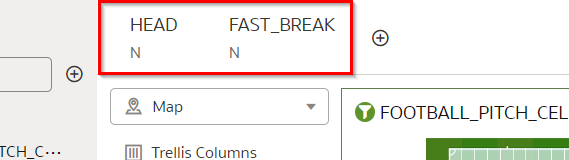

5. We are only interested in those sections of the pitch with a minimal xG of 7%.

   Drag `XG` to filter and set Range Start to 0.07.

   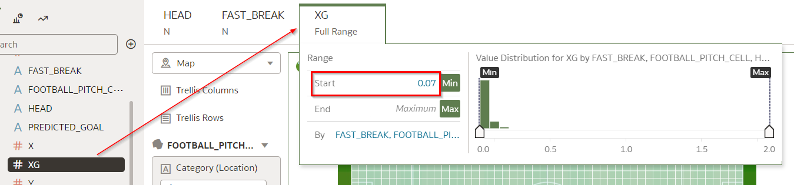

6. We want to create zones in which the scoring chances are:
	* 30% or larger
	* 15% or larger
	* 7% or larger

	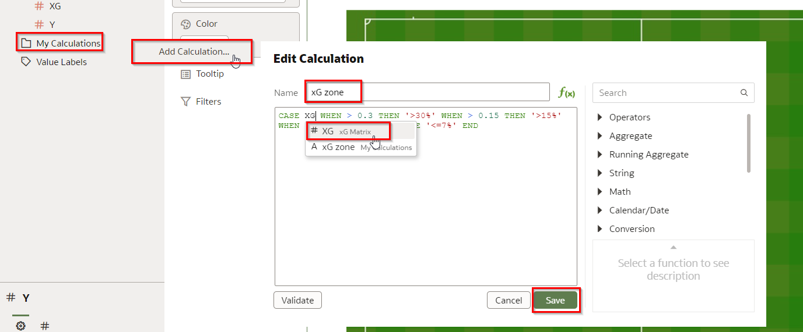

	Right-click on "My Calculations" and choose "New Calculation".

	Name the calculation "xG Zone".

	Enter the following formula:
	```
	<copy>
	CASE WHEN XG > 0.3 THEN '>30%' WHEN XG > 0.15 THEN '>15%' WHEN XG > 0.07 THEN '>7%' ELSE '<=7%' END
	</copy>
	```

	**Retype the word XG in every place that it's shown in the formula. This will force the recognition of the column names. Click on "XG" in the dropdown.**

	Finally, press "Save".

7. Drag the newly calculated field "xG Zone" on top of the "XG" field in the Color section to replace it. 

   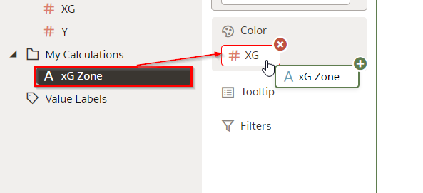

8. Inspect the result.

   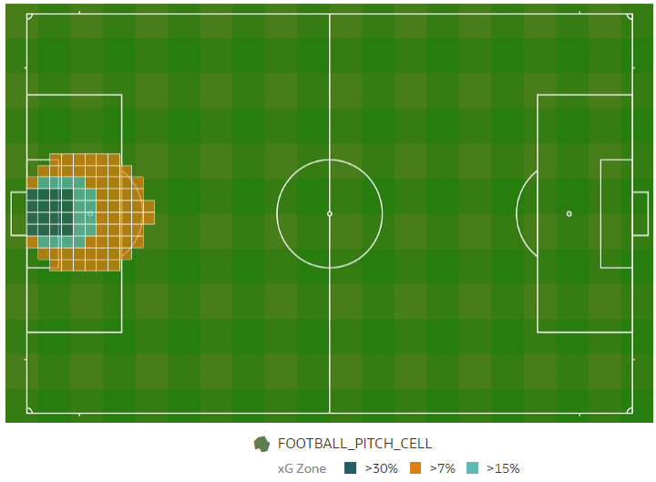

   We now have a very clear picture of where the opportunities to score are for footer shots. This can be used in coaching conversations with a player or a team, especially when comparing it with actual shots.

9. Compare how the xG zones are different for headers.

   Change the filter of `HEAD` to "Y". 

   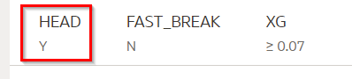

10. Inspect the result.

   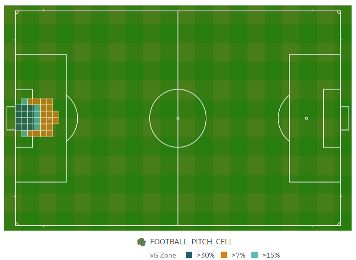

   We can clearly see how the xG zones for headers are much nearer to the goal. 

11. Compare how the xG zones are different for fast breaks (counters).

   Change the filter of `HEAD` back to "N". Change the filter of `FAST_BREAK` to "Y".

   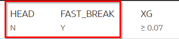

12. Inspect the result.

   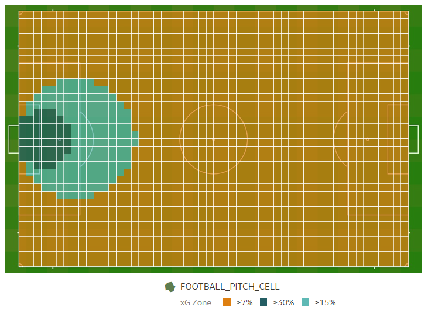

   Notice how the chance of scoring vastly increases when the shot comes from a counter. Quite often, the defense is not yet in position when a counter happens, this may explain the higher xG.
   
   In fact, the model predicts at least a 7% chance of scoring from *anywhere* on the pitch. Our common sense says that this may not be correct. The reason for this could be the lack of shots beyond a certain distance, resulting in poorer performance of the model in those ranges.

13. Conclusion: We now have a clear picture on where the opportunities to score are for different types of shots (headers/footers/counters, et cetera). This can be used in coaching conversations with a player or a team, and can be especially useful when comparing it with actual shots.

## **Acknowledgements**
- **Author** - Jeroen Kloosterman - Technology Product Strategy Director, Sudeshni Fisher - Technology Product Strategy Manager.
