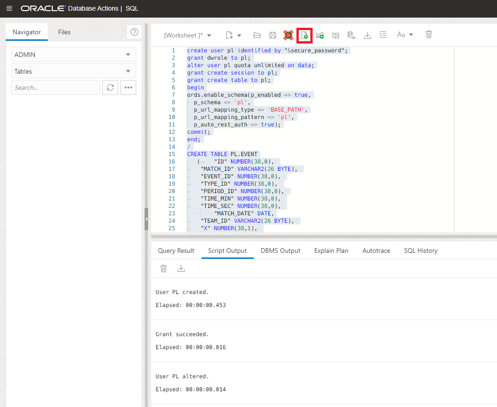
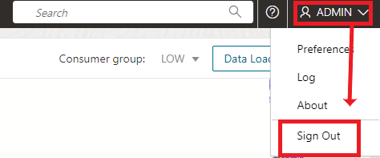
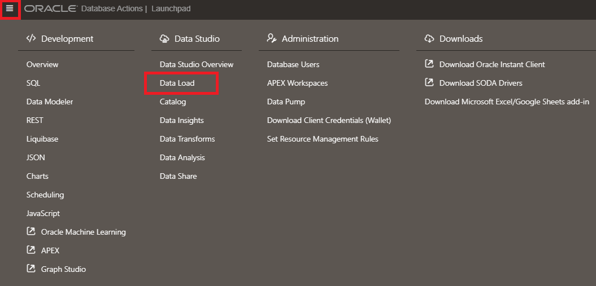
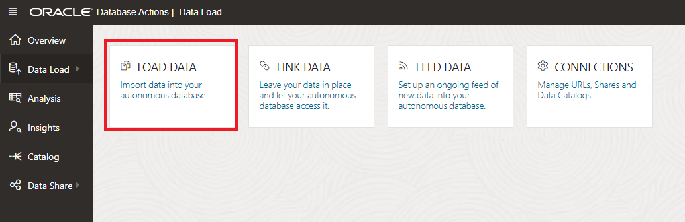
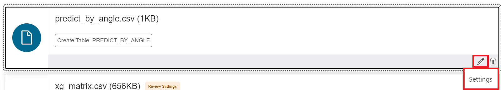
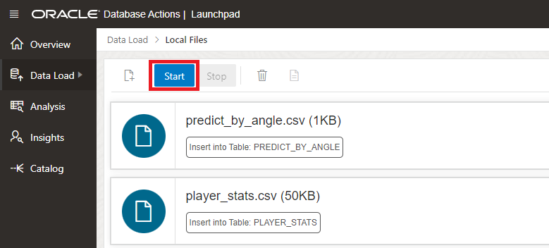

# Load Data into Autonomous Data Warehouse

<!---->

## Introduction
In this lab you will load the Premier League data into the Autonomous Data Warehouse. After this lab we will be ready to start analyzing the data.

We will:
1. Login in the Database Actions section as the ADMIN user. We will run a script here that a) creates the PL user and b) creates a set of **empty** tables in the PL schema.
2. Log out and then login again in the Database Actions, now as the new PL user.
3. Load the data into the tables as the PL user.

Estimated Time: 10 minutes

### Objectives
- Learn how to load data into the data warehouse, so you can analyze it later.

### Prerequisites
To complete this lab, you need to have the following:
- A provisioned Autonomous Data Warehouse
- You're logged into your Oracle Cloud Account

## Task 1: Create a New Database User/Schema in Autonomous Data Warehouse

This new user/schema will hold the football data.

1. Go to **Menu** > **Oracle Database** > **Autonomous Data Warehouse**.

   

2. Click on the **PL** database that you created earlier.

   

3. Click **Database Actions**.

   (if your Autonomous Data Warehouse was created earlier, you can find the Database Actions under "Tools")

   

   If asked, login with user **ADMIN** and the secure password (you specified this upon creation of the Autonomous Data Warehouse earlier).

4. Click the **SQL** tile under **Development** section.

    

5. **Download** [pl-create-user.sql](/files/pl-create-user.sql) Save the file on your local machine. Make sure that the file is saved with extension `.sql`.

6. Open the `pl-create-user.sql` file with a text editor and copy-and-paste all of its contents into the database actions worksheet area. 

    

7. Click the **run-script** button (**NOT** the Run button). 

   You will be asked for a password for the new user "PL". The password should have a minimum of 8 characters, one special character and mix of upper and lowercase characters.

   Verify the output of the script in the **Script Output** tab. The last lines in the output should indicate that the script has run successfully.

    

## Task 2: Upload the Football Data to Autonomous Data Warehouse

1. **Download** the 5 files that contain the data that we'll use in our analysis:

   [event.csv](https://objectstorage.eu-frankfurt-1.oraclecloud.com/p/oxJctcE-MEIjVVhjUZMhns-b5ovTAiCIEgJJG2-VxbLCQQjb34JrEiPKYV3XNiYd/n/fruktknlrefu/b/workshop-premier-league/o/event.csv) Shot data with location of shot, result and more.

   [match.csv](https://objectstorage.eu-frankfurt-1.oraclecloud.com/p/RYVwaLLuK6toAlh0hVap5V6H9XGPzShRycciiWEVwFqPG9EwdkjktbFSKf_nnpkY/n/fruktknlrefu/b/workshop-premier-league/o/match.csv) Matches with team names, results, and more.

   [predict\_by\_angle.csv](https://objectstorage.eu-frankfurt-1.oraclecloud.com/p/qjPrGmvSpo7WmTDwuafVn7mtbTCnb-8jvzQnLRaKeszyybC3hUSKPL-kfjkZwoit/n/fruktknlrefu/b/workshop-premier-league/o/predict_by_angle.csv) List of angles between 0 and 180 degrees.

   [xg\_matrix.csv](https://objectstorage.eu-frankfurt-1.oraclecloud.com/p/MducgpGpw2eshkApXwW9CGJfAcnprJd7MBQ1fIXHvFPDg_fc6YoFWk-t4wFqll-g/n/fruktknlrefu/b/workshop-premier-league/o/xg_matrix.csv) Precalculated xG values, used in the last lab.

   [player\_stats.csv](https://objectstorage.eu-frankfurt-1.oraclecloud.com/p/xlcockSigxId1FV7DLDV5vVNYl_L-RbYgJxj5NqXa_HaqqOHxZSUyEPjsk6gunf5/n/fruktknlrefu/b/workshop-premier-league/o/player_stats.csv) Precalculated player statistics, including xG.

   Save the files on your local machine. **Make sure that the files are saved with extension `.csv`**

2. **Important**: At this point, make sure that you **change to the "PL" user**. Note that you created this "PL" user earlier (when you ran the pl-create-user.sql script).

   Log out from the Data Actions (currently showing "ADMIN").

   

   Now log in to Data Actions again using the following:

   - Username: PL
   - Password: Provide the secure password for the PL user (as chosen earlier in Task 1 Step 7).

3. Click to the **Data Load** option, under the **Data Tools** section.

   

4. Choose **Load Data** to answer the first question and **Local Files** to answer the second one. Click **Next**.

    

5. Select the files that you downloaded earlier (5 in total).

    

6. Edit the configuration of **each** of the data sets by changing the load option into "Insert into table". We are doing this because we already created the empty tables earlier, and we want to add the data into those existing tables.

  We are showing the instructions for PLAYER_STATS. **Please make sure that you do this for all data sets.**

   

   

   Press "Close" after you've changed the option for each file.

7. After you have changed the load option of **all** files, click the **Play** button to start the process and click **Run** on the **Run Data Load Job** verification window.

    

8. This process takes usually takes between 20 seconds or a few minutes. When it's done you should see green ticks next to all data load jobs.

   

   Congratulations! You've successfully loaded the data into Autonomous Data Warehouse.

   You may now proceed to the next lab.

## **Acknowledgements**

- **Author** - Jeroen Kloosterman - Technology Product Strategy Director, Sudeshni Fisher - Technology Product Strategy Manager.
