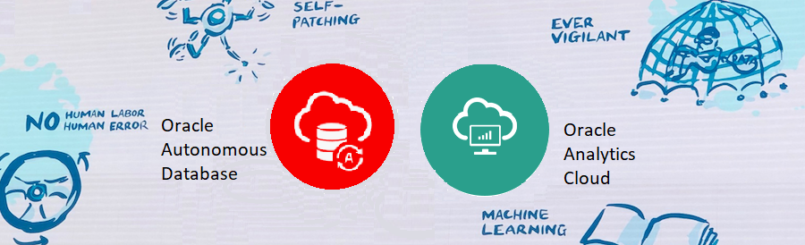

# Introduction

## Introduction

This hands-on workshop will help users get started with provisioning and administering an Oracle Analytics Cloud instance. For users that don't have an Oracle Cloud account, we will show you how to create a Free Tier account.

**Oracle Analytics Cloud (OAC)** is a scalable and secure public cloud service that provides a full set of capabilities to explore and perform collaborative analytics for you, your workgroup, and your enterprise.

With **Oracle Analytics Cloud**, you get flexible service management capabilities, including fast setup, easy scaling and patching, and automated lifecycle management.

To run the workshop, you will need an [Oracle Cloud Free Tier Account](https://www.oracle.com/cloud/free/) or a Paid account to provision an OAC instance.

  > **Note:** If you have a **Free Trial** account, when your Free Trial expires your account will be converted to an **Always Free** account. You will not be able to conduct Free Tier workshops unless the Always Free environment is available. **[Click here for the Free Tier FAQ page.](https://www.oracle.com/cloud/free/faq.html)**

Here's a video to help with signing up:  

And another short video that explains **Oracle Analytics Cloud (OAC)**:

Estimated Workshop Time: ___ minutes

You may now **proceed to the next lab**.
## **Acknowledgements**
- **Author** - Lucian Dinescu, Product Strategy, Analytics
- **Contributors** - Priscila Iruela, Database Business Development | Juan Antonio Martin Pedro, Analytics Business Development Victor Martin, Melanie Ashworth-March, Andrea Zengin
- **Reviewed by** -
- **Last Updated By/Date** -
