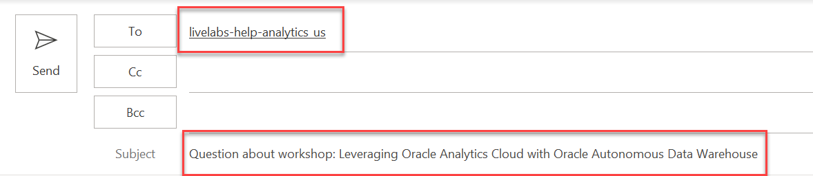
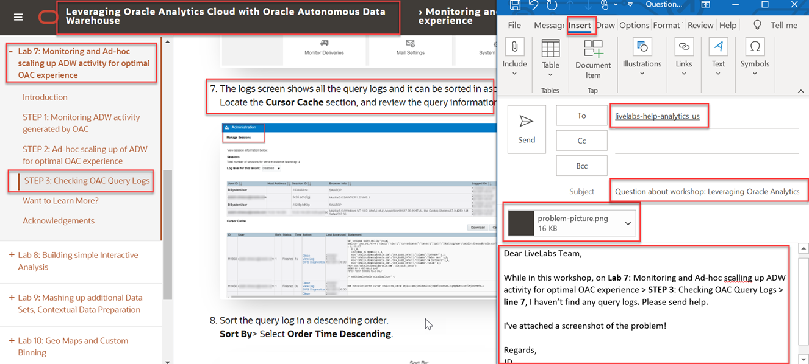

# Need Help?   

## Introduction
This page is designed to help you solve some common problems users face in this LiveLab. 

If you still find yourself stuck or would like to report an issue with the workshop, click the question mark icon in the upper left corner to contact the LiveLabs team directly via email.  

### **Please Rate This Workshop**
When you are finished please don't forget to rate this workshop!  We rely on this feedback to help us improve and refine our LiveLabs catalog.  Follow the steps to submit your rating. 

1.  Go back to your **Workshop Homepage** in LiveLabs by searching for your workshop and clicking the Launch button.

2.  Click on the **Brown Button** to re-access the workshop  

    

3.  Click **Rate this workshop**

    

## How to Format Your Support Email Request
This will construct an email in your default mail application that is auto populated to address our LiveLabs support inbox and will also include your current workshop in the subject line. Follow the steps below to contact us and get a quick resolution to your issue.

1. Do not change the subject line. 
2. Include the description of your issue and any pertinent information in the contents on your email.

    

3. Include the **Lab Number**, **Step Number**, and **Sub-Step Number** where you've encounter the issue. 
4. Attach a **Screenshot** and **Any Troubleshooting Steps** you've tried so we can recreate the issue and provide a timely and accurate solution.

    

## Connectivity Issues
Are you connected to a **VPN**, **Corporate Network**, or behind a strict **Firewall**?

If any of these three conditions are true, some ports in your network may be closed to traffic. Uploading data through Database Actions in your web browser and applications like the Oracle Analytics Tool could be restricted and may appear to "Hang" or freeze. 

1. Please disconnect from your VPN and try again if applicable.

2. If you are connected to a corporate network, try switching to a public or a "clear" network if allowed.

3. Alternatively, contact your IT Administrator to see if adding exceptions to your network or firewall would be viable.

## **Acknowledgements**

- **Author** - Lucian Dinescu, Product Strategy, Analytics
- **Contributors** -
- **Last Updated By/Date** - Lucian Dinescu, April 2021