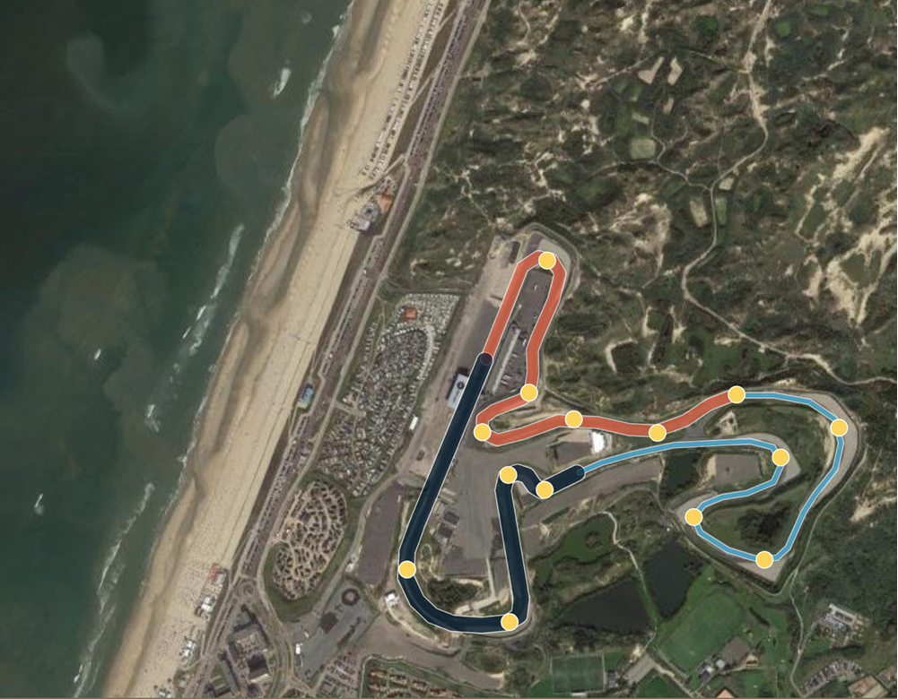
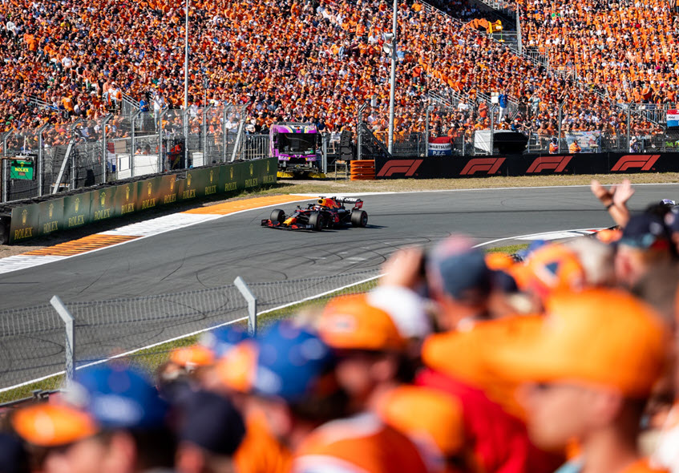

# Develop an Interactive Map of a Racetrack: Red Bull Racing Honda Win

## Introduction

On September 5, 2021, Red Bull Racing Honda, a leading Formula 1 team,
took the podium at the Formula 1 Heineken Dutch Grand Prix 2021 at Circuit Zandvoort in the Netherlands using Oracle Cloud Infrastructure
as its official cloud platform. Winning the race required driver Max Verstappen to complete 72 laps around the 4.259 km circuit with an overall distance of 306.648 km or just over 190 miles.  

### About this Workshop

Oracle Analytics Cloud supports the configuration of numerous [map background](https://docs.oracle.com/en/cloud/paas/analytics-cloud/acubi/apply-map-backgrounds-and-map-layers-enhance-visualizations.html) types that can be used to visualize your data to tell a story in a way that no conventional map could. Enhancing the map with information such as historical race results, weather conditions, lap speeds, turn and altitude variations, and driver statistics, makes for a more powerful, interactive presentation.

In this hands-on lab you will learn how to create this circuit with LineString and Points from GeoJSON and to join it to data. Let’s see how
simple it is to do.

_Estimated Time:_ 60 minutes

### Objectives

In this workshop, you will:

- Generate GeoJSON code and import into OAC

- Load data into OAC as a Dataset

- Use Location Details to assign your GeoJSON code to your data

- Build a map with multiple layers in OAC

_At this point, you are ready to start learning! Please proceed._

## **Acknowledgements**

- **Author** - Carrie Nielsen (Oracle Analytics Product Strategy Director)
- **Contributors** - Lucian Dinescu (Oracle Analytics Product Strategy)
- **Last Updated By/Date** - Andres Quintana (Oracle Analytics Product Strategy), March 2023