# Add the Sector Dataset to OAC and assign it to the Map Layer

## Introduction

In this lab you will assign values from your Dataset to properties in your Map Layers.  
This process allows for maps to be automatically rendered in OAC for your GeoJSON LineString and Points with color, size, and more.

_Estimated Time:_ 20 minutes

### Objectives

In this lab, you will:

- Create Sector, Point Datasets and assign it to the Map Layer
###  Prerequisites

This lab assumes you have:

- An Oracle Free Tier, Always Free, Paid or Live Labs Cloud Account
- Provisioned Oracle Analytics Cloud
- All previous labs successfully completed
- Permission to create Datasets in OAC
- Created a file or use the data file provided

## Task 1: Create the Sector Dataset and assign it to the Map Layer

Now that you have your two map layers created and imported, we need to associate the name property from our geojson files to an attribute in your data. Our first simple exercise will be to **create a Dataset** for each **Map Layer**.

1. Create a file that contains the following information. The name field in your data set needs to match the properties name value in the map layer.  

    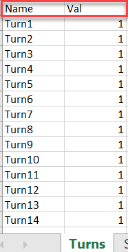 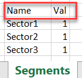  
        > **Note:** you can use [Netherlands GrandPrix.xlsx](https://objectstorage.us-ashburn-1.oraclecloud.com/p/jyHA4nclWcTaekNIdpKPq3u2gsLb00v_1mmRKDIuOEsp--D6GJWS_tMrqGmb85R2/n/c4u04/b/livelabsfiles/o/labfiles/Netherlands%20GrandPrix.xlsx)

2. On the top right of the **Oracle Analytics Home Page**, choose **Create** and then **Data Set**

    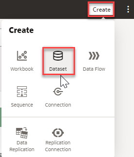

3. Browse to the file you created for Turns and Segments (Sector)  

    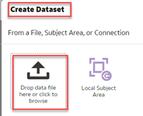

4. Add your file, rename your Dataset as needed, and ensure the correct sheet is selected. Click **Add**.  

    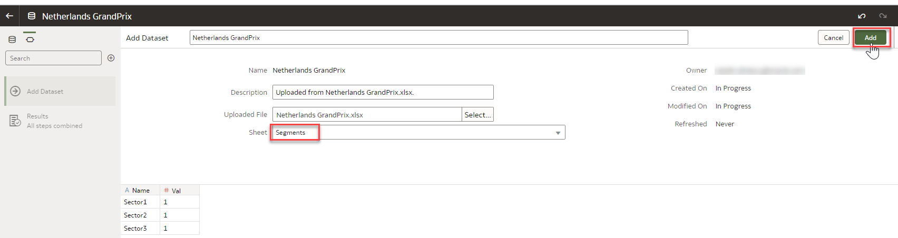

5. Highlight the **Name** columns and click on the stacked dots (**Options**).  

    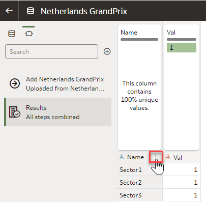

6.  Choose **Location Details**…  

    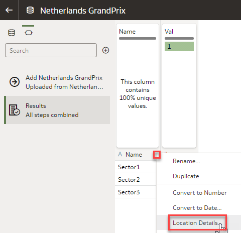

7.  Choose **Zandvoort Sector LineString** Map Layer name and confirm your match quality is sufficient. Click **OK**  

    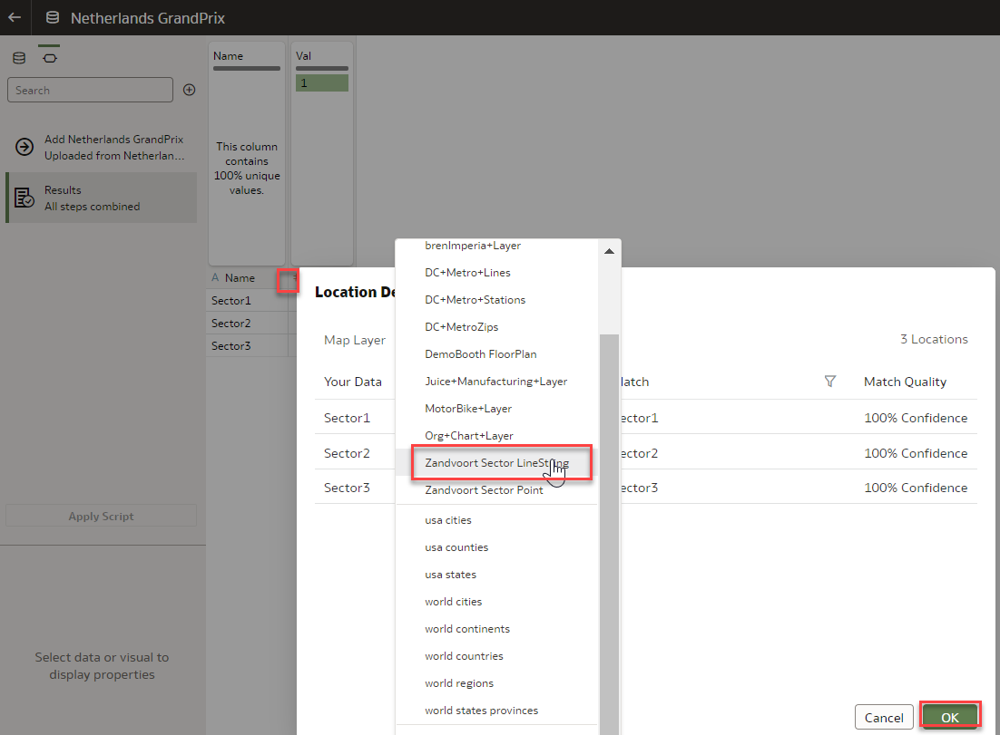

    Your data is now mapped to the map layer. You will see the icon to the left of your name column change to the location property icon.

8. Click **Apply Script**.  

    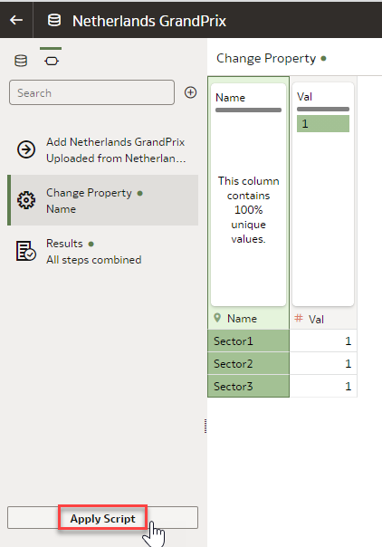

9. Select **Create Workbook** button from top right  

    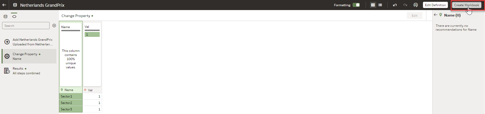

10. Right click on the `Name` field and choose **Create Best Visualization**.  

    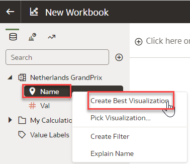  

11. Use the **Name** value for both the **Category** and **Color**.  
Drag **Name** to **Color**
    
    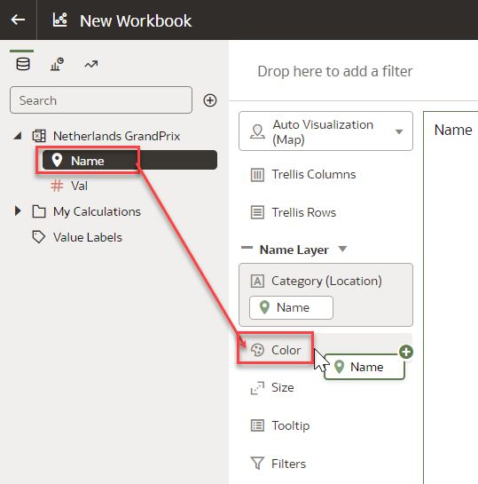  

12. Your Map visualizatin should look like
    
    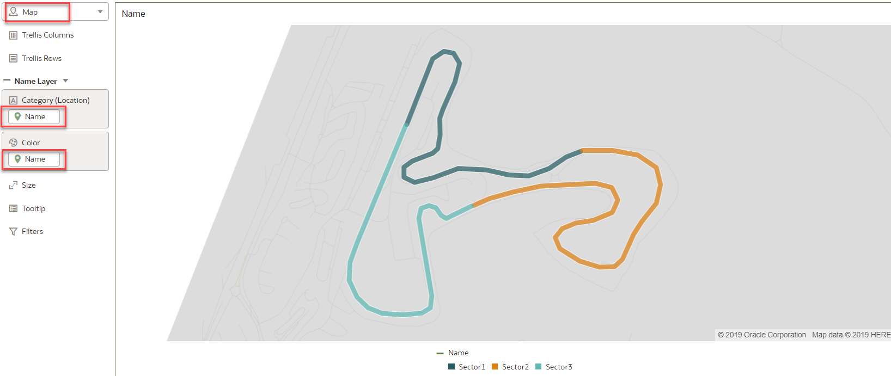  

    You can extend your Dataset with additional values such as speed to provide additional values to display. You can use all of the powers of OAC now to blend additional DataSets to make your visualization more interactive.

13. Click **Data** tab on your center-top header and within the Dataset icon, click the  _pencil_ and then choose **Edit Definition**.  

    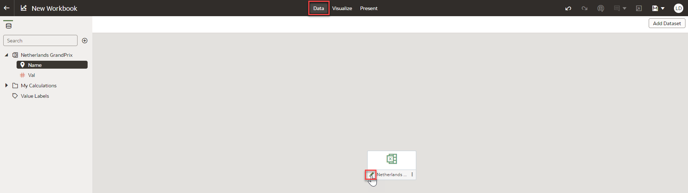

14. Click select and reload your file with any extended values you want in your Dataset (Segments(2) Sheet). Click **OK**  

    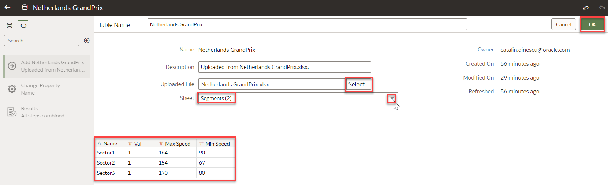

15. Return to your **Visualize** tab and add your new Max Speed Measure to size to see the fastest part of the track.  

    Click **New Workbook** browser page 

    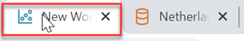

16. Click **Visualize** tab  

    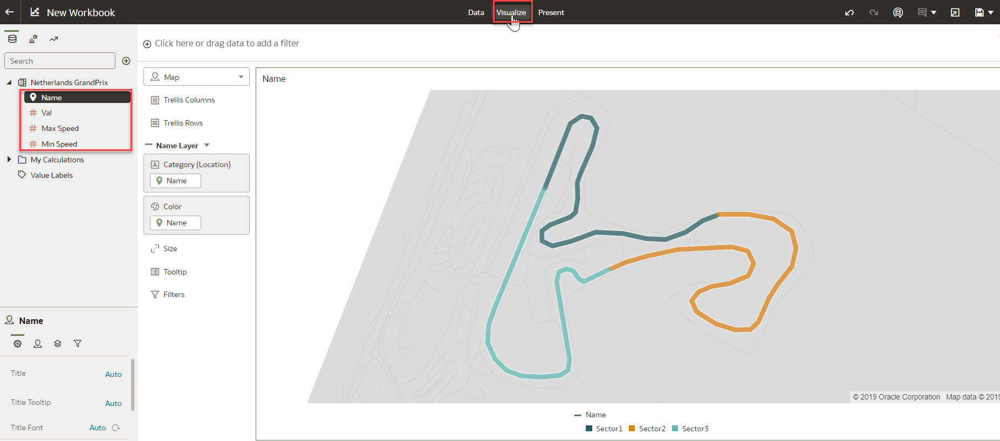

17. Drag and Drop **Max Speed** to **Size**  

    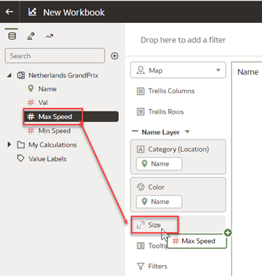

    > **Note:** Min and Max speed values are not real and were created for the use in this exercise 

18. Your visualization should look like  

    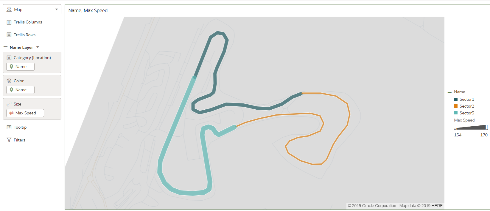 

19. Click on the **Color** option and choose **Manage Assignments** to set your color for each sector.  

    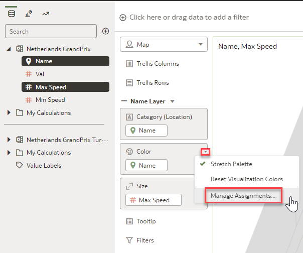 

20. Set the **Sector** colors  as follows, click Sector1 (colored square), change it with Red, click **OK**, repeat the steps for Sector2, Sector3 and click **Done** once finished.  
Sector1 = Red: #ed6647  
Sector2 = Blue: #47bdef  
Sector3 = Dark Blue:  #00192f  

    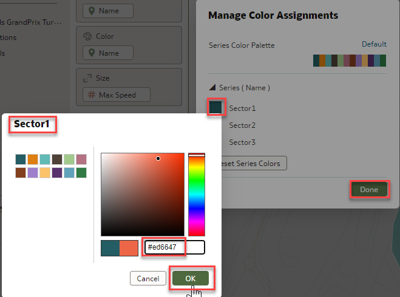 

21. **Rename** your Map Layer to "**LineString**"  

    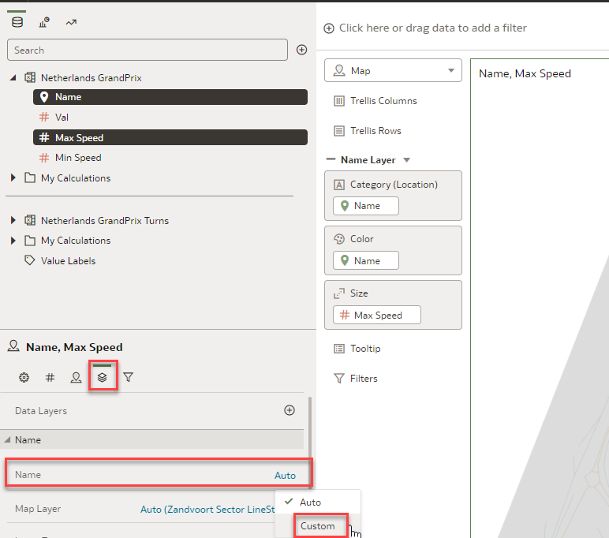  
    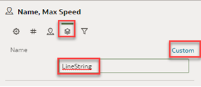 

22. Your visualization should look like  

    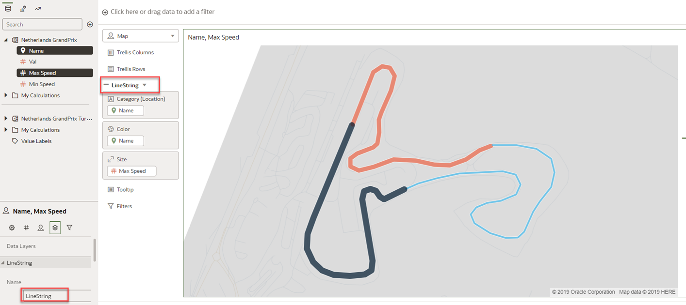 

23. **Save** the Workbook.  
Go to Save icon from top right, enter your workbook **Name** and click **Save** 

    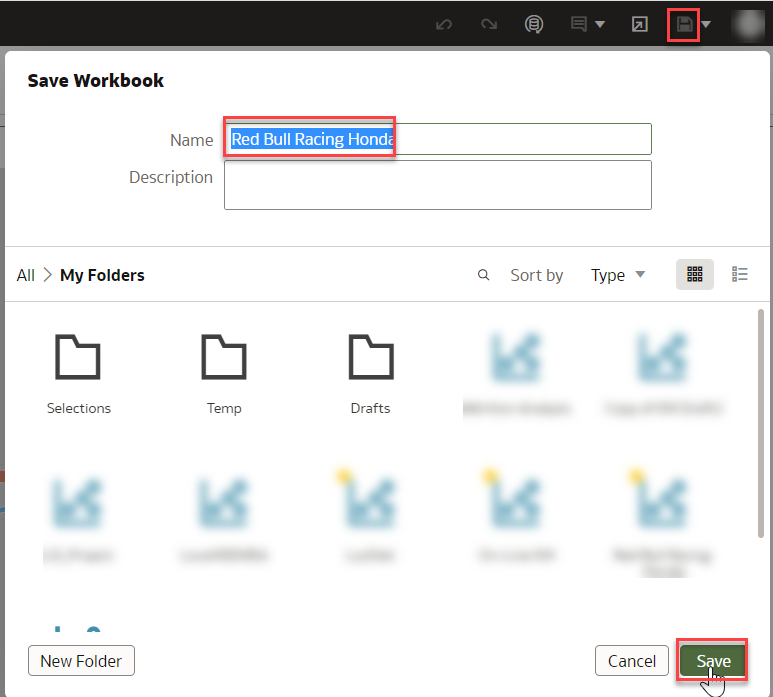 

## Task 2: Create the Points Dataset and assign it to the Map Layer

1. Select the circle icon containing a **+** next to Search to select **Add Dataset**  

    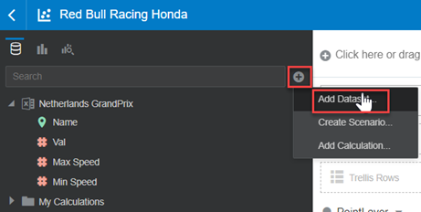

2. Click **Create Dataset** You can create a new Dataset by importing the file that contains your data for **Turns**

    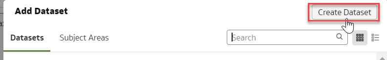

3. Browse for **[Netherlands GrandPrix.xlsx](https://objectstorage.us-ashburn-1.oraclecloud.com/p/jyHA4nclWcTaekNIdpKPq3u2gsLb00v_1mmRKDIuOEsp--D6GJWS_tMrqGmb85R2/n/c4u04/b/livelabsfiles/o/labfiles/Netherlands%20GrandPrix.xlsx)** file and click **Open**

    

4. Rename Dataset as **Netherlands GrandPrix Turns**, select **Turns** Sheet and click **Add**

    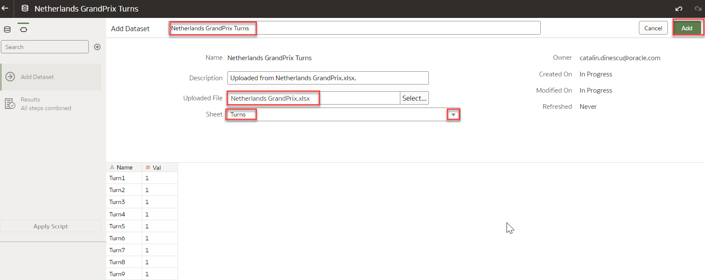

5. As defined earlier, select the Name column, click the triple stacked icon, choose Location Details. You will then select the name that was used for your points Map Layer.  

    Highlight the **Name** columns, click on the stacked dots (**Options**) and choose **Location Details**

    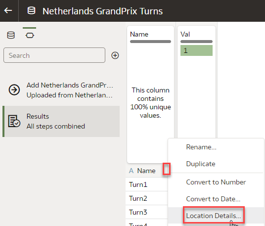

6. Choose **Zandvoort Sector Point** Map Layer name and confirm your match quality is sufficient. Click **OK**  

    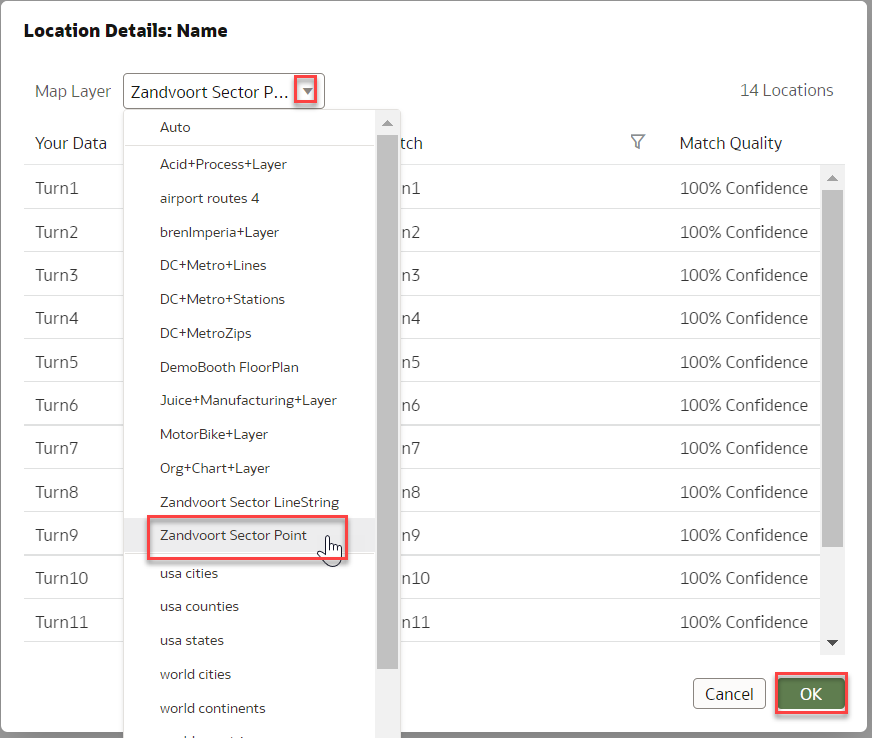

    Your data is now mapped to the Map Layer. You will see the icon to the left of your name column change to the location property icon.

7. Click **Apply Script**.  

    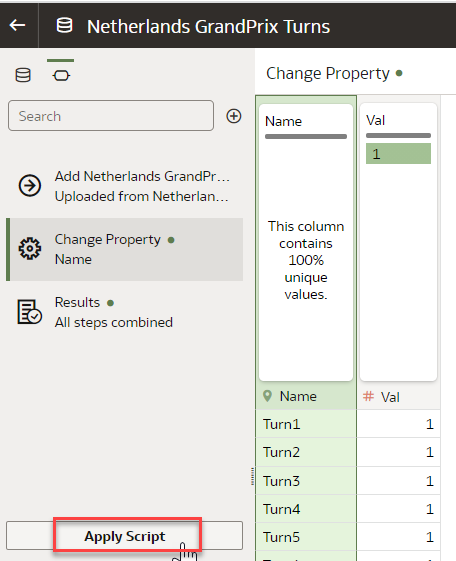

8. Return to the previous browser page, select  **Netherlands GrandPrix Turns** Dataset and click **Add to Workbook** 

    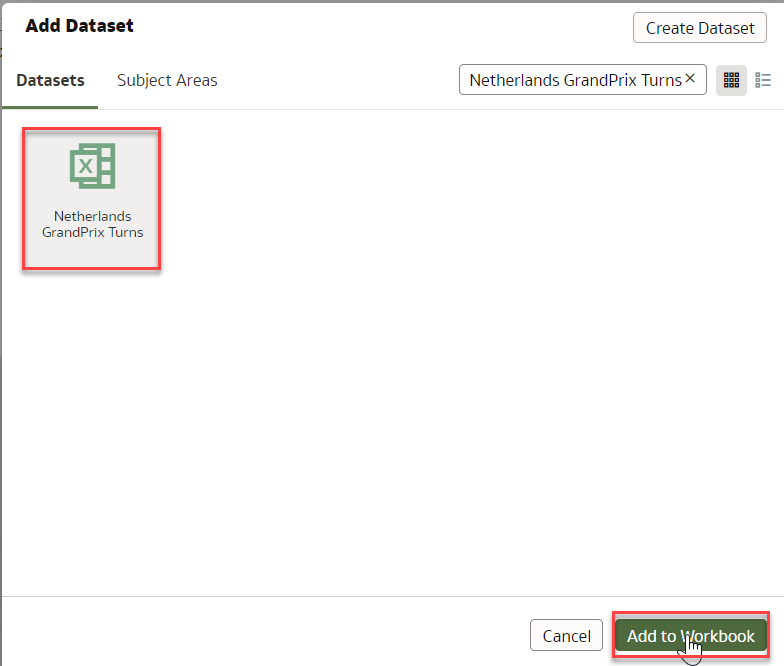

9. **Save** and return to the OAC visualization page. 

    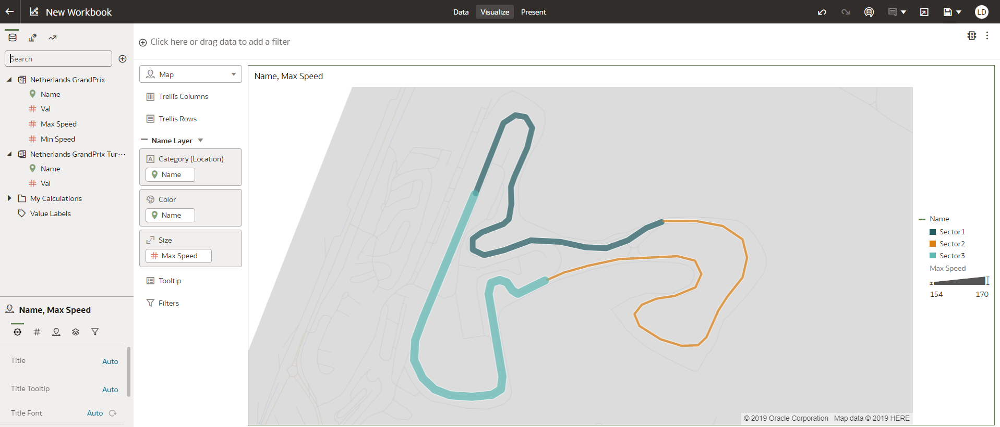

10. Go to your **Data** tab and right click on your join between the two Datasets.  
Select **Delete All Matches**, click **OK**, confirm that you want to disconnect these datasets by selecting yes.

    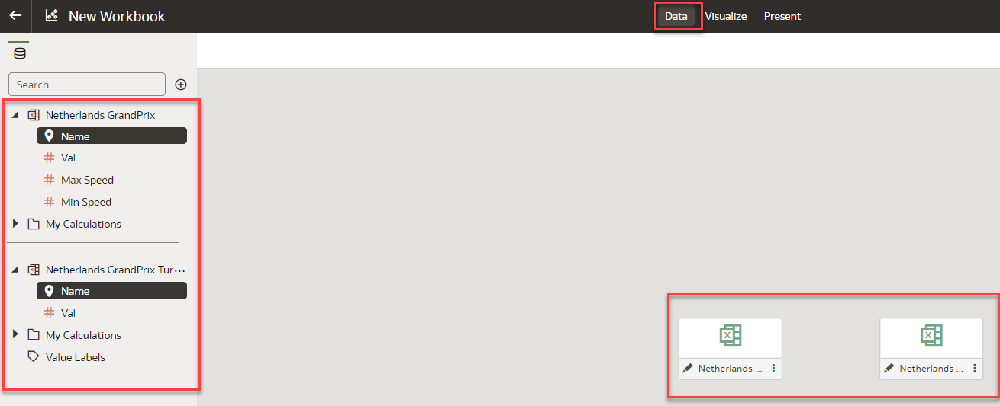

11. **Return** to your **Visualize** tab and **add** your second **Map Layer** to represent the points on your Map.  
Click the layer options icon and select **Add Layer** 

    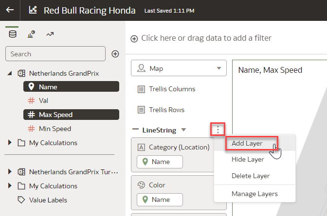

12. Using the "**Netherlands GrandPrix Turns**" Dataset, use your **Name** column for the Category (Location) and **Val** for the Size option.

    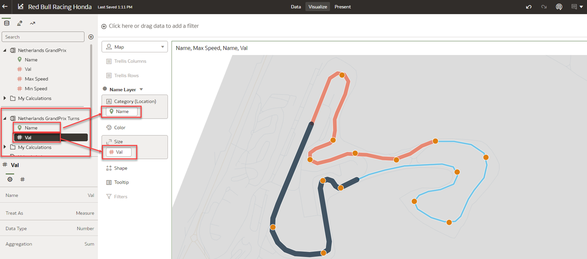

13. **Rename** your **layer** to by selecting the layer option and choose **Custom**.  Set the name to **PointLayer**.

    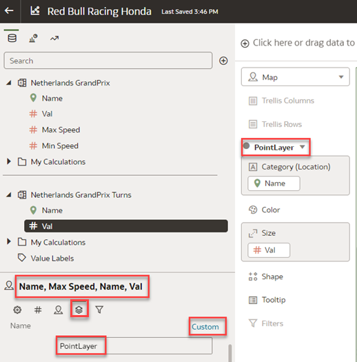

14. Click on the **color option** from the **Size** option  and choose **Manage Assignments**.  

    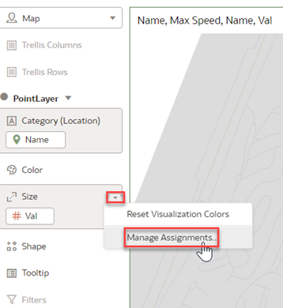 

15. Set the Size **Val** color as follows, click **Val** (colored square), change it with Yellow, click **OK** and click **Done**.  
Val = Yellow: #fad55c

    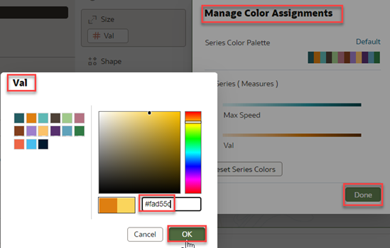 

16. Your visualization should look like  

    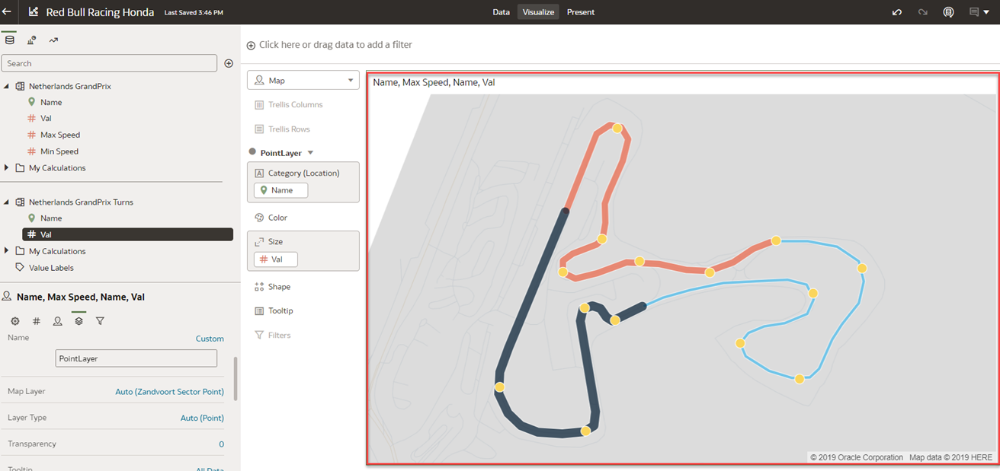 

17. **Save** the Workbook.  
Click **Save** icon from top right 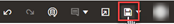  

## Task 3: Review the workshop  
If you were able to successfully complete the workshop, you can ignore this task.  
Otherwise, please find the dva for this project for use of troubleshooting or reviewing the implementation.  

1. Follow the steps from **Lab 3: Import your GeoJSON code into OAC** and import the following files:  
    [Zandvoort Sector LineString.geojson](https://objectstorage.us-ashburn-1.oraclecloud.com/p/jyHA4nclWcTaekNIdpKPq3u2gsLb00v_1mmRKDIuOEsp--D6GJWS_tMrqGmb85R2/n/c4u04/b/livelabsfiles/o/labfiles/Zandvoort%20Sector%20LineString.geojson)  
    [Zandvoort Sector Point.geojson](https://objectstorage.us-ashburn-1.oraclecloud.com/p/jyHA4nclWcTaekNIdpKPq3u2gsLb00v_1mmRKDIuOEsp--D6GJWS_tMrqGmb85R2/n/c4u04/b/livelabsfiles/o/labfiles/Zandvoort%20Sector%20Point.geojson)

2. Download the OAC dva project file. (link to the file [here](https://objectstorage.us-ashburn-1.oraclecloud.com/p/jyHA4nclWcTaekNIdpKPq3u2gsLb00v_1mmRKDIuOEsp--D6GJWS_tMrqGmb85R2/n/c4u04/b/livelabsfiles/o/labfiles/Red%20Bull%20Racing%20Honda.dva))  

3. On the top right of the **Oracle Analytics Home Page**, choose the stacked icons and select **Import Workbook/Flow**

    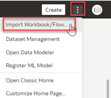

4. Click **Select File** and browse to the file downloaded from step 2 above and click **Open**

    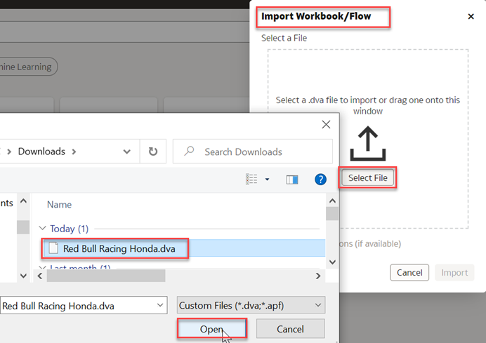

5. Click **Import**

    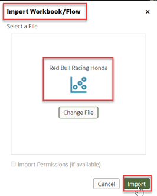

6. When the message, Import successful appears, click **OK**

    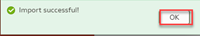

7. You can open the project to view the contents or make changes.  

    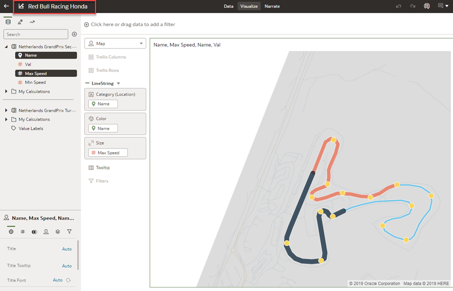

Congratulations on completing this lab!

You may now *proceed to the next lab*

## **Acknowledgements**

- **Author** - Carrie Nielsen (Oracle Analytics Product Strategy Director)
- **Contributors** - Lucian Dinescu (Oracle Analytics Product Strategy)
- **Last Updated By/Date** - Lucian Dinescu (Oracle Analytics Product Strategy), October 2021
