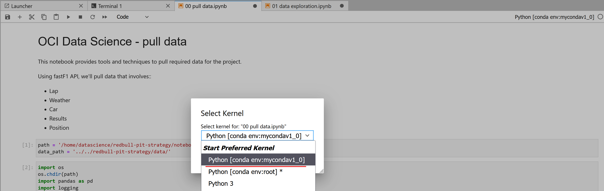
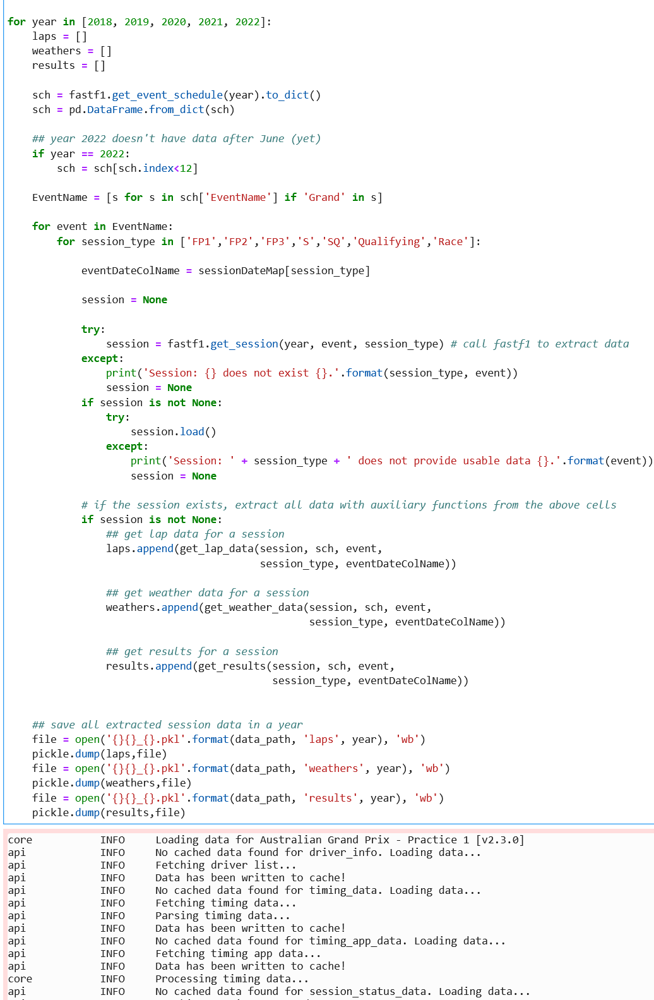
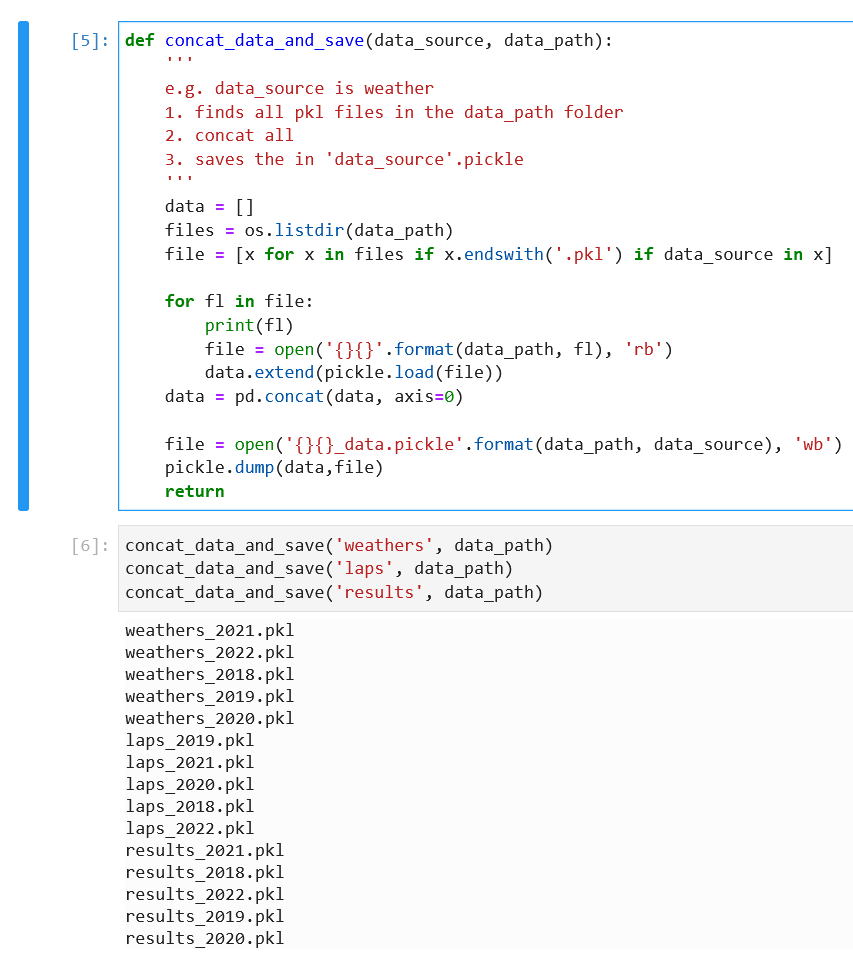

# Lab 2: Data Extraction

## Introduction
In this section of the workshop, we will focus on how to extract **meaningful** data, how to perform requests to a Python library (that will help us obtain all this data) and how to save this information into **persistent** files that we can re-use over and over.

Estimated Lab Time: 15 minutes

### Prerequisites

* An Oracle Free Tier, Paid or LiveLabs Cloud Account
* Active Oracle Cloud Account with available credits to use for Data Science service.
* [Previously created](../infra/infra.md) OCI Data Science Environment


## Task 1: Extracting Data

For the purpose of data extraction, we will reference the Python library called [`fastf1`](https://github.com/theOehrly/Fast-F1). All credits to them for the awesome library.

In order to interact with FastF1, we usually start by loading either an __event__ or a __session__.

Most importantly, and by the library's developer's recommendation, caching should almost always be enabled to speed up the runtime of your scripts and to prevent exceeding the rate limit of api servers. FastF1 will print an annoyingly obnoxious warning message if you do not enable caching.

Using FastF1's API, we'll extract five types of events:
- Lap Data 
- Weather Data
- Car Data 
- Results Data 
- Position Data

We want to build a dataset as complete and robust as possible, so our focus will be on obtaining **as much information as possible**. For that, we've created some functions to help us _iterate_ through all kinds of sessions (practice, qualifying, race).

For obtaining the F1 schedule, types of sessions, dates (which helps us iterate) we also take advantage of FastF1's API. For example, we can extract a year's schedule by running the following function in our notebook:

```
<copy>
'''
Create an ~fastf1.events.EventSchedule object for a specific season.

Args:
    year (int): Championship year
    include_testing (bool): Include or exclude testing sessions from the
        event schedule.
    force_ergast (bool): Always use data from the ergast database to
        create the event schedule
'''

# Call get_event_schedule()
sch = fastf1.get_event_schedule(year).to_dict()
</copy>
```


## Task 2: Running the Notebook

In order to run the notebook _`00_ pull data.ipynb`_ after opening it (by double clicking it), we need to ensure that the selected Python/conda environment is the right one. By default, 'Python 3' will be the selected kernel. The right kernel to choose should be called _`conda env:mycondav1_0`_ if you followed all steps. We need to change this in the following way:



After selecting it, press **Select** to make the notebook run in the selected kernel. This ensures that our notebook will have the necessary installed dependencies before running.

Now, when we **run** our notebook, we progressively get data from the last 5 years, for all events in the F1 schedule, and for all session types. This should give us enough data points to get started with Machine Learning. 



> Note: since we're pulling data from five years for all types of sessions and events, and the API has a rate limit (to prevent abuse from malicious users), the process will take **a long while**.
> You're free to run this at your own pace, but keep in mind that the process can take **4 to 5 hours** to complete, mainly due to the API's limits. Therefore, we have prepared the resulting files from an execution made on August 2022, so that you can **skip** running this notebook by yourself.

After we have all files present in our cache (which can be found in the data path _`redbull-pit-strategy/data/`_), we concatenate all this data and save it into three types of files:
- weathers_xxxx.pkl
- laps_xxxx.pkl
- results_xxxx.pkl

Where xxxx represents data from a specific year.

Each file contains **all** concatenated information from every downloaded file into our data path:



Now, we're done with data extraction. Our job in the following chapters will be to **harmonize** this data into few files that we can use for our Machine Learning (ML) models.

## Overview

You may now [proceed to the next lab](#next).


## Acknowledgements

* **Author** - Nacho Martinez, Data Science Advocate @ DevRel
* **Contributors** - Victor Martin - Product Strategy Director, Alireza Dibazar - Principal Data Scientist, Vesselin Diev - Senior Director of Data Science, ML Innovation Team
* **Last Updated By/Date** - October 3rd, 2022
