# Lab 6: Model Deployment

## Introduction

Now that we have our models created and saved into a pickle file, it's time to learn how to deploy these models to the Internet.

Estimated Lab Time: 20 minutes

### Prerequisites

* An Oracle Free Tier, Paid or LiveLabs Cloud Account
* Active Oracle Cloud Account with available credits to use for Data Science service.
* [Previously created](../infra/infra.md) OCI Data Science Environment

## Task 1: Loading Model

We load the saved model in pickle format.

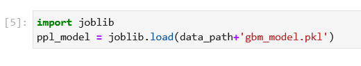

## Task 2: Creating SklearnModel() object

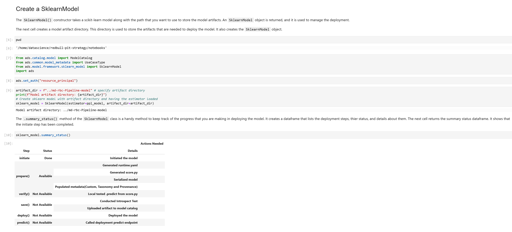

Once we have our SklearnModel() object, we need to prepare the object with _`.prepare()`_. This function will create the model artifacts, and contains information about which Python/conda environment should be the one to resolve the model's call when we invoke it. We'll specify our conda environment to be a pre-trained model called _`generalml_py37_cpu_v1`_.

We also specify which variables are expected as inputs to the model and which one to predict, through _`X_sample`_ and _`y_sample`_.

After this function, in the directory we have specified, all model artifacts will be created. Most important artifacts are:
- `input_schema.json`: A JSON file that defines the nature of the features of the `X_sample` data. It includes metadata such as the data type, name, constraints, summary statistics, feature type, and more.
- `model.joblib`: This is the default filename of the serialized model. It can be changed with the `model_file_name` attribute. By default, the model is stored in a joblib file. The parameter `as_onnx` can be used to save it in the ONNX format.
- `output_schema.json`: A JSON file that defines the nature of the dependent variable in the `y_sample` data. It includes metadata such as the data type, name, constraints, summary statistics, feature type, and more.
- `runtime.yaml`: This file contains information that is needed to set up the runtime environment on the deployment server. It has information about which conda environment was used to train the model, and what environment should be used to deploy the model. The file also specifies what version of Python should be used.
- **`score.py`**: This script contains the `load_model()` and `predict()` functions. The `load_model()` function understands the format the model file was saved in and loads it into memory. The `.predict()` method is used to make inferences in a deployed model. There are also hooks that allow you to perform operations before and after inference. You can modify this script to fit your specific needs.

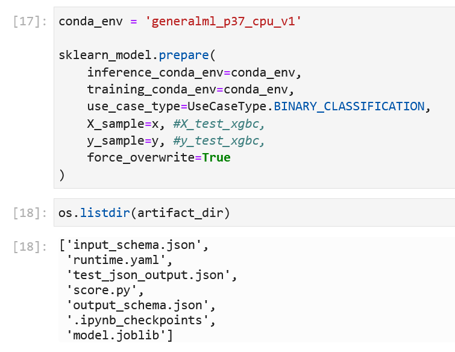

Once all artifacts have been created, we can check the model's metadata:

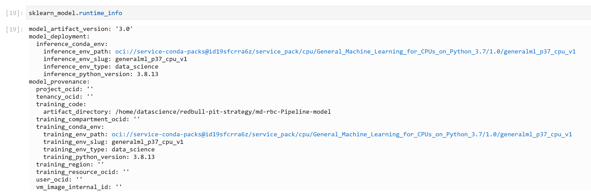

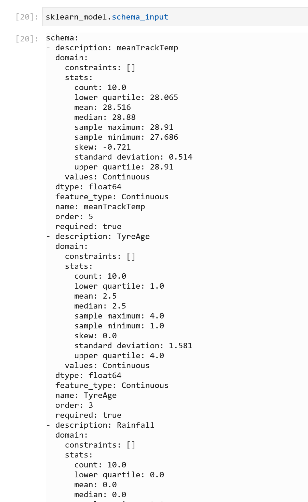

## Task 3: Testing Model

If you modify the `score.py` file that is part of the model artifacts, then you should verify it. The verify step allows you to test those changes without having to deploy the model. This allows you to debug your code without having to save the model to the model catalog and then deploy it. The `.verify()` method takes a set of test parameters and performs the prediction by calling the `predict` function in `score.py`. It also runs the `load_model` function.

The next figure simulates a call to a deployed model without having to actually deploy the model. It passes in test values and returns the predictions:

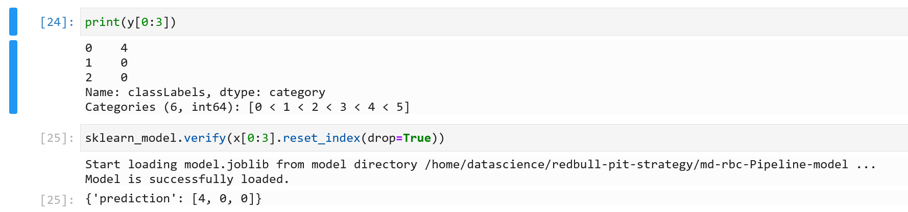

## Task 4: Saving Model to Model Catalog

Saving in the model catalog allows us to load this model in other Data Science environments or regions within OCI. It returns the model OCID, which we'll later need to invoke the model.

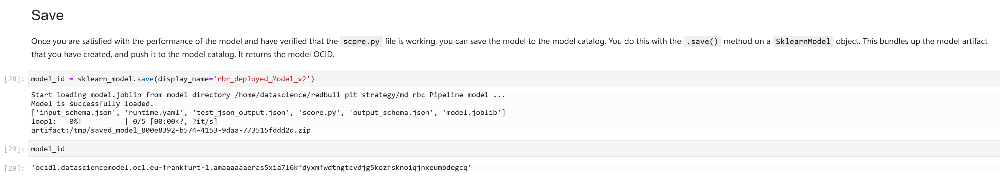

## Task 5: Deploy Model to the Internet

With the model in the model catalog, you can use the `.deploy()` method of an `SklearnModel` object to deploy the model. This method allows you to specify the attributes of the deployment such as the display name, description, instance type and count, the maximum bandwidth, and logging groups.

The next cell deployed the model with the default settings, except for the custom display name. The `.deploy()` method returns a `ModelDeployment` object.

We take a look at the model's summary status to see whether everything is OK and all endpoints are available or there have been errors:

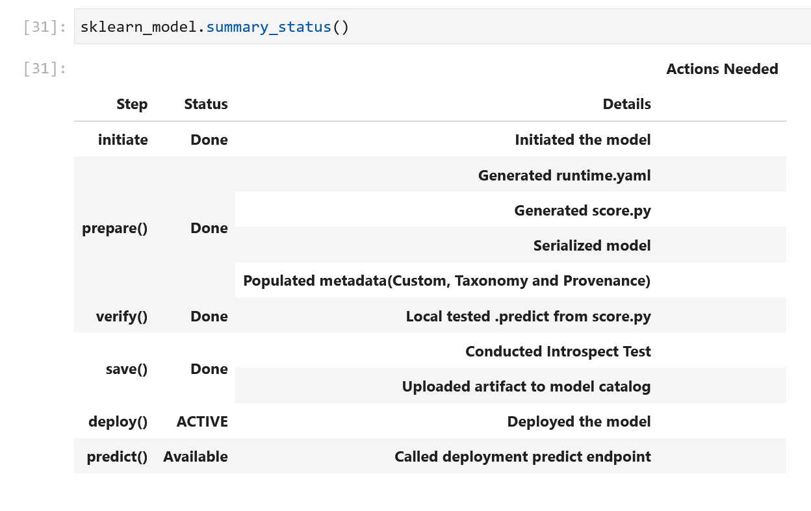

> Note: when a model is deployed, a Load Balancer is automatically created to support and monitor traffic and prevent the model from overloading due to receiving too many calls.

These models and model deployments are accessible from the OCI Panel, and can be stopped, restarted, updated and deleted whenever we need:

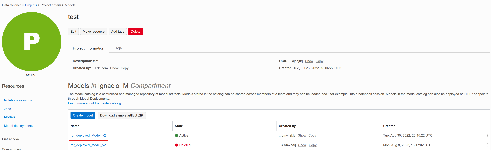

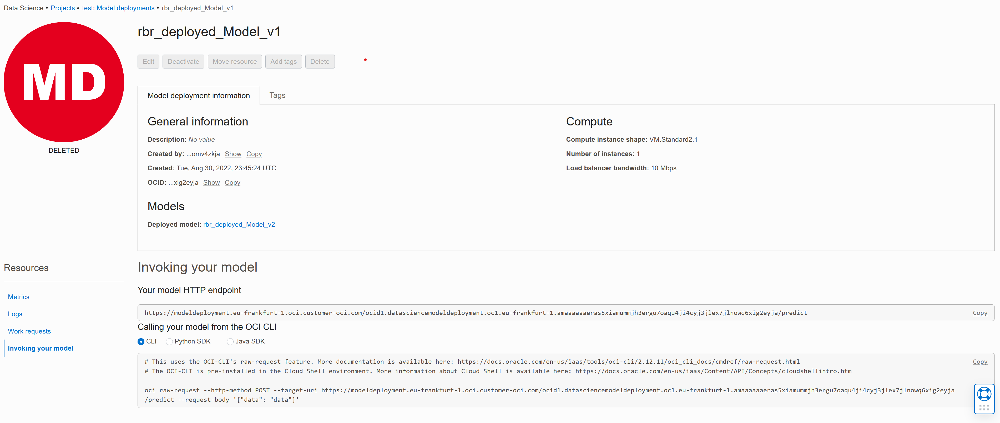

From within the model deployment, we can extract the endpoint API: 

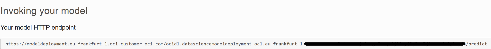

This endpoint is the one we'll call in the following task to get prediction results from our model.

## Task 6: Invoking Endpoint from anywhere

We take the model's OCID from the previous task and make the HTTP request to get results:

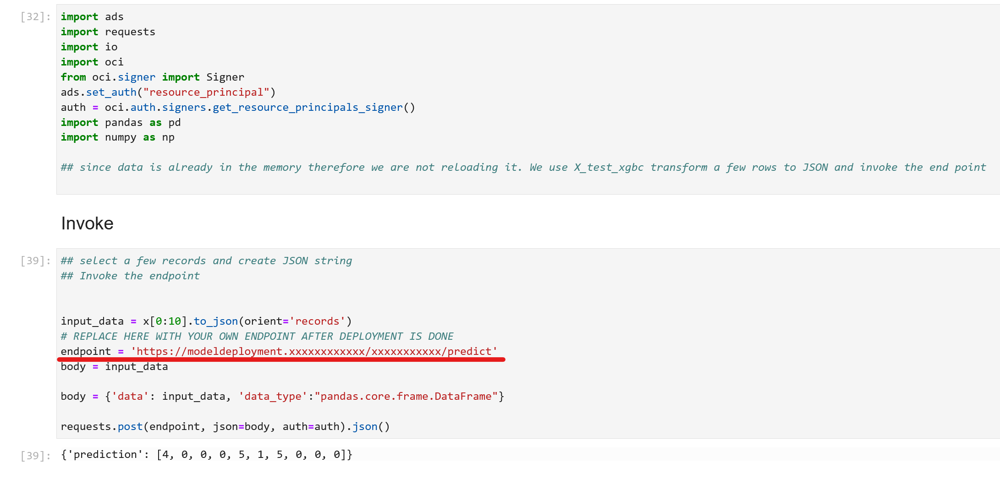

We see that the model has returned ten different predictions for the 10 rows we made requests for.

> Notice that we can make as many row-requests as we want within the same API call.

## Task 7: Destroying Model (Optional)

If you want to destroy the model from the catalog and OCI (also, to save money on unwanted API calls), we can call the _`.delete_model() and .delete_deployment()`_ functions:

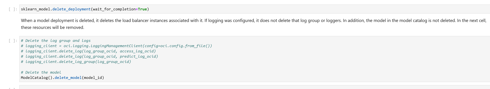

## Conclusions

In this chapter, we have learned how to deploy an already-created Machine Learning model.

I hope this workshop was useful for everybody, and we'll see you in the upcoming workshops!

### How can I get started on OCI?

Remember that you can always sign up for free with OCI! Your Oracle Cloud account provides a number of Always Free services and a Free Trial with US$300 of free credit to use on all eligible OCI services for up to 30 days. These Always Free services are available for an **unlimited** period of time. The Free Trial services may be used until your US$300 of free credits are consumed or the 30 days has expired, whichever comes first. You can [sign up here for free](https://signup.cloud.oracle.com/?language=en&sourceType=:ow:de:te::::&intcmp=:ow:de:te::::).

### Join the conversation!

If you’re curious about the goings-on of Oracle Developers in their natural habitat, come [join us on our public Slack channel](https://bit.ly/devrel_slack)! We don’t mind being your fish bowl 🐠

## Acknowledgements

* **Author** - Nacho Martinez, Data Science Advocate @ DevRel
* **Contributors** - Victor Martin - Product Strategy Director, Alireza Dibazar - Principal Data Scientist, Vesselin Diev - Senior Director of Data Science, ML Innovation Team
* **Last Updated By/Date** - October 3rd, 2022
