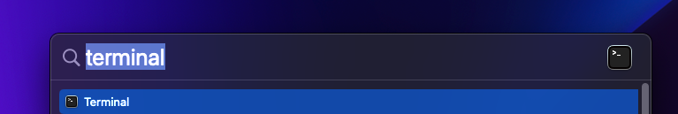

# Create and connect to an OCI Compute Instance

## Introduction

We will set up the demo to run from an OCI Compute Instance (aka VM). We will configure this Compute Instance as a "server" which will send real-time updates to the demo web client. The client will then visualize these updates. After creating the Compute Instance we will connect to it using SSH.

### Objectives

* Create an OCI Compute Instance.
* Configure network access.
* Connect using SSH.

## Task 1: Create an OCI Compute Instance

1. Login to your OCI account.
2. From the main menu, select Compute and then Instances

   

3. Make sure you have the right Compartment selected and click the Create instance button.

   

4. On the Create Compute Instance page, name your instance (senti-meter-server, for example).

   

5. We are going to accept most of the defaults on this page. Please make sure that under the Image and shape section, Oracle Linux is selected and under the Networking section, the Assign a public IPv4 address is selected.

   
   

6. Scroll down to the Add SSH keys section (we will accept most of the defaults on this page) and click the Save Private Key button. This will trigger a download of your SSH connection key file (typically to your downloads folder). We will use this file to connect to our Compute Instance.  
It is recommended that you move the key file to a dedicated folder on your computer for safe keeping.  
On a Mac/Linux machine, one possible location would be the `~/.ssh/` folder.  

   > **Note:** Please take note of where this file is saved as we will need it in upcoming steps.

   


7. Create the Create button at the bottom of the page.

   

8. After a short while, the Compute Instance details page will show. Click the Instances link at the top of the page to go back to the instances list page.

   

9. When the Compute Instance has been created and started, you will see the Running state next to your Compute Instance name.

   

## Task 2: Configure network access

By default, the server will block any connection attempts over the network (except for SSH connections on port 22). In this task we will allow connections to be made on port 9000 as this will be the port the server expects traffic to be sent through.

1. Click the newly created & running Compute Instance in the instances list.

   

2. On the instance details page, click the subnet link in the Primary VNIC section.

   

3. On the Subnet Details page, click the Default Security List in the Security Lists table.

   

4. On the Security List Details page, click the Add Ingress Rules button. We are about to define a security rule which will allow incoming traffic to the Compute Instance.

   

5. In the Add Ingress Rule panel, update the following fields and click the Add Ingress Rules button:

   | Field Name             | Value     | Meaning                                                          |
   | ---------------------- | --------- | ---------------------------------------------------------------- |
   | Source CIDR            | 0.0.0.0/0 | We will allow incoming traffic from any computer on the internet |
   | Destination Port Range | 9000      | The server will be expecting connections on TCP port 9000        |

   

## Task 3: Connect to the Compute Instance using SSH

1. To connect to the newly created Compute Instance, we will need to know the public IP address assigned to it. Back at the Instances page (Main Menu > Compute > Instances), copy the IP address assigned to the Compute Instance. Save the IP address somewhere handy (a text file, for example) as we will need it in upcoming steps.

   

2. Start a terminal application:

    * On Windows 11: use the `⊞ Windows Key` on your keyboard to open the start menu, type `cmd` in the search bar and press Enter.

      

    * On Mac: use the `⌘ Command Key + Space Bar` combination to launch Spotlight search, type `Terminal` and press Enter.

      

3. This step is only required on Mac and Linux, if you're using a Windows machine please skip to the next step.  
To use the SSH key we've downloaded previously, we need to make sure the key file is stored with secure access permissions.

      > **Note:** In this lab we are using the file name `ssh-key-2022-08-01.key` to refer to the key file. Your file name will be different and you will have to replace the file name place holder in the commands with the proper file name.

      1. In the terminal window, change the current directory to the directory where you've stored the download key file. This is usually the `Downloads` folder  (if you saved the key file in a different location, please use that folder's name instead of Downloads). Use the following command to move to that location:

         ```bash
         % <copy>cd Downloads</copy>
         ```

      2. List the files in the folder while showing the files permissions:

         ```bash
         Downloads % <copy>ls -l</copy>

         total 8
         -rwxrwxrwx@  1 username  staff  1675 Aug  6 11:05 ssh-key-2022-08-01.key
         ```

         As you can see, `ssh-key-2022-08-01.key` is accessible to all users (-rwxrwxrwx).

      3. Restrict the access permissions for the key file:

         ```bash
         Downloads % <copy>chmod 600 [key file name].key</copy>
         Downloads % ls -l

         total 8
         -rw-------@  1 username  staff  1675 Aug  6 11:05 ssh-key-2022-08-01.key
         ```

         As you can see, the file access is now restricted to the owner of the file (-rw-------).

4. Using the key file, we will connect to the Compute Instance.  
In the terminal window, use the following command (replace [compute instance IP] with the actual Compute Instance IP copied in a previous step and [key file name] with the actual name of the key file):

    * On a `Mac` computer:

        ```bash
        Downloads % <copy>ssh -i ./[key file name].key opc@[compute instance IP]</copy>
        ```

    * On a `Windows` computer:

        ```bash
        C:\Users\username\Downloads><copy>ssh -i [key file name].key opc@[compute instance IP]</copy>
        ```

    As an example, this command would look similar to the following:

    ```bash
    ssh -i ssh-key-2022-08-01.key opc@192.168.15.76
    ```

    `opc` is the default user name for created for the Compute Instances.  
    If you are presented with a warning such as: `WARNING: UNPROTECTED PRIVATE KEY FILE!`, please make sure you have followed the instructions in step #3.

    In certain situations, you will be presented with the following warning:

    ```text
    The authenticity of host '[IP address] ([IP address])' can't be established.
    ECDSA key fingerprint is SHA256:[hash].
    Are you sure you want to continue connecting (yes/no/[fingerprint])?
    ```

    In this case type `yes` and press Enter. We have generated this key file so it is safe to use.

    At this point, you should be connected to the Compute Instance.  
    The terminal should show an output similar to:

    ```bash
    Downloads % ssh -i [key file name].key opc@[compute instance IP]

    Last login: Sat Aug  6 18:35:03 2022 from [compute instance IP]
    [opc@senti-meter-server ~]$ 
    ```

    The prompt `opc@senti-meter-server` shows that a connection was made using the user `opc` to a computer named `senti-meter-server`  (your Compute Instance might be named differently).  
    From this moment on, we will refer to this terminal window as the `connected terminal` to differentiate it from other terminal windows we might require.  

    > **Note:** The connection to the Compute Instance might break for various reasons. If the connected terminal becomes unresponsive or indicates that the connection has been broken, please repeat the steps in this section to re-establish the connection.

You may now **proceed to the next lab**.

## Acknowledgements

* **Authors:**
	* Yanir Shahak - Senior Principal Software Engineer, Health & AI