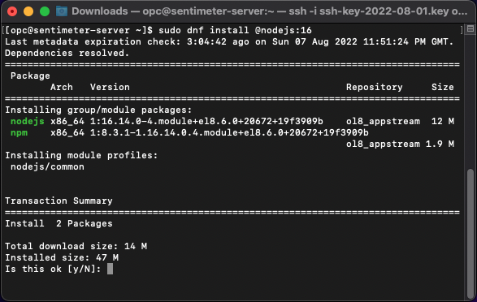
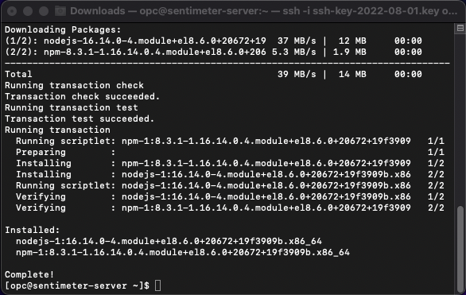

# Configure the Compute Instance

## Introduction

In previous sections we created the Compute Instance and established a connection to it.  
In this section we will make the necessary configurations for the demo to work properly.

### Objectives

* Allow incoming network traffic on port 9000.
* Install Node.JS.
* Create a folder to hold the OCI authentication information.

## Task 1: Allow incoming network traffic on port 9000

The demo server will send sentiment analysis notifications to the client over port 9000.  
By default, all communication to the server is disabled except for port 22 used for SSH connections.
In the Compute Instance network configuration step, port 9000 was enabled on the network side, and now we will enable it on the Compute Instance.  

1. As we've done in the previous section, we will use the connected terminal to issue the following commands:

    ```bash
    [opc@senti-meter-server ~]$ <copy>sudo firewall-cmd --permanent --add-port=9000/tcp</copy>
    ```

    The terminal should output `success` when the command completes.

    ```bash
    [opc@senti-meter-server ~]$ <copy>sudo firewall-cmd --reload</copy>
    ```

    The terminal should output `success` when the command completes.

## Task 2: Install Node.JS

To execute the demo code, we need to install Node.JS version 16 or above.

1. In the terminal, type the following command:

    ```bash
    [opc@senti-meter-server ~]$ <copy>sudo dnf install @nodejs:16</copy>
    ```

   After executing this command, you should see output similar to the following:

   

   Respond to the prompt asking you if you would like to proceed with the installation, type `y` (for `yes`) and press Enter.  
   Once the installation completes, your terminal should look like the following:

   

## Task 3: Create a folder to hold the OCI authentication information

The demo code makes extensive use of OCI's AI APIs to analyze the incoming tweets. To make those API calls, authentication information must be sent with the calls. In a following lab we will configure the authentication, but for now, we will create a folder which will serve as a placeholder for the authentication information.

1. We will use the `mkdir` command in the connected terminal to create the folder:

    ```bash
    [opc@senti-meter-server ~]$ <copy>mkdir ~/.oci</copy>
    ```

    This command doesn't output anything in response when successful.

You may now **proceed to the next lab**.

## Acknowledgements

* **Authors:**
	* Yanir Shahak - Senior Principal Software Engineer, Health & AI