# Setup OCI AI Authentication

## Introduction

Throughout this workshop we will be making extensive use of the Oracle Cloud Infrastructure (OCI) AI APIs. In order to issue API requests, we need to append authentication information to the requests. In this lab we will setup this authentication mechanism.

### Objectives

* Create an API key.
* Setup the authentication environment on the Compute Instance.

## Task 1: Create an API key

1. From the `Main Menu`, select `Identity & Security` and then `Users` to the right.

    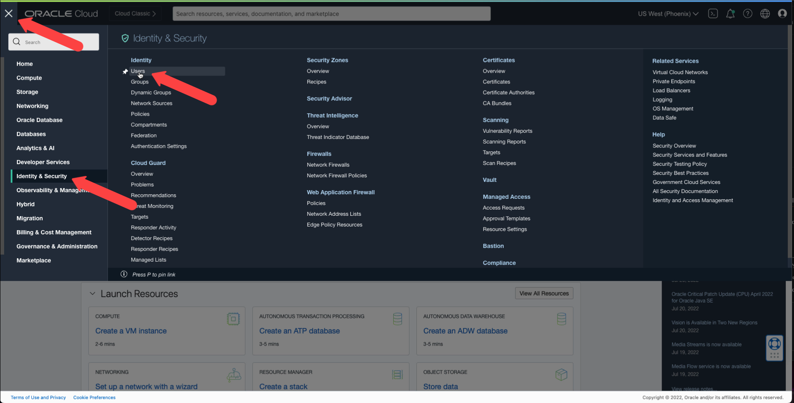

2. On the `Users` page, click your user name.  
We will use your specific user in this demo for simplicity. In a production environment, a specific user might be created for this task.

    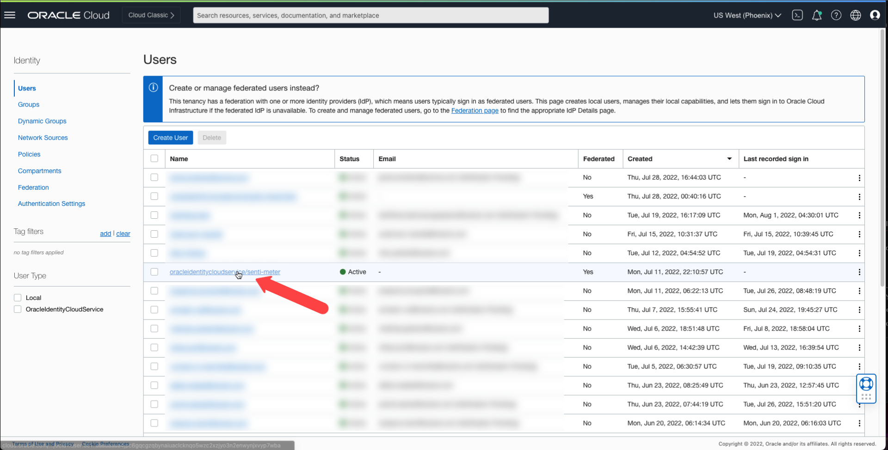

3. On the `User Details` page, select the `API Keys` link on the bottom left.

    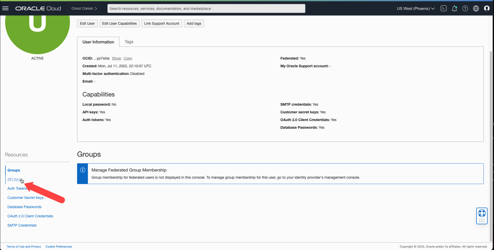

4. On the right, under the `API Keys` section, click the `Add API Key` button.

    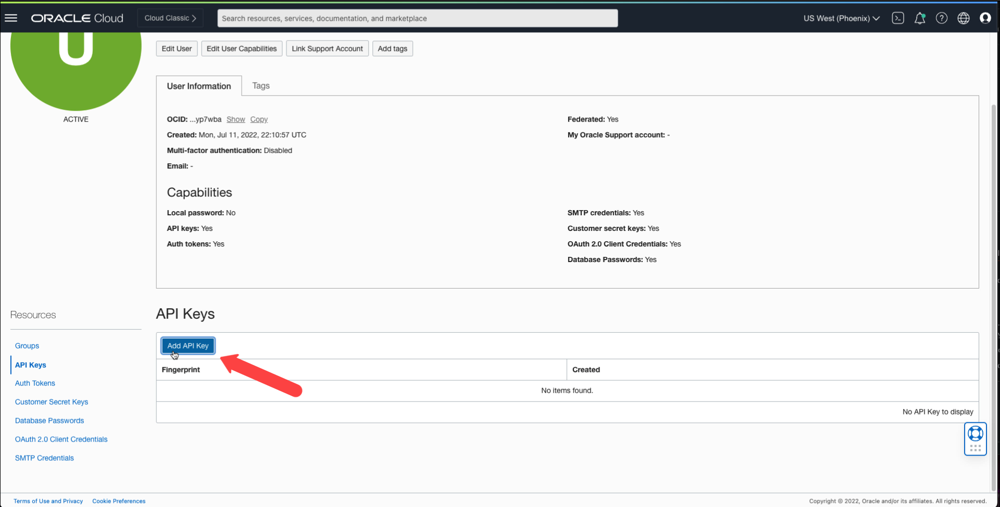

5. On the Add `API Key dialog`, click the `Download Private Key` button.

    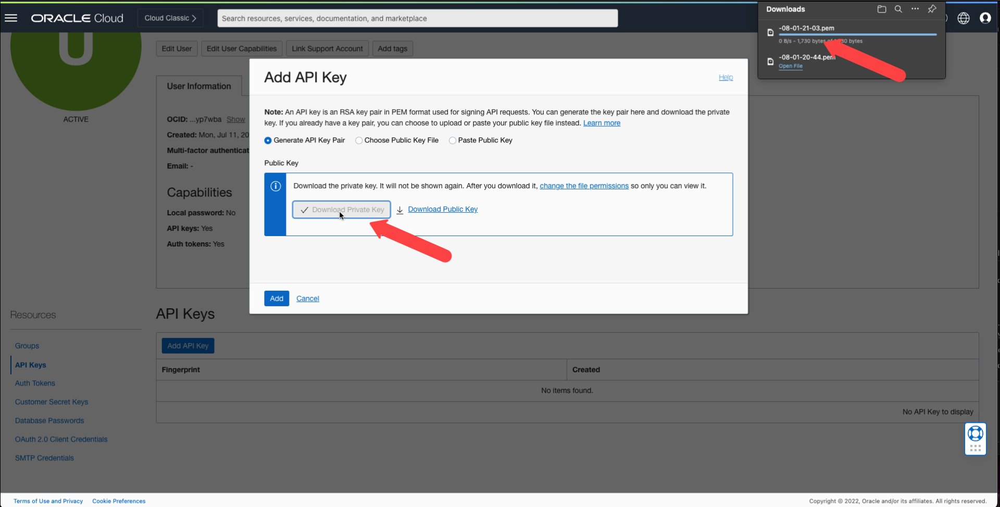

    The key file should automatically download and saved (typically) to your `Download` folder. This file, along with some additional information will be used to authenticate the API calls.  
    Keeping this file in the same folder where we keep the SSH connection key (downloaded in a [previous lab](?lab=create-a-compute-instance-and-connect#Task1:CreateanOCIComputeInstance)) will simplify our next steps.

6. After the file has successfully download, click the `Add` button at the bottom of the dialog.

    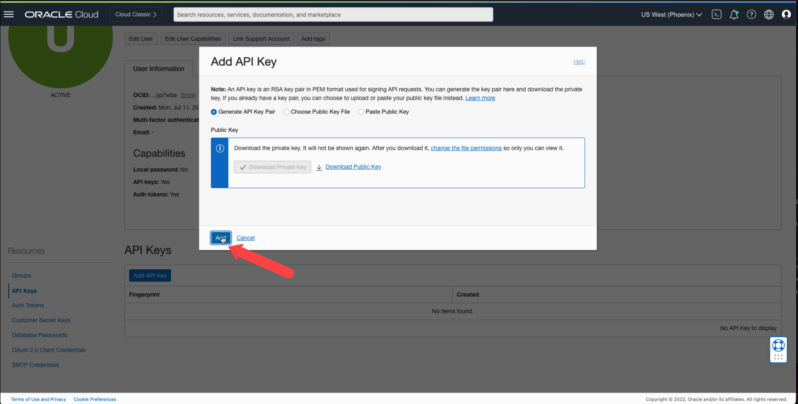

7. In the `Configuration File Preview` dialog, copy the configuration text displayed in the `Configuration File Preview` text box by selecting the text and copying it or by click the `Copy` link on the bottom right of the text box.

    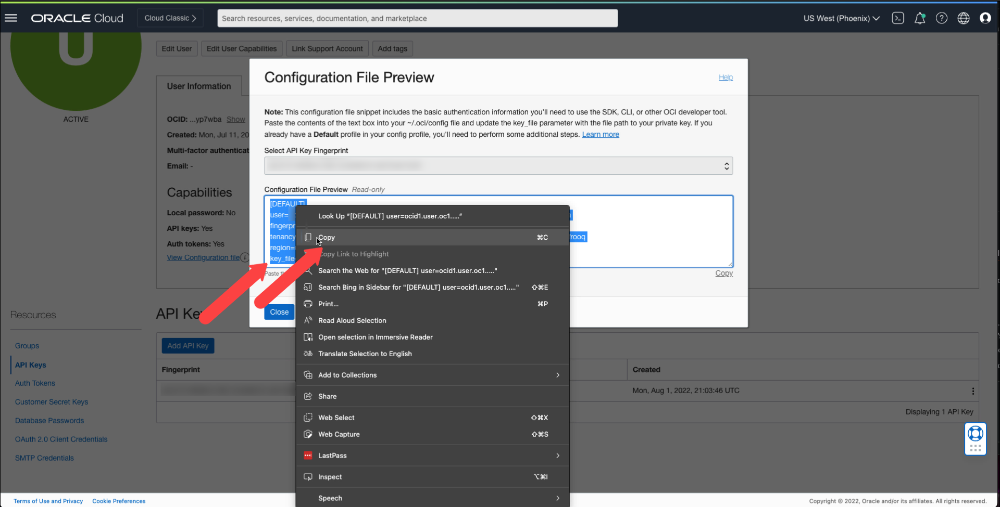

    After copying the text, please paste it to a location of your choice. This can be a text file, or any other document, but keep it handy as we are going to need this information shortly.

8. When you have the configuration information safely stored, click the `Close` button to dismiss the dialog.  
You should see a new entry in the `API Keys` list which represents the newly created API key.

    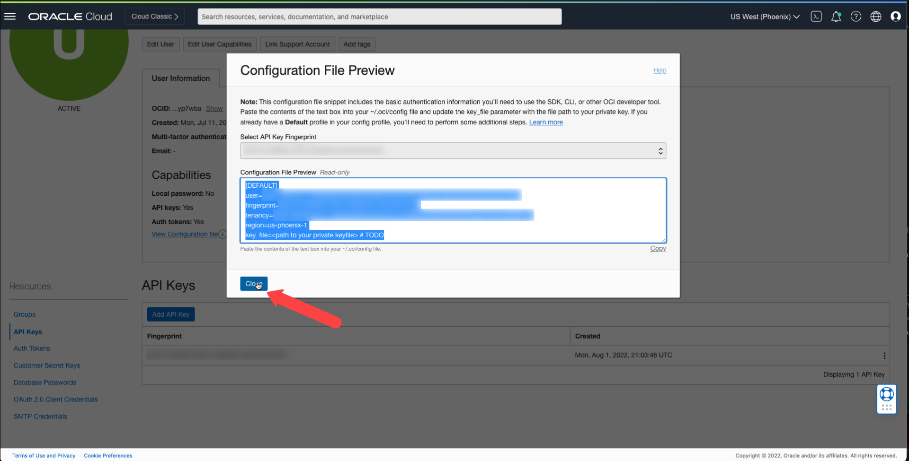

## Task 2: Setup the authentication environment on the Compute Instance

To use our API key, we first need to copy it to our Compute Instance.  
We will use the SCP (Secure Copy) command to copy the file. This command is very similar to the SSH command and uses the same key we used to connect to the Compute Instance.
Please note: In this lab we are using the file name `08-01-21-03.pem` to refer to the `API Key` file. Your file name will be different and you will have to replace the file name place holder in the commands with the proper file name.

1. This task requires a new terminal window. Please keep the existing terminal window active and start a new terminal window as discussed in a [previous lab](?lab=create-a-compute-instance-and-connect#Task2:ConnecttotheComputeInstanceusingSSH).
2. Use the `cd` command to switch to the folder where the downloaded `API Key` was saved (`Downloads` in our example).

    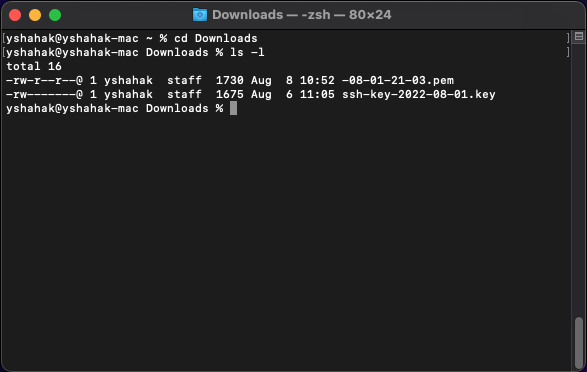

3. Use the following `scp` command to copy the `API Key` file from your computer to the Compute Instance over the network:

    * On a `Mac` computer, use the following command:

    ```bash
    Downloads % <copy>scp -i ./[key file name].key ./[api key file name].pem opc@[compute instance IP]:~/.oci</copy>
    ```

    * On a `Windows` computer, use the following command:

    ```bash
    C:\Users\username\Downloads><copy>scp -i ./[key file name].key ./[api key file name].pem opc@[compute instance IP]:~/.oci</copy>
    ```

    Here's an example of how this command might look like:

    ```bash
    scp -i ssh-key-2022-08-01.key 08-01-21-03.pem opc@192.168.15.76:~/.oci</copy>
    ```

    Here's an example of how the terminal output might look like for a successful copy:

    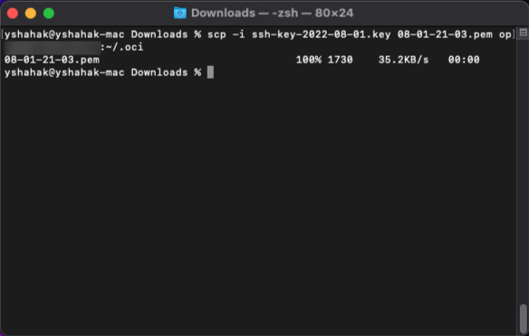

    At this point, the `API Key` file resides on the Compute Instance under the `~/.oci` folder (`~` means the home folder for the current user (`opc`) which in our case means `/home/opc`, therefore, the full path of the `API Key` file on the Compute Instance will be: `/home/opc/.oci/[key file name].pem`). We will use this information in the following step.

3. For this next step, we will go back to the connected terminal and create the configuration file with all of the authentication info we copied in previous steps. We will use the `nano` text editor to create and edit our configuration file.
In the connected terminal window, execute the following command:

    ```bash
    [opc@senti-meter-server ~]$ <copy>nano ~/.oci/config</copy>
    ```

    At this point we will need the text we copied in the [previous task](#Task1:CreateanAPIkey). Please copy this text and paste it directly into the terminal window (On `Mac` use `Command + V`. On `Windows` use `Ctrl+V`).  
    Most of the information we need already exists in the text we copied from the OCI console. The only value we need to update is the `key_file`. Remove all of the placeholder text (`<path to your private keyfile> #TODO`) and replace it with the full path of `API Key` file as espablished in the previos step (`/.oci/[key file name].pem`).  
    The final result should look similar to this:

    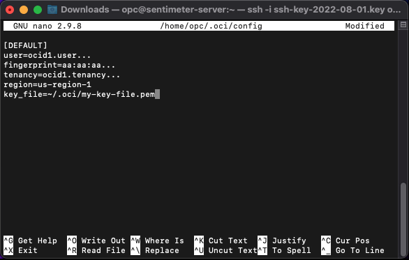

    When done, press `Ctrl+X`, type `Y` as a response to the question `Save modified buffer?` and press `Enter`.  
    The configuration file will be saved and ready to use.

## Acknowledgements

* **Authors:**
	* Yanir Shahak - Senior Principal Software Engineer, Health & AI