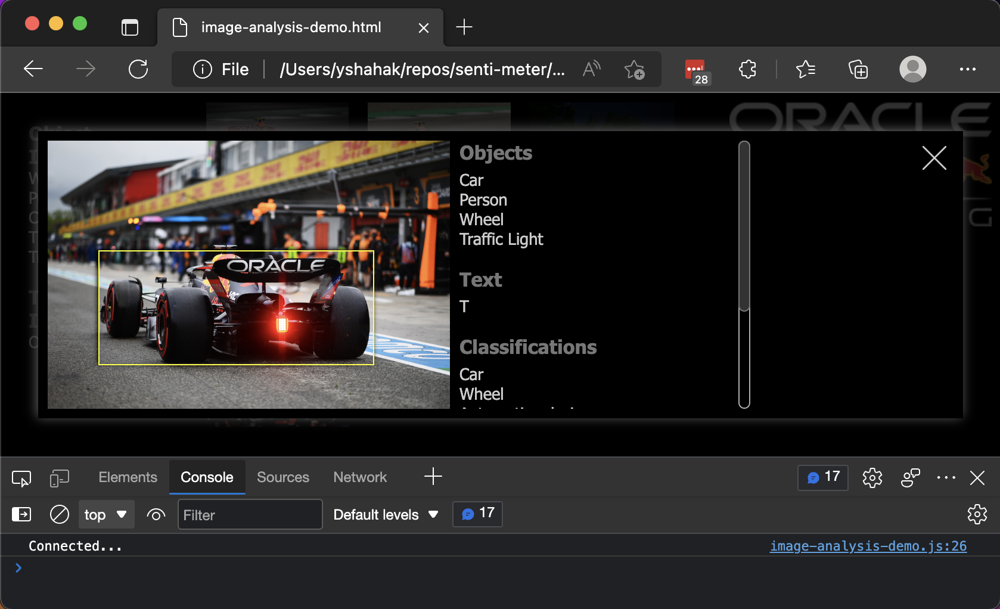

# Start your engines

## Introduction

After completing the hard work of configuring the demo, now it's time to sit back, relax and observe the results.
In just a few steps we will be able to see the flow of tweets analyzed by the Oracle AI APIs sent directly to our screen.

### Objectives

* Start the Senti-Meter `consumer` and `processor`.
* Launch the Senti-Meter client.
* Start the Vision AI image demo.
* Launch the Vision AI image demo client.

## Task 1: Start the Senti-Meter consumer and processor

The Senti-Meter demo has three main components:

1. The tweets `consumer` TypeScript/NodeJS program is designed to connect to the Twitter Filtered Stream API and retrieve the tweets specified by the filter in `.env`. Each tweet received is then temporarily saved in a text file on the Compute Instance's local disk in preparation for processing.

2. The tweets `processor` TypeScript/NodeJS program waits for tweet files to be created by the `consumer`, reads them from disk in batches of up to 100 files and sends them to the Oracle Language AI service for sentiment analysis. In parallel, this program listens for incoming connections from clients. Each connected client will receive the results of the sentiment analysis as a stream of text messages. After a Tweet files is processed, the `processor` deletes it from disk.

3. The Senti-Meter `client` is an HTML/JavaScript client application designed to connect to the `processor` over the network, pull results of analyzed tweets and visualize them using a speedometer-like presentation.

In this task we will launch each of these components.

1. In your connected terminal, execute the following two commands to start the tweets `consumer` and observe its operation:

    ```bash
    [opc@senti-meter-server ~]$ <copy>npm run consumer</copy>
    [opc@senti-meter-server ~]$ <copy>tail -f consumer</copy>
    ```

    The output from these two commands should look similar to this:

    

    The first command starts the `consumer`. The second command reads the output made by the `consumer` process. The output is written to a file called `consumer`. This command will continue reading this output until stopped by using `Ctrl+C`. After you have observed the `Retrieving tweets...` message, you can exit the command using `Ctrl+C`.  

    If you see different output or error messages, please review the `Bearer Token` configuration steps [here](?lab=deploy-the-demo-code-to-the-ci#Task3:Configurethesourcecode).

2. In your connected terminal, execute the following two commands to start the tweets `processor` and observe its operation:

    ```bash
    [opc@senti-meter-server ~]$ <copy>npm run processor</copy>
    [opc@senti-meter-server ~]$ <copy>tail -f processor</copy>
    ```

    The output from these two commands should look similar to this:

    

    The first command starts the `processor`. The second command reads the output made by the `processor` process. The output is written to a file called `processor`. This command will continue reading the output made by the `processor` until stopped by using `Ctrl+C`. After you have observed following message: `The WebSocket server is listening on 0.0.0.0:9000` you can exit the command with `Ctrl+C`.

3. (OPTIONAL) After you are done running the demo, you can use the following commands to stop the `consumer` and/or `processor` processes (if you intend to run the demo right now, please skip this section):

    ```bash
    [opc@senti-meter-server ~]$ <copy>npm run stop-processor</copy>
    [opc@senti-meter-server ~]$ <copy>npm run stop-consumer</copy>
    ```

## Task 2: Launch the Senti-Meter client

The client used to visualize the analysis results is an HTML file which can be opened on your browser to view the output from the `processor`. In this section we will extract the client file from the source code zip file (downloaded in a [previous lab](?lab=deploy-the-demo-code-to-the-ci#Task1:DownloadandcopythesourcecodetotheComputeInstance)), update the Compute Instance's IP address and launch the demo.

1. Locate the previously downloaded `senti-meter-demo.zip` file (usually will be found in the `Downloads` folder).

    * On a `Mac` computer, double click the file to extract all of its content to a folder called `senti-meter-demo`.
    * On a `Windows` computer, right click the file and select `Extract All`. In the `Extract Compressed (Zipped) Folders` dialog, accept the defaults and click the `Extract` button.

2. The extraction process has created a folder called `senti-meter-demo`. To find the file we need to update, navigate to the following folder (using `Finder` on `Mac` or `File Explorer` on `Windows`):

    ```text
    Downloads/senti-meter-demo/src/senti-meter-demo/client/scripts
    ```

3. Using your favorite text file editor, open the file named: `senti-meter-client.js`, locate the string `localhost` within the file and replace it with the Compute Instance IP. Here are before and after screenshots of how this should look like:


    
    

    Please make sure that the single quotes remain at the beginning and end of the IP address without any additional spacing. When done, save the file and exit the editor.

4. Before we load the client into the browser, we need to let the browser know we are aware that the TLS certificate used to connect to our Compute Instance is a self-signed one (this was covered in a [previous lab](?lab=deploy-the-demo-code-to-the-ci#Task4:CreateaselfsignedTLScertificate)).  
To do this, start your favorite browser and navigate to: `https://[Compute Instanec IP]:9000`. As an example, the address should look similar to this: `https://192.168.0.74:9000`.  
Depending on your browser, you should see a message similar to this:

    

    Despite the alarming message, it is expected in our case as we are using a self-signed TLS certificate.  
    In order to get past this error, we need to let the browser know we are aware of the risks. The solution is different for each browser:

    * On `Chromium` based browsers (such as `Chrome` or `Edge`): Click the `Advanced` button. If see a link similar to `Continue to 192.168.0.74 (unsafe)` at the bottom of the page, click this link. If you do not see such a link, while the error message is being displayed, click anywhere on the screen (not on any of the buttons) to set focus to the page and type: `thisisunsafe` (the words `this is unsafe` with no space between them).
    * On `FireFox`: Click the `Advanced...` button and then the `Accept the Risk and Continue` button.
    * On `Safari`: Click the `Show Details` button and then the `visit this website` link and finally, click the `Visit Website` button in the confirmation dialog.

    None of the browsers will show an indication that this step has succeeded. The only way to know for sure is by launching the client and trying to connect to the server. We will do this next.

5. We will now load the client in the browser to observe the sentiment analysis results:
In order to load the client file, navigate to the following folder (using `Finder` on `Mac` or `File Explorer` on `Windows`)

    ```text
    Downloads/senti-meter-demo/src/senti-meter-demo/client/
    ```

    The `senti-meter-client.html` file resides in this folder. Double click this file to open it in the default browser. Alternatively, you could launch your favorite browser, use the `File > Open` option, navigate to `Downloads/senti-meter-demo/src/senti-meter-demo/client/` and select `senti-meter-client.html`.

    Once the file is loaded, press `F12` to reveal the `Developer-Tools` pane.  
    If everything was configured successfully, you should see the message `Connected...` in the `Developer-Tools` `Console` tab like so:

    

    As the sentiment analysis results stream into the client, the `Console` will show the streamed values. Positive values will inch the dial further to the right and Negative values will push it to the left. Mixed and Neutral values will have no effect on the dial.
    If the stream of values is too slow, please consider using a different filter value by changing the current filter in the `.env` file on the Compute Instance. Consider replacing `@redbullracing` with `cats` for example. If you make a change to the filter, please don't forget to execute the filter update command: `npm run setup`. These concepts are covered in a [previous lab](?lab=deploy-the-demo-code-to-the-ci#Task3:Configurethesourcecode).

    If the `Console` shows error messages that indicate the client cannot connect, please review the steps for starting the `consumer` and `processor` in a [previous task](#Task1:StarttheSentiMeterconsumerandprocessor) as well as the steps for accepting the self-signed certificate earlier in this section.  
    If the console shows errors regarding loading specific files, please try opening these files (using File > Open) in the browser on different tabs.  On a Mac those files might be `Downloads/senti-meter-demo/src/scripts/client/web-socket-client.js` and `Downloads/senti-meter-demo/src/images/logo.png`.
    After each completed troubleshooting step, please refresh the browser page to see the results.

## Task 3: Start the Vision AI image demo

The demo also includes a demonstration of the Vision AI service.
This demo extracts images from tweets, analyses them using the Vision AI service and sends the results to the client.
The components of the two demos are similar as they both contain the `consumer`, `processor` and `client` components.
Here are the steps to run the Vision AI demo:

1. Since the demos use the same resources on the Compute Instance, they cannot be run in parallel.
Use the following commands to stop the running Language demo using your connected terminal:

    ```bash
    [opc@senti-meter-server ~]$ <copy>npm run stop-processor</copy>
    [opc@senti-meter-server ~]$ <copy>npm run stop-consumer</copy>
    ```

2. Use the following command to start the `image-consumer`:

    ```bash
    [opc@senti-meter-server ~]$ <copy>npm run image-consumer</copy>
    ```

    This process performs a query on past tweets using the filter defined in `.env` for the `IMAGE_QUERY` parameter. The default value queries for tweets which mention `@redbullracing`, contain images, and are not a retweet.  
    Each image extracted is saved in the `~/senti-meter-demo/images` folder.  A maximum of 300 images will be downloaded before the process exists. You can exist the `image-consumer` process using `Ctrl+C` when you feel like you have enough image for the demo.

    > **Note:** We do not control the type of images being posted to Twitter. Some of the content might be unsavory.

2. Use the following command to start the `image-processor`:

    ```bash
    [opc@senti-meter-server ~]$ <copy>npm run image-processor</copy>
    [opc@senti-meter-server ~]$ <copy>tail -f image-processor</copy>
    ```

    The output from these two commands should look similar to this:

    

    Just like the tweets `processor`, the `image-processor` will act on the data extracted by the `image-consumer`. It will load the list of images in the `~/senti-meter-demo/images` folder, send them in randomly sized batched to the Oracle Vision AI service and return the results to the client. After you have observed following message: `The WebSocket server is listening on 0.0.0.0:9000` you can exit the command with `Ctrl+C` (the `image-processor` will continue to run in the background).

3. (OPTIONAL) After you are done running the demo, you can use the following command to stop the `processor` process (if you intend to run the demo now, please skip this section):

    ```bash
    [opc@senti-meter-server ~]$ <copy>npm run stop-image-processor</copy>
    ```

## Task 3: Launch the Vision AI image demo client

We will now load the client in the browser to observe the results of image analysis.
Please make sure you have completed the steps to approve the self-signed certificate covered in a [previous task](#Task2:LaunchtheSentiMeterclient).

1. To load the client file, navigate to the following folder (using `Finder` on `Mac` or `File Explorer` on `Windows`)

    ```text
    Downloads/senti-meter-demo/src/image-analysis-demo/client/scripts
    ```

    Similar to the steps we've taken for the tweets client, we will need to update the Compute Instance IP for the Vision demo as well.
    Using your favorite text file editor, open the file named: `image-analysis-demo.js`, locate the string `localhost` within the file and replace it with the Compute Instance IP.
    Please make sure that the single quotes remain at the beginning and end of the IP address without any additional spacing. When done, save the file and exit the editor.

2. Navigate to the following folder (using `Finder` on `Mac` or `File Explorer` on `Windows`):

    ```text
    Downloads/senti-meter-demo/src/image-analysis-demo/client
    ```

    The `image-analysis-demo.html` file resides in this folder. Double click this file to open it in the default browser. Alternatively, you could launch your favorite browser, use the `File > Open` option, navigate to `Downloads/senti-meter-demo/src/image-analysis-demo/client/` and select `image-analysis-demo.html`.

    Once the file is loaded, press `F12` to reveal the `Developer-Tools` pane.  
    If everything was configured successfully, you should see the message `Connected...` in the `Developer-Tools` `Console` tab like so:

    

    As the image analysis results stream into the client, you will see images being loaded into the main demo UI. On the left you will see impression counts of the various objects and specific phrases extracted from the images which will show you the popular themes as observed in the images.  
    Each image in the main UI is clickable. Clicking an image will show a larger preview of the image as well as additional details on the elements extracted from the image. Hovering over the detected object names and extracted text value will highlight their location within the image.

    

    If the `Console` shows error messages that indicate the client cannot connect, please review the steps for starting the `image-consumer` and `image-processor` in a [previous task](#Task3:StarttheVisionAIimagedemo) as well as the steps for accepting the self-signed certificate in a [previous task](#Task2:LaunchtheSentiMeterclient).  
    If the console shows errors regarding loading specific files, please try opening these files (using File > Open) in the browser on different tabs.  On Mac those files might be `Downloads/senti-meter-demo/src/scripts/client/lang.js` and `Downloads/senti-meter-demo/src/scripts/client/html.js`.
    After each completed trouble shooting step, please refresh the browser page to see the results.

## Acknowledgements

* **Authors:**
	* Yanir Shahak - Senior Principal Software Engineer, Health & AI