# Advanced Data Exploration

<!---->

## Introduction

We've already identified several data points that were "out in the open" and readily available to us: the number of overtakes, the number of Did-Not-Finish and the weather.

However, we're not yet done. In practice, the data that holds predictive value is often _hidden away_.

It is up to us to _uncover_ the patterns that are important to be able to make a prediction. After all, the success of our machine learning model will depend on the data that we present to it, and we have to make the most of the data that we have.

Estimated Lab Time: 20 minutes

### Objectives
- Learn how to use visualization techniques to uncover additional data points that may be of value in predicting the score of a race.
- Learn how to use Oracle Analytics Cloud to Explore Data and Prepare Data to get it ready for building a Machine Learning model.

### Prerequisites
- An Oracle Free Tier, Always Free, Paid or Live Labs Cloud Account
- Oracle Analytics Cloud
- Autonomous Data Warehouse
- You've completed the previous labs

## **Task 1:** "Come back score"

First of all, let's look closer at the visualizations that we already have to see what data is patterns are hidden away in them.

1. On the home page, reopen the workbook of the previous lab by clicking on "Workbooks and Reports" and then on "Race Analysis".

   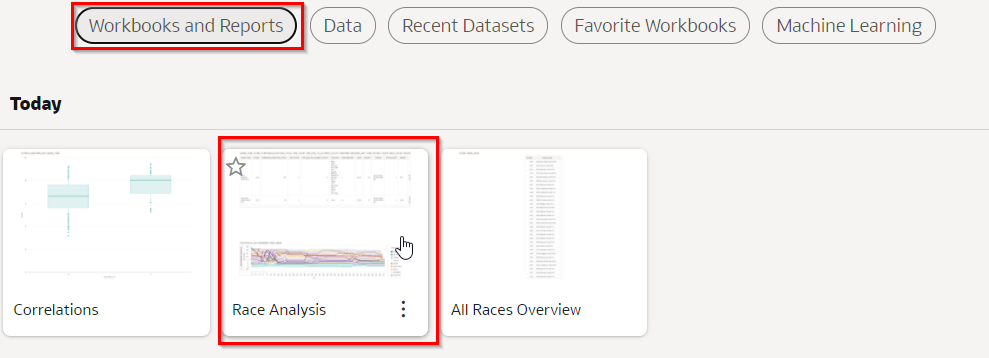

2. We want to look only at the 2012 Brazilian Grand Prix.

   Remove the Abu Dhabi Grand Prix from the filter by clicking on the filter (top-left), then click on "2020 Abu Dhabi...".

 	 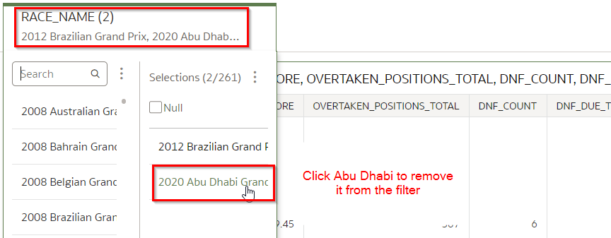

3. On the position chart, zoom in on Sebastian Vettel by clicking on "vettel" (the driver references are shown in the legend of the chart).

	 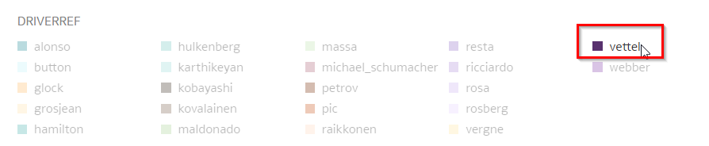

4. Inspect the chart.

   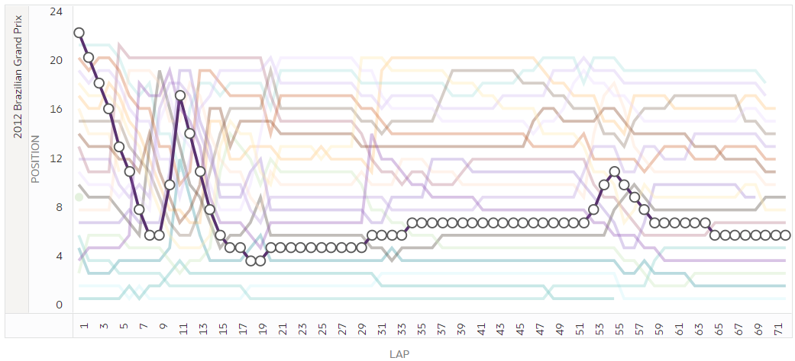

   Due to a collision Vettel fell to 22nd position early in the race. In the chart you can see how he made a great come back. Eventually he made it back to the 6th position, which was enough for him to seal the championship of that year. **What do you think about this? Could we use this type of pattern to predict the score of a race?**

5. We suspect that is interesting to have many overtakes, and it's even more exciting if a particular driver is able to recover many positions during the race. Let's make another note of this as an interesting pattern.

	 Note 5: A large come back (many positions gained) of a driver _may have_ a positive influence on the score. We don't have this metric available yet, so we will have to create it ourselves later (Feature Engineering).

## **Task 2:** Pit Stops

Now let's have a look at the pit stop information.

1. Let's visualize a more recent race. In the filter, change the selected race to the Austrian Grand Prix of 2021.

   Delete any existing Grand Prix' from the filter. Then use the search box to look for "Austrian", then click on "2021 Austrian Grand Prix" in the list.

   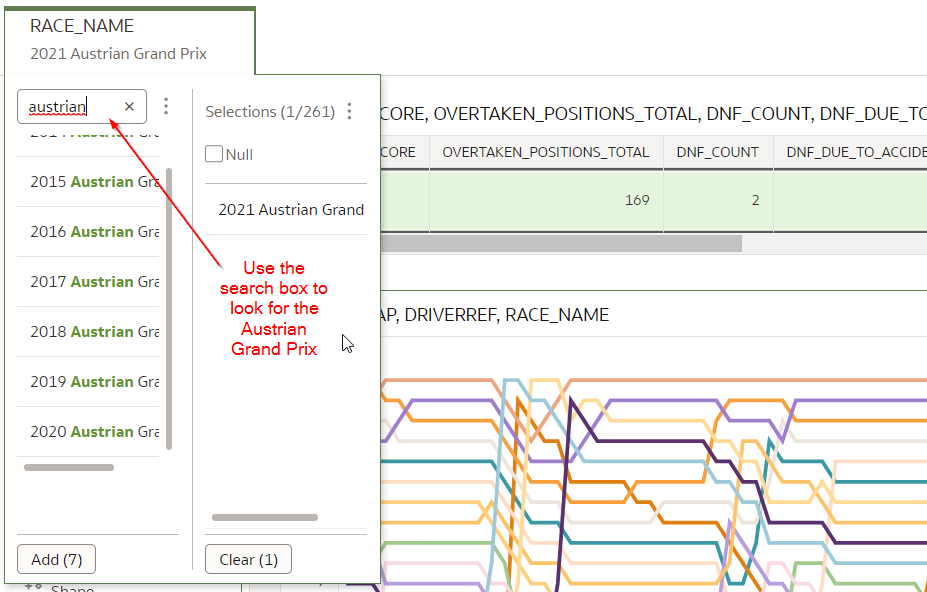

2. We want to show whether a driver made a pit stop in a particular lap.

   Click on the position chart to select its configuration, then drag `PIT_STOP` (from the "Lap Times" data set) to the Shape attribute

	 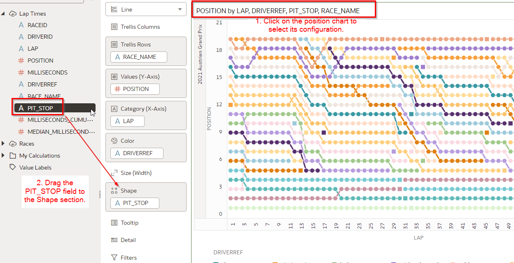

	 You should see different shapes appear in the chart (e.g. squares and circles), indicating whether a pit stop was made.

4. Now, click on Norris in the legend.

   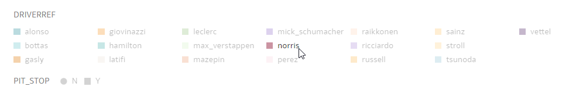

5. Inspect the results.

   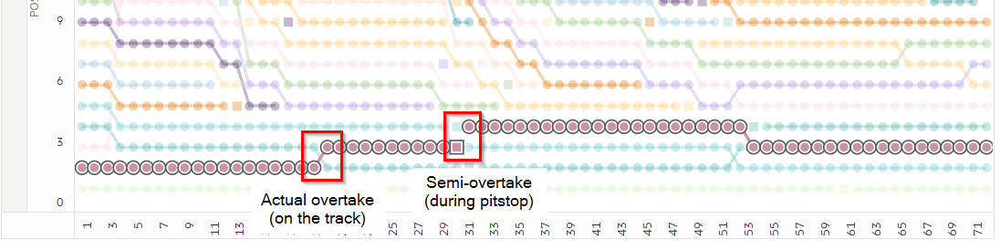

   Notice how Norris is overtaken by Bottas in lap 30. However, this overtake took place because Norris was making a pit stop. This is in contrast with the overtake by Hamilton in lap 20, which actually takes place on the track itself. **How do you believe pit stops can help us predict scores?**.

6. Our theory is that, although an overtake during a pit stop can be interesting, the  overtakes that actually take place on the track are even more exciting, and will result in a higher score. This is another interesting finding.

	 Note 6: Position changes due to a pit stop _may be_ less interesting for viewers than position changes on the track. We will have to transform the race data in some way to separate real overtakes from semi overtakes (during Feature Generation).

## **Task 3:** Ghost Car

The position chart we've been using so far may seem quite rudimentary; although it contains position information, it doesn't give any idea of exactly _how big_ the distance is in seconds between cars.

This leaves one thinking that we might still be missing some essential insights. So how can we include the element of time to visualize a race?

For this we have to introduce the concept of the "ghost car". The ghost car is a virtual car that drives at the exact average speed of the pack. This time has already been calculated for you and is available as `MEDIAN_MILLISECONDS_CUMULATIVE`.

To visualize how well each car is doing, we'll calculate the time-delta between each car and the ghost driver at each lap.

1. Configure the filter to only select data for the 2012 Brazilian Grand Prix.

   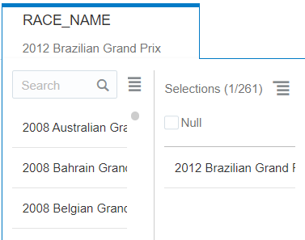

2. On the bottom left, below the datasets, right-click on "My Calculations" and then "Add Calculation".

   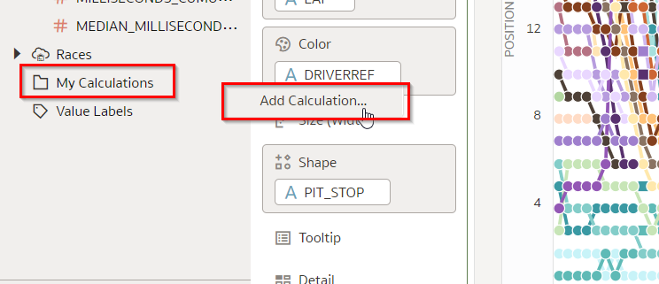

3. Calculate the delta to the ghost car as follows:

   * Drag `MEDIAN_MILLISECONDS_CUMULATIVE` (from Lap Times) to the formula box.
	 * Type the minus symbol "-" behind it.
	 * Drag `MILLISECONDS_CUMULATIVE` (from Lap Times) to the formula box (to the end of the formula).
	 * Name the calculation "Delta to Ghost Car".
	 * Press "Save"

   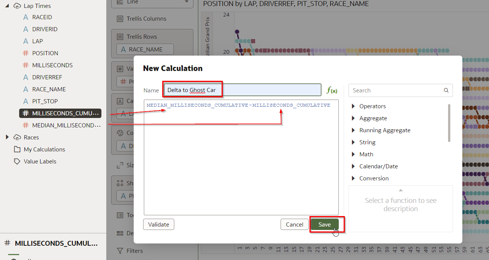

3. Now visualize the top race again, this time by showing the delta to the ghost car.    

   Select the `LAP`, `DRIVERREF` and the newly calculated field `Delta to Ghost Car` (use Control + Click to select multiple fields). Then right click on any of the fields to bring up the context menu and select "Pick Visualization". Then select the "Line" visualization type.

   

4. Make sure that the chart is configured as follows (rearrange the fields if necessary).
   - Values (Y-Axis): `Delta to Ghost Car`
   - Category (X-Axis): `LAP`
   - Color: `DRIVERREF`

	 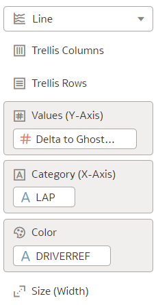

5. Inspect the resulting chart.

   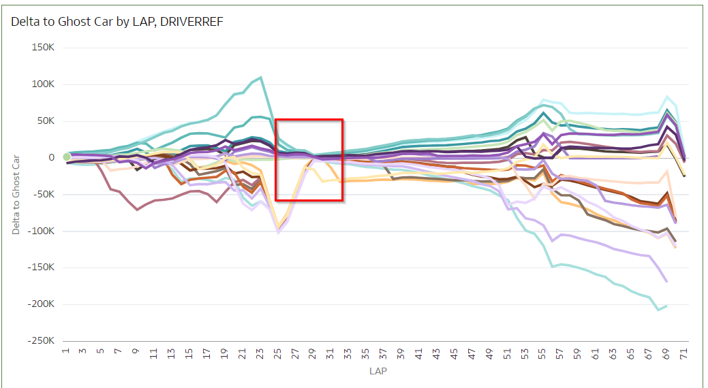

   In this chart, the horizontal axis (y=0) indicates the ghost car. Any car that's above the line is going faster than the ghost car, any car below it is going slower.

   With this new visualization we can uncover new patterns in the data! There's an event around laps 25-30 where all the cars come back close together. **What do you believe is happening here?**

6. This is likely a safety car. This wasn't visible before in the position chart.

   This makes us think: What could a safety car mean for the level of excitement of a race? A safety car effectively "resets" the race, by compressing the cars into a short distance from each other. Our theory is that in general this may add lead to a higher score.

	 Note 7: The presence of a safety car _may_ increase the score of races in general.

7. Save the workbook by clicking on the Save icon.

   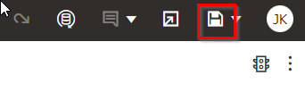

8. Finally, go back to the home page by clicking on the top left icon.

   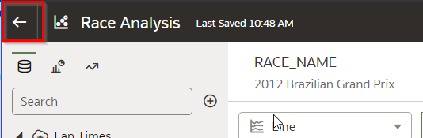

## **Task 4:** Conclusion

In the previous lab we already found several factors that influence the score that fans will give to a race. These factors were directly available to us in the `RACES` dataset.

In this lab, we've gone a step further by uncovering useful pieces of data that weren't visible at first sight. We've uncovered the following new pieces of information that can potentially be extracted from the data:
- Come back score (number of positions recovered by a driver during the race)
- Positions changes as a result of actual take overs on the track versus position changes that are a result of pit stops
- The presence of a safety car

Congratulations on completing the lab! In the next lab we'll see how we can actually extract these new pieces of information from the data sets (Features Generation). We'll also train a model and review the model's performance.

## **Acknowledgements**
- **Author** - Jeroen Kloosterman, Technology Product Strategy Director
