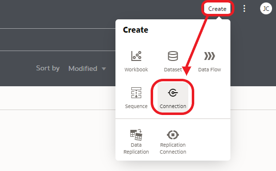

# Basic Data Exploration

<!---->

## Introduction

As described in the introduction, our goal is to identify the factors that make a great Formula 1 race. Factors can be the number of overtakes, the weather, the circuit that the race is being held, et cetera. If we can identify the factors that matter for the fan experience, then we can potentially influence those factors, and create even better races!

How will we do this? First of all, we will look for clues in the data, through visualization, to identify candidate variables. Once we have identified those candidates, we will build a Machine Learning model on them to try to predict the score that fans will give to a race.

If we can show that the score that we predict is accurate (meaning that the score we predict is close to the actual fan score), that would give us solid grounds to state that the factors that we identified are indeed the correct ones.

You have access to the following:
- Information on races (1950-2021). For example, the circuit of each race, the lap times, pit stops and the results of each race.
- A fan score per race (2008-2020) (source: racefans.net). These scores were collected from many fans and result in one aggregated average score for each race. We will treat this fan score as the **ground truth** of how "good" a race is. Note that we **don't** have fan scores for 2021.

We will go through the following phases:
- Data Exploration: Understand our data and look for clues on what makes a great race. In other words, we try to identify race variables that are potentially important for a high appreciation score by the fans.
- Feature Engineering: Extract additional variables from the races by applying data transformations. For example, we'll extract a so-called "Come back" score and "RankVersusPosition" score for each race.
- Train the Model: Train a model based on the variables that we've selected.
- Prediction: Predict the fan scores for a number of races.
- Evaluation: Verify the accuracy of the model. We'll take a visual approach to see how accurate our model is.

Estimated Lab Time: 30 minutes

### Objectives
- Identify the factors that we can influence to improve the fan experience of F1 races.
- Learn how to use Oracle Analytics Cloud to Explore Data and Prepare Data to get it ready for building a Machine Learning model.

### Prerequisites
- An Oracle Free Tier, Always Free, Paid or Live Labs Cloud Account
- Oracle Analytics Cloud
- Autonomous Data Warehouse
- You've completed the previous lab that loads the data sources into the Autonomous Data Warehouse

## **Task 1**: Create the connection from Oracle Analytics Cloud to Autonomous Database

**Oracle Analytics Cloud** will be the tool which you use to analyze your data. **Autonomous Data Warehouse** is used to store and organize the data, and to provide the Machine Learning engine.
Therefore we need to create a connection from Oracle Analytics Cloud to Autonomous Data Warehouse first. To be able to create this connection, OAC will need to use a so-called "wallet" file. The wallet file (client credentials), along with the database user ID and password, provides access to your Autonomous Database in the most secure way possible. The "wallet" file can be obtained from the database menus.

1. In Oracle Cloud, click the **Navigation Menu** in the upper left, navigate to **Oracle Database**, and select **Autonomous Data Warehouse**.

	

    You can see all the **ADW** instances that you have **created**.
    **Select** the instance `REDBULL` that we created before.

    

2. We will download the wallet file. The wallet file (client credentials), along with the database user ID and password, provides access to your Autonomous Database in the most secure way possible.

   > NOTE: Store wallet files in a secure location. Share wallet files only with authorized users.

3. On the ADW detail page,click **DB Connection**.

   

4. Click **Download Wallet** on Database Connection side-screen. Leave  the default value `Instance Wallet` as the **Wallet Type**. Finally, click **Download Wallet**.

   

5. Type the password, confirm the password by typing it again and click **Download**.

      - Password: Type the secure password
      - Confirm Password: Confirm the secure password

   

6. Click **Close**. A ZIP file will start downloading.

7. Use the Wallet in Oracle Analytics Cloud

    **Return** to the **Oracle Cloud Infrastructure console** and click on the menu icon on the left.

    Navigate to **Analytics & AI** and then **Analytics Cloud**.

    

8. **Open** the Cloud Analytics **URL** associated with your instance (we created this earlier) by using the dots menu button on the right-hand side of your instance information and selecting **Analytics Home Page**.

   > Make sure your Oracle Analytics Cloud instance is in status `Active` (not `Creating`) before you go to the **Analytics Home Page**.
   >
   > Please be patient, Analytics Cloud can sometimes take a few more minutes to provision.

   

   The **Oracle Analytics** page will open in a new browser **window/tab**.

9. On the top right-hand side of the screen, click **Create**, and then **Connection**.

    

10. Choose **Oracle Autonomous Data Warehouse**.

    

    Use the following information to configure your **connection**.

    > **Connection Name**: `REDBULL`
    >
    > **Client Credentials**: Use the Browse button to upload the **wallet zip > file** that you downloaded. It will automatically extract the `cwallet.sso` file from this zip bundle.
    >
    > **Username**: `F1`
    >
    > **Password**: Provide the secure password for the F1 user
    >
    > **Service Name**: Keep the default, the name of your database followed by the `_high` suffix.
    >

    

11. Select **Save** to save your new connection **information**.

## **Task 2:** Add the RACES dataset to Oracle Analytics Cloud

1. On the top right, choose Create and then Dataset.

   

2. Select the `REDBULL` connection.

   

3. Open the `F1` schema and **double click** on the `RACES` table.

   

   Each record in this data set represents the race of one Grand Prix.

   You see how Oracle Analytics is profiling the columns in the data set. It creates histograms that give a high level overview of the distribution of the values in the column. These histograms help you to quickly understand what data you have at your disposal as well as gauge the quality of the data (e.g. missing values).

4. Inspect the `YEAR` column

   

   Notice how the dataset contains races from the start of Formula 1 in 1950 until sometime in the season of 2021. You can also notice directly how the number of races per season has gradually increased.

5. Now scroll to the column `SCORE`

	 

   This column indicates the scores that fans have given to the race. We will use this value as the -ground truth- for the measurement of how good a race is. In other words, we want to learn to understand what factors contribute to each score.

   Notice how values are distributed between +/- 3.5 and +/- 9.5. At first sight, the scores also appear to be normal distributed (e.g. very low and very high scores occur less often).

	 Also notice that bar at the top that's about 80% red. This indicates missing data. In other words, on first sight only about 20% of the races have a score assigned. This is correct, as only the last 10 years have fan score data.

6. Configure the details of the dataset

   At the bottom of the screen, click on `RACES` to configure the details of the dataset.

   

7. Pivot the representation

   Pivot the presentation so it becomes easier to modify the column configuration.

  

8. Modify `RACEID` column

   This attribute contains a unique ID for each race.

   Right now it is classified as a `MEASURE` (visible because of the # symbol). However, we will not use this attribute to calculate, therefore we will convert this into an `ATTRIBUTE`.

   Click the header of the `RACEID` column, then click the value next to **Treat As** and change it to **Attribute**.

   

   The symbol next to the column header changes to `A`.

9. Modify the aggregation type of `SCORE` (score that fans have given to the race)

   Later on, we will want to find out the average SCORE per season. Because of this, we want to set the default aggregation of the `SCORE` field to **Average**.

   Find the `SCORE` column and click it, then change the aggregation to **Average**.

   

8. Save the data set

    Click the **Save** icon and name the data set `Races`.

    

9. Finally, go back to the homepage by clicking on the top left icon.

   

## **Task 3:** Add the LAP_TIMES dataset to Oracle Analytics Cloud

1. On the top right, choose Create and then Dataset.

  

2. Select the `REDBULL` connection.

  

3. Open the `F1` schema and **double click** on the `LAP_TIMES` table.

  

  Each record in this data set represents one lap for one driver in one race.

	For every lap, we can see for example:
	- The position of the driver in the race at that point in time
	- The time it took to complete the lap
	- The total time it took to complete all laps until then
	- Whether the driver made a pit stop during the lap

4. Configure the details of the laps dataset

   At the bottom of the screen, click on `LAP_TIMES` to configure the details of the dataset.

   

5. Pivot the representation

   Pivot the presentation so it becomes easier to modify the column configuration.

   

6. Change the "Treat As" for the columns `RACEID`, `DRIVERID` and `LAP` to "Attribute".

   

7. Save the data set

   Click the **Save** icon and give the data the name `Lap Times`.

   

8. Finally, go back to the homepage by clicking on the top left icon.

   

<!--
Let's have a first look at the data that we have available for our data challenge.

1. On the homepage, click "Data", then click the "Races" dataset to create a new visualization project.

  

2. We want to create a chart that shows the number of races per season.

  Select both the `YEAR_C` and `RACE_COUNT` columns. You can do this by clicking on `YEAR_C`, then hold Control while you click `RACE_COUNT`. Next, drag the two to the canvas.

	

  You see that the chart was automatically configured.

	

	Notice the drop in number of races in season 2020 (Covid 19).

3. Now, let's add in the race score. Drag the `SCORE` field to the small space right underneath the `RACE_COUNT` field (inside of the Values Y-Axis section).

   

4. By default the `SCORE` also shows as bars. We want to improve the readability of the chart by changing `SCORE` to a Line presentation.

  Change the visualization type to "Combo".

	

  Set the visualization type of `RACE_COUNT` back to Bar.

	

5. Now the only problem is that `SCORE` has a very different number range than `RACE_COUNT`, and therefore is hard to read. To fix this, we'll give `SCORE` its own scale.

   Click `SCORE` (in the Values Y-axis section) and select "Y2 Axis".

	

	Now you see that `RACE_COUNT` and `SCORE` have their own scale (see left and right Y-axis).

6. Inspect the chart.

   The chart helps us to understand that, although we have Formula 1 data from the very start in 1950 until now, the fan scores are only available for the last decade. And we're missing the fan scores for the races in season 2021.

   At first glance, it appears that, since the measurement of fan scores started in 2008, fans are less excited about the sport as the years progressed. At least, this is the case if we look at the yearly average, not looking at individual races.

	 Since we're missing fan scores for 2021, we cannot say whether this trend continued. However, by the completion of this workshop, you will be able to generate (predict) the scores for the races of 2021 yourself!
-->

## **Task 3:** Finding the best and worst race according to the fans

  What was the most popular race between 2008 and 2020 according to the fans? This would be interesting to find out, as that race is likely to have a lot of the key factors that fans appreciate.

1. On the homepage, click "Data", then click the "Races" dataset to create a new visualization workbook.

	  

2. We'll search for the race with the highest score first.

   Create a new visualization by selecting both `NAME_YEAR` and `SCORE` (use Control + click), then right click on one of the fields and choose "Pick Visualization".

	 

	 Then select the table icon.

3. We will create a filter to only show those races that have a score assigned to them.

   Drag `SCORE` to the filter region.

   

   Then configure the `SCORE` field to be between 0 and 10. This will remove any races that don't have scores from the active selection.

	 

	 And finally, sort the dataset on score high-to-low by clicking the Descending icon.

	 

	 You see that the race with the top score was the Brazilian Grand Prix of 2012. Therefore, this is the best race during the decade that the fan scores were collected.

4. Similarly, we'll look for the race with the lowest score.

   Sort the dataset on score low-to-high by clicking the Ascending icon.

   

   You see that the race with the lowest score according to the fans was Abu Dhabi GP of 2020.

5. Finally, save the workbook by clicking on the Save icon and name it "All Races Overview".

   

   Then go back to the homepage by clicking on the icon on the top left.

	 

## **Task 4:** Overtakes and DNFs

These two races are a great starting point for our investigation into what factors makes a great (or not so great) race.

Apparently, the Brazilian GP of 2012 had the right elements to make it interesting, whereas Abu Dhabi didn't. Since we want to find the factors that make a great race, The natural thing to do is to compare the data of these two races.

1. From the homepage, select Data and Click on the LAP_TIMES dataset.

   

2. We'll visualize this dataset to understand the story of what happened during the two races we've selected. In particular, we want to zoom in on how the drivers changed positions (compared to the other drivers) from lap to lap.

   First of all, make sure that we only see the lap information of the two Grand Prix's that we're interested in: Drag the RACE_NAME field to the Filter section. Search for the "2012 Brazilian Grand Prix" and the "2020 Abu Dhabi Grand Prix" and add them to the filter values.

   

3. Now create the visualization to show the position changes during the race.

   Select the `LAP`, `POSITION` and `DRIVERREF` (Control + click to multi-select) fields. Then right click on any of those fields and select "Pick Visualization". Choose the Line visualization.

	 

4. Separate the information of the two races into separate visualizations by dragging `RACE_NAME` to the Trellis Rows section.

   

5. Inspect the results.

   We see immediately that the high scoring race has many more position changes than the low scoring race. This suggests that the number of take overs are an important factor that influence the race score. Intuitively this also makes sense. Let's make a note of this!

	 Note 1: "The total number of position changes _may be_ a factor to predict race score"

6. Intuition tells us that the audience is interested in what happens in the top positions. So let's zoom in on the top positions of these two races.

   Drag the `POSITION` field to the Filter section and configure it to only show data for Positions 1 to 5.

   

   

7. Inspect the resulting chart.

   We can conclude that the Brazilian GP doesn't only have more take overs in general, it also has more take overs in the leading positions. Again, this confirms our intuition. It may well be that take overs -especially in the top positions- are an important factor that influence the score that fans give to a race.

	 Note 2: "The number of changes in the top positions _may be_ a factor to predict race score"

8. Let's see what else we can find in this chart.

   Remove the `POSITION` filter again.

	 

9. Now Look closely at the 2012 Brazilian GP, and specifically at the graphs for Paul Di Resta, Lewis Hamilton, Romain Grosjean and Pastor Maldonado ("resta", "hamilton", "grosjean", "maldonado").

   

   Notice how these drivers didn't finish the race. In fact, all of these drivers were involved in accidents/collisions. This raises the theory that DNFs (Did Not Finish) may increase the score that fans give to a race. Although nobody likes accidents that harm the drivers, collisions can add dynamics to a race and have surprising effects on the race outcome, as was the case in the Brazilian GP.

   Note 3: "DNFs _may be_ a factor to predict race score"

10. Now let's see what aggregated information we already have available on each of these races.

   Add the `RACES` dataset by clicking on the + icon, then choose Add Data set.

	 

   Click on the `RACES` dataset and click "Add to Workbook".

	 

11. Create a table to show all of the information that's readily available on the level of `RACES`.

   

12. Inspect the data.

   

	 Note that you can drag the visualization to another place on the canvas to create more  space to make it readable.

	 (The columns may appear in a different order in your environment)

	 Notice how we already have aggregated data available on the number of overtakes and the number of Did-Not-Finish. This means these particular metrics are basically "ready to go" to train our ML model on.

	 In addition, we see two columns that have information on the weather. In particular, notice how the Brazilian Grand Prix was held during rainy conditions, while the Abu Dhabi GP had dry conditions. Our hypothesis is that wet weather on average will make a race more spectacular, because of unpredictable events, more complicated pit stop and tyre decisions, sliding/turning cars, et cetera. Let's make another note!

	 Note 4: Wet weather _may have_ a positive influence on the score that fans give to a race.

13. Save the analysis by clicking on the Save icon. Name it "Race Analysis".

	 

14. Go back to the homepage by clicking on the top left icon.

   

## **Task 5:** Correlation diagrams for Position Changes and DNFs

How can we check whether our theories about the relationship between position changes, DNFs and score is correct? We can use smart visualizations for this, in particular correlation diagrams and box plots are well suited for this task.

1. Create a new workbook by clicking on the Races data set from the homepage.

   

2. Notice how there's already a field `OVERTAKEN_POSITIONS_TOTAL` on the `RACES` data set. This value has previously been calculated from the `LAP_TIMES` data set.

   Configure the correlation diagram using the fields `OVERTAKEN_POSITIONS_TOTAL`, `SCORE` and `NAME_YEAR` as follows.

	 Make sure you set the correct chart type (Scatter) configure the chart as shown in the screenshot.

	 By default the fields may not be in the correct sections. In that case, drag the fields to their correct sections.

   

3. Create a trend line.

   Click on the icon at the top right of the chart, then click "Add Statistics", then "Trend Line".

	 

	 We see positive correlation, which means that as the number of overtakes increase, _generally speaking_ so does the average race score. However, the points are not nicely concentrated on one line (they are sometimes far away from the trend line), which indicates that this is likely not to be the only factor that influences the fan score.

	 For now, we'll conclude that the number of overtaken positions will remain a candidate to train our model!

4. Now, let's create the same visualizations for Did-Not-Finish and Did-Not-Finish because of accidents.

   Duplicate the first visualization by right-clicking on the top of the chart, then click "Edit" and "Duplicate Visualization". **Do this twice.**

	 

5. Click on the first copy of the chart to show its configuration. Now drag the `DNF_COUNT` field over the `OVERTAKEN_POSITIONS_TOTAL` field (in Values X-Axis) to replace it.

	 

6. Click on the second copy of the chart to show its configuration. Now drag the `DNF_DUE_TO_ACCIDENT_COUNT` field over the `OVERTAKEN_POSITIONS_TOTAL` field (in Values X-Axis) to replace it.

   

7. Inspect the two correlation diagrams with `DNF_COUNT` and `DNF_DUE_TO_ACCIDENT_ACOUNT`.

   Notice that also here we have positive correlation; as the number of DNFs increase, so does the race score.

   However, the angle of the slope of the line is quite small; the score doesn't increase significantly when DNFs increase, not as much as was the case with the correlation between overtakes and fan score.

	 And also here, the points are not nicely concentrated on one line, which indicates that also the metric for DNFs are not enough on their own to predict fan score.

	 For now, we'll conclude that the DNF metrics will remain candidates to train our model!

8. Relying on interpretation of a scatter plot can be a bit subjective. Therefore, it's important to also provide _numerical_ evidence of the correlation.

   We can do this by calculating the **Pearson correlation**. This is a single number that indicates the strength of the correlation between two variables.

	 In the following we will calculate the Pearson correlation for all variables in one go by creating a matrix.

	 Select the fields `DNF_COUNT`, `DNF_DUE_TO_ACCIDENT_COUNT`, `OVERTAKEN_POSITIONS_TOTAL` and `SCORE` (use Control click to multi-select). Then right click on any of the fields to open the Context Menu and choose the Correlation Matrix icon.

	 

9. Inspect the correlation matrix.

   All variables are listed along both the vertical and the horizontal axis.

	 For each combination of two variables, the Pearson correlation is a number between -1 and 1. -1 is a perfectly negative linear correlation, 0 means no correlation and 1 a perfectly positive correlation.

   Any variable is always perfectly correlated with itself, which explain the dark green boxes through the diagonal.

	 Right now, we are only interested in the Pearson correlation of SCORE with all other variables (as marked in the screenshot).

	 Notice how `OVERTAKEN_POSITIONS_TOTAL` has the highest Pearson correlation (0.38). "Highest" in this case means that, of all variables, `OVERTAKEN_POSITIONS_TOTAL` is furthest away from 0 and closest to -1 or 1. This _may_ indicate that it is of relatively high importance to predict the SCORE.

	 In contrast, imagine we were to find no correlation between a variable and the target, then it's likely not to be of any value in predicting that target.

	 

10. Earlier on, we noticed how wet/dry weather possibly influences the score of a race. We want to investigate this further. However, we cannot use a correlation diagram in this case, since `WEATHER_WET` is not a continuous number but rather a category ('Y' or 'N').

   We can investigate the relationship between a categorical variable (such as `WEATHER_WET`) and a continuous variable (such as `SCORE`) using a Box Plot.

	 First, create some empty space to work on by clicking the + icon next to Canvas 1 (bottom of the screen).

	 

11. Now create a new Boxplot by selecting `NAME_YEAR`, `SCORE` and `WEATHER_WET` (use Control + Click to select multiple fields). Then right-click on any of the fields to bring up the context menu and click "Pick Visualization". Click the Boxplot icon.

   

12. Rearrange the chart configuration to be as follows

   > Values (Y-Axis): `SCORE`
	 >
   > Category (X-Axis): `WEATHER_WET`
	 >
   > Detail (Box): `NAME_YEAR`

   

13. Inspect the Boxplot

   How to read this type of chart? The mean of the data set is indicated by the small horizontal line within the boxes. We see that the mean fan score for races with wet weather is quite a bit higher than for races with dry weather. The top and bottom end of the boxes show where the mid 50% of the fan scores lie. We can conclude that scores of races in wet weather in general are significantly higher than races with dry weather. However, there are outliers that are quite far outside of the boxes. We see that there are dry weather races that also result in high scores. So again, the `WEATHER_WET` factor looks important, but we can safely assume that it is not the only factor that influences the score.

14. Save the workbook by clicking on the Save icon and name it "Correlations".

   

15. Finally, go back to the homepage by clicking on the top left icon.

   

## **Task 6:** Conclusion

In our Exploratory Data Analysis we tried to identify factors that are of value to predict the score that fans give to the races.

We looked at the total number of positions changes, the number of DNFs and weather (wet weather). Using correlation analysis we've confirmed that they are likely good candidates for the machine learning model.

Congratulations on completing this lab! In the next lab you will see how you can look for additional pointers in the data that are not visible at first sight. We will use visualization to uncover these hidden patterns.

<!--
Let's review our notes:
- Note 1: "The total number of position changes _may be_ a factor to predict race score"
- Note 2: "The number of changes in the top positions _may be_ a factor to predict race score"
- Note 3: "DNFs _may be_ a factor to predict race score"
- Note 4: "Wet weather _may have_ a positive influence on the score that fans give to a race.""
- Note 5: "A large come back (many positions gained) of a driver _may have_ a positive influence on the score. We don't have this metric available yet, so we will have to create it ourselves later (Feature Engineering)."
- Note 6: "Position changes due to a pit stop _may be_ less interesting for viewers than position changes on the track. We will have to transform the race data in some way to separate real overtakes from semi overtakes (during Feature Generation)."
- Note 7: "The presence of a safety car _may_ increase the score of races in general."
-->

## **Acknowledgements**
- **Author** - Jeroen Kloosterman, Technology Product Strategy Director
