# Feature Generation, Machine Learning Training, Prediction and Evaluation

<!---->

## Introduction

In this lab we will finally get to the actual Machine Learning part!

We will do the following:
- Feature Generation: in the advanced data exploration lab we identified additional data points that may be of value. However, we first have to extract those data points.
- Train the machine learning model: we will use AutoML to take most of the complexity out of training a model.
- Predict the scores: we will use a Data Flow in OAC to predict the scores for season 2020.
- Evaluate the accuracy of the model: we will take a visual approach in OAC to compare predicted scores with actual scores.
- Finally, we will draw conclusions on the entire exercise.

Estimated Lab Time: 20 minutes

### Objectives
- Learn how to generate new features from one or more data sets
- Learn how to train a model with AutoML
- Learn how to predict using a ML model and evaluate the accuracy of the predictions

### Prerequisites
- An Oracle Free Tier, Always Free, Paid or Live Labs Cloud Account
- Oracle Analytics Cloud
- Autonomous Data Warehouse
- You've completed the previous labs

## **Task 1:** Set Up The Machine Learning User

1. Open the Autonomous Data Warehouse.

   From the Oracle Console, click **Oracle Database** > **Autonomous Data Warehouse**.

   

2. Click on the `REDBULL` database that you created earlier.

   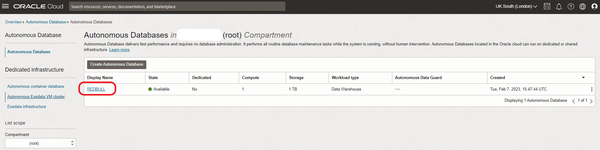

3. Open the **Service Console**.

   

4. Choose **Administration** > **Manage Oracle ML Users**.

   

   If sign-in is requested, sign in with `ADMIN` and the secure password for the admin user.

5. Check **Show All Users**, then click on the `F1` user.

   

6. Choose any email address (it's not relevant). **Don't update any of the other fields**.

   

   Press **Save**. You've now enabled the `F1` database user (schema) to use the Machine Learning functionality of Autonomous Data Warehouse.

## **Task 2:** Generate New Features

SQL is a useful language in Machine Learning process. It allows you to work with data in databases in an efficient manner. In our case, we will use it to extract new data points from the raw data that is available to us.

Learning SQL is not the objective of this workshop. Therefore we have already prepared the SQL statements that will do the data extraction for us.

We will run these SQL statements in a Notebook. A notebook is not just a convenient way to execute SQL, it also allows us to document and share the code easily.

1. **Download** the prepared notebook that contain the SQL instructions to Generate the new Features:

   <a href="https://objectstorage.eu-frankfurt-1.oraclecloud.com/p/PeMeH0b0dmnYER-OpqcMh_UWCUbBxhWQ27Sf0PcqEDs25kDKqx8aXHmp90Xbf2xw/n/fruktknlrefu/b/workshop-redbull-analytics/o/redbull-notebook.json" target="\_blank">Notebook to Generate Features</a>

   Save the file on your local machine. Make sure that the file is saved with extension `.json`.

2. In the console of the Autonomous Data Warehouse, open the **Service Console**.

   

3. Choose **Development** > **Oracle Machine Learning User Interface**.

   

4. Sign in with the user `F1` and the secure password for the F1 user.

   

5. Open the menu by pressing the hamburger icon, then open the Notebooks option.

   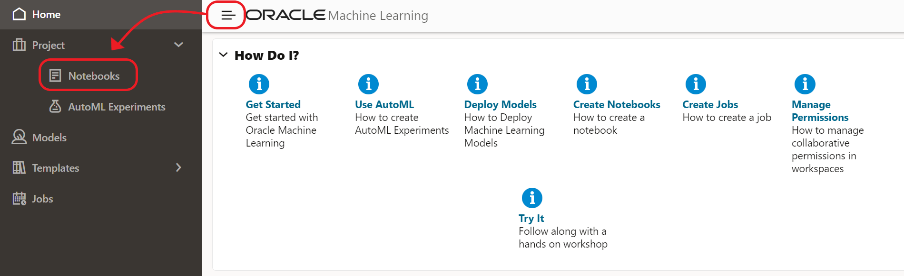

6. Start the "Import Notebook" option.

   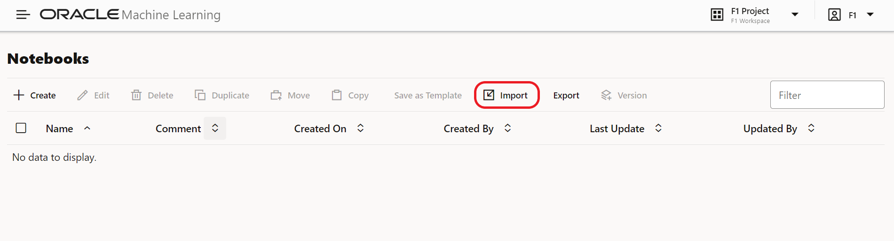

7. Then select the redbull-notebook.json file from your file system.

   You should see the message "1 out of 1 notebooks imported successfully" and the notebook "Red Bull Racing: Generate New Features" appears.

   

8. Now click on the notebook to open it.

   

9. Inspect the notebook

   

   You will find the following sections in the notebook.

   First of all, you'll find the SQL to generate the following features:
   * Calculate the number of laps that have a change of driver in the leading position.
   * Calculate the number of laps that have a change of driver in the top 5 positions.
   * Calculate the total number of overtakes in two ways: semi-overtakes due to a pit stop and actual overtakes on the track.
   * Calculate the "come back score", defined as the maximum number of positions that a driver recovers from a position in the back of the field.
   * Retrieve the number of safety cars in a race.

   Secondly, you'll find the SQL updates to actually add these features to the RACES table. In other words, the RACES dataset will be _enriched_ with the new features.

   Thirdly, you'll find the SQL to create a separate training table (RACES_TRAIN) that will be used to build the model. The RACES_TRAIN table will hold the years _until 2019_. Later, we will use the races of 2020 later to test our model.

10. Run the notebook

    Go back to the top of the notebook and press the Run icon. Then confirm that you want to run the entire notebook.

    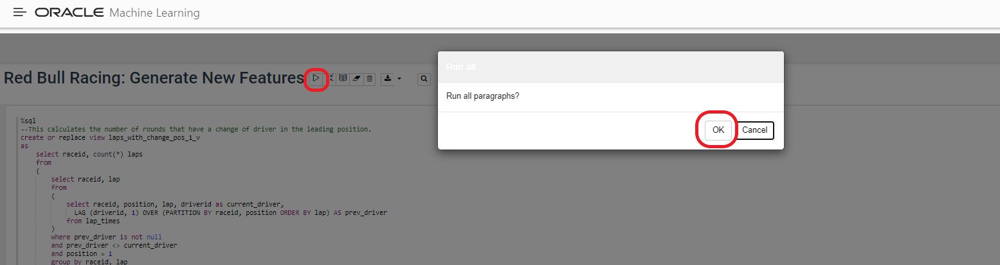

11. Running the notebook may take several minutes.

    You can follow the progress as the paragraphs are run one by one.

    To check that everything has run successfully, go to the last paragraph, and check that you see a message such as the following "Took X secs. Last updated...". If all is well, **it should show the current date**.

    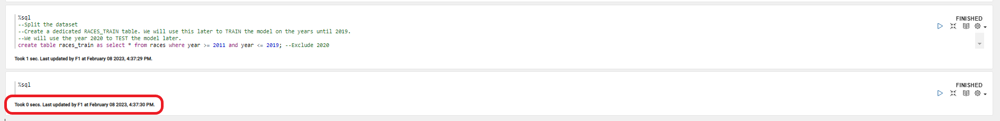

## **Task 3:** Train the model using AutoML

Now we're ready to train the ML model.

1. Open AutoML by clicking on the top left icon, then "AutoML".

   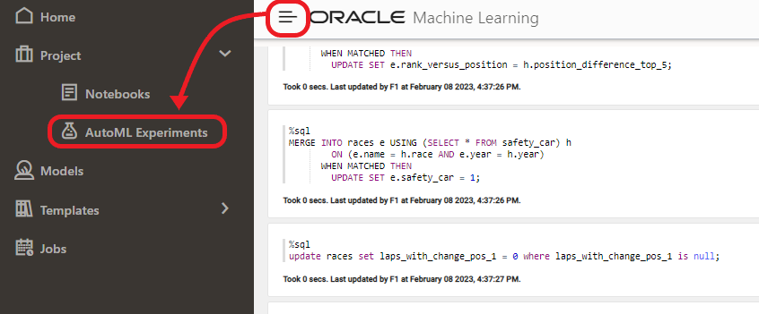

2. Click "Create".

   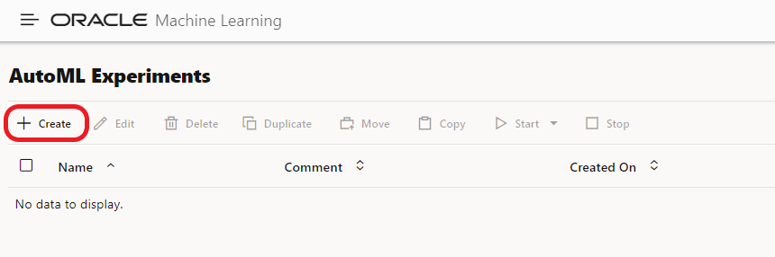

3. Now we configure how to train our model.

   We want to predict the `SCORE` of a race from all the variables that we've previously studied during the Basic/Advanced Data Exploration phases.

   Set the configuration parameters as follows:

   Name: Predict race score

   Data Source: `F1.RACES_TRAIN` (choose the `F1` schema and the `RACES_TRAIN` table from the popup window). Remember that this table holds the races until the end of 2019.

   Predict: `SCORE`

   Case ID: `RACEID`

   

4. Open the "Additional Settings" section, and select "Negative Mean Absolute Error". This is a measurement of how close the predicted values are to the actual values. The training process will try to minimize this value.

   

5. Configure the input variables.

   `CIRCUITREF`: checked

   `DNF_COUNT`: checked

   `DNF_DUE_TO_ACCIDENT_COUNT`: checked

   `LAPS_WITH_CHANGE_POS_1`: checked

   `LAPS_WITH_CHANGE_POS_1_5`: checked

   `MAX_COMEBACKSCORE`: checked

   `OVERTAKEN_POSITION_DUE_TO_PITSTOP`: checked

   `OVERTAKEN_POSITION_REAL_TOTAL`: checked

   `RANK_VERSUS_POSITION`: checked

   `SAFETY_CAR`: checked

   `WEATHER_WET`: checked

   

   **Please take care in selecting exactly these columns (and no others), as this will affect the outcome of the training process.**

6. Save the AutoML experiment configuration.

   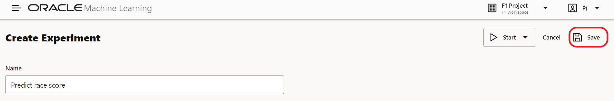

7. Now start the training of the model.

   On the top right choose **Start > Faster Results**.

   

8. Use the three small dots to open the window with progress of the training process (in case it is not yet open).

   This will allow you to follow the progress of the training process in detail.

   

9. The training will take several minutes. During this time, AutoML tries out several different ML algorithms, with different configurations.

   We will use the **Generalized Linear Model**.

   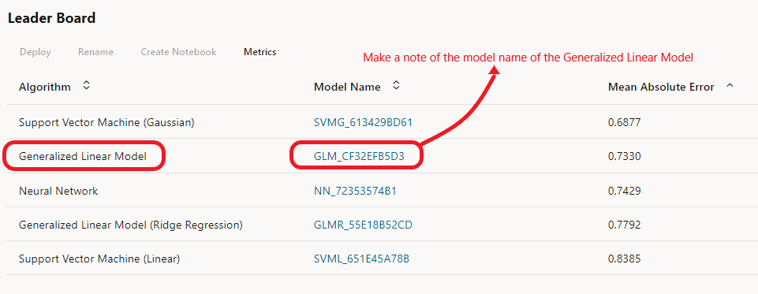

   The value under Negative Mean Absolute Error is an indicator of the accuracy of the model.

   The exact values and order of the models may be slightly different on your environment due to randomness in the process. However, if the difference is significant (e.g. > 10%), it is likely that you have done something different along the way. For example, training on different columns would result in a significantly different NMAE.

   These models have now been created in the database.

   **IMPORTANT: Make a note of the exact model name, including the number. You will need this later.**

## **Task 4:** Add the generated features to the Races data set in Oracle Analytics Cloud

1. In case you don't have a window with Oracle Analytics Cloud open, you can open it as follows:

    From the **Oracle Cloud Infrastructure console** and click on the menu icon on the left.

    Navigate to **Analytics & AI** and then **Analytics Cloud**.

    

2. **Open** the Cloud Analytics **URL** associated with your instance (we created this earlier) by using the dots menu button on the right-hand side of your instance information and selecting **Analytics Home Page**.

    

    The **Oracle Analytics** page will open in a new browser **window/tab**.

3. Now we have to make the newly generated features (columns) from the RACES table visible to Oracle Analytics Cloud.

   Click **Data**, then the small icon on the bottom-right of the `RACES` data set, and then "Open".

   

4. Click on "Edit Definition" on the top near to the right of the screen.

   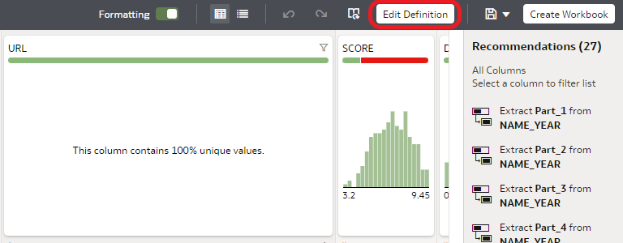

5. When we ran the notebook, we created several new fields in the database table RACES (LAPS\_WITH\_CHANGE\_POS\_1, LAPS\_WITH\_CHANGE\_POS\_1\_5, OVERTAKEN\_POSITIONS\_DUE\_TO\_PITSTOP\_TOTAL, OVERTAKEN\_POSITIONS\REAL\_TOTAL, MAX\_COMEBACKSCORE, RANK\_VERSUS\_POSITION and SAFETY\_CAR).

   Click "Add All" to also add these newly columns in the data set in Oracle Analytics Cloud.

   

6. Press "OK".

   

7. Press "Save" to apply the changes.

   

8. Go back to the home page.

   

## **Task 5:** Import the trained model into Oracle Analytics Cloud

Now we need to make the Machine Learning model that we built in the database available to Oracle Analytics Cloud.

1. From the home page, click the ribbon on the top right, then Register ML Model. Then select the REDBULL connection.

   

2. Select the database connection.

   

3. Now select the model starting with GLM. Check your notes and verify it has the same name that you created earlier.

   Then press Register.

   

## **Task 6:** Predict the scores for 2020 in Oracle Analytics Cloud

Now it's time to predict the race score on our _test_ data set: 2020. We can do this with Data Flows. Data Flows let us create a series of steps in which we can manipulate data, or, in this case, apply a ML model to data.

1. Create a new Data Flow by clicking on Create in the top right, then "Data Flow".

   

2. Click the RACES data set, then click "Add".

   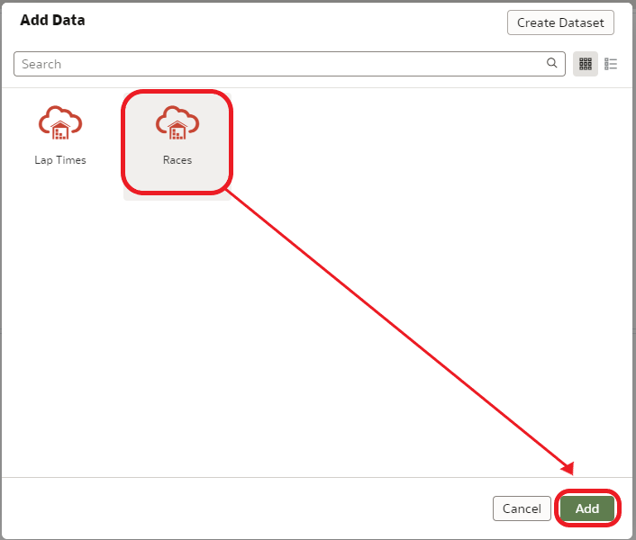

3. Drag a "Filter" operation to the "+" icon right next to the "Races" data set.

   Then add a filter on "YEAR" and configure it to select data from 2020 only.

   

3. Drag a "Apply Model" operation to the "+" icon right next to the Filter operation.

   Click on the model that you registered earlier, then "OK".

   

   If all is well, no further action will be needed as all the columns in the dataset (2020) automatically match up with the input parameters of the model.

   Notice how a new column "Prediction" will be created which will hold the predicted score.

   

4. Drag a "Select Columns" operation to the "+" icon right next to the "Apply Model" operation.

   Configure the "Select Columns" operation by only selecting these columns:

   > `RACEID`: Unique identifier of the race
   >
   > `NAME_YEAR`: Name and year of the race
   >
   > `SCORE`: _Actual_ score as given by the fans to the race (ground truth)
   >
   > `Prediction`: _Predicted_ score that will be generated by the ML model

   

5. Drag a "Save Data" operation to the "+" icon right next to the "Select Columns" operation.

   Configure the "Save Data" operation as follows:

   Dataset: `Predicted scores`

   Table: `PREDICTED_SCORES` (this is displayed at the bottom of the screen, don't confuse this with "Dataset Table")

   Verify that the "Treat As" value for each column is set as in the screenshot (adapt if necessary):

   Verify that the "Default Aggregation" for SCORE and Prediction is as in the screenshot (adapt if necessary):

   

   Don't worry about the warning message, this should disappear once you save the data flow.

6. Save the Data Flow by clicking on the Save icon, then type `Predict Score DF` as the name and press "OK".

   

7. Keep in mind that at this point we have only _created_ the Data Flow. We have not _run_ it yet!

   To run the Data Flow, press the indicated icon at the top.

   

   After a few moment (usually less than 1 minute), you should see the message _Data Flow "Predict score DF" complete_.

8. Go back to the home page by clicking on the top-left icon.

   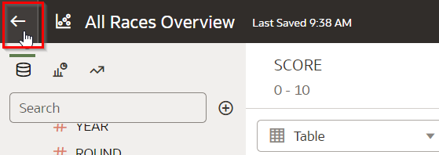

## **Task 7:** Evaluate the accuracy of the model in Oracle Analytics Cloud

1. On the homepage, click "Data", then click the "Predicted Scores" dataset to create a new visualization workbook.

   

2. Select all fields (use control + click to select multiple fields). Then right-click on any of the fields to bring up the context menu and click "Pick Visualization". Then choose the Line visualization.

   

3. Reconfigure the chart setup as follows:

   - Values Y-Axis, first field: `SCORE`
   - Values Y-Axis, second field: `Prediction`
   - Values X-Axis, first field: `RACEID`
   - Values X-Axis, second field: `NAME_YEAR`

   

4. Inspect the chart.

   Notice how the predicted scores follow the actual scores nicely.

   

5. Finally, save the chart and call it "Check prediction accuracy".

   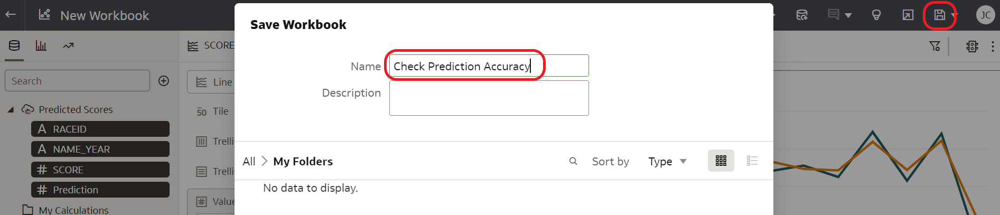

## **Task 8:** Bonus exercise: Calculate the difference between predicted and actual scores

1. Calculate the distance between the predicted and the actual scores.

   Right click on "My Calculations", then click "Add Calculation".

   Create the formula `ABS(Prediction-SCORE)`. Remember that you can type in the formula field as well as drag over fields.

   Name the new field `Distance` and press "Save".

   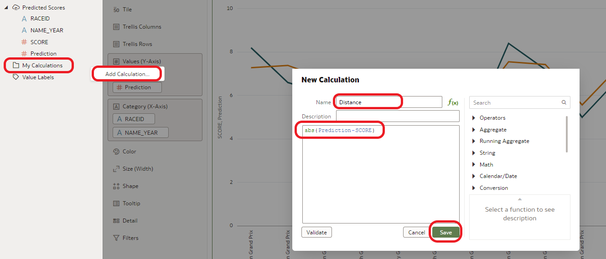

2. Drag the new `Distance` field to just below `Prediction` in the "Values Y-Axis" section.

   

3. Change the presentation of this variable by right-clicking on it and selecting "Bar".

   

4. Inspect the chart.

   Note that the predicted score follows the actual score in general. This is a pretty good first result!
   As a point of improvement, notice how on the races with lower actual scores, the predicted score tends to be a bit too high.

   

## **Task 9:** Bonus exercise: Predict the scores for the 2021 season

In 2021, Formula 1 appears to be very exciting. At least judging by how close Hamilton and Verstappen are during the year. The final race was also a very close call for Red Bull. Now the question is: does our model "agree"? Will the predictions of the model indicate that 2021 was an exciting year for Formula 1?

1. Adapt the data flow to predict the scores for 2021

Your challenge is to predict the score values for 2021 and plot the predicted scores. This means that you will have to adapt the Data Flow to predict until for YEAR 2021 (instead of 2020). We will not give detailed instructions here. Review the rest of the lab if you need hints on how to do this.

2. If all is well, you should be able to produce the chart below:

   

3. Conclusion

   This showed that indeed there have been some very high scoring races throughout the year. For example, the Hungarian and Bahrain races were very interesting for the fans, according to our model.

**So what do you think? Do the predicted scores reflect the actual level of excitement of 2021?**

## **Task 10:** Conclusions and next steps

We have identified a number of factors that were successfully used to predict the score that fans will give to a race.

What this tells us is that these factors are indeed important for the experience of the fans. As a next step, we could look closely at how we could improve these factors. Here are some starting points of what could be investigated:
- Takeovers: We found that take overs are an important factor for the race score. What could we do to improve takeover probability, especially in the top positions?
- Weather: It appears that wet weather adds to the excitement of the races. Maybe we could consider not cancelling a race because of weather conditions?
- Safety car: We found that the appearance of a safety car adds to the average score as well. We could consider to lower the criteria in which a safety car is deployed.

Congratulations on completing the workshop! Now you've learned the basics of machine learning, hopefully you are inspired to apply it to many more challenges!

## **Acknowledgements**
- **Author** - Jeroen Kloosterman, Technology Product Strategy Director
