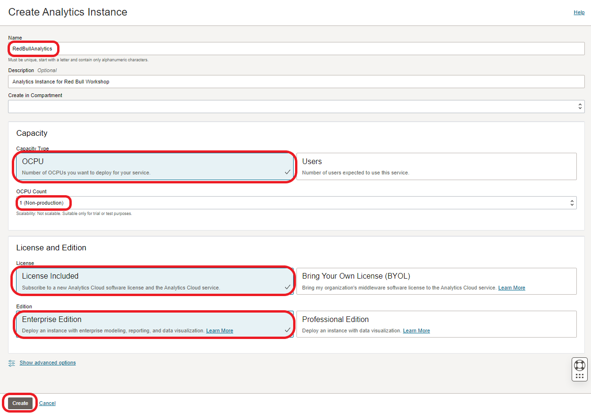

# Provision Analytics Cloud

<!---->

## Introduction

During this lab you will deploy an Oracle Analytics Cloud instance on Oracle Cloud Infrastructure.

Estimated Lab Time: 15 minutes (provisioning time may vary)

### Objectives
In this lab, you will:
- Login as a federated user.
- Create an Oracle Analytics Cloud Instance.

### Prerequisites
- Oracle Free Trial Account.

## **Task 1:** Create an Oracle Analytics Cloud (OAC) Instance

1. Return to the Home Page and go to the **Menu** > **Analytics & AI** > **Analytics Cloud**.

   

2. Make sure you select the `root` compartment (unless you have permissions and experience selecting a different one) and click **Create Instance**.

   

3. Fill the web form with the following information and click **Create**:
  
   - **Name**: `RedBullAnalytics`
   - **Description**: `Analytics Instance for Red Bull Workshop`
   - **Compartment**: `root` compartment, unless you have permissions and experience selecting a different one.
   - **Capacity**: `OCPU`
   - **OCPU Count**: `1 (Non-Procuction)`
   - **License**: `License Included`
   - **Edition**: `Enterprise Edition`
   

   

   Your Analytics Instance will start provisioning.

   

   > NOTE: Provisioning an Oracle Analytics Cloud instance can take from 10 (most likely) to 40 minutes.

   We will get back to your Oracle Analytics Cloud instance later in the workshop.

## **Acknowledgements**

- **Author** - Jeroen Kloosterman, Technology Product Strategy Director
- **Author** - Victor Martin, Technology Product Strategy Manager
- **Contributor** - Priscila Iruela
