# Load Data into Autonomous Data Warehouse

<!---->

## Introduction
In this lab you will load the Grand Prix data into the Autonomous Data Warehouse. After this lab we will be ready to start analyzing the data.

We will:
1. Login in the Database Actions section as the ADMIN user. We will run a script here that a) creates the F1 user and b) creates a set of **empty** tables in the F1 schema.
2. Log out and then login again in the Database Actions, now as the new F1 user.
3. Load the data into the tables as the F1 user.

Estimated Lab Time: 10 minutes

### Objectives
- Learn how to load data into the data warehouse, so you can analyze it later.

### Prerequisites
To complete this lab, you need to have the following:
- A provisioned Autonomous Data Warehouse
- You're logged into your Oracle Cloud Account

## **Task 1**: Create a New Database User/Schema in Autonomous Data Warehouse

This new user/schema will hold the Grand Prix data.

1. Go to **Menu** > **Oracle Database** > **Autonomous Data Warehouse**.

   

2. Click on the **REDBULL** database that you created earlier.

   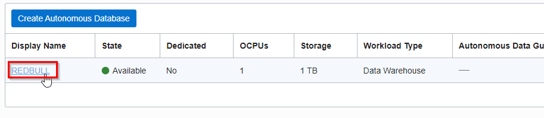

3. Click **Database Actions**.

   (if your Autonomous Data Warehouse was created earlier, you can find the Database Actions under "Tools")

   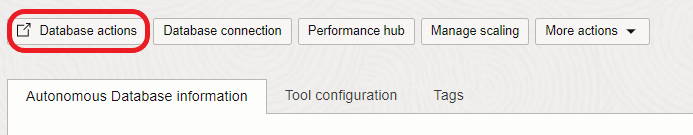

   If asked, login with user **ADMIN** and the secure password (you specified this upon creation of the Autonomous Data Warehouse earlier).

4. Click the **SQL** tile under **Development** section.

    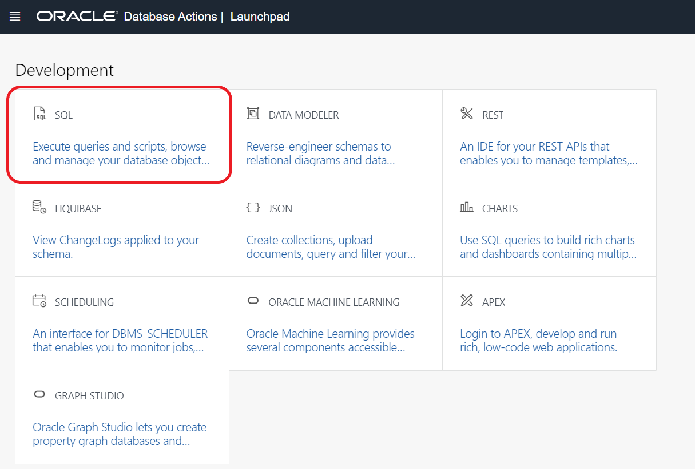

5. **Download** <a href="https://objectstorage.eu-frankfurt-1.oraclecloud.com/p/cEbDpmx0Imy3-L8SYZK4BQNnVLGVhkN_iJyQyjGc2So4qNse69_dSB513EzX_Hzu/n/fruktknlrefu/b/workshop-redbull-analytics/o/redbull-create-user.sql" target="\_blank">`redbull-create-user.sql`</a>. Save the file on your local machine. Make sure that the file is saved with extension `.sql`.

6. Open the `redbull-create-user.sql` file with a text editor and copy-and-paste all of its contents into the database actions worksheet area. This file will create a new user "F1" for us.

    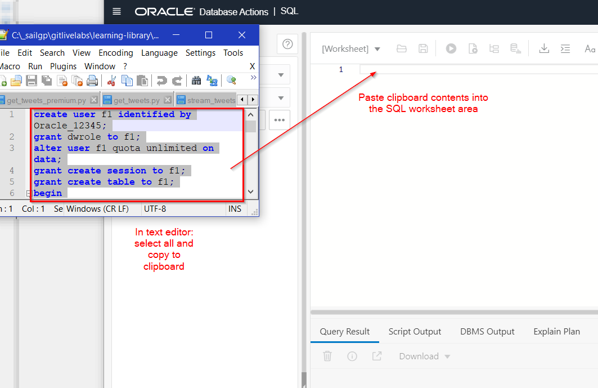

7. Click the **run-script** button (**NOT** the Run button). Then verify the output in the **Script Output** tab. The last lines in the output should indicate that the script has run successfully.

    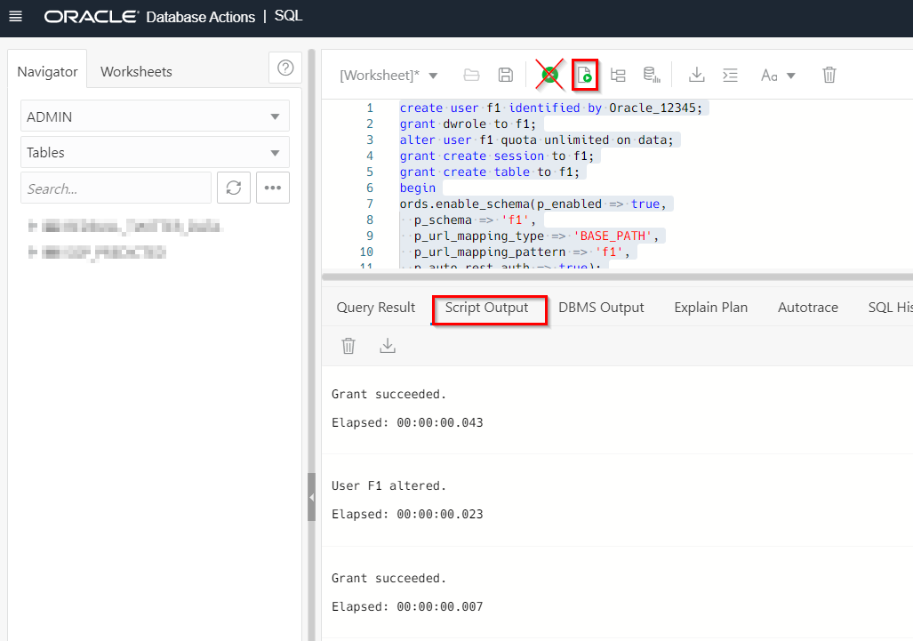

## **Task 2**: Upload the Grand Prix data to Autonomous Data Warehouse

1. **Download** the 6 files that contain the data that we'll use in our analysis:

   <a href="https://objectstorage.eu-frankfurt-1.oraclecloud.com/p/dx3YybE7Ax5bQWGnbnO-ke42vjb4s9qnaHPoEFPNmDwp5u-nMf-lDTWWfhUmrkNK/n/fruktknlrefu/b/workshop-redbull-analytics/o/RACES.csv" target="\_blank">Races data</a>

   <a href="https://objectstorage.eu-frankfurt-1.oraclecloud.com/p/M8g8i7K4yo6DSiv9mXN_jVtLIJZSGB4lmEhYZ0mfX9DuwJKAGMafM8XGzw5kIKXn/n/fruktknlrefu/b/workshop-redbull-analytics/o/LAP_TIMES.csv" target="\_blank">Lap Times data</a>

   <a href="https://objectstorage.eu-frankfurt-1.oraclecloud.com/p/PlYaI3Fp8SLzYwA_31L2Zj5_3aam_YbMRoIk4C1FEvhgqruQfa76pFyZwM4l2lyx/n/fruktknlrefu/b/workshop-redbull-analytics/o/SAFETY_CAR.csv" target="\_blank">Safety Car data</a>

   <a href="https://objectstorage.eu-frankfurt-1.oraclecloud.com/p/OIUA5aX1tAkmoWpDty8VzBlKxm_TJDY8Sm12K2BbG1palHy5dnXPkfbNB2m0ZVDU/n/fruktknlrefu/b/workshop-redbull-analytics/o/PIT_STOPS.csv" target="\_blank">Pit Stop data</a>

   <a href="https://objectstorage.eu-frankfurt-1.oraclecloud.com/p/5ijlW0pUZ2yr4wbs_NICe73AemtiCl_iI2fTKr85-vDkirQZs1MAwhpzYIH_w1dZ/n/fruktknlrefu/b/workshop-redbull-analytics/o/RESULTS.csv" target="\_blank">Race Results data</a>

   <a href="https://objectstorage.eu-frankfurt-1.oraclecloud.com/p/LC9WxthFNE_v46C40Wccor1Z9Qw1toNRagnqb4jPMhh3IVk0PbLSN1si5k5sphUk/n/fruktknlrefu/b/workshop-redbull-analytics/o/DRIVER_STANDINGS.csv" target="\_blank">Driver Ranking data</a>

   Save the files on your local machine. **Make sure that the files are saved with extension `.csv`**

2. **Important**: Make sure that you **change to the "F1" user**. Note that you created this "F1" user earlier (when you ran the create_user.sql script).

   Log out from the Data Actions (currently showing "ADMIN").

   

   Now log in to Data Actions again using the following:

   - Username: F1
   - Password: Provide the secure password for the F1 user

3. Click to the **Data Load** option, under the **Data Tools** section.

   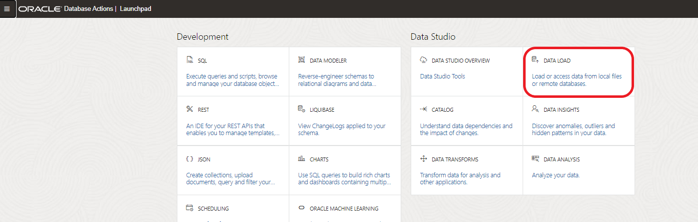

4. Choose **Load Data** to answer the first question and **Local Files** to answer the second one. Click **Next**.

    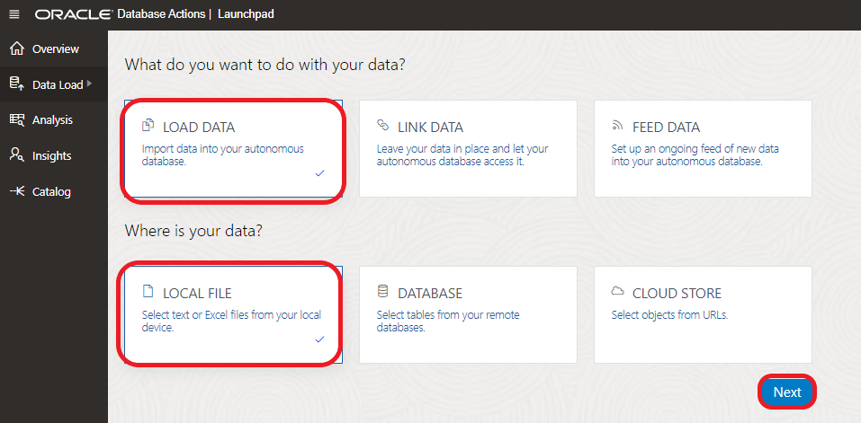

5. Select the files that you downloaded earlier (6 in total).

    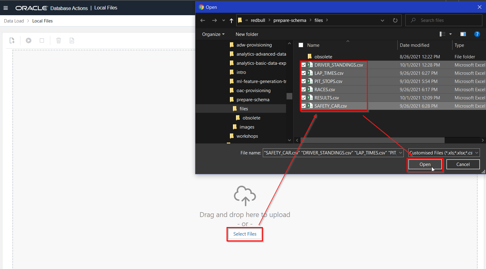

6. Edit the configuration of each of the data sets by changing the load option into "Insert into table". We are doing this because we already created the empty tables earlier, and we want to add the data into those existing tables.

  We are showing the instructions for SAFETY_CAR. **Please make sure that you do this for all data sets.**

   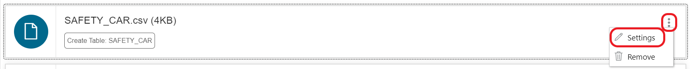

   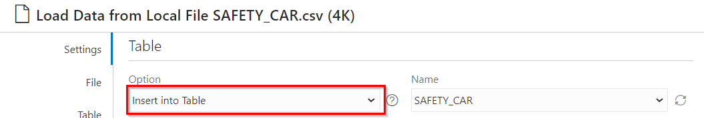

   Press "Close" after you've changed the option for each file.

7. After you have changed the load option of **all** files, click the **Play** button to start the process and click **Run** on the **Run Data Load Job** verification window.

    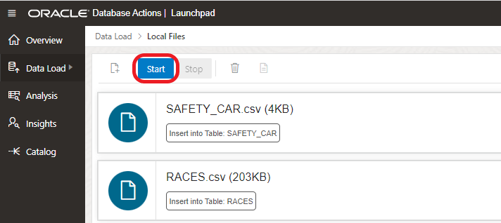

8. This process takes a few minutes. You should see  green ticks next to all data load jobs.

    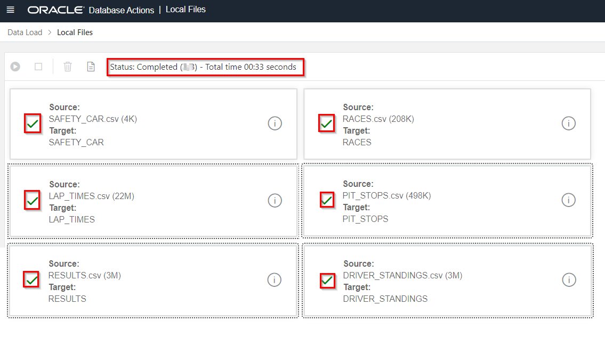

Congratulations! You've successfully loaded the data into Autonomous Data Warehouse.

You can now proceed to the next lab.

## **Acknowledgements**

- **Author** - Jeroen Kloosterman, Technology Product Strategy Director
