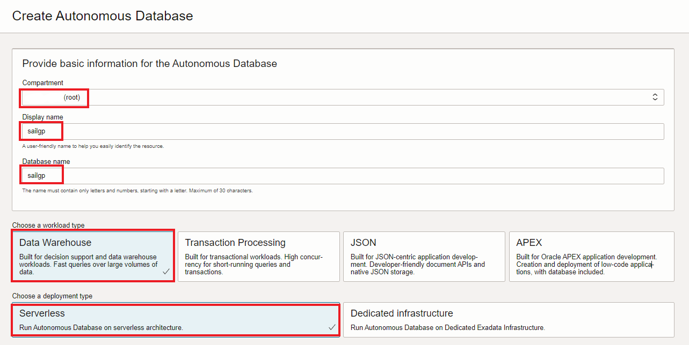

# Provision  Autonomous Data Warehouse

## Introduction

In this lab, you will get started with the Oracle Autonomous Database on Oracle Cloud. There are two types of workloads:

- Autonomous Data Warehouse (ADW)
- Autonomous Transaction Processing (ATP)

You will provision a new Autonomous Data Warehouse (ADW) instance.

> **Note:** While this lab uses ADW, the tasks are identical for creating an ATP database.

_Estimated Time:_ 5 minutes

### Objectives

In this lab, you will:

-   Learn how to provision a new Autonomous Database

### Prerequisites

This lab assumes you have:

- Logged into your Oracle Cloud Account

## Task 1: Provision ADW

1. Go to **Menu** > **Oracle Database** > **Autonomous Data Warehouse**.

   

2. Click **Create Autonomous Database**.

   

3. Fill the first part of the provisioning form with the following values.

   

      - Compartment: `root` (You can select the root compartment, if not already selected)
      - Display name: `sailgp`
      - Database name: `sailgp`
      - Choose a workload type: `Data Warehouse`
      - Choose a deployment type: `Shared Infrastructure`

4. In the part named "Configure the database", keep all the default values.

5. Fill the administrator credentials as follows:

      - Password: `Oracle_12345`
      - Confirm password: `Oracle_12345`

6. Keep the default values for Network Access

7. In Choosee license and Oracle Database edition
 
   - Choose "License included".

8. Click **Create Autonomous Database**.

   We will see the new ADW Database provisioning. Wait for the icon to change from:

   

   To `ACTIVE` state:

   

9. Your Autonomous Data Warehouse is ready to use.

You may now *proceed to the next lab*.

## **Acknowledgements**

- **Author** - Jeroen Kloosterman (Technology Product Strategy Director), Victor Martin (Technology Product Strategy Manager)
- **Contributors** - Priscila Iruela, Arabella Yao
