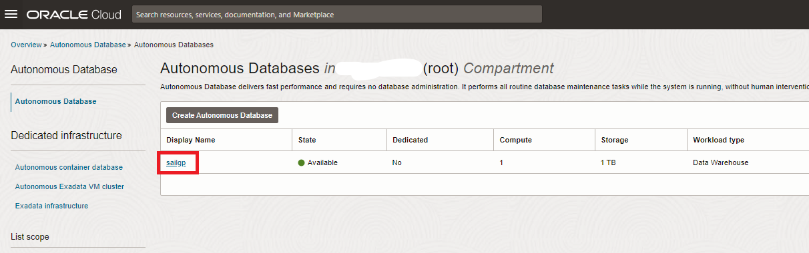
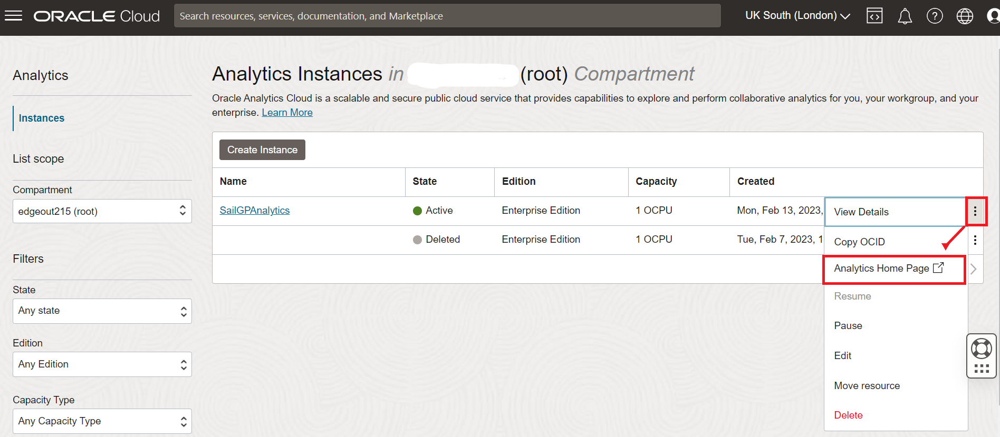
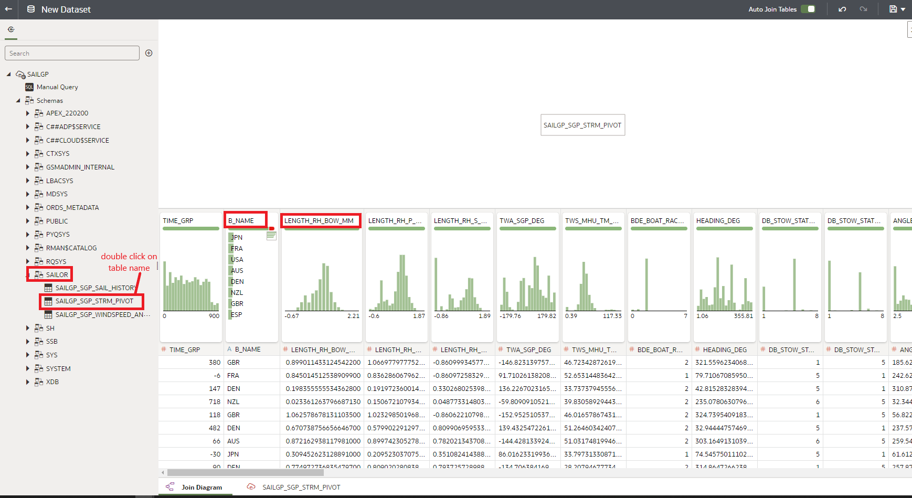
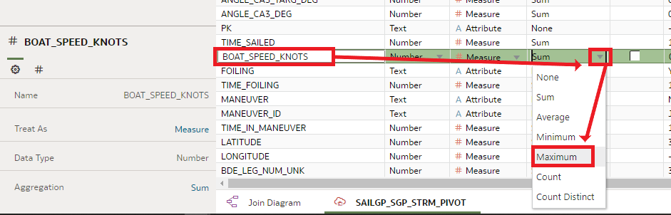
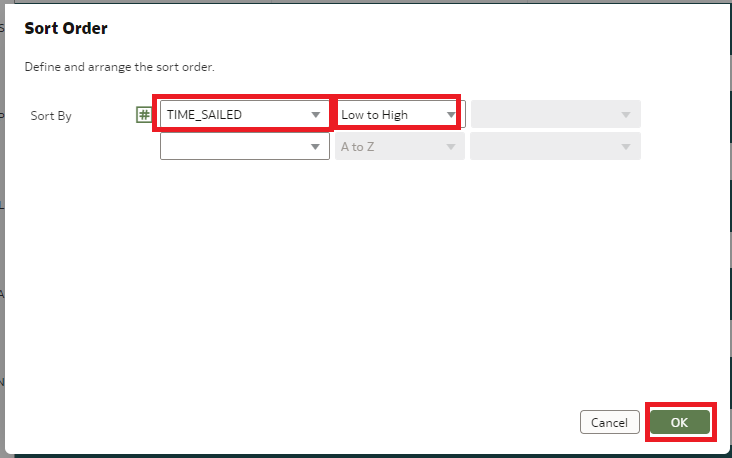
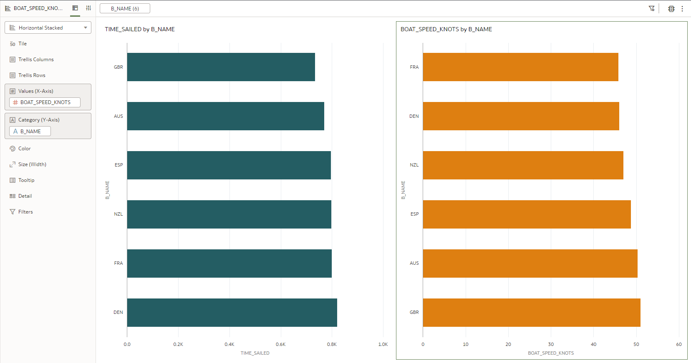

# SailGP Data Analysis

## Introduction

In this lab, you will get a taste of what it is to be a Data Athlete for SailGP! One of their jobs is to do a post-race analysis. The goal of such an analysis is to find out why one boat finishes before the other one. You'll do this by looking for clues in the data and calculate various performance metrics. The final goal of this is to help the sailing teams to perform better in the upcoming race!

In this lab we'll start with some basic statistics such as the time that it takes each team to finish the race, the maximum speed that the teams achieve and the amount of time that they are able to foil (let the boat rise out of the water).

The tool that will make this possible is **Oracle Analytics Cloud** (OAC), which will work on data that's stored and processed by **Oracle Autonomous Data Warehouse** (ADW).

<!--
[](youtube:Sf5MkI9pTn0)
-->

_Estimated Time:_ 15 minutes


### Objectives
In this lab, you will:

- Learn how a SailGP Data Athlete extracts valuable insights from sensor data
- Learn how to use Oracle Analytics Cloud to prepare and analyze data

### Prerequisites
This lab assumes you have:
- An Oracle Free Tier, Always Free, Paid or Live Labs Cloud Account
- Provisioned Oracle Analytics Cloud
- Provisioned Autonomous Data Warehouse

## Task 1: Create the Connection from Oracle Analytics Cloud to Autonomous Database

**Oracle Analytics Cloud** will be the tool which you use to analyze your data. **Autonomous Data Warehouse** is used to store and organize the data.
Therefore we need to create a connection from Oracle Analytics Cloud to Autonomous Data Warehouse first. To be able to create this connection, OAC will need to use a so-called "wallet" file. The wallet file (client credentials), along with the database user ID and password, provides access to your Autonomous Database in the most secure way possible. The "wallet" file can be obtained from the database menus.

1. In Oracle Cloud, click the **Navigation Menu** in the upper left, navigate to **Oracle Database**, and select **Autonomous Data Warehouse**.

	

   You can see all the **ADW** instances that you have **created**.
   **Select** the instance `SAILGP` that we created before.

   

2. We will download the wallet file. The wallet file (client credentials), along with the database user ID and password, provides access to your Autonomous Database in the most secure way possible.

   > **Note:** Store wallet files in a secure location. Share wallet files only with authorized users.

3. On the ADW detail page,click **Database Connection**.

   

4. Click **Download Wallet** on Database Connection side-screen. Leave  the default value `Instance Wallet` as the **Wallet Type**. Finally, click **Download Wallet**.

   

5. Type the password, confirm the password by typing it again and click **Download**.

      - Password: `Oracle_12345`
      - Confirm Password: `Oracle_12345`

   

  A `ZIP` file will start downloading to your local machine.

6. Use the Wallet in Oracle Analytics Cloud

   **Return** to the **Oracle Cloud Infrastructure console** and click on the menu icon on the left.

   Navigate to **Analytics & AI** and then **Analytics Cloud**.

   

7. **Open** the Cloud Analytics **URL** associated with your instance (the one that we created in Lab 2) by using the dots menu button on the right-hand side of your instance information and selecting **Analytics Home Page**.

   Make sure your Oracle Analytics Cloud instance is in status `Active` (not `Creating`) before you go to **Analytics Home Page**.

   Be patient, Analytics Cloud sometimes can take few more minutes to provision.

   

   The **Oracle Analytics** page will open in a new browser **window/tab**.

8. On the top right-hand side of the screen, click **Create**, and then **Connection**.

   

9. Choose **Oracle Autonomous Data Warehouse**.

   

   Use the following information to configure your **connection**.

    - Connection Name: `SAILGP`
    - Description: Can stay empty
    - Encryption Type: Keep default value
    - Client Credentials: Use the Browse button to upload the **wallet ZIP file** that you downloaded (it will automatically extract the `cwallet.sso` file from this zip bundle)
    - Username: `sailor`
    - Password: `Oracle_12345`
    - Service Name: Keep the default, the name of your database followed by the `_high` suffix

    

10. Select **Save** to save your new connection **information**.

## Task 2: Add the Dataset to Oracle Analytics Cloud

We're going to take a deep dive on the SailGP regatta that took place in Bermuda in April 2021. In particular, we are going to have a look at race 4 (out of 7 in total). We're going to do a post race analysis with the goal of helping the teams perform better in the upcoming race.

Earlier, we uploaded the data of this race to Autonomous Data Warehouse. Now, we have to make this available to Oracle Analytics Cloud.

1. On the top right, choose **Create** and then **Data Set**.

   

2. Select the `SAILGP` connection.

   

3. Open the `SAILOR` schema and **double click** on the `SGP_STRM_PIVOT` table.

   

   Each record in this data set represents one second of the race for one particular team.
   At each second of the race, we can see the values of many of the sensors of the boat of each team.

   You see how Oracle Analytics is profiling the columns in the data set. It creates histograms and other charts of each of the columns to quickly give you insight into what value there is in them. For example, have a look at column `B_NAME`. This shows you that there are 8 countries that are competing (column `B_NAME`). And have a look at `LENGTH_RH_BOW_MM`, Which shows you how far the boat lifts out of the water, the values appear to hover between 0 and 1.5m above the water.

   These graphs are a great way to quickly get an understanding of your data.

4. Configure the details of the dataset

   Now at the bottom of the screen, click on `SGP_STRM_PIVOT` to configure the details of the dataset.

   

5. Modify `TIME_GRP` column

   This attribute contains the time in the race, in seconds. For example, -30 indicates 30 seconds before the start of the race. Value 0 indicates the start of the race, etc.

   Right now it is classified as a `MEASURE` (visible because of the # symbol). However, we will not use this attribute to calculate, therefore we will convert this into an `ATTRIBUTE`.

   Click the header of the `TIME_GRP` column, then click the value next to **Treat As** and change it to **Attribute**.

   

   The symbol next to the column header changes to `A`.

6. **Pivot** the representation

   Pivot the presentation so it becomes easier to modify the column configuration.

   

7. Modify the **Aggregation** type of `BOAT_SPEED_KNOTS` (boat speed in knots)

   Later on, we will want to obtain the Maximum Boat Speed for each team. Because of this, we want to set the default aggregation of the `BOAT_SPEED_KNOTS` field to **Maximum**.

   Find the `BOAT_SPEED_KNOTS` column and click it, then change the aggregation to **Maximum**.

   

<!--
8. Modify the aggregation type of TWS_MHU_TM_KM_H_1 (wind speed)

   Similarly, later on we'll want to obtain the Average Wind Speed.
   Because of this, we want to set the default aggregation of the TWS_MHU_TM_KM_H_1 (wind speed) to "Average".

   Find the TWS_MHU_TM_KM_H_1 column and click it, then change the aggregation to "Average".

   
-->

8. Save the data set

   Finally, click the **Save** icon and give the data set a logical name, e.g. **Race Data**.

   

## Task 3: Find out Who the Winners of the Race Are

1. Still in the data set editor, on the top right, click **Create Workbook**.

   

   Now you have prepared your data, you are ready to start creating some visualizations and finally get some insights!

	Now you are in the Visualization area!

	> **Note:** As a general note, keep in mind that you can use the Undo/Redo buttons at the top right of the screen if you make any mistake in this section.

   

2. Create a chart with race winners

   Let's start with our first visualization challenge: Find out who took the least time to go from start to finish by creating a chart on `B_NAME` (team name) and `TIME_SAILED` (the number of seconds they were sailing).

   Drag `B_NAME` to the canvas.

   

   Find the `TIME_SAILED` column and drag it to the canvas as well.

   

   The result should look like this. You have a simple table with the time that each team took to complete the race.

3. Let's make this a bit easier to interpret: Change the representation to **Horizontal Stacked Bar Chart**.

   

4. We want to see the fastest team first, so let's change the sorting. Click the **Sorting** icon (top right).

   

   Configure the sorting to be by `TIME_SAILED` from low to high. Click **OK**.

   

   We can see that Great Britain was the winner, followed by Australia.

5. Actually, Japan and the USA did not finish the race because they collided. Let's remove them from the outcome by adding a filter. Drag `B_NAME` to the filter area.

   

   Then configure the filter to include all countries apart from `JPN` and `USA`. You see how the chart now contains only the 6 remaining teams.

   

   You can see that the boats that finished last were France and Denmark, we will now compare France and Denmark to Great Britain to see how they are different. Hopefully we will find some indicators on where France and Denmark can make improvements.

## Task 4: Compare Maximum Boat Speeds

1. Find out which teams are able to obtain the maximum boat speed.

   Right click on the `BOAT_SPEED_KNOTS` field and choose **Create Best Visualization**.

   

   This shows the maximum speed across all boats in this race. In fact, this was a new record for all SailGP races so far! 51 knots per hour is over 94 kilometers per hour or 59 miles per hour!

2. Show what the maximum speeds are for all countries, by dragging `B_NAME` onto the same chart.

   

3. Change the chart type to **Horizontal Stacked**.

   

4. **Sort** the chart by boat speed, **High to Low**.

   
   

	 In this case, the teams that have the higher maximum speed also are the teams that are finishing highest. However we have to be careful drawing any conclusions from this. Remember, in sailing the highest speed doesn't necessarily mean the best track taken through the course, nor that you will be the winner.

   

## Task 5: Investigate How Much the Teams Are Foiling

1. Introduction

   Foiling is the phenomenon where boats go fast enough to rise out of the water. Because they rise of the water, they have less water resistance, resulting in even higher speeds. Because of this, teams will always try to foil as much as possible. Let's see how well the teams are able to foil.

	 

2. Create a calculation

   First create a calculation to calculate the percentage of time that teams are foiling. We can use the `TIME_SAILED` (total time to complete race) and `TIME_FOILING` for this. Add a calculation (right click on **My Calculations**) with the name `Foiling Percentage` and create the following formula. Remember that you can drag the fields in from the left to add them to the formula.

   It should look like this:

	 ```
   <copy>
   (TIME_FOILING / TIME_SAILED)*100
   </copy>
   ```

   

3. Create a basic chart

   Now create a chart to display the foiling percentage for all the teams. First, create a new chart with overall foiling percentage by right clicking on the new Foiling Percentage field and choosing **Create Best Visualization**.

   

4. Add the `B_NAME` column in the visualization to show the foiling percentage per team.

   

5. Change the chart type to **Horizontal Bar Stacked**.

   

6. Change the sorting to be on Foiling Percentage **High to Low**. Click **OK**.

   

   We can see that, although Denmark does a good job foiling, they are still the last team to cross the finish line.

   

7. Save the workbook with name `Basic statistics on Bermuda race 4`.

   

8. Go back to the **Home Page**.

   

Congratulations on completing this lab!

You may now *proceed to the next lab*.

## **Acknowledgements**
- **Author** - Jeroen Kloosterman (Technology Product Strategy Director), Victor Martin (Technology Product Strategy Manager)
- **Contributors** - Priscila Iruela, Arabella Yao
- **Last Updated By** - Arabella Yao, August 2021
