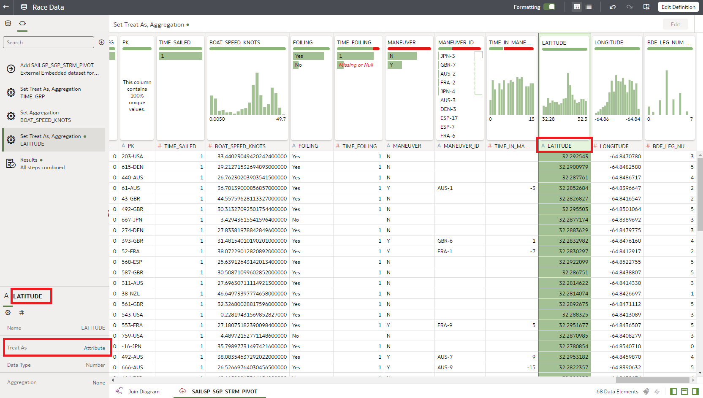
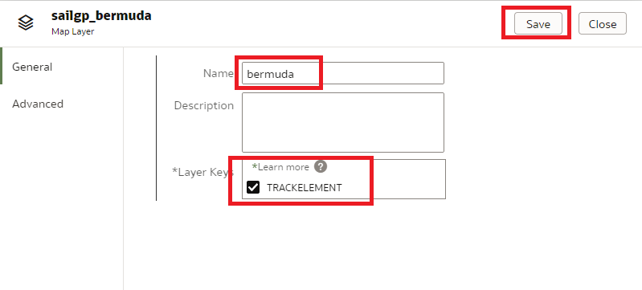

# SailGP Data Analysis

## Introduction

In this lab, you will continue your post-race analysis of the Bermuda race.

We will look closely at the **start** of the race. Often, who will win the race is decided in these crucial first moments. Teams want to position themselves as well as possible during the count down to the start signal. For example, they try to

- Be as close to the starting line when the race starts and,
- Have the highest possible speed when the race starts.

Our goal is to help the sailing teams to perform better in the upcoming race!

_Estimated Time:_ 10 minutes

### Objectives
In this lab, you will:

- Learn how a SailGP Data Athlete extracts valuable insights from sensor data
- Learn how to use Oracle Analytics Cloud to prepare and analyze data

### Prerequisites
This lab assumes you have:
- An Oracle Free Tier, Always Free, Paid or Live Labs Cloud Account
- Provisioned Oracle Analytics Cloud
- Provisioned Autonomous Data Warehouse
- Completed the first SailGP analytics Lab

## Task 1: Investigate Start Performance (Part 1)

<!--
To give you an impression, have a look at this video. You can see how teams are trying to get in the best possible position and with the highest speeds.

   
-->

1. Investigate proximity to the starting line at start signal

   Our goal is to visualize the boats on a map so that we can see how close the teams are to the starting line at the star signal. Luckily, our data contains the geographical coordinate (latitude + longitude) of each boat at each moment in the race. However, we first have to instruct Oracle Analytics Cloud to interpret our coordinates as such.

   From the **Home Page** of Oracle Analytics Cloud, choose **Data**, then click the ribbon `Race Data` and select **Open**.

   

2. Find the `LATITUDE` column (towards the end), and change **Treat As** to **Attribute**.

   

3. Click on the ribbon next to the `LATITUDE` field and choose **Location Details**.

   

4. Make sure that the Location Details configuration is as follows. **It's important to press Ok, even if you don't make changes.**

   

   Next, do the same thing for the `LONGITUDE` column. Set the **Treat As** to **Attribute**.

   

   Change the Location Details to the following. **It's important to press Ok.**

   

5. Now we're ready to create a workbook for this data. Save the changes to the data set if you're being asked to.

   

6. Now we want to visualize our coordinates (comprised of Latitude and Longitude). **Select** the `LATITUDE` and `LONGITUDE` columns (use Control to select multiple columns). Then **drag** them to the right canvas.

   

   You should see the following:

   

7. We want to be able to distinguish the path of each team separately. Let's color-code each team. Drag the `B_NAME` column to the **Color** field.

   

8. This shows each team as a separate color. However, it's still a lot of data to digest. How do we zoom in on only the data that's relevant for that start? Let's filter the data to show only the first seconds of the race.

   Drag `TIME_GRP` to the Filter area.

   

9. Set the filter type to **RANGE**.

   

10. Choose only the 10 seconds before and after the start. In the filter parameters, **Start** will be `-10` and **End** will be `10`.

   

   This still isn’t perfect, because we cannot see the starting line. We have no context of the race course (starting line, marks, et cetera).

11. Our next task will be to bring in the geographical elements for starting line, marks, et cetera. First **Save** the workbook as `Performance analysis`.

   

12. Then, go back to the **Home Page**.

   

## Task 2: Add Geographical Data of the Race Course

1. **Download** a file that contains all the geographical elements (such as starting line, waypoints and finish line) from <a href="https://objectstorage.eu-frankfurt-1.oraclecloud.com/p/-n1PnhbMmtnXnsiHa65cqVxrvF30lUmm8f0MGsUFD7gNASCuUu6r6X209IjydDMh/n/fruktknlrefu/b/workshop-sailgp/o/sailgp_bermuda.geojson" target="\_blank">File with Bermuda geo elements</a> to your local machine. Depending on your browser, you may have to use Right Click. Make sure that the file is saved with extension `.geojson`.

2. From the ribbon on the **Home Page**, go to the Console.

   

3. Select Maps.

   

4. Choose **Add Custom Layer**:

   

5. Choose the file that you've just downloaded. Note the **Trackelement** field.

   This field in the file identifies each of the geographical elements with a number. This number corresponds to the leg to which the element belongs. For example, `trackelement=0` corresponds to the coordinates of the starting line, `trackelement=1` corresponds to the coordinates of the first waypoint after the start and `trackelement=6` corresponds to the coordinates of the finish line. See the image below for an explanation.

   

   Rename the Map Layer to **bermuda**.

   Check the "Trackelement" field. Click **Add**.

   

6. Next, link our dataset to the geographical data of the race course. We will do this by linking the leg number to the trackelement number that we just uploaded.

7. From the **Home Page** of Oracle Analytics Cloud, choose **Data**, then click the ribbon in `Race Data` and select **Open**.

   

8. Click the `BDE_LEG_NUM_UNK` column (towards the end). This contains the current leg that each boat is sailing at a particular moment in time. Set **Treat As** to **Attribute**.

   

9. Next, go to the **Location Details** of this column.

   

10. Select the `bermuda` map to connect to this column. You will notice that the values in our data set ("Your Data") line up perfectly with the values in the map information that we uploaded earlier ("Match"). Click **OK**.

   

11. Go back to the **Home Page** and save the data set if you're being asked to.

   

## Task 3: Investigate Start Performance (Part 2)

   Now we're ready to include the geographical elements such as starting line, waypoints and finish line.

1. From the Home Page, select **Workbooks and Reports**, then click the workbook that we created earlier. We called it `Performance analysis` (containing the analysis of the start).

   

2. Click the ribbon icon next to the map configuration and choose **Add Layer**.

   

3. Drag the `BDE_LEG_NUM_UNK` column to the _Category (Location)_ field of the new layer.

   

4. Select the `bermuda` layer.

   

5. You should now see the starting line as follows:

   

6. Our next goal is to highlight the positions of the teams at the very start of the race.

	 Right click on the `TIME_GRP` column and select **Create Best Visualization**.

   

7. In the resulting table, click on the **0** to highlight the positions at `TIME_GRP` = 0.

   

   **Conclusion**: Already at the start, we see that the winner Great Britain is outperforming the other boats. Denmark and France could improve their timing on the start.
	 It indeed appears that the start is very important for the final result of the race. We also notice that Spain has crossed the starting line early, they actually received a penalty for this.

9. Save the workbook and go back to the Home Page.

   

<!--10. Bonus: Evaluate the speed of the teams at the very start of the race. Which teams have the highest speed? Which teams could try to improve their speed at the start in the next race?-->

Congratulations on completing this lab!

You may now *proceed to the next lab*.

## **Acknowledgements**
- **Author** - Jeroen Kloosterman (Technology Product Strategy Director), Victor Martin (Technology Product Strategy Manager)
- **Contributors** - Priscila Iruela, Arabella Yao
- **Last Updated By** - Arabella Yao, August 2021
