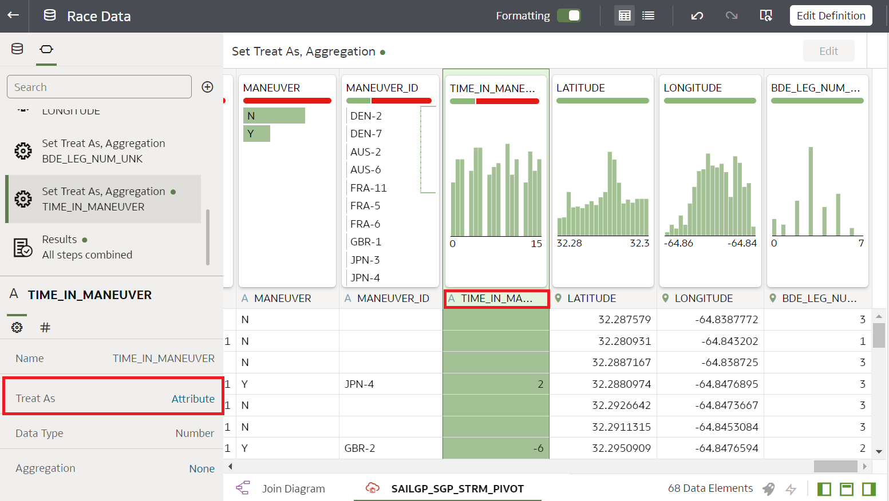
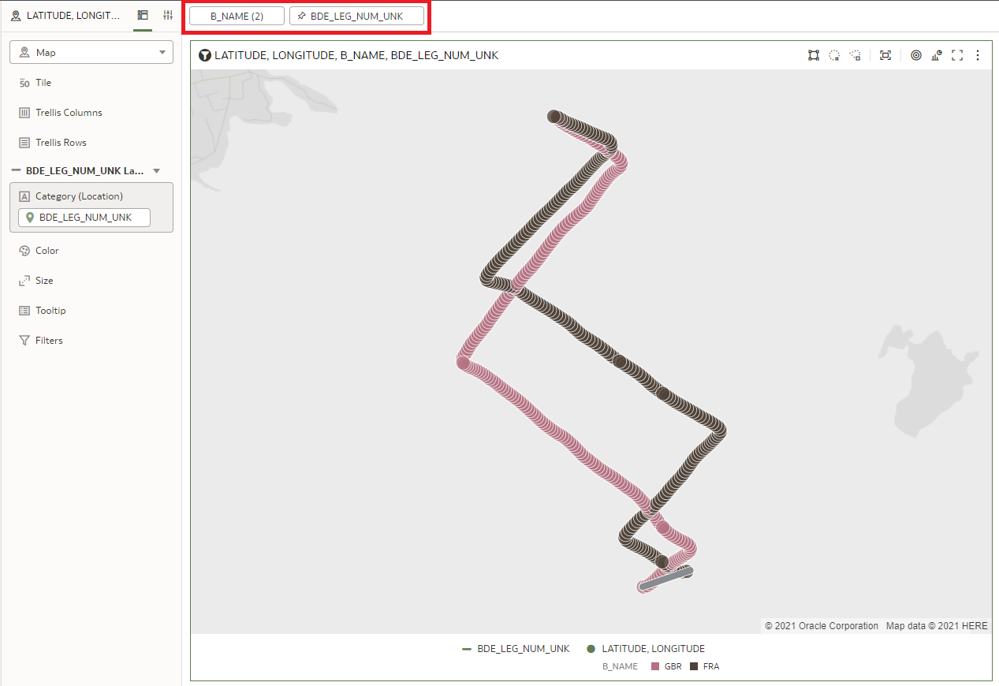
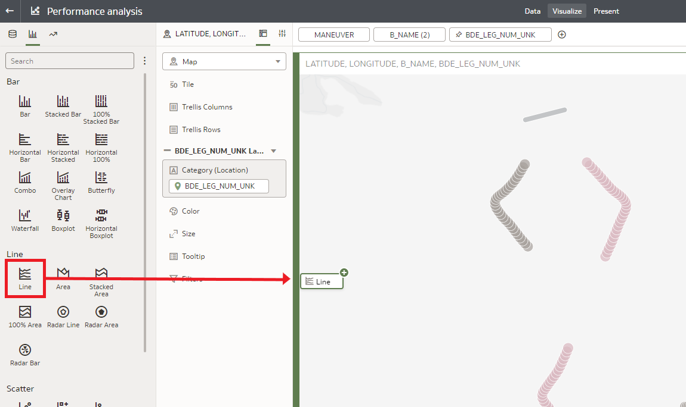
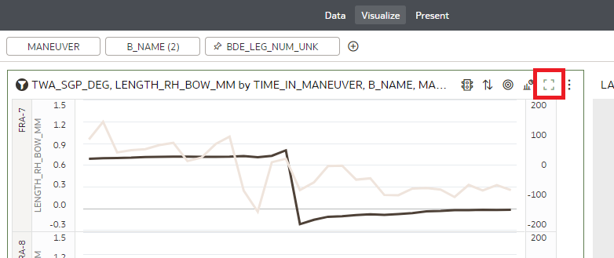

# SailGP Data Analysis

## Introduction

In this lab, you will continue your post-race analysis of the Bermuda race.

When a boat changing the side that's facing the wind, we call this a Tack or a Gybe. Although these maneuvers are necessary to reach the waypoints, in general teams try to **minimize the number** of maneuvers. The reason: Maneuvers will slow down the boat for a little while.

The **quality** of the maneuvers is also very important. Ideally, during a maneuver the team loses as little speed as possible. This requires very good technique and coordination between the team members.

_Estimated Time:_ 10 minutes

### Objectives
In this lab, you will:

- Learn how a SailGP Data Athlete extracts valuable insights from sensor data
- Learn how to use Oracle Analytics Cloud to prepare and analyze data

### Prerequisites
This lab assumes you have:
- An Oracle Free Tier, Always Free, Paid or Live Labs Cloud Account
- Provisioned Oracle Analytics Cloud
- Provisioned Autonomous Data Warehouse
- Completed the first two SailGP analytics Labs

## Task 1: Investigate the Number of the Maneuvers

<!--	 
	 We're oversimplifying here, because often maneuvers are also done for tactical/strategical reasons.
-->

   Let's see how our focus teams, Denmark and France, compare to the winner, Great Britain, when it comes to the number of maneuvers to complete the legs of the race.

1. From the **Home Page** of Oracle Analytics Cloud, choose **Data**, then click the ribbon `Race Data` and select **Open**.

   

2. Find the `TIME_IN_MANEUVER` column (towards the end) and set **Treat As** to **Attribute**. We will use this field to zoom in on maneuvers only later on.

   

3. Go back to the **Home Page**. Save the Data Set if you're being asked to.

   

4. Open the workbook that we created earlier by clicking on **Workbooks and Reports** and then click on `Performance analysis`.

   

5. Compare the number of maneuvers

   **Delete** any filter that's active. Next, add two new filters. Create a filter on `B_NAME` (team) to **include** France and Great Britain and `BDE_LEG_NUM_UNK` (Leg) to be **3**. Then, if needed, change the zoom on the map, so you can see the full leg.

   

   **Conclusion**: Count the number of places where each team changes direction. Notice how the French team makes one more maneuver compared to Great Britain?
	The French team could learn from this that they could improve the planning of how they navigate the leg. We have to be careful with this conclusion though, there may be tactical/strategical advantages in tacking/gybing more than strictly necessary (e.g. compete with other boats).

## Task 2: Investigate the Quality of the Maneuvers

1. Let's see how France's maneuvers compare to those of the winner of the race, GBR.

   **Change the filter** so we only look at leg **4**, and add a filter to only show the parts where teams are making a maneuver so `MANEUVER` is `Y` (Yes).

   

   Notice how you now only see the sections where the boats are changing their sailing course. Each of these sections is defined to be exactly 30 seconds, and at the centre of it,  the moment in which the boat passes exactly through the wind.

	Now, let's look into the quality of the maneuvers.

2. Create a new Line Chart by clicking on the **Graph icon** (second icon from the top left), then drag the **Line icon** to just left of the existing map visualization.

   

3. Go back to the fields by clicking on the **database icon**.

	

4. In this chart, we want to see how well the boats are able to keep out of the water during a maneuver. The boats try to not hit the water during a maneuver, to prevent losing speed. The column `LENGTH_RH_BOW_MM` indicates the "flying height", the distance that the boat is out of the water. The `TWA_SGP_DEG` column indicates the wind direction, so we can see exactly when the boat is at the middle of its maneuver.

	Configure the chart as follows by **dragging** the fields from the left to the chart configuration.

   

5. Currently we can hardly see the flying height because its values (between 0 and 1,4m) are much smaller than the wind angle (between 0 and 360). Let's add a secondary Y axis to solve that. You can find these settings on the bottom left of the screen.

   

6. Maximize the chart to see it better:

   

7. The way that the flight height has been configured, at a value of `0,4` the boat hits the water. Let's include a reference line to indicate this. Click the ribbon menu, select **Add Statistics** and click **Reference Line** as follows:

   

8. Configure the reference line as follows (bottom left of the screen):

   

9. Now, scroll through the resulting chart and compare how well each team manages to stay out of the water during maneuvers.

   

	**Conclusion:** Notice how the French team comes in contact with the water more often. So the tacking/gybing technique could be another point of attention to improve their next race.

Congratulations on completing this lab! You have made the first steps towards a full post-race analysis. This is just the beginning; there are many more sensor values to explore and insights to find with which we can improve the teams' performance. We hope you feel inspired to continue experimenting with this data, or even start with the analysis of your own data!

You may now *proceed to the next lab*.

## **Acknowledgements**

- **Author** - Jeroen Kloosterman (Technology Product Strategy Director), Victor Martin (Technology Product Strategy Manager)
- **Contributors** - Priscila Iruela, Arabella Yao
- **Last Updated By** - Arabella Yao, August 2021
