<!--
This works:
only select OML
(don't do tablespace)
(don't do web)
then after do REST enable with separate option
then use SQL to add quota: ALTER USER sailor13 QUOTA UNLIMITED ON Data

4 spaces version
-->

# Machine Learning On SailGP Data: Predicting the best sailing direction

## Introduction

In this lab, you will use machine learning to solve a very common challenge in sailing: finding the best direction to sail. With the optimal direction, we mean **which angle to the wind the boat must sail** to **obtain the highest boat speed** in the target direction, given a particular wind speed.

You will train a machine learning model that will find the relationship between wind speed, wind angle and boat speed.

The machine learning that takes place in the Autonomous Data Warehouse and Oracle Analytics Cloud will pick up the resulting predictions from the database and visualize them.

_Estimated Time:_ 25 minutes

### Objectives

In this lab, you will:
- Learn basic machine learning principles, which you can apply to a myriad of (business) problems.
- Learn how you can perform machine learning in Autonomous Data Warehouse, and analyze the results in Oracle Analytics Cloud, without having to be a data science expert!

### Prerequisites
This lab assumes you have:
- An Oracle Free Tier, Always Free, Paid or LiveLabs Cloud Account
- Provisioned Oracle Analytics Cloud
- Provisioned Autonomous Data Warehouse
- A configured connection between Oracle Analytics Cloud and Autonomous Data Warehouse

## Task 1: Plan Your Approach

For this case, we will imagine that our **goal is to try to sail upwind** (into the direction of the source of the wind) as fast as possible. Different angles result in different boat speeds, for example:
- Going directly upwind with angle 0 (straight into the wind) is not possible at all.
- Taking a wide angle of 60+ degrees (e.g. "Wind angle 2") will result in a high boat speed, but it will not bring us to our target as quickly as possible (going vertically "up").
- Taking a less wide angle (e.g. "Wind angle 1") will result in a less high boat speed, but may actually bring us to our target faster.

Therefore, there is an optimal wind angle, and it is up to us to find it. However, this is not so easy; every boat has its own characteristics and responds with a different speed to the wind angle and wind speed in a non-linear way. There's a complex relationship between these variables!

We will attack the problem in two phases:

1) Predict the actual boat speed (green) based on wind speed (red) and wind angle (blue). We will use machine learning to do this.

2) Decompose the boat speed and extract its "vertical" component (purple) towards the wind. This is the speed we're finally interested in. It's nice for the boat to go fast, but only the vertical speed (up towards the wind) is what counts.

## Task 2: Explore the Data (Prepare for Machine Learning)

Predict boat speed (green) based on wind speed (red) and wind angle (blue).

In the past we've gone onto the water with our boat many times in different wind conditions, and we've measured wind speed, wind angle and the resulting boat speed. This has resulted in a data set with many measurements. We'll start the process by having a look at this data.

1. Open Oracle Analytics Cloud.

   From the  **Oracle Cloud Infrastructure console** click on the menu icon on the left.
   **Navigate** to **Analytics & AI** and then **Analytics Cloud**.

   

2. **Open** the Cloud Analytics **URL** associated with your instance (the one that we created in Lab 2) by using the dots menu button on the right-hand side of your instance information and selecting **Analytics Home Page**.

   

3. Let's have a look at our measurements.

   **Create** a new **Data Set**.

   

4. Select our database connection, `SAILGP`.

   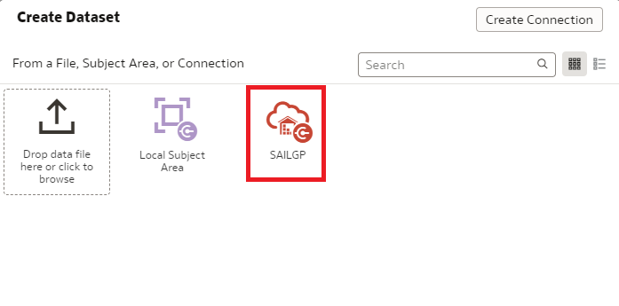

5. **Double click** the `SGP_SAIL_HISTORY` table in the `SAILOR` schema.

   

   Here you see the results of the measurements of our past trips with the boat; every measurement is a combinations of wind speed, wind angle and resulting boat speed.

6. Open the contents of the table by clicking on `SGP_SAIL_HISTORY` at the bottom of the screen.

   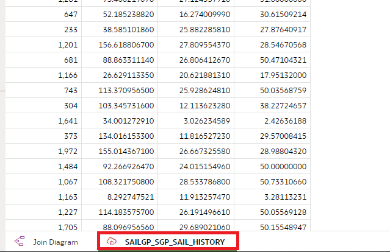

7. Click on the PK column (this holds a simple counter for each measurement). On the bottom left of the screen, change **Treat As** to **Attribute**.

   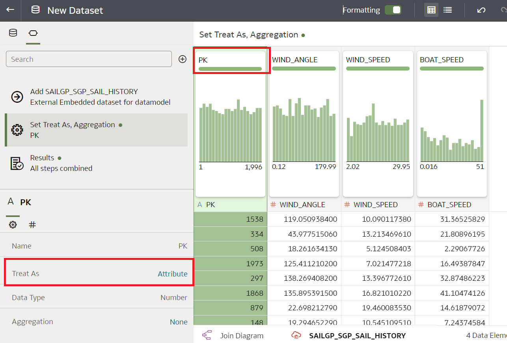

8. **Save** the Data Set and name it `Sail History`. Click **OK**.

   

9. From the **Home Page**. Click **Create Workbook** and select the **Sail History** data set that you created earlier.

   

10. Select the `PK`, `WIND_SPEED` and `BOAT_SPEED` columns (use control-click) and drag them to the canvas to create a new visualization.

   

   Conclusion: There appears to be some correlation between wind speed and boat speed, as you would expect. But it's not just a simple straight line!

   

11. Create a new visualization from `PK`, `WIND_ANGLE` and `BOAT_SPEED` and drag it to just above the original chart (the area will be highlighted in blue).

   

   Conclusion: There also appears to be a relationship between `WIND_ANGLE` and `BOAT_SPEED` as well. There's a clear concentration of points in the top of the chart. However, there are also many points further down.

   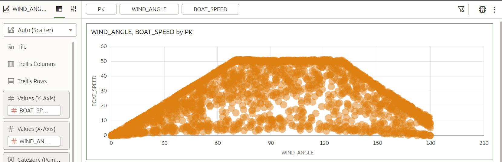

12. Drag the `WIND_SPEED` to the **Color** component. With this we're trying to visualize the relationship between all three variables.

   

   Conclusion: We see correlation between wind speed, wind angle and boat speed. However, it's very difficult to find the exact relationship. As mentioned before, the relationship between wind speed, wind angle and boat speed is **non linear**.

   On top of that, it's fair to assume that there will be some amount of error in our readings, it's notoriously difficult to measure things like wind speed and wind angle accurately.

   These things together makes it pretty hard for us, human beings, to find these relationships.

   But luckily for us, Machine Learning is great at extracting these type of patterns! It is able to cut through the noise and find relationships between variables!

## Task 3: Set up the Machine Learning User

1. Open the Autonomous Data Warehouse.

   From the Oracle Console, click **Oracle Database** > **Autonomous Data Warehouse**.

   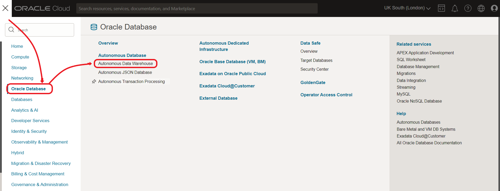

2. Click on the `SAILGP` database that you created earlier.

   

3. Open the **Database Actions**.

   If sign-in is requested, sign in with `ADMIN`, password `Oracle_12345`.

   

4. Choose **Administration** > **Database Users**.

   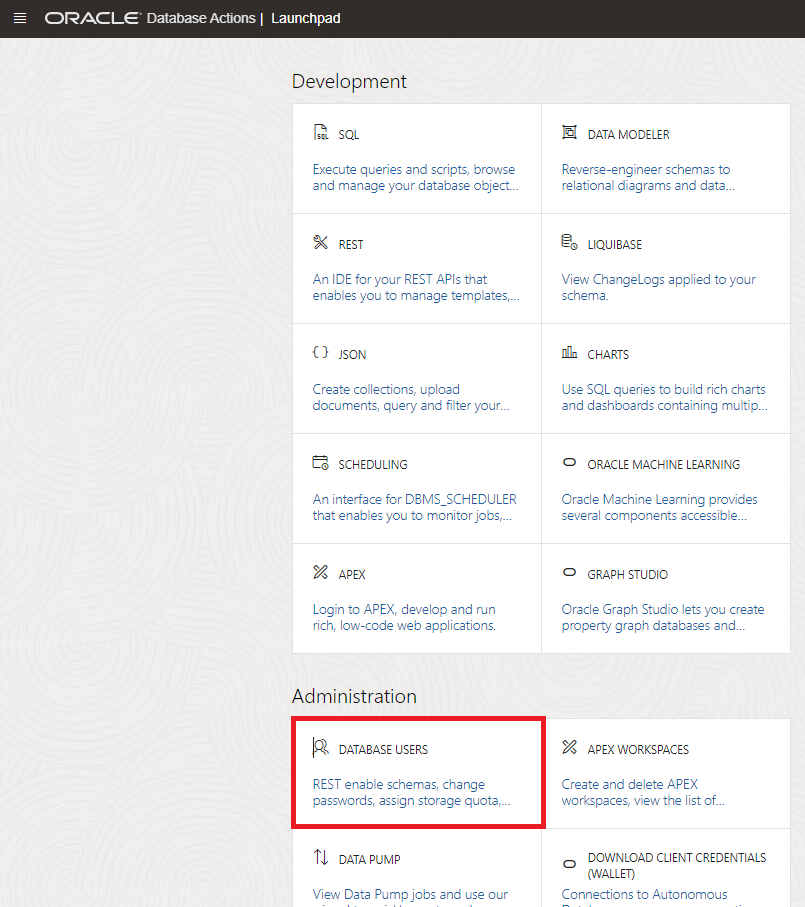

5. Find the **SAILOR** user and Edit the user.

   

6. Turn on the "OML" (Oracle Machine Learning) button and click Apply Changes. You've now enabled the `SAILOR` user to use the Machine Learning functionality of Autonomous Data Warehouse.

   

<!--6. Choose any email address (it's not relevant). **Don't update any of the other fields**.

   
-->

<!--
   Click on the icon on the bottom-right to get the URL to access Machine Learning for the SAILOR user.

   Keep this URL save (e.g. place it in your bookmarks or save it in a text file).

   
-->

## Task 4: Build the Machine Learning Model

1. In the console of the Autonomous Data Warehouse, go to **Database Actions**.

   

2. Look at the top right to see which user is logged in.

   If it is not SAILOR (e.g. ADMIN), then first Sign Out and log in as SAILOR.

   Username: `SAILOR`
   Password: `Oracle_12345`

3. Choose "Oracle Machine Learning"

   

   If you are asked to login again, login with the SAILOR user.

4. Start AutoML by clicking on the ribbon and `AutoML Experiments`.

   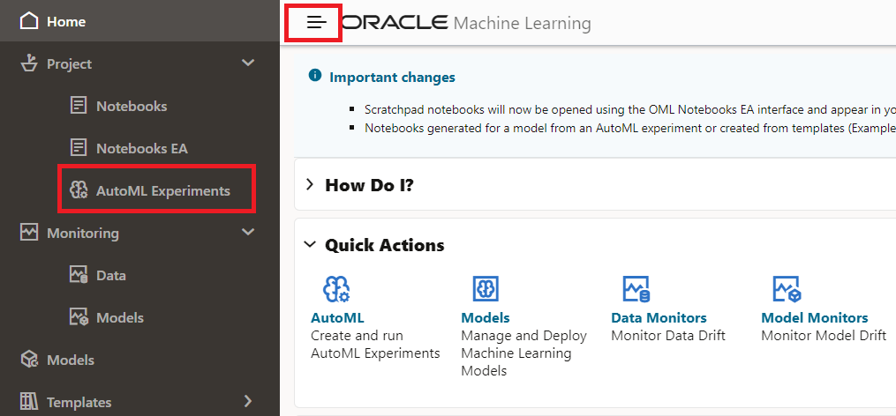

5. Select **Create**

   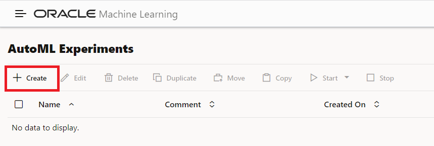

6. Now we have to select how to train our model.

    We want to predict **boat speed** from **wind speed** and **wind angle**, therefore configure the experiment as follows.

    - Name: `Predict F50 Speed`
    - Data Source: `SAILOR.SGP_SAIL_HISTORY`, choose `SAILOR` and `SGP_SAIL_HISTORY` on the popup window.
    - Predict: `BOAT_SPEED`
    - Case ID: `PK`
    - `WIND_ANGLE`: checked
    - `WIND_SPEED`: checked

    

7. Lastly, in the **Additional Settings**, set Database Service Level to `High`. This will help us build the model faster.

    

8. Click on the **Save button** at the top right.

   Now start the training of the model.

    On the top right choose **Start** > **Faster Results**.

    

9. The progress window opens automatically.

    

10. The training will take several minutes. During this time, AutoML tries out several different ML algorithms, with different configurations.

    The value under **Mean Squared Error** is an indicator of the accuracy of the model.

    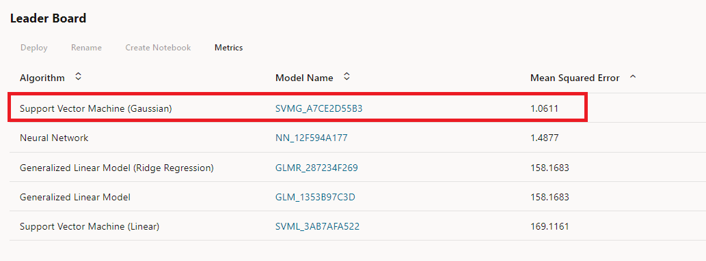

    We will use the **Support Vector Machine (Gaussian) model**.

    **IMPORTANT: Make a note of the exact model name, including the number. You will need this later.**

## Task 5: Predict the Boat Speed in Oracle Analytics Cloud

Now it's time to make predictions with the model. We will make a prediction for a combination of wind speeds (5, 10, 15, 20 and 25 mph) and range of wind angles (0-180 degrees with 1 degree increments).

The following assumes you already have Oracle Analytics Cloud open in your browser. If not, you can find instructions in Task 2 on how to open it.

1. **Create** a new **Data Set**.

   

2. Select the connection to our Autonomous Data Warehouse.

   

3. **Double click** on the `SGP_WINDSPEED_AND_WINDANGLES` table (under the **SAILOR** user).

   

   You will see that this table holds a combination of wind speeds and wind angles. The table **does not yet have** the boat speed. We will predict the boat speed from these two values.

4. Click on the table name at the bottom of the screen.

   

5. **Save** the Data Set, call it `To Predict`. Click **OK**.

   

6. Go back to the **Home Page**.

   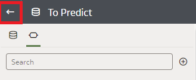

7. Now we need to make the Machine Learning model that we built in the database available to Oracle Analytics Cloud.

   Click the **ribbon**, then **Register Model/Function** and **Machine Learning Models**. Then select `SAILGP` connection.
   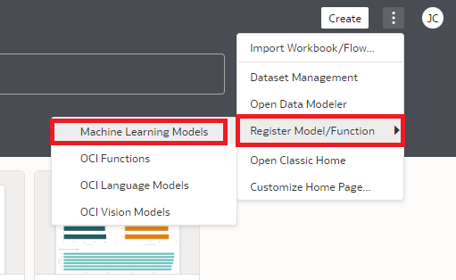

8. Now select the model starting with `SVMG`. Check that it has the same name that you created earlier (in your environment the numbers will be different from this screenshot). Then press **Register**.

   

9. Now it's time to predict the boat speeds for all the combinations of wind speed and wind angle in the "To Predict" dataset. We can do this with Data Flows. Data Flows let us create a series of steps in which we can manipulate data in sequence, or in this case, apply a ML model to data.

   **Create** a new **Data Flow**.

   

10. Select the **To Predict** Data Set as the input for the Data Flow and click **Add**.

    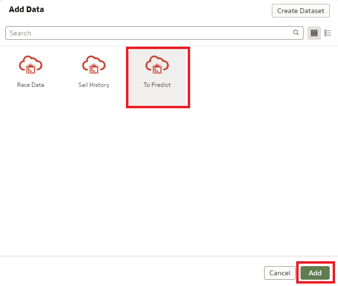

11. Click on the **+** icon next to the **To Predict** Data Set and add an **Apply Model** step.

   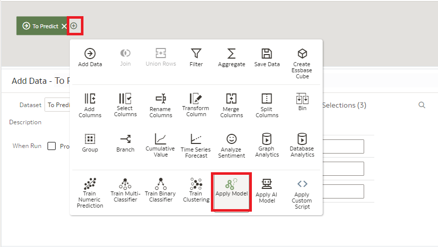

12. Choose the model that we registered earlier, and click **OK**.

   

   See how the Wind Speed and Wind Angle are automatically lined up with the input features of the model.

13. Although the model has predicted values for wind angles from 0-360, our training data actually only has values from 0-180. Therefore it does not make sense to predict values above 180. We will set those to 0.

   Click the **+** signal next to **Apply Model**, and select **Transform Column**.

   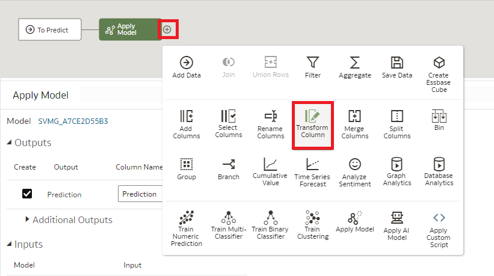

14. Choose the **Prediction** column. This is the column we will adapt.

   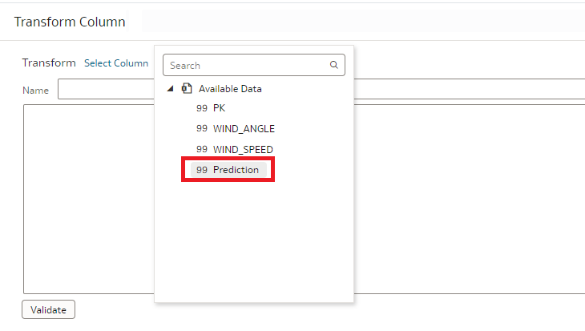

15. Clear the formula, open the Expressions option at the right, and drag `Case (If)` to the formula field.

   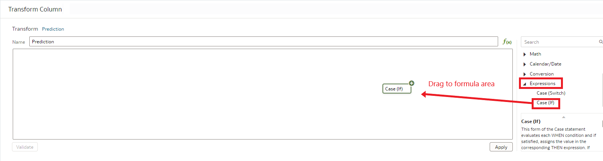

16. Complete the formula `CASE WHEN wind_angle<=180 THEN prediction ELSE 0 END`.

    When typing the field names wind_angle and prediction, make sure that you confirm the field names by clicking on the suggestions by the editor.

    
    

    If all is well, `WIND_ANGLE` and `PREDICTION` will be shown in blue.

    Now **Apply** the transformation.

17. Finally, add a step to save the resulting data to a new Data Set. Select **Save Data**.

    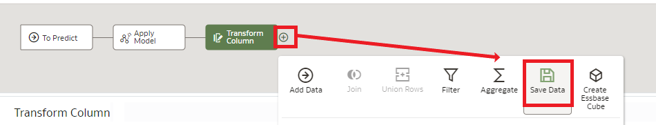

18. Fill in the following details on the **Save Data** step.

    - Data Set: `Predicted Boat speed`
    - Table: `SGP_PREDICTED`

    

    Then press **Save**.

19. Give the Data Flow the name `Prediction Data Flow`.

    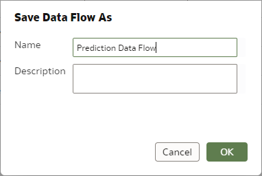

20. On the top right, click on the **Play** button to start the Data Flow.

    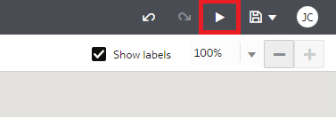

    This may take a few minutes. You should see a message that the Data Flow completed successfully.

21. Go back to the **Home Page**.

    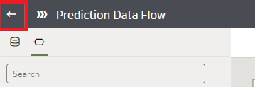

22. Open the new Data Set by clicking on **Data**, then on the ribbon of **Predicted Boat Speed** and select **Open**.

    

23. Change the **Treat As** of the 4 columns to be as follows:

    - `WIND_SPEED`: `Attribute`
    - `WIND_ANGLE`: `Attribute`
    - `PK`: `Attribute`
    - `Prediction`: `Measure`

    Ignore any message regarding the Data Flow by clicking **OK**.

    The result should look like this.

    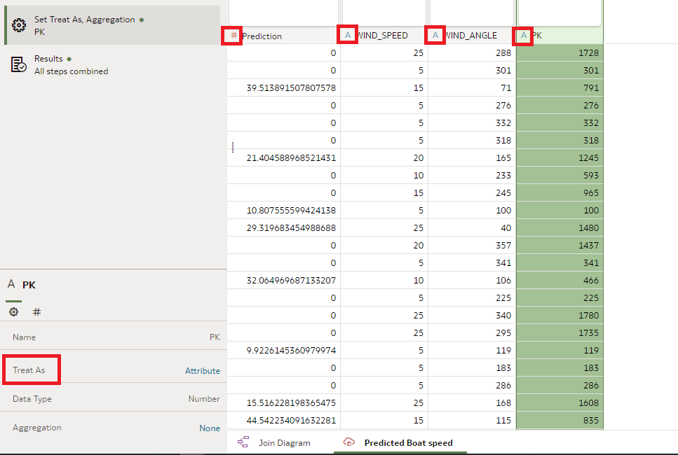

24. **Save** the Data Set and click **Create Workbook** after.

    

25. Now it's time to visualize the predictions.

    Select `WIND_SPEED`, `WIND_ANGLE` and `Prediction` (control-click for multi-select) and Right Click. Then choose **Pick Visualization** and choose **Line** chart.

    

26. Make sure that the Line Chart is configured as indicated with the red boxes.

    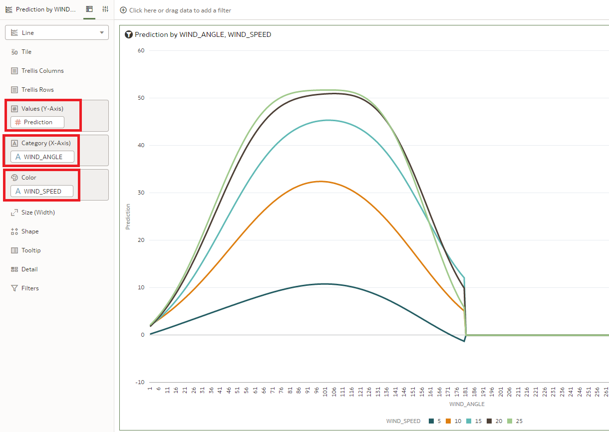

    > If you see a different chart be sure you have the correct order as showed in the picture.

    Conclusion: We can now see clear patterns in how boat speed changes as a result of wind speed and wind angle. The angles to reach the highest boat speed are different depending on the wind speed.

## Task 6: Extract the Boat Speed towards Our Upwind Target

At this point, we can use the previous chart to pick the best angle to sail to obtain the highest boat speed for a certain wind speed. In other words, what we can now predict is the green line in this diagram, based on wind speed and wind angle.

However, this is not so useful by itself. Remember, what we -really- want to know, is not the absolute boat speed, but the boat speed towards our -goal-, which is going directly upwind in this case. What we want to do now, is to obtain the length of the -purple- line. The sailing term for this is "Velocity Made Good".

Luckily, we can easily do this by converting the chart into a polar diagram.

1. Change the visualization of the chart to **Radar Line**.

   

2. How to read this chart?

   Because of the circular projection, the vertical distance now effectively shows the Velocity Made Good (the speed that we're achieving towards the target).

   

   For example, imagine the current wind speed is 10 knots. This is the green ellipse. Now find the point that's vertically in the highest position. This point indicates the maximum speed that we can obtain towards our target (upwind). The optimum angle to obtain this is 42 degrees, the total boat speed will be 16.7 knots, and the expected boat speed towards the target will be around 10 knots.

   

   Another example, imagine the current wind speed is 25 knots. This is the purple ellipse. Again, find the point that's vertically in the highest position. In this case the highest speed that we can obtain towards our target can be achieved by taking an angle of 48 degrees to the wind, the total boat speed will be 36 knots, and the expected boat speed towards the target will be around 22 knots.

## Task 7: Draw Conclusions
In this lab we predicted what the boat speed will be based on wind speed and wind angle. We did this by training a ML model on historical measurements of wind conditions and resulting boat speed. Machine Learning was able to find the complicated relationship that exists between these variables. Something that's not easy to do for human beings!

By displaying these predictions in a smart way in a radar chart, it allowed us to read the optimal angle to take with a certain wind speed, in order to reach our goal as fast as possible!

Congratulations on completing the lab! Now you've learned the basics of machine learning, hopefully you are inspired to apply it to many more challenges!

## **Acknowledgements**
- **Author** - Jeroen Kloosterman (Technology Product Strategy Director), Victor Martin (Technology Product Strategy Manager)
- **Contributors** - Priscila Iruela, Arabella Yao
- **Last Updated By** - Arabella Yao, August 2021
