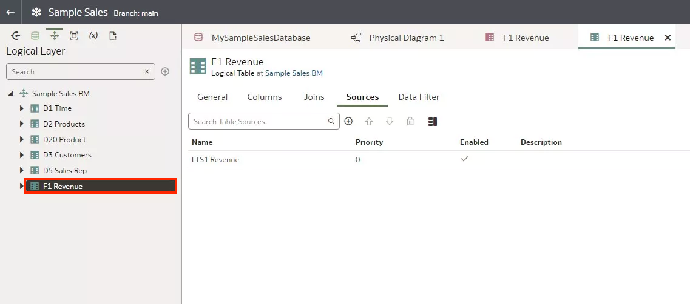
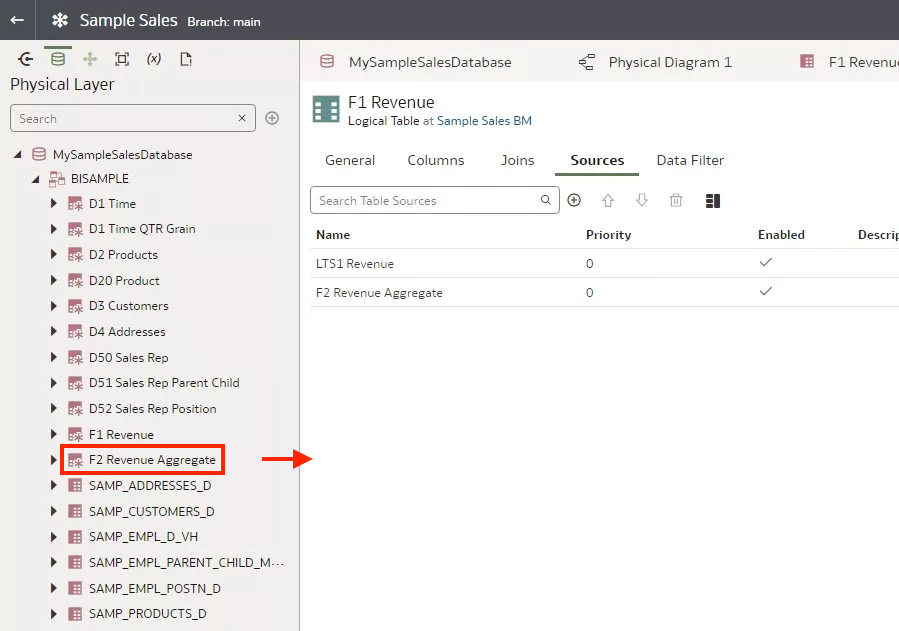
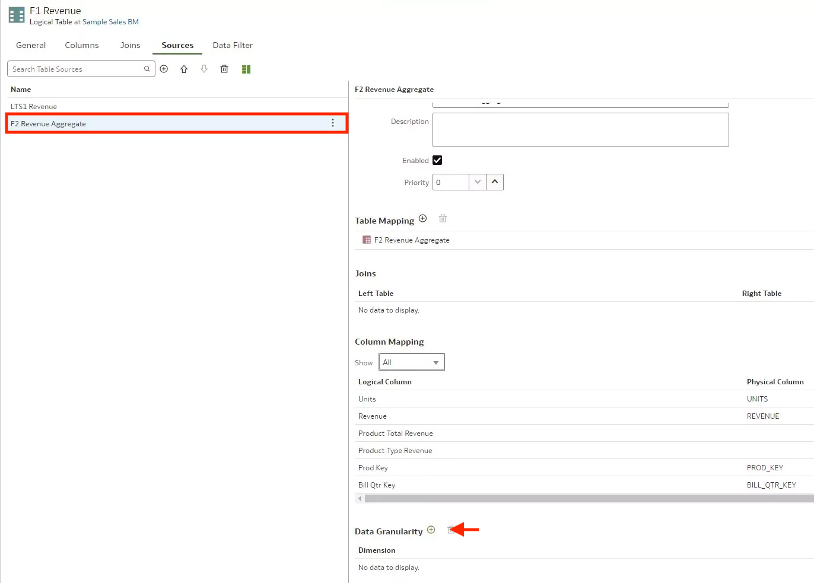

# Create Aggregate Tables

## Introduction

This tutorial shows you how to create aggregate tables in your semantic model.

Estimated Lab Time: 25 minutes

### Objectives

In this lab, you will:
* Create aggregate tables in your semantic model in Oracle Analytics Cloud.

### Prerequisites

This lab assumes you have:
* Access to Oracle Analytics Cloud
* Access to DV Content Author, BI Data Model Author, or a BI Service Administrator Problems
* Access to the Sample Sales Semantic Model

## Task 1: Add Physical Tables

In this section, you add tables from your physical source to your Samples Sales schema and create table alias.

Begin with step 3 if you're continuing this tutorial directly after completing the steps in the Create Parent-Child Hierarchies tutorial.

1. If you closed your semantic model, sign in to Oracle Analytics Cloud using one of DV Content Author, BI Data Model Author or service administrator credentials. On the Home page, click the **Navigator**, and then click **Semantic Models**.
	
2. In the Semantic Models page, select **Sample Sales**, click **Actions menu**, and then select **Open**.
	
3. Click the **Physical Layer**. Double-click **MySampleSalesDatabase**.

4. In Tables, under MySampleSalesDatabase, expand the **Sample Sales schema**.

5. Click **Connections**. Expand **BISAMPLE**. Hold down the Ctrl key, select the **SAMP_ REVENUE_ FA2** and **SAMP_ TIME_ QTR_ D** tables, and then drop the tables on the Sample Sales schema when the **Add table** green icon shows.
	
6. In the Tables pane, hold down the Ctrl key, select **SAMP_ REVENUE_ FA2** and **SAMP_ TIME_ QTR_ DAY** table, right-click, and then select **Cut**. Right-click the **Sample Sales schema**, and then select **Paste**.

7. Right-click **SAMP_ REVENUE_ FA2** and select **Create Physical Table Alias**.
	
8. In Create Physical Table Alias, enter <code>F2 Revenue Aggregate</code> in **Name**, and then click **OK**. Close F2 Revenue Aggregate.
	
9. Right-click **SAMP_ TIME_ QTR_ DAY** and select **Create Physical Table Alias**.
	
10. In Create Physical Table Alias, enter <code>D1 Time QTR Grain</code> in **Name**, and then click **OK**.
	
11. Click **Save**.

## Task 2: Create Joins

In this section, you create links between the aggregate tables and the D2 Product table using the Physical Diagram.

1. In the Physical Layer, right-click **F2 Revenue Aggregate**, select **Show Physical Diagram**, and then click **Selected Table Only**.

	

2. Hold down the Ctrl key, select **D1 Time QTR Grain** and select **D2 Products**, and then drag the tables to the Physical Diagram.

	

3. Click **F2 Revenue Aggregate** and drag the cursor to **D2 Product** to open the Add Physical Join dialog.

	

4. From the Join Conditions list under the Left Table, select **PROD_ KEY**. From the Join Conditions list under the Right Table, select **PROD_ KEY**, and then click **Add**.
	
5. In the Physical Diagram, click **F2 Revenue Aggregate**, drag the cursor to **D1 Time QTR Grain** to open the Add Physical Join dialog.

	

6. From the Join Conditions list under the Left Table, select **BILL_ QTR_ KEY**. From the **Join Conditions** list under the Right Table, select **QTR_ KEY**, and then click **Add**.	
	
	

## Task 3: Add Source Tables

In this section, you add the aggregate tables as sources for the F1 Revenue and D1 Time tables in the logical layer.

1. Click the **Logical Layer**. Expand **Sample Sales BM**, and then double-click **D1 Time**.

	

2. In D1 Time, click **Sources**. Click the **Physical Layer**.

3. From the Sample Sales schema, select **D1 Time QTR Grain**, and then drag it to D1 Time Sources.

	

4. Close D1 Time.

5. In the Logical Layer, double-click **F1 Revenue**.

	

6. In F1 Revenue, click **Sources**.

7. Click the **Physical Layer**.

8. From the Sample Sales schema, select **F2 Revenue Aggregate**, and then drag it to F1 Revenue Sources.

	

## Task 4: Specify Data Granularity

In this section, you set the level of detail (the grain) stored in the logical tables.

1. In the F1 Revenue Sources tab, double-click **F2 Revenue Aggregate**. Scroll to Data Granularity. Click **Add Level**.

	

2. From the Dimension list, select **D2 Products**. Click the **Level** list, and then select **Total**.

3. Click **Add Level**. From the Dimension list, select **D1 Time**. Click the **Level** list, and then select **QTR**.

4. Click **Add Level**. From the Dimension list, select **D3 Customers**. Click the **Level** list, and then select **Total**.

5. Click **Add Level**. From the Dimension list, select **D1 Time**. Click the **Level** list, and then select **Total**.

6. Click **Save**.

	

## Learn More
* [Add Logical Table Sources](https://docs.oracle.com/en/cloud/paas/analytics-cloud/acmdg/add-logical-table-sources.html#GUID-52CBFD5E-0F83-4836-AEB8-32F0A8299FA7)

## Acknowledgements
* **Author** - Desmond Jung, Cloud Engineer, NACI
* **Contributors** - Pravin Janardanam, Nagwang Gyamtso
* **Last Updated By/Date** - Desmond Jung, July 2023

