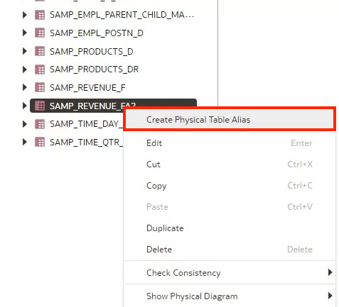
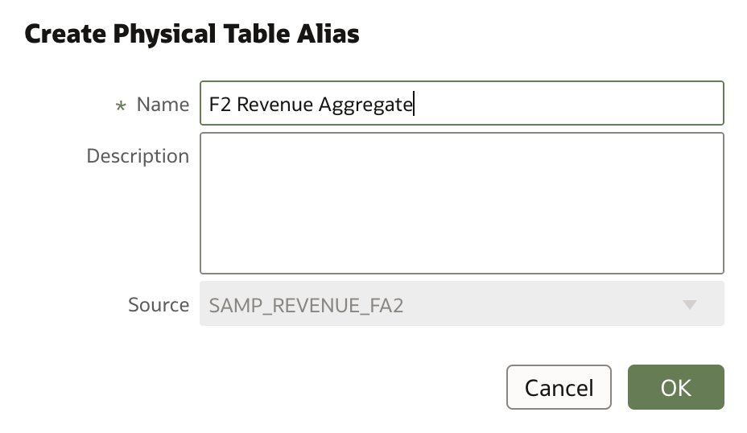
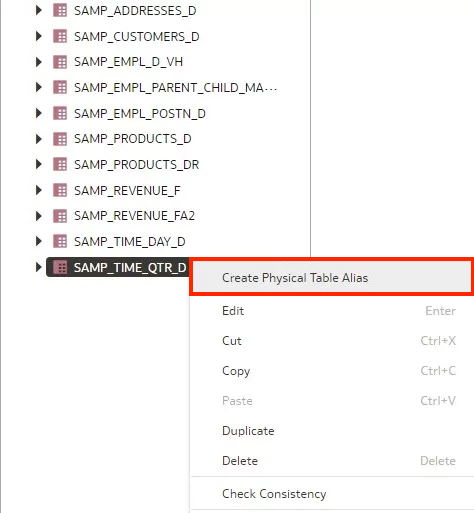
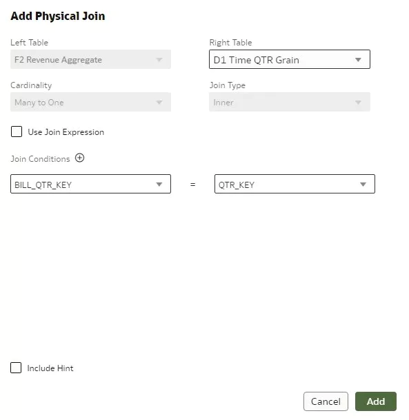
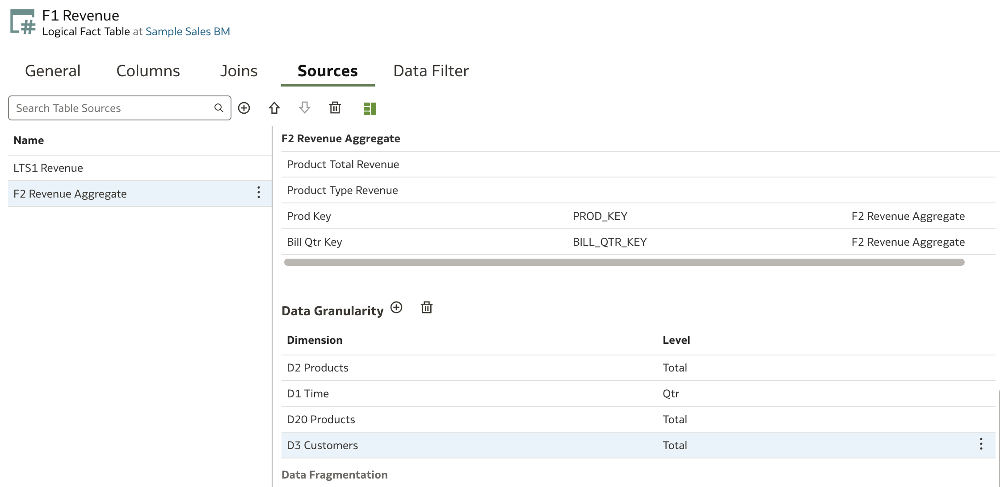

# Create Aggregate Tables

## Introduction

This lab shows you how to create aggregate tables in your semantic model.

Estimated Time: 25 minutes

### Objectives

In this lab, you will:
* Create aggregate tables in your semantic model in Oracle Analytics Cloud.

### Prerequisites

This lab assumes you have:
* Access to Oracle Analytics Cloud
* Access to DV Content Author, BI Data Model Author, or a BI Service Administrator Problems
* Access to the Sample Sales Semantic Model

## Task 1: Add Physical Tables

In this section, you add tables from your physical source to your Samples Sales schema and create table alias.

Begin with step 3 if you're continuing this tutorial directly after completing the steps in the Create Parent-Child Hierarchies tutorial.

1. If you closed your semantic model, sign in to Oracle Analytics Cloud using one of DV Content Author, BI Data Model Author or service administrator credentials. On the Home page, click the **Navigator**, and then click **Semantic Models**.

	

2. In the Semantic Models page, select **Sample Sales**, click **Actions menu**, and then select **Open**.

	

3. Click the **Physical Layer**. Double-click **MySampleSalesDatabase**.

4. In Tables, under MySampleSalesDatabase, expand the **BISAMPLE** schema.

5. Click **Connections**. Expand **Schemas**, then expand **BISAMPLE**. Hold down the Ctrl (command on Mac) key, select the **SAMP_ REVENUE_ FA2** and **SAMP_ TIME_ QTR_ D** tables, and then drop the tables on the Sample Sales schema when the **Add table** green icon shows.

	

6. Right-click **SAMP_ REVENUE_ FA2** and select **Create Physical Table Alias**.

	

7. In Create Physical Table Alias, enter **"F2 Revenue Aggregate"** in **Name**, and then click **OK**. Close F2 Revenue Aggregate.

	

8. Right-click **SAMP_ TIME_ QTR_ DAY** and select **Create Physical Table Alias**.

	

9. In Create Physical Table Alias, enter **"D1 Time QTR Grain"** in **Name**, and then click **OK**.

	

10. Click **Save**.

## Task 2: Create Joins

In this section, you create links between the aggregate tables and the D2 Product table using the Physical Diagram.

1. In the Physical Layer, right-click **F2 Revenue Aggregate**, select **Show Physical Diagram**, and then click **Selected Table Only**.

	

2. Hold down the Ctrl (command on Mac) key, select **D1 Time QTR Grain** and select **D2 Products**, and then drag the tables to the Physical Diagram.

	

3. Click **F2 Revenue Aggregate** and drag the cursor to **D2 Products** to open the Add Physical Join dialog.

4. From the Join Conditions list under the Left Table, select **PROD_ KEY**. From the Join Conditions list under the Right Table, select **PROD_ KEY**, and then click **Add**.

	

5. In the Physical Diagram, click **F2 Revenue Aggregate**, drag the cursor to **D1 Time QTR Grain** to open the Add Physical Join dialog.

6. From the Join Conditions list under the Left Table, select **BILL_ QTR_ KEY**. From the **Join Conditions** list under the Right Table, select **QTR_ KEY**, and then click **Add**.

	
	

## Task 3: Add Source Tables

In this section, you add the aggregate tables as sources for the F1 Revenue and D1 Time tables in the logical layer.

1. Click the **Logical Layer**. Expand **Sample Sales BM**, and then double-click **D1 Time**.

	

2. In D1 Time, click **Sources**. Click the **Physical Layer**.

3. From the Sample Sales schema, select **D1 Time QTR Grain**, and then drag it to **D1 Time Sources**.

	

4. Close D1 Time.

5. In the Logical Layer, double-click **F1 Revenue**.

	

6. In F1 Revenue, click **Sources**.

7. Click the **Physical Layer**.

8. From the Sample Sales schema, select **F2 Revenue Aggregate**, and then drag it to **F1 Revenue** **Sources**.

	

## Task 4: Specify Data Granularity

In this section, you set the level of detail (the grain) stored in the logical tables.

1. Double-click **D1 Time** from the **Logical Layer**. Select **D1 Time QTR Grain** and select the **Detail View**. Scroll down and set **Data Granularity** to be **Qtr** level.

	

2. Scroll up to **Column Mapping** and select **Mapped**. Hold Ctrl (command on Mac) key and select all the mapped columns. Right-click and select **Unmap**. ---------------------------------------------
	

2. Click the **Columns** tab in **D1 Time**. Scroll down and select the **Qtr Key** column. Click the **Detail View**. Scroll down and ensure the **Level** is **Qtr** and there is a **D1 Time QTR Grain** source. ---------------------------------------------

	

2. In the **F1 Revenue Sources** tab, select **F2 Revenue Aggregate** and click the **Detail view**. Scroll to Data Granularity. Click **Add Level**.

	

3. From the Dimension list, select **D2 Products**. Click the **Level** list, and then select **Total**.

4. Click **Add Level**. From the Dimension list, select **D1 Time**. Click the **Level** list, and then select **QTR**.

5. Click **Add Level**. From the Dimension list, select **D20 Product**. Click the **Level** list, and then select **Total**.

6. Click **Add Level**. From the Dimension list, select **D3 Customers**. Click the **Level** list, and then select **Total**.

	

7. Click **Save**.

## Task 5: Deploy and Validate the Changes

In this section, you run the consistency checker, deploy the updated semantic model, and create a
workbook with the updated Sample Sales subject area.

1. Click the **Consistency Checker** and select **Include warnings**.

	

2. Oracle Analytics didn't find any errors in the Sample Sales semantic model. In the semantic model, click the **Page Menu** icon, and select **Deploy**. The message, **"Deploy successful"** appears in the status bar when the deployment process is complete.

  

3. Go back to the Oracle Analytics Cloud homepage and create a new workbook with the **Samples Sales** Subject Area. Create the following three visualizations to validate this lesson:

    >**Note**: If you do not see the columns and your model deployment was successful, sign out and sign back in. If the columns are still not available, wait a few moments before trying again.

  

You may now **proceed to the next lab**

## Learn More
* [Add Logical Table Sources](https://docs.oracle.com/en/cloud/paas/analytics-cloud/acmdg/add-logical-table-sources.html#GUID-52CBFD5E-0F83-4836-AEB8-32F0A8299FA7)

## Acknowledgements
* **Author** - Nagwang Gyamtso, Product Manager, Analytics Product Strategy
* **Contributors** - Pravin Janardanam, Gabrielle Prichard, Lucian Dinescu, Desmond Jung
* **Last Updated By/Date** - Nagwang Gyamtso, March, 2024
