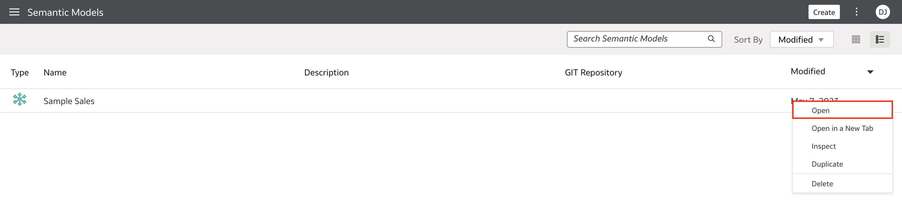

### Introduction

Learn how to create calculated, level-based, and share measures in the logical layer of a semantic model in Oracle Analytics Cloud.

Estimated Lab Time: 25 minutes

### Objectives

In this lab, you will:
* Create calculated, level-based, and share measures in the logical layer of a semantic model in OAC

### Prerequisites

This lab assumes you have:
* Access to Oracle Analytics Cloud
* Access to DV Content Author, BI Data Model Author, or a BI Service Administrator role
* Access to the Sample Sales Semantic Model
* All previous labs successfully completed

## Task 1: Create Calculated Measures

In this section, you create a calculated measure in the logical layer's F1 Revenue table using a logical expression and a calculated measure using a function.

Begin with step 3 if you're continuing this tutorial directly after completing the steps in the Create Logical Dimensions tutorial.

1. If you closed your semantic model, sign in to Oracle Analytics Cloud using one of DV Content Author, BI Data Model Author or service administrator credentials. On the Home page, click the **Navigator**, and then click **Semantic Models**.
    
2. In the Semantic Models page, select **Sample Sales**, click **Actions menu**, and then select **Open**.
    
3. In the Sample Sales semantic model, click the **Logical Layer**.
    
4. Expand **Sample Sales BM**, expand **F1 Revenue**, and select **Revenue**, and then click **Detail View**.
    
5. In F1 Revenue Columns, click **Add Column**.
    
6. In **Name**, enter <code>Actual Unit Price</code>. Click **Logical Expression**, and then click **Open Expression Editor**.
    
7. In the Expression Editor, click **Logical Layer**, expand **F1 Revenue**, and then drag **Revenue** to the expression field.
    
8. From **Operators**, double-click the divisor **(/)**. After the divisor, start typing <code>Uni</code>, and then select <code>Units</code>. Click **Validate**, and then click **Save** in the calculated measure. Actual Unit Price equals Revenue divided by Units.
    
9. In F1 Revenue, click **Add Column**. In Name, enter <code>Revenue Rank</code>. Click **Logical Expression**, and then click **Open Expression Editor**. Under Functions, expand **Display**, and then double-click **Rank**.
    
10. Click **Logical Layer**, expand **F1 Revenue**, and then drag **Revenue** to column in the parentheses next to **Rank** in the Expression Editor field. Click **Validate**, and then click **Save** to save the calculation. The Revenue Rank columns uses the Rank function for its calculated measure.
    
11. Click **Save**.

## Task 2: Create Level-Based Measures

In this section, you create measure columns in the Revenue table using physical expressions.

1. In the Logical Layer, double-click **F1 Revenue**. In the Columns tab, click **Add Column**. Double-click **New Column_1** to open the detail view.
    
2. In **Name**, enter <code>Product Total Revenue</code>.
    
3. In Sources with **Physical Expression** selected, click **Add Level**.
    
4. Click **LTS1 Revenue** in the **Logical Table Source** field. Double-click **Physical Column**, expand **F1 Revenue**, and then select **Revenue**.

5. In Aggregation, click **Add Aggregation by Level**. From the **Dimension** list, click **D2 Products**. From the **Logical Level** list, click **Total**, and then click **Save**.
    
6. In the F1 Revenue Columns tab, click **Add Column**.

7. In **Name**, enter <code>Product Type Revenue</code>.

8. In Sources with **Physical Expression** selected, click **Add Level**.

9. Click **LTS1 Revenue** in the **Logical Table Source** field. Double-click **Physical Column**, expand **F1 Revenue**, and then select **Revenue**.
    
10. In Aggregation, click **Add Aggregation by Level**. From the **Dimension** list, click **D2 Products**. From the **Logical Level** list, click **Product Type** and then click **Save**.
    

## Task 3: Create a Share Measure

In this section, you create a measure that calculates the revenue share of a product type in the total revenue.

1. In the F1 Revenue Columns tab, click **Add Column**. Enter <code>Product Share</code> to replace New Column_1. Click **Detail View**.
    
2. Click **Logical Expression**, and then click **Open Expression Editor**.
    
3. In the Expression Editor search bar, enter <code>Round</code>, and then double-click **ROUND** to add the function. In the expression field after ROUND in the parentheses, enter the following:
<code>(100*Revenue/Product Type Revenue, 1)</code>
    
4. Click **Validate**, and the click **Save** in the Expression Editor. Click **Save**.

You may now **proceed to the next lab**

## Learn More
* [Work with Logical Columns](https://docs.oracle.com/en/cloud/paas/analytics-cloud/acmdg/work-logical-columns.html#ACMDG-GUID-BD5F1139-6304-4C18-B46A-B73E721BC9F5)
* [Expression Editor Reference](https://docs.oracle.com/en/cloud/paas/analytics-cloud/acmdg/expression-editor-reference.html#ACMDG-GUID-1A790ED8-A783-4C55-B131-C738109BD8DA)

## Acknowledgements
* **Author** - Desmond Jung, Cloud Engineer, NACI
* **Contributors** - Pravin Janardanam, Nagwang Gyamtso
* **Last Updated By/Date** - Desmond Jung, July 2023

