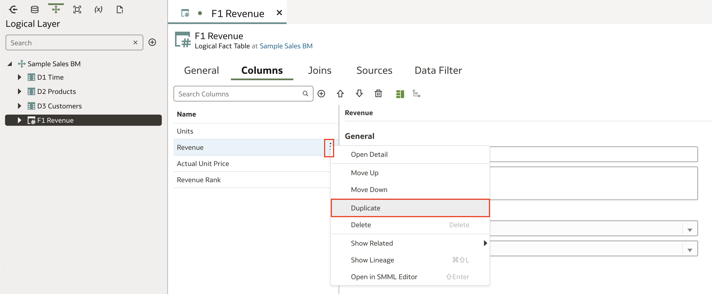
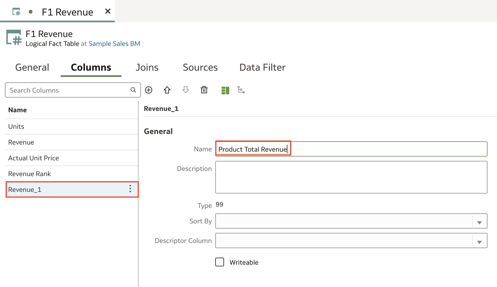
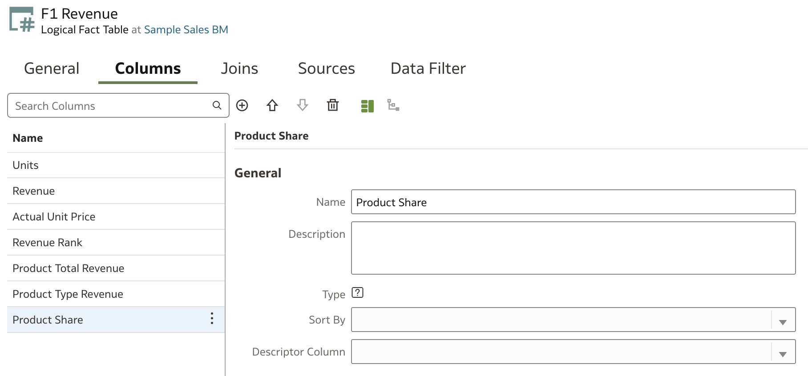

# Create Calculated, Level-Based, and Share Measures

### Introduction

Learn how to create calculated, level-based, and share measures in the logical layer of a semantic model in Oracle Analytics Cloud.

Estimated Time: 25 minutes

### Objectives

In this lab, you will:
* Create calculated, level-based, and share measures in the logical layer of a semantic model in OAC

### Prerequisites

This lab assumes you have:
* Access to Oracle Analytics Cloud
* Access to DV Content Author, BI Data Model Author, or a BI Service Administrator role
* Access to the Sample Sales Semantic Model
* All previous labs successfully completed

## Task 1: Create Calculated Measures

In this section, you create a calculated measure in the logical layer's F1 Revenue table using a logical expression and a calculated measure using a function.

Begin with step 3 if you're continuing this tutorial directly after completing the steps in the Create Logical Dimensions tutorial.

1. If you closed your semantic model, sign in to Oracle Analytics Cloud using one of DV Content Author, BI Data Model Author or service administrator credentials. On the Home page, click the **Navigator**, and then click **Semantic Models**.

    

2. In the Semantic Models page, select **Sample Sales**, click **Actions menu**, and then select **Open**.

    

3. In the Sample Sales semantic model, click the **Logical Layer**. Expand **Sample Sales BM**, and expand **F1 Revenue**.

    

4.  Double-click **Revenue** under **F1 Revenue**. Click **Add Table**. Then select **Create New Column**.

    

5. In **Name**, enter **"Actual Unit Price"**. Under **Sources** select **Logical Expression**, and then click **Open Expression Editor**.

    

6. In the Expression Editor, click **Logical Layer**, expand **F1 Revenue**, and then drag **Revenue** to the expression field.

    

7. From **Operators**, double-click the divisor **(/)**. After the divisor, start typing <code>Uni</code>, and then select <code>Units</code>. Click **Validate**, and then click **Save** in the calculated measure. Actual Unit Price equals Revenue divided by Units.

    

8. In F1 Revenue, click **Add Column**. In Name, enter **"Revenue Rank"**. Click **Logical Expression**, and then click **Open Expression Editor**.

    

9. Under Functions, expand **Display**, and then double-click **Rank**. Click **Logical Layer**, expand **F1 Revenue**, and then drag **Revenue** to column in the parentheses next to **Rank** in the Expression Editor field. Click **Validate**, and then click **Save** to save the calculation. The Revenue Rank columns uses the Rank function for its calculated measure.

    

10. Click **Save**.

## Task 2: Create Level-Based Measures

In this section, you create measure columns in the Revenue table using physical expressions.

1. Duplicate the **Revenue** column.

    

2. Select the **Revenue_1** column. In **Name**, replace **Revenue1** with **"Product Total Revenue"**.

    

3. In Sources, the logical table source should be **LTS1 Revenue**.

   

5. In Aggregation, set the **Aggregation Rule** to **None**. Click **Add Aggregation by Level**. From the **Dimension** list, click **D2 Products**. From the **Logical Level** list, click **Total**, and then click **Save**.

  

6. Repeat steps 1-3 to create another level based measure and name it **"Product Type Revenue"**.

  

9. In Aggregation, set the **Aggregation Rule** to **None**. Click **Add Aggregation by Level**. From the **Dimension** list, click **D2 Products**. From the **Logical Level** list, click **Product Type**, and then click **Save**.

    

## Task 3: Create a Share Measure

In this section, you create a measure that calculates the revenue share of a product type in the total revenue.

1. In the F1 Revenue Columns tab, click **Add Column**. Enter **"Product Share"** to replace **New Column_1**.

    

2. Click **Logical Expression**, and then click **Open Expression Editor**.

    

3. In the Expression Editor search bar, enter the following: **Revenue/Product Total Revenue**. Click **Validate**, and then click **Save** in the Expression Editor.

    >**Note**: As you type the calculation, select the columns from the dropdown results.

  

4. Navigate to the **Presentation Layer** and expand **Sample Sales**. Double click on **Base Facts** to open the Base Facts tab.

  

5. Navigate to the **Logical Layer**, expand **F1 Revenue**, hold down the Ctrl (command on Mac) key, select and drag the following to the **Base Facts** presentation table:

      * Actual Unit Price
      * Product Share
      * Product Total Revenue
      * Product Type Revenue
      * Revenue Rank

  

6. **Save** the Semantic Modeler.

## Task 4: Deploy and Validate the Changes

In this section, you run the consistency checker, deploy the updated semantic model, and create a
workbook with the updated Sample Sales subject area.

1. Click the **Consistency Checker** and select **Include warnings**.

	

2. Oracle Analytics didn't find any errors in the Sample Sales semantic model. In the semantic model, click the **Page Menu** icon, and select **Deploy**. The message, **"Deploy successful"** appears in the status bar when the deployment process is complete.

  

3. Go back to the Oracle Analytics Cloud homepage and create a new workbook with the **Samples Sales** Subject Area. Add the following fields to a new visualization to validate this lesson

    * Products.Product
    * Base Facts.Revenue
    * Base Facts.Revenue Rank
    * Base Facts.Units
    * Base Facts.Actual Unit Price

Sort by Revenue Rank ascending.

  

You may now **proceed to the next lab**

## Learn More
* [Work with Logical Columns](https://docs.oracle.com/en/cloud/paas/analytics-cloud/acmdg/work-logical-columns.html#ACMDG-GUID-BD5F1139-6304-4C18-B46A-B73E721BC9F5)
* [Expression Editor Reference](https://docs.oracle.com/en/cloud/paas/analytics-cloud/acmdg/expression-editor-reference.html#ACMDG-GUID-1A790ED8-A783-4C55-B131-C738109BD8DA)

## Acknowledgements
* **Author** - Nagwang Gyamtso, Product Manager, Analytics Product Strategy
* **Contributors** - Pravin Janardanam, Gabrielle Prichard, Lucian Dinescu, Desmond Jung
* **Last Updated By/Date** - Nagwang Gyamtso, March, 2024
