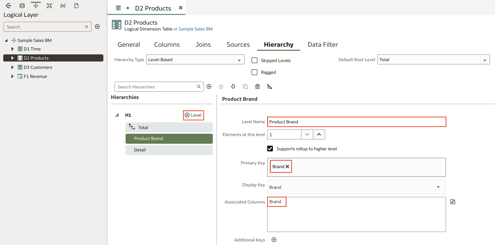
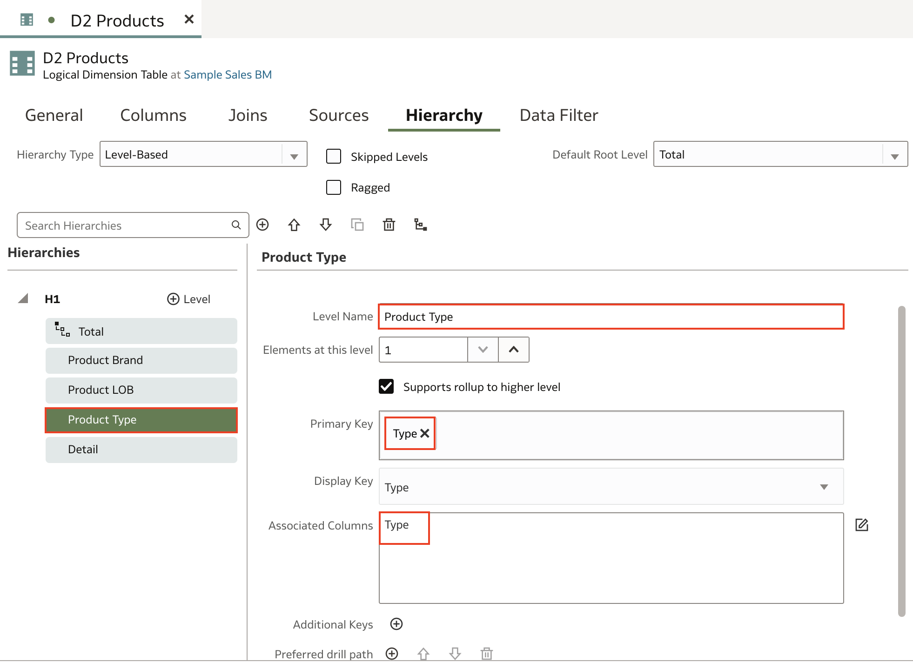
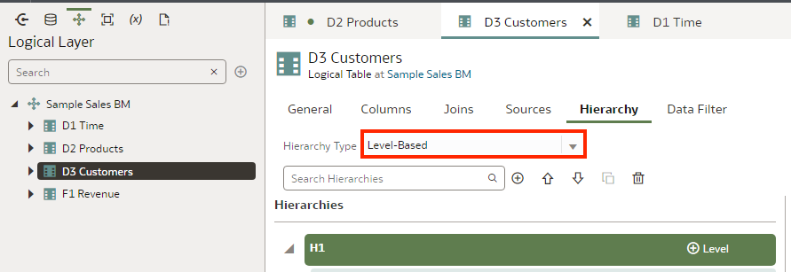
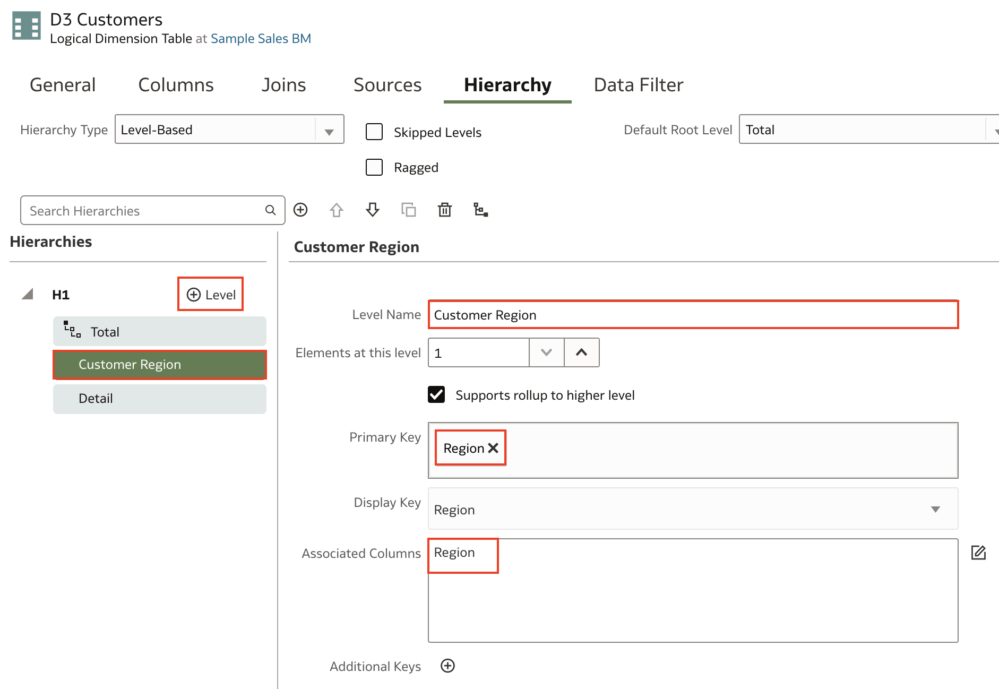
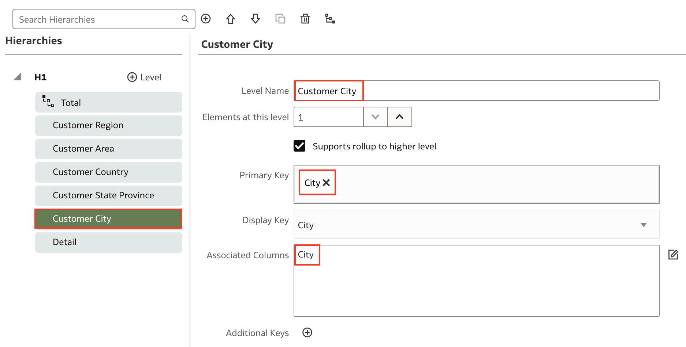
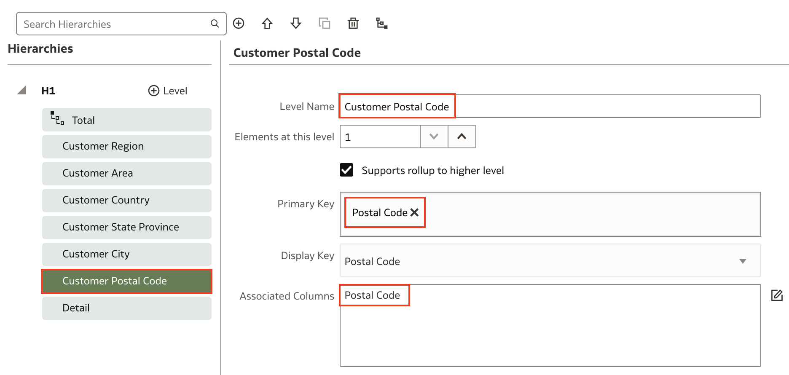
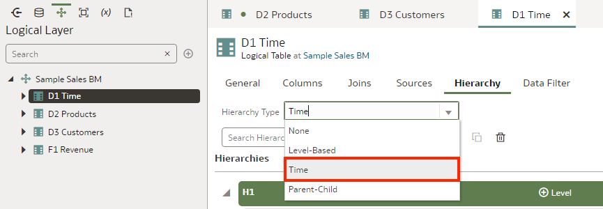
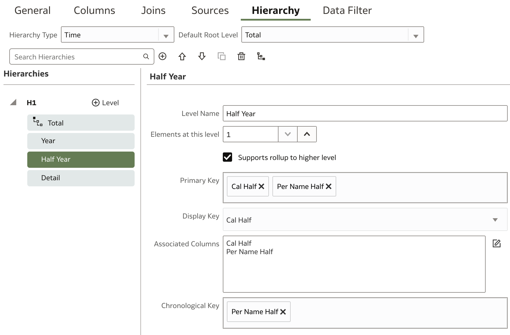
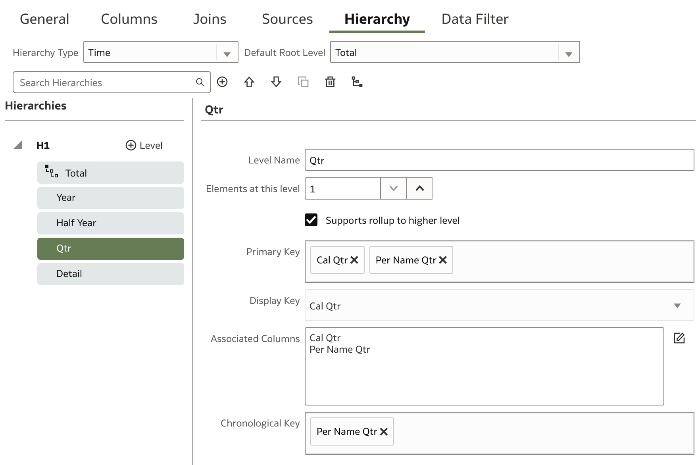

# Create Logical Hierarchies

## Introduction

This lab describes how to build governed semantic models using the Semantic Modeler.

In this lab, you continue building the Sample Sales semantic model by creating calculated, level-based, and share measures, and creating level-based and time hierarchies.

Estimated Time: 25 minutes

### Objectives

In this lab, you will:
* Create level-based and time hierarchies

### Prerequisites

This lab assumes you have:
* Access to Oracle Analytics Cloud
* Access to DV Content Author, BI Data Model Author, or a BI Service Administrator role
* Access to the Sample Sales Semantic Model
* All previous labs successfully completed

## Task 1: Create a Level-based Hierarchy for Products

In the logical layer, your tables are dimension objects. The dimension object's logical columns are its attributes. You organize the columns of a dimension object into levels of a hierarchical structure.

Begin with step 3 if you're continuing this tutorial directly after completing the steps in the Manage Logical Table Sources tutorial.

1. If you closed your semantic model, sign in to Oracle Analytics Cloud using one of DV Content Author, BI Data Model Author or service administrator credentials.

2. On the Home page, click the **Navigator**, and then click **Semantic Models**.

    

3. In the Semantic Models page, select **Sample Sales**, click **Actions menu**, and then select **Open**.

    

4. In the Logical Layer, click **D2 Products**.

    

5. In D2 Products, click the **Hierarchy** tab. In Hierarchy Type, select **Level-Based**.

    

6. Under **Hierarchies**, select the **Total** level and then click **Add Level**. In
**Level Name**, enter **"Product Brand"** to replace **Level-3**. In the **Primary Key** and **Associated Columns** fields, select **Brand**.

    

7. Select **Product Brand** in Hierarchies, click **Add Level**. In Level **Name**, enter <code>Product LOB</code> to replace Level-4. In the **Primary Key** and **Associated Columns** fields,
select **LOB**.

    

8. Select **Product LOB**, click **Add Level**. In **Level Name**, enter **"Product Type"** to replace Level-5. In the **Primary Key** and **Associated Columns** fields, select **Type**, and then click **Save**.

    

9. Select **Detail** level. Ensure your fields are consistent with the fields in the image below.

  
  

10. Close D2 Products.

## Task 2: Create a Level-based Hierarchy for Customers

In this section, you create a level-based hierarchy for the D3 Customers table.

1. In the Logical Layer, double-click **D3 Customers**. In D3 Customers, click the **Hierarchy** tab. In Hierarchy Type, select **Level-Based**.

    

2. Under Hierarchies, select the **Total** level and then click **Add Level**. In **Level Name**, enter **"Customer Region"** to replace Level-3. In the **Primary Key** and **Associated Columns** fields, select **Region**.

    

3. Select **Customer Region** in Hierarchies, click **Add Level**. In **Level Name**, enter **"Customer Area"** to replace Level-4. In the **Primary Key** and **Associated Columns** fields, select **Area**.

    

4. Select **Customer Area** in Hierarchies, click **Add Level**. In **Level Name**, enter **"Customer Country"** to replace Level-5. In the **Primary Key** and **Associated Columns** fields, select **Country Name**.

    

5. Select **Customer Country** in Hierarchies, click **Add Level**. In **Level Name**, enter **"Customer State Province"** to replace Level-6. In the **Primary Key** and **Associated Columns** fields, select **State Province**.

    

6. Select **Customer State Province** in Hierarchies, click **Add Level**. In **Level Name**, enter **"Customer City"** to replace Level-7. In the **Primary Key** and **Associated Columns** fields, select **City**.

    

7. Select **Customer City** in Hierarchies, click **Add Level**. In **Level Name**, enter **"Customer Postal Code"** to replace Level-8. In the **Primary Key** and **Associated Columns** fields, select **Postal Code**, and then click **Save**.

    

8. Close D3 Customers.

## Task 3: Create a Time Hierarchy

In this section, you create a time hierarchy in the D1 Time logical table to use with time series functions.

1. In the Logical Layer, double-click **D1 Time**. In D1 Time, click the **Hierarchy** tab. In Hierarchy Type, select **Time**.

    

2. Under Hierarchies, click on the **Total** level and then click **Add Level**. In **Level Name**, enter **"Year"** to replace Level-3. In the **Primary Key** and **Associated Columns** fields, select **Cal Year** and **Per Name Year**. Click the **Chronological Key** field and select **Per Name Year**.

    

3. Click **Add Level**. In **Level Name**, enter **"Half Year"** to replace Level-4. In the **Primary Key** and **Associated Columns** fields, select **Cal Half** and **Per Name Half**. Click the **Chronological Key** field and select **Per Name Half**.

    

4. Select **Half Year** in Hierarchies, click **Add Level**. In **Level Name**, enter **"Qtr"** to replace Level-5. In the **Primary Key** and **Associated Columns** fields, select **Cal Qtr** and **Per Name Qtr**. Click the **Chronological Key** field and select **Per Name Qtr**.

    

5. Select **Qtr** in Hierarchies, click **Add Level**. In **Level Name**, enter **"Month"** to replace Level-6. In the **Primary Key** and **Associated Columns** fields, select **Cal Month** and **Per Name Month**. Click the **Chronological Key** field and select **Per Name Month**.

    

6. Select **Month** in Hierarchies, click **Add Level**. In **Level Name**, enter **"Week"** to replace Level-7. In the **Primary Key** and **Associated Columns** fields, select **Cal Week** and **Per Name Week**. Click the **Chronological Key** field and select **Per Name Week**.

    

7. Select **Detail** and in the **Chronological Key**, ensure that it is set to **Day Key**.

7. Click **Save**.

8. Close D1 Time.

## Task 4: Create Presentation Hierarchies

Drag and drop logical hierarchy to corresponding presentation tables.

1. Click the **Presentation Layer** and double-click **Products**. Click the **Hierarchies** tab. From the Logical Layer, expand **D2 Products**. Drag and drop the logical hierarchy **H1** to **Hierarchies** in the **Products** presentation table.

  

2. Select the **Detail** level under **Hierarchies**. Under **General**, find **Display Column** and click **Select**.

  

3. Expand **Products** and select **Product**. Then click **Select**. Click **Save**.

  

<!-- 2. Click the **Presentation Layer** and double-click **Time**. Click the **Hierarchies** tab. From the Logical Layer, expand **D1 Time**. Drag and drop the logical hierarchy **H1** to **Hierarchies** in the **Time** presentation table. Click **Save**.

  

3. Click the **Presentation Layer** and double-click **Customers**. Click the **Hierarchies** tab. From the Logical Layer, expand **D3 Customers**. Drag and drop the logical hierarchy **H1** to **Hierarchies** in the **Customers** presentation table. Click **Save**.

   -->

## Task 4: Deploy and Validate the Changes

In this section, you run the consistency checker, deploy the updated semantic model, and create a
workbook with the updated Sample Sales subject area.

1. Click the **Consistency Checker** and select **Include warnings**.

	

2. Oracle Analytics didn't find any errors in the Sample Sales semantic model. In the semantic model, click the **Page Menu** icon, and select **Deploy**. The message, **"Deploy successful"** appears in the status bar when the deployment process is complete.

  

3. Go back to the Oracle Analytics Cloud homepage and create a new workbook with the **Samples Sales** Subject Area. Select H1 presentation hierarchy from **Products** table and add it to your visualization. Since the hierarchy is defined, now you should be able to drill down from the top level of the product brand to the detail product

    >**Note**: If you do not see the columns and your model deployment was successful, sign out and sign back in. If the columns are still not available, wait a few moments before trying again.

  

You may now **proceed to the next lab**

## Learn More
* [About Working with Logical Dimensions](https://docs.oracle.com/en/cloud/paas/analytics-cloud/acmdg/working-logical-hierarchies.html#ACMDG-GUID-9AF96F03-ABBA-43EF-80C9-A8ED6F018DE8)
* [Create Logical Time Dimensions](https://docs.oracle.com/en/cloud/paas/analytics-cloud/acmdg/model-time-series-data.html#ACMDG-GUID-8EC7B9D0-7A0D-4520-9A90-82D625518D4E)

## Acknowledgements
* **Author** - Nagwang Gyamtso, Product Manager, Analytics Product Strategy
* **Contributors** - Pravin Janardanam, Gabrielle Prichard, Lucian Dinescu, Desmond Jung
* **Last Updated By/Date** - Nagwang Gyamtso, March, 2024
